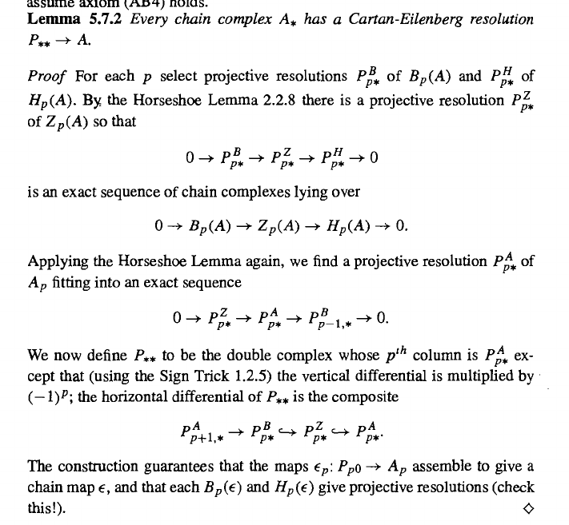
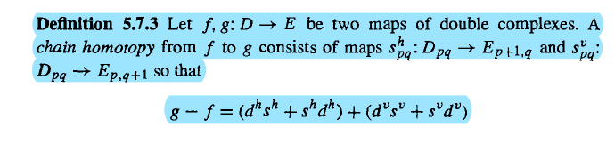
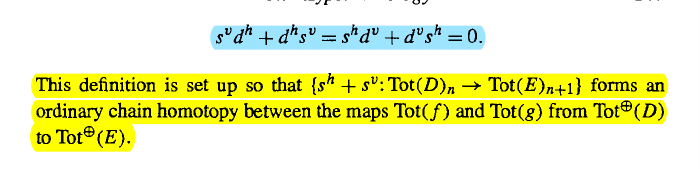

# Problem Set 6

:::{.problem title="5.7.1, Sentence One."}
In a Cartan-Eilenberg resolution, show that the following induced maps are projective resolutions in $\cat{A}$:

\[
Z^p(\eps): Z_p(P, d^h) &\to Z_p(A) \\
\eps^p: P_{p, *} &\to A_p 
.\]
:::

:::{.solution}
To show that these form projective resolutions, by definition we need to show that each object in the respective complexes is projective, and that each complex is exact, so kernels equal images.
In what follows, fix a column $p$ in $P_{*, *}$.

:::{.claim title="1"}
$Z_p(P, d^h)_q$ is a projective object for all $q\geq 0$.
:::

:::{.proof title="?"}
With $p$ fixed, for every row $q$ we have a SES
\[
0 \to B_p(P, d^h)_q \to Z_p(P, d^h)_q \to H_p(P, d^h)_q \to 0
.\]
Since by assumption $H_p(P, d^h)_*$ forms a projective resolution of $A_p$, each $H_p(P, d^h)_q$ is a projective object.
So this sequence splits and we have
\[
Z_p(P, d^h)_q \cong B_p(P, d^h)_q \oplus H_p(P, d^h)_q
.\]
Working over \(R\dash\)modules, $Z_p$ is projective if and only if it is a direct summand of a free module.
By assumption, $B_p, H_p$ are projective, and hence direct summands of free modules $F_1, F_2$.
But then $Z_p$ is a direct summand of $F_1 \oplus F_2$, which is still free, making $Z_p$ projective.
:::

:::{.claim title="2"}
The complex $\ts{ Z_p(P, d^h)_q \st q\geq 0}$ is exact, making it a projective resolution of $Z_p(A)$.
:::

:::{.proof title="of claim 2"}
The proof of this claim is postponed until the end of the solution.
:::

:::{.claim title="3"}
$P_{p, q}$ is projective object for all $q$ and $P{p, *}$ forms an exact complex, making it a projective resolution of $A_p$.
:::

:::{.proof title="?"}
Fixing $q$, we apply precisely the same argument as above to the SES
\[
0 \to Z_p(P, d^h)_q \to P_{p, q} \to B_p(P, d^h)_q \to 0
,\]
where we again use that $B_p$ is projective to form the splitting which shows $P_{p, q}$ is projective, and that the complexes $Z_p, B_p$ are exact to force exactness of the complex $P_{p, *}$.

:::

This yields the desired result.
:::

:::{.proof title="of claim 2"}
We can assemble all of the above SESs into the following diagram:

\begin{tikzcd}[column sep=1.2em]
	& \vdots && \vdots && \vdots && \vdots && \vdots \\
	& 0 && \textcolor{rgb,255:red,92;green,92;blue,214}{B_p(P, d^h)_q} && {Z_p(P, d^h)_q} && \textcolor{rgb,255:red,92;green,92;blue,214}{H_p(P, d^h)_q} && 0 \\
	& 0 && \textcolor{rgb,255:red,92;green,92;blue,214}{B_p(P, d^h)_{q-1}} && {Z_p(P, d^h)_{q-1}} && \textcolor{rgb,255:red,92;green,92;blue,214}{H_p(P, d^h)_{q-1}} && 0 \\
	&&& \textcolor{rgb,255:red,92;green,92;blue,214}{\vdots} && \vdots && \textcolor{rgb,255:red,92;green,92;blue,214}{\vdots} \\
	& 0 && \textcolor{rgb,255:red,92;green,92;blue,214}{B_p(P, d^h)_1} && {Z_p(P, d^h)_1} && \textcolor{rgb,255:red,92;green,92;blue,214}{H_p(P, d^h)_1} && 0 \\
	& 0 && \textcolor{rgb,255:red,92;green,92;blue,214}{B_p(P, d^h)_0} && {Z_p(P, d^h)_0} && \textcolor{rgb,255:red,92;green,92;blue,214}{H_p(P, d^h)_0} && 0 \\
	{} &&&&&&&&&& {} \\
	& 0 && \textcolor{rgb,255:red,92;green,92;blue,214}{B_p(A)} && {Z_p(A)} && \textcolor{rgb,255:red,92;green,92;blue,214}{H_p(A)} && 0
	\arrow[from=8-2, to=8-4]
	\arrow[from=8-4, to=8-6]
	\arrow[from=8-6, to=8-8]
	\arrow[from=6-2, to=6-4]
	\arrow[from=5-2, to=5-4]
	\arrow[from=5-4, to=5-6]
	\arrow[from=6-4, to=6-6]
	\arrow[from=5-6, to=5-8]
	\arrow[from=6-6, to=6-8]
	\arrow[from=8-8, to=8-10]
	\arrow[from=6-8, to=6-10]
	\arrow[from=5-8, to=5-10]
	\arrow[from=3-2, to=3-4]
	\arrow[from=3-4, to=3-6]
	\arrow[from=3-6, to=3-8]
	\arrow[from=3-8, to=3-10]
	\arrow[from=2-2, to=2-4]
	\arrow[from=2-4, to=2-6]
	\arrow[from=2-6, to=2-8]
	\arrow[from=2-8, to=2-10]
	\arrow[color={rgb,255:red,92;green,92;blue,214}, from=2-4, to=3-4]
	\arrow[from=2-6, to=3-6]
	\arrow[color={rgb,255:red,92;green,92;blue,214}, from=2-8, to=3-8]
	\arrow[color={rgb,255:red,92;green,92;blue,214}, from=3-8, to=4-8]
	\arrow[color={rgb,255:red,92;green,92;blue,214}, from=4-8, to=5-8]
	\arrow[color={rgb,255:red,92;green,92;blue,214}, from=3-4, to=4-4]
	\arrow[from=3-6, to=4-6]
	\arrow[from=4-6, to=5-6]
	\arrow[color={rgb,255:red,92;green,92;blue,214}, from=5-4, to=6-4]
	\arrow[color={rgb,255:red,92;green,92;blue,214}, from=4-4, to=5-4]
	\arrow[from=5-6, to=6-6]
	\arrow[color={rgb,255:red,92;green,92;blue,214}, from=5-8, to=6-8]
	\arrow[color={rgb,255:red,92;green,92;blue,214}, from=6-4, to=8-4]
	\arrow[from=6-6, to=8-6]
	\arrow[color={rgb,255:red,92;green,92;blue,214}, from=6-8, to=8-8]
	\arrow[dashed, no head, from=7-1, to=7-11]
	\arrow[from=1-4, to=2-4]
	\arrow[from=1-6, to=2-6]
	\arrow[from=1-8, to=2-8]
\end{tikzcd}

> [Link to Diagram](https://q.uiver.app/?q=WzAsMzUsWzMsMSwiQl9wKFAsIGReaClfcSIsWzI0MCw2MCw2MCwxXV0sWzUsMSwiWl9wKFAsIGReaClfcSJdLFs3LDEsIkhfcChQLCBkXmgpX3EiLFsyNDAsNjAsNjAsMV1dLFszLDIsIkJfcChQLCBkXmgpX3txLTF9IixbMjQwLDYwLDYwLDFdXSxbNSwyLCJaX3AoUCwgZF5oKV97cS0xfSJdLFs3LDIsIkhfcChQLCBkXmgpX3txLTF9IixbMjQwLDYwLDYwLDFdXSxbMyw0LCJCX3AoUCwgZF5oKV8xIixbMjQwLDYwLDYwLDFdXSxbNSw0LCJaX3AoUCwgZF5oKV8xIl0sWzcsNCwiSF9wKFAsIGReaClfMSIsWzI0MCw2MCw2MCwxXV0sWzMsNSwiQl9wKFAsIGReaClfMCIsWzI0MCw2MCw2MCwxXV0sWzUsNSwiWl9wKFAsIGReaClfMCJdLFs3LDUsIkhfcChQLCBkXmgpXzAiLFsyNDAsNjAsNjAsMV1dLFsxLDEsIjAiXSxbMSwyLCIwIl0sWzksMSwiMCJdLFs5LDIsIjAiXSxbMSw0LCIwIl0sWzksNCwiMCJdLFsxLDUsIjAiXSxbOSw1LCIwIl0sWzMsNywiQl9wKEEpIixbMjQwLDYwLDYwLDFdXSxbNSw3LCJaX3AoQSkiXSxbNyw3LCJIX3AoQSkiLFsyNDAsNjAsNjAsMV1dLFs5LDcsIjAiXSxbMSw3LCIwIl0sWzcsMywiXFx2ZG90cyIsWzI0MCw2MCw2MCwxXV0sWzMsMywiXFx2ZG90cyIsWzI0MCw2MCw2MCwxXV0sWzUsMywiXFx2ZG90cyJdLFswLDZdLFsxMCw2XSxbMywwLCJcXHZkb3RzIl0sWzUsMCwiXFx2ZG90cyJdLFs3LDAsIlxcdmRvdHMiXSxbOSwwLCJcXHZkb3RzIl0sWzEsMCwiXFx2ZG90cyJdLFsyNCwyMF0sWzIwLDIxXSxbMjEsMjJdLFsxOCw5XSxbMTYsNl0sWzYsN10sWzksMTBdLFs3LDhdLFsxMCwxMV0sWzIyLDIzXSxbMTEsMTldLFs4LDE3XSxbMTMsM10sWzMsNF0sWzQsNV0sWzUsMTVdLFsxMiwwXSxbMCwxXSxbMSwyXSxbMiwxNF0sWzAsMywiIiwxLHsiY29sb3VyIjpbMjQwLDYwLDYwXX1dLFsxLDRdLFsyLDUsIiIsMSx7ImNvbG91ciI6WzI0MCw2MCw2MF19XSxbNSwyNSwiIiwxLHsiY29sb3VyIjpbMjQwLDYwLDYwXX1dLFsyNSw4LCIiLDEseyJjb2xvdXIiOlsyNDAsNjAsNjBdfV0sWzMsMjYsIiIsMSx7ImNvbG91ciI6WzI0MCw2MCw2MF19XSxbNCwyN10sWzI3LDddLFs2LDksIiIsMSx7ImNvbG91ciI6WzI0MCw2MCw2MF19XSxbMjYsNiwiIiwxLHsiY29sb3VyIjpbMjQwLDYwLDYwXX1dLFs3LDEwXSxbOCwxMSwiIiwxLHsiY29sb3VyIjpbMjQwLDYwLDYwXX1dLFs5LDIwLCIiLDEseyJjb2xvdXIiOlsyNDAsNjAsNjBdfV0sWzEwLDIxXSxbMTEsMjIsIiIsMSx7ImNvbG91ciI6WzI0MCw2MCw2MF19XSxbMjgsMjksIiIsMSx7InN0eWxlIjp7ImJvZHkiOnsibmFtZSI6ImRhc2hlZCJ9LCJoZWFkIjp7Im5hbWUiOiJub25lIn19fV0sWzMwLDBdLFszMSwxXSxbMzIsMl1d)

The vertical maps are all induced by the vertical maps in the original CE resolution.
The blue portions are exact by assumption, since the $H_p$ and $B_p$ form projective resolutions of $H_p(A)$ and $B_p(A)$.
Collapsing each vertical tower into a chain complex, we get a SES of complexes
\[
0 
\to B_p(P, d^h)_*
\to Z_p(P, d^h)_*
\to H_p(P, d^h)_*
\to 0
.\]
We thus get a long exact sequence in the homology of these complexes, where here we use $\mathcal{H}$ to distinguish this from the original homology and omit the asterisk for notational brevity:

\begin{tikzcd}
	&&&& \cdots \\
	{} \\
	{\mathcal{H}_1 B_p(P, d^h)} && {\mathcal{H}_1 Z_p(P, d^h)} && {\mathcal{H}_1 H_p(P, d^h)} \\
	\\
	{\mathcal{H}_0 B_p(P, d^h)} && {\mathcal{H}_0 Z_p(P, d^h)} && {\mathcal{H}_0 H_p(P, d^h)} \\
	&&&& 0
	\arrow[from=3-5, to=5-1]
	\arrow[from=5-1, to=5-3]
	\arrow[from=5-3, to=5-5]
	\arrow[from=5-5, to=6-5]
	\arrow[from=3-3, to=3-5]
	\arrow[from=3-1, to=3-3]
	\arrow[from=1-5, to=3-1]
\end{tikzcd}

> [Link to Diagram](https://q.uiver.app/?q=WzAsOSxbMCw0LCJcXG1hdGhjYWx7SH1fMCBCX3AoUCwgZF5oKSJdLFsyLDQsIlxcbWF0aGNhbHtIfV8wIFpfcChQLCBkXmgpIl0sWzQsNCwiXFxtYXRoY2Fse0h9XzAgSF9wKFAsIGReaCkiXSxbMCwyLCJcXG1hdGhjYWx7SH1fMSBCX3AoUCwgZF5oKSJdLFsyLDIsIlxcbWF0aGNhbHtIfV8xIFpfcChQLCBkXmgpIl0sWzQsMiwiXFxtYXRoY2Fse0h9XzEgSF9wKFAsIGReaCkiXSxbNCw1LCIwIl0sWzAsMV0sWzQsMCwiXFxjZG90cyJdLFs1LDBdLFswLDFdLFsxLDJdLFsyLDZdLFs0LDVdLFszLDRdLFs4LDNdXQ==)

We can now use the fact that a complex is exact if and only if its homology vanishes in degree $d\geq 1$.
Since $B_p, H_p$ were exact, the edge terms in this LES are zero, yielding the following situation:

\begin{tikzcd}
	&&&& \cdots \\
	\\
	0 && {\mathcal{H}_2 Z_p(P, d^h)} && 0 \\
	{} \\
	0 && {\mathcal{H}_1 Z_p(P, d^h)} && 0 \\
	\\
	{B_p(P, d^h)} && {Z_p(P, d^h)} && {H_p(P, d^h)} \\
	&&&& 0
	\arrow[from=5-5, to=7-1]
	\arrow[from=7-1, to=7-3]
	\arrow[from=7-3, to=7-5]
	\arrow[from=7-5, to=8-5]
	\arrow[from=5-3, to=5-5]
	\arrow[from=5-1, to=5-3]
	\arrow[from=3-5, to=5-1]
	\arrow[from=3-1, to=3-3]
	\arrow[from=3-3, to=3-5]
	\arrow[from=1-5, to=3-1]
\end{tikzcd}

> [Link to Diagram](https://q.uiver.app/?q=WzAsMTIsWzAsNiwiQl9wKFAsIGReaCkiXSxbMiw2LCJaX3AoUCwgZF5oKSJdLFs0LDYsIkhfcChQLCBkXmgpIl0sWzAsNCwiMCJdLFsyLDQsIlxcbWF0aGNhbHtIfV8xIFpfcChQLCBkXmgpIl0sWzQsNCwiMCJdLFs0LDcsIjAiXSxbMCwzXSxbNCwyLCIwIl0sWzAsMiwiMCJdLFsyLDIsIlxcbWF0aGNhbHtIfV8xIFpfcChQLCBkXmgpIl0sWzQsMCwiXFxjZG90cyJdLFs1LDBdLFswLDFdLFsxLDJdLFsyLDZdLFs0LDVdLFszLDRdLFs4LDNdLFs5LDEwXSxbMTAsOF0sWzExLDldXQ==)

This forces \( \mathcal{H}_d Z_p (P, d^h)_* = 0  \) for $d\geq 1$, so the complex $Z_p(P, d^h)_*$ is exact as desired.

:::

:::{.problem title="5.7.2"}
If $A\to B$ is a chain map and $P\to A, Q\to B$ are CE resolutions, show that there is a double complex map $\tilde f: P \to Q$ lifting $f$.
:::

:::{.solution}
Fixing $p$, let $P_{*, p} \to A_p$ be the column of the CE resolution above $A_p$, so it forms a projective resolution by the previous exercise, and let $Q_{*, p} \to B_p$ be the corresponding column above $B_p$.
The claim is that there is a commutative tower of the following form:

\begin{tikzcd}
	\ddots &&&&&&&& \iddots \\
	& {P_{1, p}} &&&&&& {P_{1, p+1}} \\
	&& {P_{0, p}} &&&& {P_{0, p+1}} \\
	&&& {A_p} && {A_{p+1}} \\
	\\
	&&& {B_{p}} && {B_{p+1}} \\
	&& {Q_{0, p}} &&&& {Q_{0, p+1}} \\
	& {Q_{1, p}} &&&&&& {Q_{1, p+1}} \\
	\iddots &&&&&&&& \ddots
	\arrow[""{name=0, anchor=center, inner sep=0}, "{\bd_A}"', from=4-6, to=4-4]
	\arrow[""{name=1, anchor=center, inner sep=0}, "{f^p}", from=4-4, to=6-4]
	\arrow[""{name=2, anchor=center, inner sep=0}, "{f^{p+1}}"', from=4-6, to=6-6]
	\arrow[""{name=3, anchor=center, inner sep=0}, "{\bd_B}"', from=6-6, to=6-4]
	\arrow[color={rgb,255:red,41;green,163;blue,41}, from=9-1, to=8-2]
	\arrow[color={rgb,255:red,41;green,163;blue,41}, from=8-2, to=7-3]
	\arrow[color={rgb,255:red,41;green,163;blue,41}, from=7-3, to=6-4]
	\arrow[color={rgb,255:red,41;green,163;blue,41}, from=3-3, to=4-4]
	\arrow[color={rgb,255:red,41;green,163;blue,41}, from=2-2, to=3-3]
	\arrow[color={rgb,255:red,41;green,163;blue,41}, from=1-1, to=2-2]
	\arrow[color={rgb,255:red,41;green,163;blue,41}, from=3-7, to=4-6]
	\arrow[color={rgb,255:red,41;green,163;blue,41}, from=2-8, to=3-7]
	\arrow[color={rgb,255:red,41;green,163;blue,41}, from=1-9, to=2-8]
	\arrow[color={rgb,255:red,41;green,163;blue,41}, from=9-9, to=8-8]
	\arrow[color={rgb,255:red,41;green,163;blue,41}, from=8-8, to=7-7]
	\arrow[color={rgb,255:red,41;green,163;blue,41}, from=7-7, to=6-6]
	\arrow[""{name=4, anchor=center, inner sep=0}, "{\tilde f^{p+1}_0}"{description}, color={rgb,255:red,42;green,69;blue,244}, from=3-7, to=7-7]
	\arrow["{\tilde f^{p+1}_1}"{description}, color={rgb,255:red,42;green,69;blue,244}, from=2-8, to=8-8]
	\arrow[dashed, from=1-9, to=9-9]
	\arrow[dashed, from=1-1, to=9-1]
	\arrow["{\tilde f^{p}_1}"{description}, color={rgb,255:red,42;green,69;blue,244}, from=2-2, to=8-2]
	\arrow[""{name=5, anchor=center, inner sep=0}, "{\tilde f^{p}_0}"{description}, color={rgb,255:red,42;green,69;blue,244}, from=3-3, to=7-3]
	\arrow[""{name=6, anchor=center, inner sep=0}, "{\bd^h_Q}"{description}, dashed, from=7-7, to=7-3]
	\arrow["{\bd^h_Q}"{description}, dashed, from=8-8, to=8-2]
	\arrow[""{name=7, anchor=center, inner sep=0}, "{\bd^h_P}"{description}, dashed, from=3-7, to=3-3]
	\arrow["{\bd^h_P}"{description}, dashed, from=2-8, to=2-2]
	\arrow[Rightarrow, from=4-6, to=6-4]
	\arrow[shift right=5, shorten <=4pt, shorten >=4pt, Rightarrow, from=3, to=6]
	\arrow[shorten <=7pt, shorten >=7pt, Rightarrow, from=2, to=4]
	\arrow[shift left=5, color={rgb,255:red,255;green,51;blue,54}, Rightarrow, from=7, to=6]
	\arrow[shorten <=6pt, shorten >=6pt, Rightarrow, from=1, to=5]
	\arrow[shift left=5, shorten <=4pt, shorten >=4pt, Rightarrow, from=0, to=7]
\end{tikzcd}

> [Link to Diagram](https://q.uiver.app/?q=WzAsMTYsWzMsMywiQV9wIl0sWzUsMywiQV97cCsxfSJdLFs1LDUsIkJfe3ArMX0iXSxbMyw1LCJCX3twfSJdLFsyLDYsIlFfezAsIHB9Il0sWzYsNiwiUV97MCwgcCsxfSJdLFs2LDIsIlBfezAsIHArMX0iXSxbMiwyLCJQX3swLCBwfSJdLFs3LDcsIlFfezEsIHArMX0iXSxbOCw4LCJcXGRkb3RzIl0sWzEsMSwiUF97MSwgcH0iXSxbMCwwLCJcXGRkb3RzIl0sWzcsMSwiUF97MSwgcCsxfSJdLFs4LDAsIlxcaWRkb3RzIl0sWzAsOCwiXFxpZGRvdHMiXSxbMSw3LCJRX3sxLCBwfSJdLFsxLDAsIlxcYmRfQSIsMl0sWzAsMywiZl5wIl0sWzEsMiwiZl57cCsxfSIsMl0sWzIsMywiXFxiZF9CIiwyXSxbMTQsMTUsIiIsMix7ImNvbG91ciI6WzEyMCw2MCw0MF19XSxbMTUsNCwiIiwyLHsiY29sb3VyIjpbMTIwLDYwLDQwXX1dLFs0LDMsIiIsMix7ImNvbG91ciI6WzEyMCw2MCw0MF19XSxbNywwLCIiLDIseyJjb2xvdXIiOlsxMjAsNjAsNDBdfV0sWzEwLDcsIiIsMix7ImNvbG91ciI6WzEyMCw2MCw0MF19XSxbMTEsMTAsIiIsMix7ImNvbG91ciI6WzEyMCw2MCw0MF19XSxbNiwxLCIiLDIseyJjb2xvdXIiOlsxMjAsNjAsNDBdfV0sWzEyLDYsIiIsMix7ImNvbG91ciI6WzEyMCw2MCw0MF19XSxbMTMsMTIsIiIsMix7ImNvbG91ciI6WzEyMCw2MCw0MF19XSxbOSw4LCIiLDIseyJjb2xvdXIiOlsxMjAsNjAsNDBdfV0sWzgsNSwiIiwyLHsiY29sb3VyIjpbMTIwLDYwLDQwXX1dLFs1LDIsIiIsMix7ImNvbG91ciI6WzEyMCw2MCw0MF19XSxbNiw1LCJcXHRpbGRlIGZee3ArMX1fMCIsMSx7ImNvbG91ciI6WzIzMiw5MCw1Nl19LFsyMzIsOTAsNTYsMV1dLFsxMiw4LCJcXHRpbGRlIGZee3ArMX1fMSIsMSx7ImNvbG91ciI6WzIzMiw5MCw1Nl19LFsyMzIsOTAsNTYsMV1dLFsxMyw5LCIiLDEseyJzdHlsZSI6eyJib2R5Ijp7Im5hbWUiOiJkYXNoZWQifX19XSxbMTEsMTQsIiIsMSx7InN0eWxlIjp7ImJvZHkiOnsibmFtZSI6ImRhc2hlZCJ9fX1dLFsxMCwxNSwiXFx0aWxkZSBmXntwfV8xIiwxLHsiY29sb3VyIjpbMjMyLDkwLDU2XX0sWzIzMiw5MCw1NiwxXV0sWzcsNCwiXFx0aWxkZSBmXntwfV8wIiwxLHsiY29sb3VyIjpbMjMyLDkwLDU2XX0sWzIzMiw5MCw1NiwxXV0sWzUsNCwiXFxiZF5oX1EiLDEseyJzdHlsZSI6eyJib2R5Ijp7Im5hbWUiOiJkYXNoZWQifX19XSxbOCwxNSwiXFxiZF5oX1EiLDEseyJzdHlsZSI6eyJib2R5Ijp7Im5hbWUiOiJkYXNoZWQifX19XSxbNiw3LCJcXGJkXmhfUCIsMSx7InN0eWxlIjp7ImJvZHkiOnsibmFtZSI6ImRhc2hlZCJ9fX1dLFsxMiwxMCwiXFxiZF5oX1AiLDEseyJzdHlsZSI6eyJib2R5Ijp7Im5hbWUiOiJkYXNoZWQifX19XSxbMSwzLCIiLDEseyJsZXZlbCI6Mn1dLFsxOSwzOCwiIiwyLHsib2Zmc2V0Ijo1LCJzaG9ydGVuIjp7InNvdXJjZSI6MjAsInRhcmdldCI6MjB9fV0sWzE4LDMyLCIiLDIseyJzaG9ydGVuIjp7InNvdXJjZSI6MjAsInRhcmdldCI6MjB9fV0sWzQwLDM4LCIiLDEseyJvZmZzZXQiOi01LCJjb2xvdXIiOlszNTksMTAwLDYwXX1dLFsxNywzNywiIiwwLHsic2hvcnRlbiI6eyJzb3VyY2UiOjIwLCJ0YXJnZXQiOjIwfX1dLFsxNiw0MCwiIiwxLHsib2Zmc2V0IjotNSwic2hvcnRlbiI6eyJzb3VyY2UiOjIwLCJ0YXJnZXQiOjIwfX1dXQ==)

- The green maps denote the vertical differentials in the respective CE resolutions, and the horizontal differentials are indicated with dotted lines.

- The blue maps $\tilde f_i^p$ and $\tilde f_i^{p+1}$ are supplied by the comparison theorem, which assemble to form chain maps $\tilde f^p: P_{*, p} \to Q_{*, p}$ that lift $f^p$ for every $p$:

\begin{tikzcd}
	{P_{*, p}} && {Q_{*, p}} \\
	\\
	{A_p} && {B_p} \\
	\\
	{}
	\arrow["{\eps^A}", two heads, from=1-1, to=3-1]
	\arrow["{\eps^B}", two heads, from=1-3, to=3-3]
	\arrow["{f^p}", from=3-1, to=3-3]
	\arrow["{\exists \tilde f^p}", from=1-1, to=1-3, dotted]
\end{tikzcd}

> [Link to Diagram](https://q.uiver.app/?q=WzAsNSxbMCwyLCJBX3AiXSxbMCw0XSxbMiwyLCJCX3AiXSxbMCwwLCJQX3sqLCBwfSJdLFsyLDAsIlFfeyosIHB9Il0sWzMsMCwiXFxlcHNeQSIsMCx7InN0eWxlIjp7ImhlYWQiOnsibmFtZSI6ImVwaSJ9fX1dLFs0LDIsIlxcZXBzXkIiLDAseyJzdHlsZSI6eyJoZWFkIjp7Im5hbWUiOiJlcGkifX19XSxbMCwyLCJmXnAiXSxbMyw0LCJcXGV4aXN0cyBcXHRpbGRlIGZecCJdXQ==)

- The double-arrows indicate squares that commute:

  - The square on the "ground floor" of the tower commutes because the original $f$ was assumed to be a chain map.
  - The squares corresponding to the North and South walls commute since they participate in the CE resolutions of $A$ and $B$ respectively.
  - The squares corresponding to the East and West walls commute because the comparison theorem guarantees that the $\tilde f_i$ lift $f$ and form a chain map.

Thus for these to assemble to form a map of double complexes $\tilde f: P_{*, *} \to Q_{*, *}$ that also lifts $f$, it only remains to show that the squares corresponding to the "ceiling" of each floor of the tower also commutes, as indicated with the red double arrow.

\todo[inline]{Not sure how to show this, doesn't seem guaranteed by the Comparison theorem.
Hint from Weibel: modify the proof of theorem 2.4.6.}

:::

:::{.problem title="5.7.3"}
\envlist

1. If $f, g:A\to B$ are homotopic maps of chain complexes and $\tilde f, \tilde g:P\to Q$ are maps of CE resolutions over them, show that $\tilde f$ is chain homotopic to $\tilde g$.

2. Show that any two CE resolutions $P, Q$ of $A$ are chain homotopy equivalent.
  Conclude that for any additive functor $F$, the chain complex $\Totsum(F(P))$ and $\Totsum(F(Q))$ are chain homotopy equivalent.

:::

:::{.solution}
It suffices to show that if $f: A\to B$ is a nullhomotopic map of chain complexes, then then  induced map $\tilde f: P\to Q$ is a nullhomotopic map of double complexes, since $f\homotopic g \iff f-g \homotopic 0$.
So suppose that $f:A\to B$ is nullhomotopic, which supplies us with a nullhomotopy $s: A \to B[1]$ such that $f = ds + sd$.
By the previous exercise, the map of complexes $f:A\to B$ lifts to map of double complexes $\tilde f: P\to Q$, which in the $p$th component is a chain map $\tilde f^p: P_{p, *} \to Q_{p-1, *}$.

Since $f$ is nullhomotopic, we are supplied with a nullhomotopy $s: A\to B[1]$ (where $[1]$ denotes the shifted complex) satisfying $f = ds + sd$ in every component.
By the same argument, this lifts to a double complex map $\tilde s: P \to Q[1, 0]$, and so fixing a $p$ we have the following situation:

\begin{tikzcd}
	{P_{p-1, *}} &&& {P_{p, *}} \\
	&&&&&&& {} \\
	\\
	{A_{p-1}} &&& {A_p} && {Q_{p, *}} &&& {Q_{p+1, *}} \\
	\\
	\\
	&&&&& {B_p} &&& {B_{p+1}}
	\arrow["{f^p}", from=4-4, to=7-6]
	\arrow["{s_{p-1}}"', color={rgb,255:red,24;green,98;blue,24}, from=4-1, to=7-6]
	\arrow["{s_{p}}"', color={rgb,255:red,24;green,98;blue,24}, from=4-4, to=7-9]
	\arrow[from=7-9, to=7-6]
	\arrow[from=4-4, to=4-1]
	\arrow["{\tilde s_{p-1}}"', color={rgb,255:red,24;green,98;blue,24}, from=1-1, to=4-6]
	\arrow["{\tilde s_{p}}"', color={rgb,255:red,24;green,98;blue,24}, from=1-4, to=4-9]
	\arrow[from=4-9, to=7-9]
	\arrow[from=4-6, to=7-6]
	\arrow[from=1-4, to=4-4]
	\arrow[from=1-1, to=4-1]
	\arrow[from=1-4, to=1-1]
	\arrow[from=4-9, to=4-6]
	\arrow["{\tilde f^p}"', from=1-4, to=4-6]
\end{tikzcd}

> [Link to Diagram](https://q.uiver.app/?q=WzAsOSxbMCwzLCJBX3twLTF9Il0sWzMsMywiQV9wIl0sWzUsNiwiQl9wIl0sWzgsNiwiQl97cCsxfSJdLFswLDAsIlBfe3AtMSwgKn0iXSxbNSwzLCJRX3twLCAqfSJdLFs4LDMsIlFfe3ArMSwgKn0iXSxbMywwLCJQX3twLCAqfSJdLFs3LDFdLFsxLDIsImZecCJdLFswLDIsInNfe3AtMX0iLDIseyJjb2xvdXIiOlsxMjAsNjAsMjRdfSxbMTIwLDYwLDI0LDFdXSxbMSwzLCJzX3twfSIsMix7ImNvbG91ciI6WzEyMCw2MCwyNF19LFsxMjAsNjAsMjQsMV1dLFszLDJdLFsxLDBdLFs0LDUsIlxcdGlsZGUgc197cC0xfSIsMix7ImNvbG91ciI6WzEyMCw2MCwyNF19LFsxMjAsNjAsMjQsMV1dLFs3LDYsIlxcdGlsZGUgc197cH0iLDIseyJjb2xvdXIiOlsxMjAsNjAsMjRdfSxbMTIwLDYwLDI0LDFdXSxbNiwzXSxbNSwyXSxbNywxXSxbNCwwXSxbNyw0XSxbNiw1XSxbNyw1LCJcXHRpbGRlIGZecCIsMl1d)

The base of this cube commutes by assumption, and $f^p = d^B s_p + s_{p-1} d^A$ since $s$ was a nullhomotopy of $f$.
The front and back sides commute by construction of the CE resolution, and the left and right sides commute since the $\tilde s_p$ lift the original $s_p$.

:::{.claim}
The map of double complexes $\tilde s: P \to Q[1, 0]$ forms the horizontal component of a nullhomotopy $\mathbf{s}: P\to Q[1, 1]$, 
:::

:::{.remark}
This  will follow if we can construct a vertical homotopy $s^v$ such that 
\[
\tilde f^p = \vector{s} \bd + \bd \vector s \da \qty{ \tilde s_{p-1} \bd_P^h + \bd_Q^h \tilde s_{p}}
+ \qty{ s^v \bd_P^v + \bd_Q^v s^v} 
\]
as a map of complexes $P \to Q[1. 1]$, where the $\bd^h$ and $\bd^v$ are the horizontal and vertical maps in the respective CE resolutions.
:::

:::{.claim}
The vertical homotopy can be constructed to satisfy
\[
\qty{ s^v \bd_P^v + \bd_Q^v s^v} 
=
\tilde f^p - \qty{ \tilde s_{p-1} \bd_P^h + \bd_Q^h \tilde s_{p}}
.\]

:::

\todo[inline]{Note sure where these vertical maps should come from.}

:::

:::{.problem title="Extra"}
\envlist

1. Check the claim about $B_p$ at the end of Lemma 5.7.2:
  <!---->

2. Verify the remark following definition 5.7.3:
  <!---->

  <!---->

:::

:::{.solution title="Part 1"}

\todo[inline]{Todo: copy statements from Weibel and verify.}

:::

