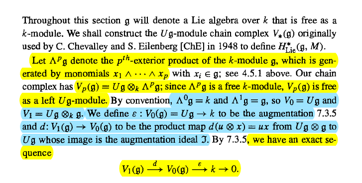
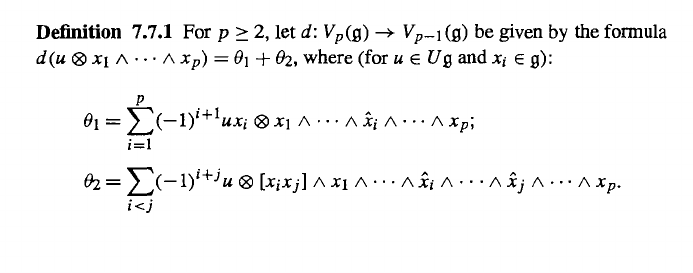
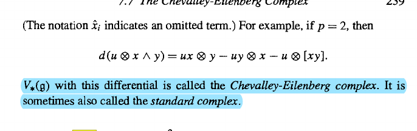

# Problem Set 7 

:::{.problem title="Weibel 7.2.1"}
1. Let $f:M\to N$ be a morphism of $\lieg\dash$modules over a field $k$.
  Show that the $k\dash$modules $\ker(f), \im(f), \coker(f)$ are the kernel, image, and cokernel respectively of $f$ in the category $\liegmod$

2. Show that a monic (resp. epi) in $\liegmod$ is also a monic (resp. epi) in $\kmod$.
  Use (1) to show that $\liegmod$ is an abelian category.
:::

:::{.solution}
\envlist

:::{.proof title="of 1"}
Note that there is an inclusion of sets
\[
\Hom_{\liegmod}(M, N) 
&\da \ts{ f\in \Hom_{\kmod }(M, N) \st f(gm) = gf(m)\,\, \forall g\in \lieg,\, \forall m\in M } \\
&\subseteq \Hom_{\kmod}(M, N)
,\]
where we can regard $M, N$ as $k\dash$modules by applying a forgetful functor $\liegmod \to \kmod$.
This is in fact a $k\dash$submodule: if $f_1, f_2 \in \Hom_{\liegmod}(M, N)$ and $t\in k$, we have
\[
(tf_1 + f_2)(gm) \da tf_1(gm) + f_2(gm) = g\cdot tf_1(m) + g\cdot f_2(m) = g\cdot ( tf_1(m) + f_2(m)
,\]
which shows $tf_1 + f_2 \in \Hom_{\liegmod}(M, N)$ and the one-step submodule test applies.

\

Moreover, kernels exist in $\liegmod$ since they exist in $\kmod$:
given $f\in \Hom_{\liegmod}(M, N)$, using the submodule structure above we can identify $f\in \Hom_{\kmod}(M, N)$ and produce $\ker f$ as a $k\dash$submodule of $M$.
Using the kernels are set inclusions in categories of $R\dash$modules, we can define a $\lieg\dash$module structure on $\ker f\leq M$ by restricting the $\lieg\dash$action on $M$.
Then the $k\dash$module inclusion $\iota: \ker f\injects M$ is a morphism of $\lieg\dash$modules, since $\iota(\ell) = \ell$ for $\ell\in \ker f$, so it is product-preserving:
\[
g\iota(\ell) = g\ell = \iota(g\ell)
.\]

Similarly, $\im(f)$ in $\liegmod$ is gotten by setting $\im(f) \da \im_{\kmod}(f)$ and restricting the $\lieg\dash$action from $N$ to $\im(f)$, and the cokernel is obtained as the quotient $\coker(f) \da N/\im(f)$ with a $\lieg\dash$module structure induced by the canonical quotient map.

:::

:::{.proof title="of 2"}
To see that monics in $\liegmod$ are also monics in $\kmod$, first consider the forgetful functor
\[
F: \liegmod \to \kmod
.\]
This is adjoint to the trivial $\lieg\dash$module functor, yielding an adjunction
\[
\adjunction{F}{\Triv}
{\liegmod}{\kmod}
.\]
We need to check that if $f: A\to B$ in $\liegmod$ is monic, then its image $F(f): F(A) \to F(B)$ is monic in $\kmod$.
Note that being a monomorphism is equivalent to having the following injections on hom sets for all $Z\in \liegmod$:
\[
f_*: \Hom_{\liegmod}(Z, A) &\injects \Hom_{\liegmod}(Z, B) \\
h_i &\mapsto f\circ h_i
.\]
So the content of the problem is to check that for all $W\in \kmod$, the following map is an injection:
\[
F(f)_*: 
\Hom_{\kmod}(W, F(A)) &\injects \Hom_{\kmod}(W, F(B)) \\
g_i &\mapsto F(f)\circ g_i
.\]
Using the adjunction, we have natural isomorphism
\[
\Hom_{\kmod}(W, F(A)) 
&\mapsvia{\sim} 
\Hom_{\liegmod}(\Triv(W), A) \\
\Hom_{\kmod}(W, F(B)) 
&\mapsvia{\sim} 
\Hom_{\liegmod}(\Triv(W), B)
,\]
and by assumption,
\[
f_*: \Hom_{\liegmod}(\Triv(W), A) \injects
\Hom_{\liegmod}(\Triv(W), B)
,\]
since we can take $Z \da \Triv(W)$.
Since $f_*$ is an injection, pushing it through the isomorphism shows that $F(f)_*$ is an isomorphism, and so any monic $\lieg\dash$module morphism descends to a monic $k\dash$module morphism.

:::

:::

:::{.problem title="Weibel 7.2.2"}
For $M\in \kmod$, let $E \da \Endo_{\kmod}(M) \in \kalg$ be the associative algebra of $k\dash$module endomorphisms of $M$.
Show that there is a correspondence
\[
\correspond{
  \text{Maps $\lieg \tensor M \to M$} \\
  \text{making $M$ a $\lieg\dash$module}
}
&\mapstofrom
\correspond{
  \text{Lie algebra morphisms}\\
  \lieg \to \Lie(E)
}
\]
Conclude that a $\lieg\dash$module may also be described as an $M\in\kmod$ together with a morphism of Lie algebras
\[
\lieg \to \Lie\qty{ \Endo_{\kmod}(M) }
.\]
:::

:::{.solution}
Define maps
\[
\ts{ f: \lieg \tensor_k M \to M \in \kmod} &
\mapscorrespond{\Theta}{\Psi} 
\ts{ \lieg \to \Lie\qty{\Endo_{\kmod}(M) } \in \liealg} \\
f & \mapsto \Theta_f \da (g \mapsto f(g\tensor \wait) ) \\
\Psi_h \da (g\tensor m \mapsto h_g (m) ) &\mapsfrom h
,\]
where $h_g(m) \da h(g)(m)$, and we have $\Theta_f(g)(m) \da f(g, m)$ and $\Psi_h(g, m) \da h(g)(m)$.

:::{.claim}
Let $f: \lieg \tensor_k M\to M$ be a $k\dash$module morphism.
$\Theta_f$ defines a morphism of Lie algebras.
:::

:::{.proof title="?"}
Write $[\wait, \wait]_\lieg$ for the bracket on $\lieg$ and $[\wait, \wait]_{\Endo}$ for the bracket on $\Lie(\Endo_{\kmod} (M))$ defined by $[x, y]_{\Endo} \da x\circ y - y\circ x$, it then suffices to check the following identity:
\[
[\Theta_f(x), \Theta_f(y)]_{\Endo} 
= \Theta_f\qty{ [x, y]_\lieg }
.\]
Expanding the right-hand side, we have
\[
[\Theta_f(x), \Theta_f(y)]_{\Endo} 
&\da
\Theta_f(x) \circ \Theta_f(y) - \Theta_f(y) \circ \Theta_f(x) \\
&= f(x\tensor \wait) \circ f(y\tensor \wait) - f(y\tensor \wait) \circ f(x\tensor \wait) \\
&= f(x \tensor f(y\tensor \wait)) - f(y \tensor f(x\tensor  \wait)) 
,\]
and now using multiplicative notation to write $gm \da f(g, m)$, evaluating this on an element $m\in M$ yields
\[
\qty{ f(x\tensor f(y\tensor \wait)) - f(y\tensor f(x\tensor \wait)) }(m) = x(ym) - y(xm)
.\]
For the right-hand side, we have
\[
\Theta_f \qty{ [x, y]_\lieg }(m)
&\da f([x, y]_\lieg \tensor m) \\
&= [x, y]_\lieg (m) \\
&\da x(ym) - y(xm)
,\]
where in the last step we've used that $f$ is a structure map that makes $M$ into a $\lieg\dash$module.
So the two sides agree on every element of $M$, and are thus equal as $k\dash$module endomorphisms of $M$.

:::

:::{.claim}
Let $h: \lieg \to \Lie( \Endo_{\kmod} (M))$ be a morphism of Lie algebras.
$\Psi_h$ defines a morphism of $k\dash$modules.
:::

:::{.proof title="?"}
It suffices to check $\Psi_h(rx+y) = r\qty{ \Psi_h(x) +\Psi_h(y)}$ for $x, y$ in the domain $\lieg \tensor M$ and $r\in k$.
This follows from a computation: on elementary tensors, we have
\[
\Psi_h( r(g_1 \tensor m_1) +  (g_2 \tensor m_2))
&= \Psi_h(r(g_1 + g_2) \tensor (m_1+ m_2)) \\
&\da h(r(g_1 + g_2))(m_1 + m_2) \\
&= r\qty{ h(g_1) + h(g_2) } (m_1 + m_2) \quad \text{using $r\dash$linearity of $h$}\\
&= r\qty{ h(g_1) + h(g_2) } (m_1 + m_2) \\
&= r\qty{ h(g_1) + h(g_2) \tensor m_1 + m_2} \\
&= r\qty{ (h(g_1) \tensor m_1) + (h(g_2)\tensor m_2)} \\
&= r\qty{ \Psi_h(g_1 \tensor m_1) + \Psi_h(g_2 \tensor m_2) }
,\]
and extending by linearity shows that $\Psi_h$ is $k\dash$linear.

:::

:::{.claim}
$\Psi_h$ makes $M$ into a $\lieg\dash$module.
:::

:::{.proof title="?"}
In multiplicative notation, the condition we need to check is the following:
\[
[x, y]m = x(ym) - y(xm) && \forall x,y\in \lieg,\, m\in M
.\]
Writing this explicitly, we want
\[
\Theta_h( [xy], m) 
= 
\Theta_h(x, \Theta_h(y, m)) - \Theta_h(y, \Theta_h(x, m))
.\]
This follows from a computation: 
\[
\Theta_h([xy]_\lieg, m) 
&\da h( [xy]_\lieg )(m) \\
&= \qty{ [h(x), h(y)]_{\Endo}} (m) \quad \ast \\
&\da \qty{ h(x) \circ h(y) - h(y) \circ h(x) }(m) \\
&= h(x)( h(y)(m)) - h(y)(h(x)(m))\\
&\da \Theta_h(x, \Theta_h(y, m)) - \Theta_h(y, \Theta_h(x, m))
,\]
where in the line marked $\ast$ we've used that $h$ was a Lie algebra morphism and thus we can commute the brackets.
:::

:::{.claim}
$\Theta$ and $\Psi$ are mutually inverse.
:::

:::{.proof title="?"}
Starting with $f: \lieg\tensor M\to M$, we obtain $\Theta_f\da (g\mapsto f(g\tensor \wait ))$.
Applying $\Psi$ yields 
\[
\Psi_{\Theta_f} 
&\da (g \tensor m \mapsto \Theta_f(g)(m)) \\
&\da (g\tensor m \mapsto f(g \tensor \wait)(m) ) \\
&\da (g\tensor m \mapsto f(g\tensor  m))
,\]
and so this recovers $f$.

\

Similarly, starting now with $h: \lieg \to \liegl(M)$ and letting $h_g \da h(g)$, applying $\Psi$ yields $\Psi_h \da (g\tensor m \mapsto h_g(m))$, and applying $\Theta$ yields 
\[
\Theta_{\Psi_h} 
&\da (g \mapsto \Psi_h(g \tensor \wait)) \\
&\da (g\mapsto (g\tensor \wait \mapsto h_g(\wait) ) ) \\
&\da (g\mapsto h_g) 
,\]
which recovers $h$.

:::

The main result now follows.

:::

:::{.problem title="Weibel 7.3.2"}
Given an $M\in \kmod$, consider the Lie algebra $\Lie(T(M))$ underlying the tensor algebra $T(M)$.
Let $\mathfrak{f}$ denote the Lie subalgebra generated by $M$, so elements of \( \mathfrak{f}  \) are iterated brackets of elements: 
\[
x \in \mathfrak{f} \implies x = \sum [x_1\, [x_2\, [ \cdots x_n]]] && x_i \in M
.\]
Show that \( \mathfrak{f}  \) satisfies the universal property of a free Lie algebra of $M$ (see 7.1.5).
:::

:::{.solution}
It suffices to show that the following map is an isomorphism of hom sets:
\[
\Hom_{\kmod}(M, \Forget(\lieg)) &\mapsvia{\sim} \Hom_{\liealg}(\lief, \lieg) \\
f &\mapsto \tilde f \\
\bar{g} &\mapsfrom g
,\]
where $\bar g$ is the restriction of $g$ to only those sums with a single term and no iterated brackets.
To define $\tilde f$, first write $[\wait, \wait] \da [\wait, \wait]_\lieg$ for the bracket on $\lieg$. 
Using the compatibility of $f$ with sums and brackets on $\lieg$, given an element $x \da \sum [x_1, [x_2, \cdots, x_n]] \in \lief$, we can pass $f$ through each iterated bracket inductively:
\[
f(x) 
&\da \tilde f\qty{ \sum [x_1, [x_2, \cdots, x_n]] } \\
&= \sum f \qty{ [x_1, [x_2, \cdots, x_n]] } \\
&= \sum [f(x_1), f\qty{ [x_2, \cdots, x_n]} ]  \\
&= \sum [f(x_1),  [ f(x_2), f \qty{ \cdots, x_n]} ]  \\
&= \sum [f(x_1), [f(x_2), \cdots, f(x_n)]] 
.\]
So we can extend $f: M\to \lieg$ to $\tilde f: \lief \to \lieg$ by linearity and bracketing to make the following definition:
\[
\tilde f(x) \da \tilde f\qty{ \sum [x_1, [x_2, \cdots, x_n]] }
&\da 
\sum [f(x_1), [f(x_2), \cdots, f(x_n)]] 
.\]

Since $\tilde f: \lief \to \lieg$ is a morphism on the underlying $k\dash$modules, it remains to check that it defines a morphism of Lie algebras.
For this to be true, we need that
\[
\tilde f \qty{ [x, y]_\lief } = [\tilde f(x), \tilde f(y)]
,\]
where since $\lief \leq \Lie(T(M))$ is a subalgebra of the tensor algebra, its bracket is defined by $[x, y]_{\lief} \da [xy-yx]$.
Since both brackets are bilinear, it suffices to check this on sums with a single term and extend by linearity.
Moreover since $\tilde f$ is defined inductively, it suffices to check on a single iteration of bracketing, in which case we have
\

:::{.remark}
Note: I don't see a clear way to get this result.
Since $f$ *is* a morphism of $k\dash$modules, one can easily get something like
\[
f( [x, y]_\lief) \da f(xy-yx) = f(x)f(y) - f(y)f(x) = [f(x), f(y) ]_{\lieg'}
,\]
where $\lieg'$ is the same underlying $k\dash$module as $\lieg$ but with the bracket defined as $[a,b]_{\lieg '} \da ab-ba$.
However, this isn't a priori related to the original bracket $[a, b]_{\lieg}$.
:::

:::

:::{.problem title="Weibel 7.3.4"}
Let $M, N \in \modsleft{\lieg}$ and make $\Hom_{\kmod}(M, N)$ into a $\lieg\dash$module via the action
\[
(xf)(m) \da xf(m) - f(xm) && x\in \lieg, m\in M
.\]
Show that there is a natural isomorphism
\[
\Hom_{\liegmod}(M, N) \mapsvia{\sim} \Hom_{\kmod}(M, N)^{\lieg} && \in\liegmod
.\]
:::

:::{.solution}
The first claim is that these are equal as sets.
This follows because for all $x\in \lieg$, for $f$ to be a morphism of $\lieg\dash$modules it must be product-preserving, and so we have:
\[
f\in \Hom_{\liegmod}(M, N)
&\iff xf(m) = f(xm) && \forall m\in M \\
&\iff xf(m) - f(xm) = 0_M && \forall m\in M \\
&\iff x\cdot f = 0 \\
&\iff f\in \Hom_{\kmod}(M, N)^{\lieg}
,\]
where we've used the definition $A^{\lieg} \da \ts{ a\in A\ \st g a = 0_A\,\, \forall g\in\lieg }$.
So if we define a map 
\[
\tilde F: \Hom_{\liegmod}(M, N) &\to \Hom_{\kmod}(M, N)^{\lieg} \\
f & \mapsto \tilde F_f \da F(f)
\]
where $F: \liegmod\to \kmod$ is the forgetful functor, the above argument shows that this is a bijection.
It only remains to check that $\tilde F$ is a morphism of $\lieg\dash$modules, but this follows from the fact that 
\[
f(m) = F(f)(m) \da \tilde F_f(m)
,\] 
i.e. $f$ and $F(f)$ are pointwise defined in precisely the same way on the underlying sets.
So $\tilde F(xf) = x\tilde F(f)$, since this already holds for $f$, making $\tilde F$ product-preserving.
:::

:::{.problem title="Weibel 7.7.1"}
In the following construction, verify that $d^2 = 0$ and conclude that $V_* \in \Ch(\liegmod)$.

> Hint: write $d(\theta_{i}) = \theta_{i, 1} + \theta_{i, 2}$ and show that $-\theta_{i, 1}$ is the $i=1$ part of $\theta_{2, 1}$ and $\theta_{2, 2} = 0$.
>
> Then show that $-\theta_{1, 2}$ is the $i>1$ part of $\theta_{2, 1}$.

:::

:::{.solution}

> Todo: start writing calculation.

:::

