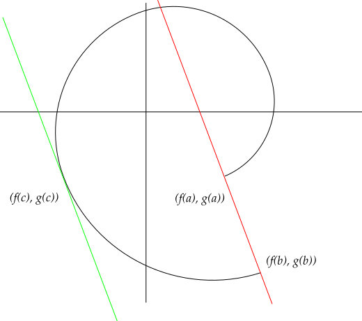

# Differentiability

:::{.theorem title="Mean Value Theorem"}
If $f: [a, b] \to \RR$ is continuous on a closed interval and differentiable on $(a, b)$, then there exists $\xi \in [a, b]$ such that 
\[
f(b) - f(a) = f'(\xi)(b-a)
.\]

More generally, if $g: [a,b]\to \RR$ is similarly continuous on $[a, b]$ and differentiable on $(a, b)$, then there exists a $\xi$ with
\[
\qty{ f(b) - f(c) } g'(\xi) = \qty{g(b) - g(a)} f'(\xi)
.\]
What this means graphically:

:::

:::{.proposition title="Lipschitz $\iff$ differentiable with bounded derivative."}
A function $f: (a, b) \to \RR$ is Lipschitz $\iff f$ is differentiable and $f'$ is bounded.
In this case, $\abs{f'(x)} \leq C$, the Lipschitz constant.
:::

:::{.theorem title="Term by Term Differentiability Theorem"}
If $f_n$ are differentiable, $\sum f_n' \to g$ uniformly, and there exists one point[^pointwise_works_too] $x_0$ such that $\sum f_n(x)$ converges, then there exists an $F$ such that 
[^theorem_referfence_6.4.3_Abbott]
\[
\norm{ \sum_{n\leq N} f_n - F} \convergesto{N\to\infty} 0 && F' = g
.\]

[^theorem_referfence_6.4.3_Abbott]: See Abbott theorem 6.4.3, pp 168.

[^pointwise_works_too]: So this implicitly holds if $f$ is the pointwise limit of $f_n$.

:::

:::{.example title="Derivatives of bounded functions need not be bounded"}
\[
f(x) \da 
\begin{cases}
x^2 \sin\qty{1\over x^2} &  x\neq 0
\\
0 & x=0.
\end{cases}
.\]

Note that $f$ is differentiable at $x=0$ since ${1\over h}\abs{f(h) - f(0)} = \abs{ h\sin\qty{h^{-2}}}\leq \abs{h}\to 0$, and
\[
f'(x) = 2x\sin\qty{1\over x^2 } - \qty{2\over x}\cos\qty{1\over x^2} \chi_{x\neq 0}
.\]
now take the sequence $x_n \da 1/\sqrt{k\pi}$ to get $f'(x_n) = 2\sqrt{k\pi}(-1)^k \convergesto{n\to\infty}\infty$.

:::

