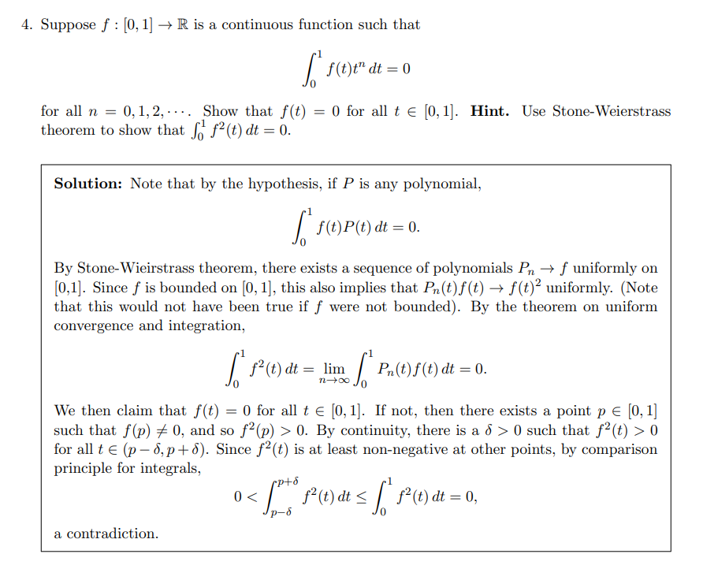

# Techniques

:::{.proposition title="Differentiating Under an Integral (non-negative)"}
If $\abs{\dd{}{t}f(x, t)} \leq g(x) \in L^1$, then letting $F(t) = \int f(x, t) ~dt$,
\[
\dd{}{t} F(t)
&\definedas \lim_{h \rightarrow 0} \int \frac{f(x, t+h)-f(x, t)}{h} d x \\
&\eq^{\scriptstyle\text{DCT}} \int \dd{}{t} f(x, t) ~dx
.\]

To justify passing the limit, let $h_k \to 0$ be any sequence and define
$$
f_k(x, t) = \frac{f(x, t+h_k)-f(x, t)}{h_k}
,$$
so $f_k \converges{k\to\infty}\too \dd{f}{t}$ pointwise.

Apply the MVT to $f_k$ to get $f_k(x, t) = f_k(\xi, t)$ for some $\xi \in [0, h_k]$, and show that $f_k(\xi, t) \in L_1$.
:::

#todo Examples

:::{.exercise title="?"}

:::

