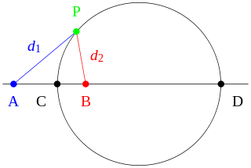
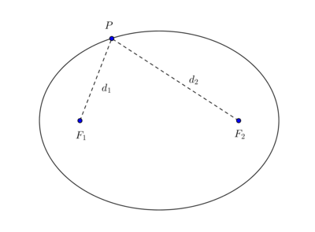
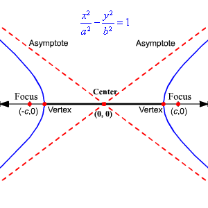

# Precalculus Preliminaries 

:::{.fact title="Standard forms of conic sections"}
\envlist

- Circle: $x^2 + y^2 = r^2$, or equivalently $\abs{z-a}=c$ or $\abs{z-a} = c\abs{z-b}$, the locus of points whose distances to two fixed points $A, B$ is a constant ratio not equal to 1, so $d_1/d_2 = c$:

- Ellipse: $\qty{\frac x a}^2  + \qty{\frac y b}^2 = 1$, or equivalently $\abs{z-a} + \abs{z-b} = c$
  Equivalently, the locus of points whose *sums* of distances to two fixed points points $A, B$ is a constant, so $d_1 + d_2 = c$:

- Hyperbola: $\qty{\frac x a}^2  - \qty{\frac y b}^2 = 1$ or equivalently $\abs{z-a} - \abs{z-b} = c$:

  - Rectangular Hyperbola: $xy = \frac{c^2}{2}$.
- Parabola: $-4ax + y^2 = 0$.

:::

:::{.remark}
Another way to distinguish: write $f(x, y) = Ax^2 + Bxy + Cy^2 + \cdots$, then consider the discriminant $\Delta = B^2 - 4AC$:

- $\Delta < 0 \iff$ ellipse
  - $\Delta < 0$ and $A=C, B=0 \iff$ circle
- $\Delta = 0 \iff$ parabola
- $\Delta > 0 \iff$ hyperbola

:::

:::{.fact title="Completing the square"}
\[
x^2 - bx = (x - s)^2 - s^2 \quad\text{where } s = \frac{b}{2} \\
x^2 + bx = (x + s)^2 - s^2 \quad\text{where } s = \frac{b}{2}
.\]
:::

:::{.fact}
The sum of the interior angles of an $n\dash$gon is $(n-2)\pi$, where each angle is $\frac{n-2}{n}\pi$.
:::

