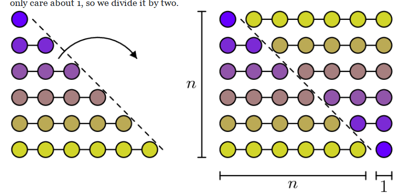
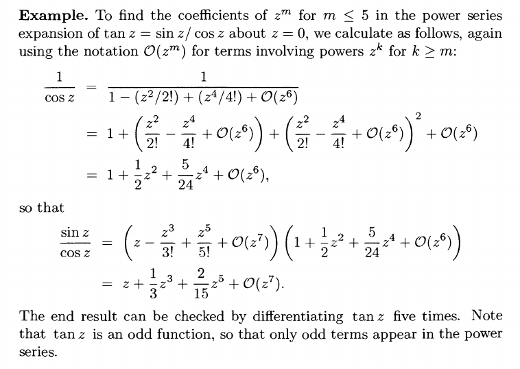

# Laurent and Power Series

:::{.fact title="Generalized Binomial Theorem"}
Define $(n)_k$ to be the falling factorial 
\[
\prod_{j=0}^{k-1} (n-k) = n(n-1)\cdots(n-k+1)
\]
and set ${n\choose k} \da (n)_k/k!$, then
\[
(x+y)^n = \sum_{k\geq 0} {n\choose k} x^{k}y^{n-k}
.\]
:::

:::{.fact title="List of useful series"}
\[
\sum_{k=1}^{n} k 
  &=\frac{n(n+1)}{2} \\
\sum_{k=1}^{n} k^{2} 
  &=\frac{n(n+1)(2 n+1)}{6} \\
\sum_{k=1}^{n} k^{3} 
  &=\frac{n^{2}(n+1)^{2}}{4}  \\
\sum_{0\leq k \leq N} z^k 
  &= {1 - z^{N+1} \over 1-z} \\
{1\over 1-z} &= \sum_{k\geq 0} z^k \\
e^z &= \sum_{k\geq 0} {z^k \over k!} \\
\sin(z) 
  &= \sum_{\substack{ k \geq 1 \\ \text{odd} }} (-1)^{k+1 \over 2} {z^k \over k!} \\
  &= z - {1\over 3!}z^3 + {1\over 5!}z^5 + \cdots \\ \\
\cos(z) 
  &= \sum_{\substack{ k \geq 0 \\ \text{even}} } (-1)^{k\over 2} {z^k \over k!} \\
  &= 1 - {1\over 2!}z^2 + {1\over 4!}z^4 + \cdots \\ \\
\cosh(z) &= \sum_{k\geq 0} { z^{2k} \over (2k)! } \\
&= 1 + {1\over 2!}z^2 + {1\over 4!}z^4 + \cdots \\ \\
\sinh(z) &= \sum_{k\geq 0} { z^{2k+1} \over (2k+1)! } \\
&= z + {1\over 3!}z^3 + {1\over 5!}z^5 + \cdots \\ \\
\log(1-z) 
  &= -1\cdot \sum_{k \geq 1} {z^k\over k} \quad \abs{z} < 1 \\ \\
\qty{\dd{}{z}}^k \sum_{n=0}^\infty c_n z^n 
  &= \sum_{n=k}^\infty (n)_k \, c_n z^{n-k} \\
  &= \sum_{n=k}^\infty n(n-1)\cdots(n-k+1) c_n z^{n-k} \\
(1+z)^{1/2} 
  &= \sum_{k\geq 0} {1/2 \choose k}z^k \\
  &= 1 + (1/2)z + {(1/2)(-1/2) \over 2!}z^2 + {(1/2)(-1/2)(-3/2) \over 3!}z^3 + \cdots \\
  &= 1 + {1\over 2}z - {1\over 8}z^2 + {1\over 16}z^3 - \cdots
\]

Some other classes of series to remember:
\[
\sum_{k=1}^{n} k
&= \frac{n(n+1)}{2} \\
\sum_{k=1}^{n} k(k+1)
&= \frac{n(n+1)(n+2)}{3} \\
\sum_{k=1}^{n} k(k+1)(k+2)
&= \frac{n(n+1)(n+2)(n+3)}{4} \\
\vdots \quad & \vdots \\
\sum_{k=1}^{n} k^{(p)} 
&= \frac{n^{(p+1)}}{p+1} && k^{(p)}\da k(k+1)(k+2) \cdots (k+p-1)
.\]
How to remember: compare to the integral
\[
\int_{x=0}^{x=n} x^p \dx = { n^{p+1} \over p+1}
.\]

Remembering that $\sum_{1\leq k \leq n} k = n(n+1)/2$: realize as counting a triangle, flip to count an entire rectangle of size $n\times (n+1)$ and take half:

Write $k^2 = k(k+1) - k$ to get
\[
\sum k^2 = \sum k(k+1) - \sum k = {n(n+1/2)(n+2/2) \over 3}
.\]
Similarly $\sum k^3 = (\sum k )^2$.

For summing the odds, $\sum_{k\geq 1} (2k-1)$:

For denominators: 
\[
\sum_{k=1}^{n} \frac{1}{k(k+1)}=\frac{1}{1}-\frac{1}{n+1} \\
\sum_{k=1}^{n} \frac{2}{k(k+1)(k+2)}=\frac{1}{1 \cdot 2}-\frac{1}{(n+1)(n+2)} \\
\sum_{k=1}^{n} \frac{p}{k^{(p+1)}}=\frac{1}{1^{(p)}}-\frac{1}{(n+1)^{(p)}}
,\]
where $1^{(p)} \da p!$.
How to remember the last one:
\[
\int_{x=1}^{x=n+1}{p\over x^{p+1}}\dx = {1\over 1^p} - {1\over (n+1)^p}
.\]

:::

:::{.fact title="Expanding square roots"}
\[
\sqrt{z} 
&= \sqrt{z_0 + z - z_0} \\
&= \sqrt{z_0 \qty{ 1 + {z-z_0 \over z} }} \\
&= \sqrt{z_0} \sqrt{1+u},\quad u\da {z-z_0 \over z} \\
\implies 
\sqrt{z} 
&= \sqrt{z_0} \sum_{k\geq 0} {1/2 \choose k} \qty{z- z_0 \over z}^k
.\]

:::

:::{.fact title="Multiplying series: Cauchy product"}
The product of two sequences is given by the Cauchy product
\[
\sum a_kz^k \cdot \sum b_k z^k = \sum c_k z^k,\quad c_k \da \sum_{j\leq k} a_k b_{k-j}
.\]
:::

:::{.fact title="Multiplicatively inverting a series"}
Using the general ring theory fact that $A(z) \da \sum_{k\geq 0} a_k z^k \in R[[z]]$ is invertible iff $a_0$ is invertible in $R$, power series over fields can always be inverted.
There is a formula: writing $B(z) \da \sum_{k\geq 0 } b_k z^k \da 1/A(z) \in \CC[[z]]$, the coefficients can be inductively computed as
\[
b_0 &= a_0\inv \\
b_n &= -a_0\inv \sum_{1\leq i \leq n} a_i b_{n-i} \\
&= -a_0\inv \sum_{0\leq i \leq n-1} a_{n-i}b_i \\
&= -{1\over a_0}\qty{a_nb_0 + a_{n-1}b_1 + \cdots + a_1 b_{n-1} }
.\]

Equivalently, supposing $A(z) \da 1 + a_1 z + a_2z^2 + \cdots$, a direct expansion gives
\[
{1\over A(z)} 
&= {1\over 1 + \displaystyle\sum_{k\geq 1} a_k z^k }\\
&= 
1 - \qty{\sum_{k\geq 1} a_k z^k}
\  + \qty{\sum_{k\geq 1} a_k z^k}^2
\  - \qty{\sum_{k\geq 1} a_k z^k}^3
\  + \cdots \\
&= 1 - (A(z) - 1) + (A(z) - 1)^2 - (A(z) - 1)^3 + \cdots
,\]
where to compute the $z^m$ term you only need to consider the first $m+1$ summands in this expansion.
:::

:::{.proof title="Sketch"}
How to prove this:
\[
\qty{\sum a_k z^k}\qty{\sum b_k z^k} = 1
\implies 
a_0b_0 &=1 \\
a_0b_1 + a_1b_0 &= 1 \\
a_0b_2 + a_1b_1 + a_2b_0 &= 1 \\
\vdots \quad&\quad \vdots
\]

:::

:::{.example title="Inverse coefficient formula for $1/1-z$"}
For example, for $A(z) = 1-z$, this recovers $(1-z)\inv = \sum_{k\geq 0} z_k$.
Noting $a_0 = 1, a_1 = -1$, we have

- $b_0 = 1/a_0 = 1$
- $b_1 = -{1\over a_0}(a_1 b_0) = -1(-1\cdot 1) = 1$
- $b_2 = -{1\over a_0}(a_2 b_0 + a_1 b_1) = -1(0\cdot 1 + -1\cdot 1) = 1$, 

and so on, so
\[
{1\over A(z)} = 1 + 1\cdot z + 1\cdot z^2 + \cdots
.\]

:::

:::{.example title="Inverse of $2z-1$"}
To compute the inverse of $A(z) \da (2z-1)$, note $a_0 = -1, a_1 = 2$, so

- $b_0 = 1/a_0 = -1$
- $b_1 = -{1\over a_0}(a_1b_0) = 1(2\cdot -1) = -2$
- $b_2 = -{1\over a_0}(a_2 b_0 + a_1 b_1) = 1(0\cdot 1 + 2\cdot -2) = -4$
- $b_3 = -{1\over a_0}(a_3b_0 + a_2 b_1 + a_1 b_2) = 1(0 + 0 + 2\cdot -4) = -8$

so
\[
{1\over 1-2z} = -1 - 2z - 4z^2 - 8z^3 \cdots 
= - \sum_{k\geq 0} (2z)^k
.\]
:::

:::{.example title="Inverting $\sin$ and computing $\tan$"}

:::

:::{.fact title="Using geometric series to invert power series"}
There is an alternative that sometimes (?) works: writing $A(z) = \sum_{k\geq 0} a_k z_k$, invert by formal manipulations:
\[
{1\over A(z)} = {1 \over 1- (1-A(z))} = \sum_{k\geq 0} (1-A(z))^k z^k
.\]
:::

:::{.warnings}
In order to invert $A$, you need to clear powers of $z$ so that a leading term is constant.
:::

:::{.example title="Inverting using geometric series"}
Inverting $\sin(z)$ using a geometric series, heeding the warning above:
\[
{1\over \sin(z)} 
&= {1\over z-{z^3\over 3!} + {z^5\over 5!} - \bigo(z^7) } \\
&={1\over z\qty{ 1 - {z^2\over 3!} + {z^4 \over 5!} - \bigo(z^6)} } \\
&= z\inv \qty{1\over 1 - p(z)} 
\qquad p(z) \da {z^2\over 3!} - {z^4\over 5!} + \bigo(z^6) \\
&= z\inv \sum_{k\geq 0} p(z)^k \\
&= z\inv\qty{ 1 + p(z) + p(z)^2 + \bigo(z^2)^3 } \\
&= z\inv\qty{ 1 
\ + \qty{{z^2\over 3!} - {z^4\over 5!} + \bigo(z^6)} 
\ + \qty{{z^2\over 3!} - {z^4\over 5!} + \bigo(z^6)}^2
\ + \bigo(z^6)} \\
&= {1\over z}\qty{ 1 + {1\over 3!}z^2 + \qty{\qty{1\over 3!}^2 - {1\over 5!} }z^4 + \bigo(z^6) }\\
&= {1\over z} + {1\over 6}z + {7\over 360}z^3 + \bigo(z^5)
.\]

:::

:::{.example title="Inverting by polynomial long division"}
With practice, it's much quicker to just do polynomial long division:
\[
{1\over \sin(z) } = z\inv\qty{z\over \sin(z)}
.\]
Now do the Euclidean algorithm:
\[
z 
\ = \qty{z - {z^3\over 3!} + {z^5\over 5!} - {z^7\over 7!} + \bigo(z^9) }
(1) + 
\qty{{z^3\over 3!} - {z^5 \over 5!} + {z^7 \over 7!} + \bigo(z^9) } 
\\ \\
{z^3\over 3!} - {z^5 \over 5!} + {z^7 \over 7!} + \bigo(z^9) 
=
\qty{z - {z^3\over 3!} + {z^5\over 5!} - {z^7\over 7!} + \bigo(z^9) }
\qty{z^2\over 3!}
\\
\quad + 
\qty{ z^5\qty{ -{1 \over 3! 3!} - {1\over 5!} } + z^7 \qty{- {1\over 3! 5!} + {1\over 7!}} + \bigo(z^9) }
\\ \\
 z^5\qty{ -{1 \over 3! 3!} - {1\over 5!} } + z^7 \qty{- {1\over 3! 5!} + {1\over 7!}} + \bigo(z^9)
\quad =
\qty{z - {z^3\over 3!} + {z^5\over 5!} - {z^7\over 7!} + \bigo(z^9) }
\qty{z^4 \qty{ {1\over 3! 3!} - { 1\over 5!}  } }
+ \bigo(z^7)
\\ \\
\implies {z\over \sin(z)} 
= 1 + {z^2\over 3!} + {7 z^4 \over 360 } + \bigo(z^6) \\
\implies {1 \over \sin(z)} 
= {1\over z}\qty {z\over \sin(z)}
= {1\over z}  + {z\over 3!} + {7 z^3 \over 360 } + \bigo(z^5)
.\]

> This looks like a lot, but it's really just the grade school algorithm.

:::

:::{.fact title="Dividing using polynomial long division"}
Polynomial long division basically works for formal power series, and with practice it's fast enough to just do in your head.
Recall the Euclidean algorithm, e.g. for ${z^3+1 \over z+1}$:
\[
z^3 + 1 &= (z+1)(z^2) + (-z^2 + 1) \\
\ -z^2 + 1 &= (z+1)(-z) + (z+1) \\
(z+1) &= (z+1)(1) + 0 \\
\implies
{z^3 + 1\over z+1} &= z^2 - z + 1
.\]
This goes by *increasing* powers, but one can also go by *decreasing* powers:
\[
1+z^3 &= (1+z)(1) + (-z+z^3) \\
\ -z+z^3 &= (1+z)(-z) + (z^2 + z^3) \\
z^2 +z^3 &= (1+z)(z^2) + 0 \\
\implies
{z^3 + 1\over z+1}&= 1 - z + z^2
,\]
which is useful for generating the first few low order terms of a series expansion.
:::

:::{.example title="Laurent series for $\tan$ by long division"}
Computing the Laurent series for $\tan(z)$ at $z=0$:
\[
{\sin(z) \over \cos(z)} 
&= {z - {1\over 3!}z^3 + {1\over 5!} z^5 + \bigo(z^7) \over 1 - {1\over 2!} z^2 + {1\over 4!}z^4 + \bigo(z^6) } 
\\ \\
z - {1\over 3!}z^3 + {1\over 5!}z^5 
&= \qty{1 - {1\over 2!}z^2 + {1\over 4!}z^4}(z)
\ +\qty{ \qty{{1\over 2!} - {1\over 3!}}z^3 + \qty{-{1\over 4!} + {1\over 5!} }z^5 } \\
&= \qty{1 - {1\over 2!}z^2 + {1\over 4!}z^4}(z)
\ +\qty{ {1\over 3}z^3 -{1\over 30}z^5 } 
\\ \\
{1\over 3}z^3 -{1\over 30}z^5 
&= \qty{1 - {1\over 2!}z^2 + {1\over 4!}z^4}\qty{{1\over 3} z^3}
\ +\qty{ \qty{ {1\over 6} - {1\over 30} } z^5 + \qty{ -{1\over 3\cdot 24} }z^7 } 
\\
&= \qty{1 - {1\over 2!}z^2 + {1\over 4!}z^4}\qty{{1\over 3} z^3}
 + \qty{ {2\over 15}z^5 - {1\over 72}z^7 }
\\ \\
{ {2\over 15}z^5 - {1\over 72}z^7 }
&= \qty{1 - {1\over 2!}z^2 + {1\over 4!}z^4}\qty{{2\over 15} z^5} + \cdot
\\ \\
\implies \tan(z) &= z + {1\over 3}z^3 + {2\over 15 }z^5 + \bigo(z^7)
.\]
:::

# Exercises

:::{.exercise title="Integral formula for coefficients"}
Show that if $f(z) \sum_{k\in \ZZ} c_k (z-z_0)^k$, then 
\[
c_k = {1\over 2\pi i}\int_\gamma {f(z) \over (z-z_0)^{n+1}}\dz
,\]
and that this converges in an annulus $D_R(z_0)\sm \bar{D_r(z_0)}$ where
\[
r=\limsup _{n \rightarrow \infty} \sqrt[n]{\left|a_{-n}\right|} \text { and } R=\frac{1}{\limsup _{n \rightarrow \infty} \sqrt[n]{\left|a_{n}\right|}} \text {. }
.\]

Hint: start with
\[
f(z)=\frac{1}{2 \pi i} \oint_{\left|w-z_{0}\right|=s_{2}} \frac{f(w)}{w-z} d w-\frac{1}{2 \pi i} \oint_{\left|w-z_{0}\right|=s_{1}} \frac{f(w)}{w-z} d w
,\]
and try to obtain a geometric series to obtain
\[
f(z)=\sum_{j=-\infty}^{\infty}\left(\frac{1}{2 \pi i} \oint_{\left|w-z_{0}\right|=r} \frac{f(w)}{\left(w-z_{0}\right)^{j+1}} d w\right)\left(z-z_{0}\right)^{j}
.\]

:::

:::{.exercise title="?"}
Find the radius of convergences for the power series expansion of $\sqrt{z}$ about $z_0 = 4 +3i$.
Repeat with $z_1=-4+3i$.

#completed

:::

:::{.solution}
Choose the principal branch of $\log$, so take a branch cut at $\RR_{\leq 0}$, to define $z^{1\over 2} = e^{{1\over 2}\log(z)}$.
The radius of convergence is the distance to the nearest singularity or branch cut, so note that $f(z) = z^{1\over 2}$ is singular at $z=0$, so we compute $\abs{z_0 - 0} = \abs{4+3i} = 5$.
The distance to the branch is also 5, so $R=5$.

For $z_1$, the distance to zero is $\abs{4+3i - 0} = 5$ but the distance to the branch is 4, so $R=4$.

> Note the subtle distinction: the series converges to $f$ in a disc $\abs{z-z_0}<1$, but the series itself converges in larger discs.

:::

:::{.exercise title="Expanding Laurent series in different regions"}
Expand $f(z) = {1\over z(z-1)}$ in both

- $\abs{z} < 1$
- $\abs{z} > 1$

#completed

:::

:::{.solution}
\[
{1\over z(z-1)} = -{1\over z}{1 \over 1-z} = -{1\over z}\sum z^k
.\]
and
\[
{1\over z(z-1)} = {1\over z^2(1 - {1\over z})} = {1\over z^2} \sum \qty{1\over z}^k
.\]
:::

:::{.exercise title="Laurent expansions about different points"}
Find the Laurent expansion about $z=0$ and $z=1$ respectively of the following function:
\[
f(z) \da {z+1 \over z(z-1)}
.\]

#completed
:::

:::{.solution}
Note: once you see that everything is in terms of powers of $(z-z_0)$, you're essentially done.
For $z=0$:
\[
{z+1 \over z(z-1)}
&= {1\over z} {z+1 \over z-1} \\
&= -{z+1\over z} {1\over 1-z} \\
&= -\qty{1 + {1\over z}}\sum_{k\geq 0} z^k
.\]

For $z=1$:
\[
{z+1 \over z(z-1)}
&= {1\over z-1}\qty{1 + {1\over z} } \\
&= {1\over z-1}\qty{1 + {1\over 1 - (1-z)} } \\
&= {1\over z-1} \qty{1 + \sum_{k\geq 0} (1-z)^k } \\
&= {1\over z-1} \qty{1 + \sum_{k\geq 0} (-1)^k (z-1)^k }
.\]

:::

:::{.problem title="?"}
Show that any power series is continuous on its domain of convergence. 

#work

:::

:::{.exercise title="?"}
Find the radius of convergence of 

- $\sum a^k z^k$ for $a$ a constant.
- $\sum a^{k^2}z^k$

#completed

:::

:::{.solution}
\envlist

- $R = 1/\limsup \abs{a^k}^{1\over k} = 1\over \abs{a}$
- $R = 1/\limsup \abs{a^{k^2}}^{1\over k} = 1/\limsup \abs{a}^k$, so $R=\infty$ if $\abs{a}< 1$, $R=0$ if $\abs{a}<1$, and $R=1$ if $\abs{a} = 1$.
:::

