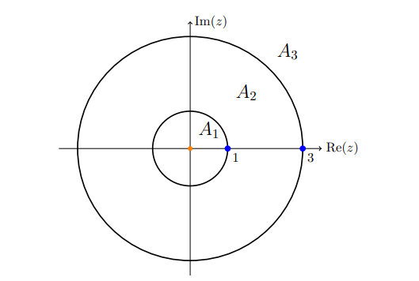

# Series Exercises

## Analytic Properties of Series

:::{.exercise title="Power series converge uniformly on their radius of convergence"}
Show that any power series converges uniformly within its radius of convergence.

#completed

:::

:::{.solution}
Write $S_N(z) \da \sum_{0\leq k\leq N} c_k (z-z_0)^k$ and $S \da \lim_{N\to\infty} S_N$.
Suppose $R\da \qty{\limsup_k \abs{c_k}^{1\over k} }\inv$ is the radius of convergence and let $r\leq R$, we'll show $S_N\to S$ uniformly on any disc $\abs{z-z_0}< r$.

Use the $M\dash$test: $\sum f_k$ converges if $\norm{f_k}_\infty\leq M_k$ where $\ts{M_k}\in \ell^1(\NN)$.
Define $f_k \da c_k (z-z_0)^k$, then 
\[
\norm{f_k}_\infty =\sup_{\abs{z-z_0}\leq r} \abs{c_k(z-z_0)^k} \leq \abs{c_k} r^k \da M_k
.\]
Then
\[
\sum_{k\geq 0} M_k = \sum_{k\geq 0} \abs{c_k} r^k
,\]
and the claim is that this converges.

Note that since $r\leq R$, we have convergence of 
\[
\sum_{k\geq 0} c_k r^k
.\]
Recall that root test:
\[
\sum_k a_k \text{ converges absolutely if } \limsup_k \abs{a_k}^{1\over k} < 1
.\]
Here we take $a_k \da c_k r^k$, then
\[
\limsup_k \abs{a_k}^{1\over k} 
&\da \limsup_k \abs{c_k r^k}^{1\over k} \\
&= \limsup_k \abs{c_k}^{1\over k} r \\
&< \limsup_k \abs{c_k}^{1\over k} R\\
&\da \limsup_k \abs{c_k}^{1\over k} \qty{\limsup_{k} \abs{c_k}^{1\over k} }\inv \\
&= 1
,\]
so $\sum_k \abs{c_k r^k} < \infty$.
Thus $\ts{M_k}\in \ell^1(\NN)$, and so $\sum_k f_k$ converges uniformly and absolutely on $\abs{z-z_0} = r < R$.
:::

:::{.exercise title="Power series are continuous"}
Show that any power series is continuous on its domain of convergence. 

#completed

:::

:::{.solution}
Let $f(z) = \lim_{N\to\infty} \sum_{k\leq N} c_k (z-z_0)^k$.
Use that power series converge uniformly and absolutely within their disc of convergence, each term is a continuous function, and finite sums of continuous functions are again continuous.
So the partial sums $S_N$ are continuous, and since $S_N\to f$ uniformly, $f$ is continuous by the uniform limit theorem.

:::

:::{.exercise title="Uniform limits of derivatives, term-by-term differentiation"}
Suppose $f_k: \Omega\to \CC$ is a sequence of differentiable functions converging locally uniformly to $f:\Omega\to \CC$.
Show that

- $f$ is continuous,
- $f$ is differentiable,
- $\ts{f_k'}\to f'$ locally uniformly.

Thus if $f(z) = \sum{k\geq 0} c_k (z-z_0)^k$ is a power series, since $S_N\to f$ locally uniformly, $f$ can be differentiated term-by-term within its radius of convergence.

#complete

:::

:::{.solution}
That $f$ is continuous is a local question: fixing a point $z_0$, take a closed disc $\DD+z_0$ about $z_0$.
By local uniform convergence $f_k\to f$ uniformly on $\DD+z_0$, and differentiable $\implies$ continuous.
So each $f_k$ is continuous, making $f$ continuous on $\DD+z_0$ by the uniform limit theorem.

That $f$ is differentiable is again a local question: fix $z$ and write $\gamma \da \bar{\DD + z}$ as the boundary of the disc about $z$.
Define $g_k(\xi) \da {f_k\over \xi-z}$, so $g_k \to {f \over \xi-a}$ locally uniformly.
Now apply Cauchy's integral formula at $z$:
\[
f(z) 
&= \lim_k f_k(z) \\
&= \lim_k {1\over 2\pi i}\int_\gamma {f_k(\xi) \over \xi - z}\dxi \\
&= \lim_k {1\over 2\pi i}\int_\gamma g_k(\xi)\dxi\\
&= {1\over 2\pi i}\int_\gamma \lim_k g_k(\xi)\dxi \\
&= {1\over 2\pi i}\int_\gamma g(\xi)\dxi\\
&= {1\over 2\pi i}\int_\gamma {f(\xi) \over \xi - z} \dxi
,\]
where we've used uniform convergence on $\gamma$ to commute the limit and integral.
So $f$ has an integral representation, making it differentiable.

That $f_k'\to f'$: 
\[
\lim_k f_k'(z)
&= \lim_k {1\over 2\pi i}\int_\gamma {f_k(\xi) \over (\xi - z)^2 }\dxi\\
&= {1\over 2\pi i}\int_\gamma \lim_k {f_k(\xi) \over (\xi - z)^2}\dxi\\
&= {1\over 2\pi i}\int_\gamma {f(\xi) \over (\xi - z)^2}\dxi\\
&= f'(z)
.\]

That the convergence is locally uniform:
first consider what happens on an closed discs $K = D$ with $\gamma \da \bd{D}$.
Then for $z\in D$,
\[
\abs{f'(z) - f_k'(z) }
&= \abs{{1\over 2\pi i} \int_{\gamma} {f(\xi) - f_k(\xi) \over (\xi - z)^2}\dxi }\\
&\leq {1\over 2\pi}\int_{\gamma} {\abs{f(\xi) - f_k(\xi) } \over \abs{\xi - z}^2} \dxi\\
&\leq {1\over 2\pi}\int_{\gamma } { \sup_{\xi \in \gamma} \abs{f(\xi) - f_k(\xi) } \over r^2 } \dxi\\
&= {1\over 2\pi} { \sup_{\xi \in \gamma } \abs{f(\xi) - f_k(\xi) } \over r^2} \cdot {2\pi r} \\
&= { \sup_{\xi \in \gamma } \abs{f(\xi) - f_k(\xi) }}/r 
.\]
Since $\gamma$ is compact, using locally uniform convergence of $f_k\to f$, there exists an $n_0$ such that $n\geq n_0$ bounds this $\sup$ by $\eps$.
For $K$ arbitrary, cover $K$ by discs $D_z$ for every $z\in K$ and extract a finite cover $\ts{D_{z_k}}_{k\leq N}$.
Produce $n_0, n_1,\cdots, n_N$ as in the above argument, and take $n\da \max\ts{n_k}_{k\leq N}$ to obtain uniform convergence on every $D_{z_k}$ and thus on $K$.
:::

## Radius of Convergence 

:::{.exercise title="Radius of convergence"}
Find the radius of convergence of 

- $\sum a^k z^k$ for $a$ a constant.
- $\sum a^{k^2}z^k$

#completed

:::

:::{.solution}
\envlist

- $R = 1/\limsup \abs{a^k}^{1\over k} = 1\over \abs{a}$
- $R = 1/\limsup \abs{a^{k^2}}^{1\over k} = 1/\limsup \abs{a}^k$, so $R=\infty$ if $\abs{a}< 1$, $R=0$ if $\abs{a}<1$, and $R=1$ if $\abs{a} = 1$.
:::

:::{.exercise title="Radius of convergence"}
Find the radius of convergences for the power series expansion of $\sqrt{z}$ about $z_0 = 4 +3i$.
Repeat with $z_1=-4+3i$.

#completed

:::

:::{.solution}
Choose the principal branch of $\log$, so take a branch cut at $\RR_{\leq 0}$, to define $z^{1\over 2} = e^{{1\over 2}\log(z)}$.
The radius of convergence is the distance to the nearest singularity or branch cut, so note that $f(z) = z^{1\over 2}$ is singular at $z=0$, so we compute $\abs{z_0 - 0} = \abs{4+3i} = 5$.
The distance to the branch is also 5, so $R=5$.

For $z_1$, the distance to zero is $\abs{4+3i - 0} = 5$ but the distance to the branch is 4, so $R=4$.

> Note the subtle distinction: the series converges to $f$ in a disc $\abs{z-z_0}<1$, but the series itself converges in larger discs.

:::

:::{.exercise title="Convergence of a $\ZZ\dash$index series"}
Find the radius of convergence for 
\[
f(z) \da \sum_{k\in \ZZ} 2^{-\abs{k}}z^k
.\]

#completed

:::

:::{.solution}
Break this up into a principal part at $z=0$ and a holomorphic part:
\[
f(z) = f_1(z) + f_2(z) \da \sum_{k\geq 1} 2^{-k}z^{-k} + \sum_{k\geq 0} 2^{-k}z^k
.\]

Using the ratio test:
\[
f_1(z) < \infty &\impliedby \limsup_k \abs{2^{-k}z^{-k}}^{1\over k} < 1 \iff \limsup_k \abs{1\over 2z} < 1 \iff {1\over 2}< \abs{z} \\
f_2(z) < \infty &\impliedby \limsup_k \abs{2^{-k}z^{k}}^{1\over k} < 1 \iff \limsup_k \abs{z\over 2}< 1 \iff \abs{z} < 2 
.\]

So $f$ converges on ${1\over 2}< \abs{z} < 2$.

:::

## Finding Laurent Expansions

:::{.exercise title="Expanding Laurent series in different regions"}
Expand $f(z) = {1\over z(z-1)}$ in both

- $\abs{z} < 1$
- $\abs{z} > 1$

#completed

:::

:::{.solution}
\[
{1\over z(z-1)} = -{1\over z}{1 \over 1-z} = -{1\over z}\sum z^k
.\]
and
\[
{1\over z(z-1)} = {1\over z^2(1 - {1\over z})} = {1\over z^2} \sum \qty{1\over z}^k
.\]
:::

:::{.exercise title="Laurent expansions about different points"}
Find the Laurent expansion about $z=0$ and $z=1$ respectively of the following function:
\[
f(z) \da {z+1 \over z(z-1)}
.\]

#completed
:::

:::{.solution}
Note: once you see that everything is in terms of powers of $(z-z_0)$, you're essentially done.
For $z=0$:
\[
{z+1 \over z(z-1)}
&= {1\over z} {z+1 \over z-1} \\
&= -{z+1\over z} {1\over 1-z} \\
&= -\qty{1 + {1\over z}}\sum_{k\geq 0} z^k
.\]

For $z=1$:
\[
{z+1 \over z(z-1)}
&= {1\over z-1}\qty{1 + {1\over z} } \\
&= {1\over z-1}\qty{1 + {1\over 1 - (1-z)} } \\
&= {1\over z-1} \qty{1 + \sum_{k\geq 0} (1-z)^k } \\
&= {1\over z-1} \qty{1 + \sum_{k\geq 0} (-1)^k (z-1)^k }
.\]

:::

:::{.exercise title="Laurent expansions on annuli"}
Find a Laurent expansion for $f(z) \da {1\over (z-3)(z-1)}$ on the 3 annular regions centered at $0$ where $f$ is holomorphic.

#completed

:::

:::{.solution}
The three regions are 

- $0 \leq \abs{z} < 1$
- $1 < \abs{z} < 3$
- $3 < \abs{z} < \infty$

Write $f$ in terms of its principal parts at $z=1$ and $z=3$ by computing the residues:

- $\Res_{z=1}f(z) = (z-1)f(z)\evalfrom_{z=1} = {1\over z-3}\evalfrom_{z=1} = -{1\over 2}$
- $\Res_{z=3}f(z) = (z-3)f(z)\evalfrom_{z=3} = {1\over z-1}\evalfrom_{z=3} = {1\over 2}$

Thus
\[
f(z) = {-1/2 \over z-1} + {1/2 \over z-3}
.\]

Now find the two expansions for each term:

\[
{-1/2 \over z-1} &= {1/2 \over 1-z} = {1\over 2}\sum_{k\geq 0} z^k 
&& 0 < \abs{z} < 1 \\
{-1/2 \over z-1} &= -{1\over 2}{z\inv \over z\inv - 1} = -{1\over 2z}{1\over 1-z\inv} = -{1\over 2}\sum_{k\geq 0}z^{-k-1} 
&& 1 < \abs{z} < \infty \\
{1/2\over z-3} &= -{1\over 2}{1\over 3-z} = -{1\over 6}{1\over 1-{z\over 3}} = -{1\over 6}\sum_{k\geq 0}3^{-k} z^k 
&& 0 < \abs{z} < 3 \\
{1/2\over z-3} &= {1\over 2z}{1\over 1-3z\inv} = {1\over 2z} \sum_{k\geq 0}3^kz^{-k} = {1\over 2}\sum_{k\geq 0}3^k z^{-k-1}
&& 3 < \abs{z} < \infty
.\]

Now, just combinatorics to pick the various series that converge on the desired regions:
\[
0 \leq \abs{z} < 1 
\qquad & f(z) = {1\over 2}\sum_{k\geq 0}z^k - {1\over 6}\sum_{k\geq 0} 3^{-k}z^k \\
1 \leq \abs{z} < 3 
\qquad & f(z) = -{1\over 2}\sum_{k\geq 0}z^{-k-1} - {1\over 6}\sum_{k\geq 0} 3^{-k}z^k \\
3 \leq \abs{z} < \infty 
\qquad & f(z) = - {1\over 2}\sum_{k\geq 0}z^{-k-1} + {1\over 2}\sum_{k\geq 0} 3^{k}z^{-k-1}
.\]
:::

:::{.exercise title="Cosine expansion in $z\inv$"}
Expand $f(z) = z^2\cos\qty{z\over 3}$ about $z=0$.
:::

:::{.solution}
\[
f(z) = z^2\qty{ 1 + {1\over 2!}\qty{1\over 3z}^2 + {1\over 4!}\qty{1\over 3z}^4 } = z^2 + {1\over 2! \cdot 3^2} + {1\over 4! \cdot 3^4}z^{-2} + \cdots
.\]
:::

:::{.exercise title="Expansion for a reciprocal"}
Find a power series expansion of 
\[
f(z) = {1\over e^z-1}
.\]

#completed

:::

:::{.solution}
One way: polynomial long division.
\[
{1\over e^z-1} 
&= {1\over z + {1\over 2}z^2 + {1\over 6}z^2 + \cdots } \\
&= {1\over z}\qty{1 - {1\over 2}z + \qty{-{1\over 6} + {1\over 4} }z^2 + \cdots } \\
&= z\inv - {1\over 2} + {1\over 12}z + \bigo(z^3)
.\]
Alternatively, use geometric series.
Note that something like ${1\over 1-e^z} = \sum_{k\geq 0} e^{kz}$ won't converge, and won't even be calculable since each $e^{kz}$ contributes a constant term!
\[
{1\over e^z-1} 
&= {1\over z + {1\over 2}z^2 + {1\over 6}z^3 + \cdots } \\
&= {1\over z(1 + {1\over 2}z + {1\over 6}z^2 + \cdots) } \\
&= z\inv {1\over 1 + q(z) } \qquad q(z) \da {1\over 2}z + {1\over 6}z^2 + \cdots \\
&= z\inv \sum_{k\geq 0}(-q(z))^k \\
&= z\inv \qty{1 - q(z) + q(z)^2 - \cdots } \\
&= z\inv\qty{1 - \qty{{1\over 2}z + {1\over 6}z^2 + \cdots } + \qty{{1\over 2}z + {1\over 6}z^2 + \cdots }^2 - \cdots } \\
&= z\inv\qty{ 1 - {1\over 2} z + \qty{-{1\over 6} + \qty{1\over 2}^2 } z^2 + \bigo(z^3) } \\
&= z\inv - {1\over 2} + {1\over 12}z + \bigo(z^2)
.\]
:::

:::{.exercise title="Expansion at an essential singularity"}
Find a Laurent expansion at $z=0$ for
\[
f(z) \da e^{1\over z}\cos\qty{1\over z}
.\]

#completed

:::

:::{.solution}
Note that a direct expansion won't work, since there are infinitely many contributions to the constant term.
Instead, a trick: consider $g(z) \da e^z\cos(z)$, so $g(1/z ) = f(z)$.
Expanding $g$ is easier:
\[
g(z) 
&= e^{z}\cos(z)\\
&= {1\over 2}e^z\qty{e^{iz} + e^{-iz}} \\
&= {1\over 2}\qty{e^{(1+i)z} + e^{(1-i)z}} \\
&= {1\over 2} \sum_{k\geq 0}\qty{(1+i)^k + (1-i)^k} {z^k\over k!} \\
\implies f(z) 
&= {1\over 2} \sum_{k\geq 0}\qty{(1+i)^k + (1-i)^k} {1 \over k!z^k } \\
.\]

:::

:::{.exercise title="Expansion at an essential singularity"}
Find a Laurent expansion about $z=0$ of
\[
f(z) \da \cos\qty{1- {1\over z}}
,\]
and compute the "residue" coefficient $c_{-1}$.

#completed

:::

:::{.solution}
Write $g(z) \da \cos(1-z)$, so $g(1/z) = f(z)$, and expand:
\[
g(z) 
&= \cos(1-z) \\
&= {1\over 2}\qty{e^{i(1-z)} + e^{-i(1-z)}} \\
&= {1\over 2}\qty{e^i e^{-iz} + e^{-i} e^{iz}}\\
&= {1\over 2}\sum_{k\geq 0} \qty{ (-i)^k e^i + i^k e^{-i} } {z^k \over k!} \\
\implies f(z) 
&= {1\over 2}\sum_{k\geq 0}  \qty{ ( (-i)^k e^i + i^k e^{-i} } {1 \over k!z^k}
.\]

Taking $k=1$ yields
\[
c_{-1} = {-ie^i + ie^{-i} \over 2} = -i\cdot {e^i - e^{-i}\over 2} = {e^i - e^{-i}\over 2i} = \sin(1)
.\]

:::

:::{.exercise title="Laurent expanding exponentials"}
Find a Laurent expansion that converges for $\abs{z} > 1$ of
\[
f(z) \da {1 \over e^{1-z}}
.\]

#completed

:::

:::{.solution}
\[
f(z) = e^{-(1-z)} = e^{z-1} = e\inv e^z = e\inv\sum_{k\geq 0} {z^k\over k!}
.\]
Since $e^z$ is entire, this converges on $\CC$.
:::

:::{.exercise title="Laurent expanding tricky exponentials"}
Find a Laurent expansion for
\[
f(z) = {1\over 1 + e^z}
\]
about $z_0 = 0$ and $z_1 = i\pi$.

#completed

:::

:::{.solution}
At $z=0$, we can use a geometric series approach since $\abs{e^z} = e^{\Re(z)} \leq 1$ near $0$.
However, we still have to get rid of the leading 1 in the expansion of $e^z$ in order to get a constant coefficient.
\[
{1\over 1 + e^z} 
&= {1\over 1 + 1 + z + {1\over 2!}z^2 + {1\over 3!} z^3 + \bigo(z^4)} \\
&= {1\over 2 + z + {1\over 2!}z^2 + {1\over 3!} z^3 + \bigo(z^4) } \\
&= {1\over 2} {1\over 1 + {1\over 2} z + {1\over 2\cdot 2!}z^2 + {1\over 2\cdot 3!} z^3 + \bigo(z^4) } \\
&= {1\over 2}{1\over 1 - (-p(z)) } \qquad p(z) \da {1\over 2}z + {1\over 2\cdot 2!}z^2 + {1\over 2\cdot 3!}z^3 + \bigo(z^4)  \\
&= {1\over 2} \sum_{k\geq 0} (-p(z))^k \\
&= {1\over 2}\Big[ 1 - \qty{{1\over 2}z + {1\over 2\cdot 2!}z^2 + {1\over 2\cdot 3!}z^3 + \bigo\qty{z^4} } \\ 
&\qquad + \qty{ {1\over 2}z + {1\over 2\cdot 2!}z^2 + {1\over 2\cdot 3!}z^3 + \bigo\qty{z^4} }^2 \\ 
&\qquad - \qty{{1\over 2} z + {1\over 2\cdot 2!}z^2 + {1\over 2\cdot 3!}z^3 + \bigo\qty{z^4} }^3 \\
&\qquad - \bigo(z^4) \Big]\\
&= {1\over 2}
\Big[ 
1 + z\qty{- {1\over 2}} + z^2\qty{- {1\over 2\cdot 2!} + \qty{1\over 2}^2}\\
&\qquad + z^3
\Big(
-{1\over 2\cdot 3! } +\left[ \qty{1\over 2}^3 + {1\over 2}{1\over 2\cdot 2!}\right] - \qty{1\over 2}^3 
\Big) \\
&\qquad + \bigo(z^4)
\Big]\\
&= {1\over 2} - {1\over 4}z + 0z^2 + {1\over 48}z^3 + \bigo(z^4)
.\]

Expanding at $z-i\pi$: quite a bit easier.
Let $\omega \da z-i\pi$, then
\[
{1\over 1 + e^z}
&= {1\over 1 + e^{z-i\pi}e^{i\pi}} \\
&= {1\over 1 - e^{\omega} } \\
&= {1 \over -\omega - {1\over 2!}\omega^2 - {1\over 3!}\omega^3 - \bigo(\omega^4) } \\
&= -{1\over \omega} {1 \over 1 + {1\over 2!}\omega + {1\over 3!}\omega^2 + \bigo(\omega^3) } \\
&= -{1\over \omega}{1\over 1-(- p(z) ) } \qquad p(z) \da \sum_{k\geq 2}{\omega^{k-1}\over k!} \\
&= -{1\over \omega} \sum_{k\geq 0} (-p(z))^k \\
&= -{1\over \omega}
\left[
1 -
\qty{{1\over 2!}\omega + {1\over 3!}\omega^2 + \bigo(\omega^3)} + 
\qty{{1\over 2!}\omega + {1\over 3!}\omega^2 + \bigo(\omega^3)}^2 -
\bigo(\omega^3)
\right] \\
&= -{1\over \omega}
\left[
1 + \omega\qty{-{1\over 2!}} + \omega^2\qty{-{1\over 3!} + \qty{1\over 2!}^2} + \bigo(\omega^3)
\right]
.\]

:::

## New Things in $\CC$

:::{.exercise title="Cauchy integral formula for coefficients"}
Show that if $f(z) \sum_{k\in \ZZ} c_k (z-z_0)^k$, then 
\[
c_k = {1\over 2\pi i}\int_\gamma {f(z) \over (z-z_0)^{n+1}}\dz
,\]
and that this converges in an annulus $D_R(z_0)\sm \bar{D_r(z_0)}$ where
\[
r=\limsup _{n \rightarrow \infty} \sqrt[n]{\left|a_{-n}\right|} \text { and } R=\frac{1}{\limsup _{n \rightarrow \infty} \sqrt[n]{\left|a_{n}\right|}} \text {. }
.\]

Hint: start with
\[
f(z)=\frac{1}{2 \pi i} \oint_{\left|w-z_{0}\right|=s_{2}} \frac{f(w)}{w-z} d w-\frac{1}{2 \pi i} \oint_{\left|w-z_{0}\right|=s_{1}} \frac{f(w)}{w-z} d w
,\]
and try to obtain a geometric series to obtain
\[
f(z)=\sum_{j=-\infty}^{\infty}\left(\frac{1}{2 \pi i} \oint_{\left|w-z_{0}\right|=r} \frac{f(w)}{\left(w-z_{0}\right)^{j+1}} d w\right)\left(z-z_{0}\right)^{j}
.\]

#work

:::

