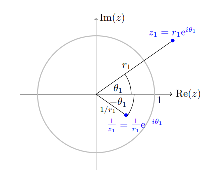

# Complex Arithmetic

:::{.fact title="The balancing exponentials trick"}
There are formulas:
\[
&e^{a i \omega}+e^{b i \omega}
&=2 \cos \left(\frac{a-b}{2} \omega\right) e^{\frac{a+b}{2} i \omega} \\
e^{a i \omega}-e^{b i \omega}
&=2 i \sin \left(\frac{a-b}{2} \omega\right) e^{\frac{a+b}{2} i \omega}
.\]
Why this is useful: you can reduce a sum of two exponentials to a complex scalar times a real trig function, e.g. when computing a residue to get a real number.
Why this is true: for the right choice of $\ell$,
\[
e^{aiw} + e^{biw} = e^{\ell iw} \qty{ e^{(l-a)iw} + e^{(\ell - b)iw} } = e^{\ell i w} \qty{ e^{kiw} + e^{-kiw}} = e^{\ell i w}\cdot 2\cos(kw)
.\]
To make this hold, choose

- $\ell \da {a+b\over 2}$
- Then $\ell - a = {b-a \over 2} \da k$
- $\ell -b = {a-b\over 2} = -k$

An example:
\[
e^{-i\pi \over 2}+ e^{-3i\pi \over 2} 
&\da e^{-iw} + e^{-3iw} \\
&= e^{-2iw} \qty{e^{iw} + e^{-iw}}\\
&= e^{-2iw}\cdot 2\cos(w) \\
&= e^{-2i\cdot {\pi \over 2}}\cdot 2\cos\qty{\pi \over 2} \\
&= -i\cdot 0 = 0
.\]

:::

:::{.fact title="Some useful facts about basic complex algebra"}
\[
z + \bar{z} &= 2\Re(z) 
&& 
z - \bar{z} = 2i\Im(z) \\
z\bar z &= \abs{z}^2 
&& 
\Arg(z/w) = \Arg(z) - \Arg(w) \\
\Re(z) &= { z + \bar z \over 2} 
&& 
\Im(z) = {z - \bar{z} \over 2i} \\
{1\over i} &= -i = i^3 &&
{1\over i^3} = i
.\]

Exponential forms of cosine and sine, where it's sometimes useful to set $w\da e^{iz}$:
\[
\cos(z) 
&= \frac 1 2 \qty{e^{iz} + e^{-iz}} = {1\over 2}(w+ w\inv)\\
\sin(z) 
&= \frac{1}{2i}\qty{e^{iz} - e^{-iz}} = {1\over 2i}(w-w\inv)
.\]

Exponential forms of *hyperbolic* cosine and sin:
\[
\cosh(z) 
&= \cos(iz) 
= {1\over 2}\qty{e^z + e^{-z}} \\
\sinh(z) 
&= -i \sin(iz) 
= {1\over 2}\qty{e^z - e^{-z}} 
.\]

Some other useful facts about the hyperbolic exponentials:

- They are periodic with period $2\pi i$.
- $\dd{}{z}\cosh(z) = \sinh(z)$ and $\dd{}{z}\sinh(z) = \cosh(z)$.
- $\sinh$ is odd and $\cosh$ is even.
- $\cosh(z + i\pi) = -\cosh(z)$ and $\sinh(z + i\pi) = -\sinh(z)$.
- $\cosh$ has zeros at $\ts{i\pi\qty{2k+1\over 2}} = \ts{i \qty{\pi/2 + k\pi}}$, i.e. $\cdots, -\pi/2, \pi/2, 3\pi/2,\cdots$, the half-integers.
- $\sinh$ has zeros at $\ts{i\pi k}$, i.e. the integers.
- $\sinh(z)$ has a particularly nice formula for derivatives:
\[
f(z) &\da \cosh(z) \implies f^{(n)}(z) = {e^z + (-1)^n e^{-z}\over 2} \\
f(z) &\da \sinh(z) \implies f^{(n)}(z) = {e^z - (-1)^{n} e^{-z}\over 2} 
.\]

:::

:::{.fact}
Some computations that come up frequently:
\[
\abs{z \pm w}^2 &= \abs{z}^2 + \abs{w}^z + 2\Re(\bar{w}z) \\
(a+bi)(c+di) &= (ac - bd) + (ad + bc) \\
{1\over \abs{a+b}} &\leq {1 \over {\abs a - \abs b}} &&
\abs{e^{z}} = e^{\Re(z)}, \quad \arg(e^z) = \Im(z)
.\]
:::

:::{.fact}
The inversion $z\to 1/z$ is easiest to understand in polar coordinates, $Re^{i\theta}\mapsto {1\over R}e^{-i\theta}$:

:::

# Exercises

:::{.exercise title="Finding complex roots"}
Solve $z^4=i$.

#complex/completed/exercise

:::

:::{.solution}
First find a principal root: $z^4=i = e^{i\pi\over 2} \implies z_0 = e^{i\pi \over 8}$.
Now all of the roots are $\ts{z_k = z_0 \zeta_4^k \st k=0,1,2,3}$ where $\zeta_4=e^{2\pi i \over 4} = e^{i\pi \over 2}$, so

- $z_0 = e^{i\pi \over 8} e^{0i\pi \over 4} = e^{i\pi \over 8}$ corresponding to ${1\over 8} + {0\over 4}$,
- $z_1 = e^{i\pi \over 8} e^{1i\pi \over 4} = e^{3i\pi \over 8}$ corresponding to ${1\over 8} + {1\over 4} = {3\over 8}$,
- $z_2 = e^{i\pi \over 8} e^{2i\pi \over 4} = e^{5i\pi \over 8}$ corresponding to ${1\over 8} + {2\over 4} = {5\over 8}$,
- $z_3 = e^{i\pi \over 8} e^{3i\pi \over 4} = e^{7i\pi \over 8}$ corresponding to ${1\over 8} + {3\over 4} = {7\over 8}$.

:::

:::{.exercise title="Working with conjugates"}
Find $\Re\qty{z+2\over z-1}$.

#complex/completed/exercise

:::

:::{.solution}
\[
{z+2\over z-1}\cdot{\bar{z-1} \over \bar{z-1}}
&= {(z+2)\bar{z-1} \over \abs{z-1}^2} \\
&= {((z-1) + 3)\bar{z-1} \over \abs{z-1}^2} \\
&= {\abs{z-1}^2 + 3\bar{z} -3 \over \abs{z-1}^2} \\
&= {(x-1)^2 + y^2 + 3(x-iy) - 3 \over (x-1)^2 + y^2} \\
&= {(x-1)^2 + 3x - 3 + y^2\over (x-1)^2 + y^2} + i{-3y\over (x-1)^2 + y^2} \\
&= {(x-1)(x+2) + y^2\over (x-1)^2 + y^2} + i{-3y\over (x-1)^2 + y^2} 
.\]

:::

:::{.exercise title="Trig identities"}
Find an identity for $\cos(4\theta)$ in terms of $\sin(\theta)$ and $\cos(\theta)$.
:::

:::{.solution}
Write $x=\cos(\theta), y= \sin(\theta)$, so $e^{i\theta} = x+iy$.
Then
\[
\cos(4\theta) + i\sin(4\theta) 
&= e^{4i\theta } \\
&= (x+iy)^4 \\
&= \sum_{0\leq k \leq 4} {4\choose k} x^k (iy)^{4-k} \\
&= x^4 + 4ix^3y - 6x^2y^2 - 4ixy^3 + y^4 \\
&= (x^4 - 6x^2y^2 + y^4) + i(4x^3y - 4xy^3)
.\]
So
\[
\cos(4\theta) 
&= \cos^4(\theta) - 6\cos^2(\theta)\sin^2(\theta) + \sin^4(\theta)\\
\sin(4\theta)
&= \cos^3(\theta)\sin(\theta) + \cos(\theta)\sin^3(\theta)
.\]

:::

:::{.exercise title="Modulus of $e^z$"}
Show that $\abs{e^z} = e^{\Re(z)}$.

#complex/completed/exercise
:::

:::{.solution}
Write $z=x+iy$, so $\Re(z) = x$.
Then
\[
\abs{e^z} = \abs{e^{x+iy}} = \abs{e^x}\abs{e^{iy}} = \abs{e^x}
,\]
using that $e^x>0$ for all $x\in \RR$.
:::

:::{.exercise title="Purely imaginary if on circle"}
Show that ${z-1\over z+1}$ is purely imaginary $\iff z\in S^1$.

> Hint: $z$ is real iff $\bar{z} = z$ and purely imaginary iff $\bar{z} = -z$.

:::

:::{.solution}

\[
{z-1\over z+1} = -\qty{\bar z - 1 \over \bar z + 1} \iff (z-1)(1+z) = (1-\bar z)(1+\bar z) \iff2-2\abs{z}^2 = 0 \iff \abs{z}^2 = 1
.\]

:::

