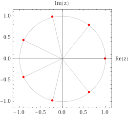
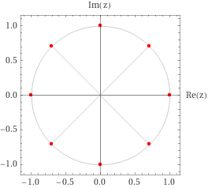
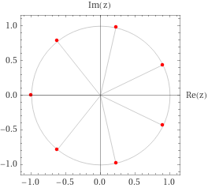
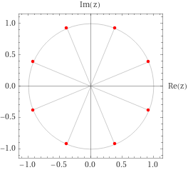

# Complex Preliminaries

- Since $\CC$ is a field, $\CC[x]$ is a UFD.

:::{.definition title="Toy contour"}
A closed Jordan curve that separates $\CC$ into an exterior and interior region is referred to as a **toy contour**.
:::

:::{.fact title="Complex roots of a number"}
Derivation of complex $n$th roots of a complex number $z$: 
\[
z = re^{i\theta} = re^{i\qty{\theta + 2k\pi}} \implies z^{1/n} = 
\qty{ re^{i\qty{\theta + 2k\pi}} }^{1\over n} = r^{1\over n} e^{i\qty{\theta + 2k\pi \over n}}
\leadsto
\ts{ \omega_k \da r^{1/n} e^{i \qty{ \theta + 2k\pi \over n} } \st 0 \leq k \leq n-1 }
.\]
Note that one root is $r^{1/n}\in \RR$, and the rest are separated by angles of $2\pi/n$.
:::

:::{.fact title="Factoring $z^n-1$"}
\[
z^n-1 
&= \prod_{k=0}^{n-1} (z-\zeta_n^k) 
= (z-1)(z-\zeta_n)(z-\zeta_n^2)\cdots(z-\zeta_n^{n-1}) && \zeta_n \da e^{2\pi i \over n}
.\]

What the roots look like: 

- $n$ odd:

- $n$ even: $\theta_0=0$, increment by $2\pi/n$. 
Always have $\pm 1$.

:::

:::{.fact title="Factoring $z^n-w$ for $w\in \CC$"}
Write $w=Re^{i\theta}$, then 
\[
z^n = w \implies z = R^{1\over n}e^{i(\theta + 2k\pi )\over n} = R^{1\over n}e^{i\theta\over n}e^{2\pi i k \over n} = \qty{Re^{i\theta}}^{1\over n}\zeta_n^k
.\]
Thus setting $w_0 \da (Re^{i\theta})^{1\over n}$ yields
\[
z^n - w = \prod_{k=0}^{n-1} (z-w_0\zeta_n^k) = (z-w_0)(z-w_0\zeta_n)\cdots (z-w_0\zeta_n^{n-1})
.\]

:::

:::{.fact title="Factoring $z^n+1$"}
Factoring $z^n+1$:
write $1 = e^{i\pi}$ to get $w_0 \da e^{i\pi \over n}$, then
\[
z^n+1 
= \prod_{k=0}^{n-1}(z-w_0\zeta_k)
&= 
(z-e^{i\pi \over n}e^{2i\pi  \over n})
(z-e^{i\pi \over n}e^{4i\pi  \over n})
\cdots
(z-e^{i\pi \over n}e^{2(n-1)i \pi \over n}) \\
&=
(z - e^{3i\pi \over n})(z-e^{5i\pi \over n}) \cdots
(z - e^{(2n-1)i\pi \over n})
.\]

What the roots look like:

- $n$ odd: start at $\theta_0 = \pi$, increment by $2\pi/n$.

- $n$ even: start at $\theta_0 = \pi/n$, increment by $2\pi/n$.

:::

