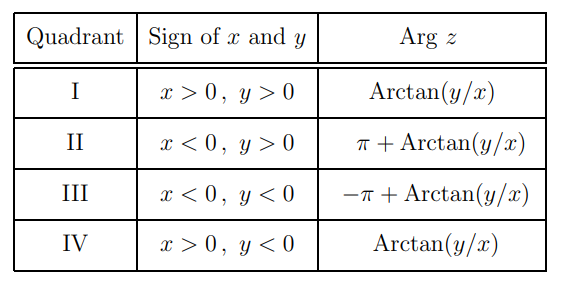
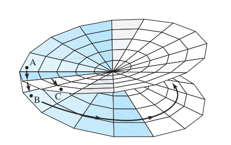

# Complex Log

:::{.fact title="Polar decomposition and $\arg$"}
Any $z\neq 0$ can be written in the form
\[
z = \abs{z} e^{i\arg(z)}
,\]
where $\arg(z)$ is the multivalued function $\arg(z) = \Arg(z) + 2\pi n$ where $\Arg(z)\in (-\pi, \pi]$ is the **principal value** of the argument.
Note that it's not necessarily true that if $z=x+iy$ that $\Arg(z) = \arctan\qty{y\over x}$, because $\arctan$ is also multivalued.
There is a formula based on which quadrant $z$ is in:

Note that $\Arg(0)$ is undefined, so that $\Arg(z)$ makes sense on $\CC \sm (-\infty, 0]$, where $(\infty, 0]$ is a **branch cut**. 
Any choice of interval $(\theta_0, \theta_0 + 2\pi]$ yields a different branch cut.

Since $\log(z)$ and $z^\alpha$ are defined in terms of $\Arg$, this is where most branching issues come from!
:::

:::{.example title="Of choosing branches"}
There are two ways to define $z^{1\over 2}$:

- $f_1(z) = \sqrt{\abs z} e^{i{ \Arg(z) \over 2} } = \sqrt{r}\cos\qty{\theta\over 2} + i\sqrt{r} \sin\qty{\theta\over 2}$.
- $f_2(z) = \sqrt{\abs z} e^{i{ \Arg(z) + 2\pi \over 2} } = \sqrt{r}\cos\qty{\theta + 2\pi \over 2} + i\sqrt{r} \sin\qty{\theta + 2\pi \over 2}$.

Note that 
\[
f_2(z) = \sqrt{r}e^{i{\Arg(z) + 2\pi \over 2} } = \sqrt{r} e^{i{\Arg(z) \over 2}}e^{i\pi} = -\sqrt{r}e^{i{\Arg(z) \over 2}} = -f_1(z)
.\]

:::

:::{.exercise title="Existence of multiple values in branches"}
Let $z_0 = r_0e^{i\pi} \in (-\infty, 0) \subseteq \RR$, and show that $z^{1\over 2}$ is not continuous along $(-\infty, 0)$ by computing
\[
\lim_{z\in \gamma_1} f_1(z) &= i\sqrt{r_0} \\
\lim_{z\in \gamma_2} f_1(z) &= -i\sqrt{r_0}
,\]

where

- $\gamma_1 = \ts{r_0 e^{it} \st t\in (0, \pi) }$,
- $\gamma_2 = \ts{r_0 e^{-it} \st t\in (\pi, 0) }$

:::

:::{.solution}
\[
\lim _{(r, \theta) \rightarrow\left(r_{0}, \pi\right)} f_{1}\left(r e^{i \theta}\right) &=\lim _{(r, \theta) \rightarrow\left(r_{0}, \pi\right)} r^{\frac{1}{2}}\left(\cos \frac{\theta}{2}+i \sin \frac{\theta}{2}\right)=i r_{0}^{\frac{1}{2}}, \quad \text { and } \\
\lim _{(r, \theta) \rightarrow\left(r_{0},-\pi\right)} f_{1}\left(r e^{i \theta}\right) &=\lim _{(r, \theta) \rightarrow\left(r_{0},-\pi\right)} r^{\frac{1}{2}}\left(\cos \frac{\theta}{2}+i \sin \frac{\theta}{2}\right)=-i r_{0}^{\frac{1}{2}} .
.\]

:::

:::{.definition title="Complex log"}
Define
\[
\log(z) \da \ln\qty{\abs{z}} + i\Arg(z)
,\]
where $\Arg(z)$ is the principal argument in $(-\pi, \pi]$.
Note that this is sometimes written
\[
\log(z) \da \ln\qty{\abs{r}} + i\theta
.\]
:::

:::{.example title="Log is multivalued"}
\[
\log(1+i) = \ln\qty{\sqrt 2} + \qty{{\pi\over 4} + 2k\pi}i
.\]
Note that this assigns an infinite number of complex numbers to $1+i$, all on the line $\Re(z) = \ln\qty{\sqrt 2}$ with imaginary parts differing by multiples of $2\pi$.
:::

:::{.remark}
The principal branch of $\Log$ is defined so that $\Log(1) = 0$, and can be written as 
\[
\Log(z) = \int_\gamma {1\over \xi} \dxi
\]
where $\gamma$ is any piecewise smooth path connecting 1 to $z$.
:::

:::{.definition title="Complex fractional powers"}
Define
\[
z^\alpha \da e^{\alpha \log(z)}
,\]
where some branch of $\log$ (usually the principal branch) is implicitly chosen.
:::

:::{.theorem title="Existence of $\log(f)$ on domains"}
If $\Omega$ is a connected domain with $f\in \OO\units(\Omega)$ an invertible regular function with 
\[
\int_\gamma {f'\over f} = 0
\]
for all $\gamma \subseteq \Omega$, then

- There exists a holomorphic $g:\Omega\to \CC$ such that $g = \log(f)$ and $e^g = f$.

- $g' = {f'\over f}$, yielding an explicit formula
\[
g(z) = g(z_0) + \int_{z_0}^z {f'(\xi) \over \xi}\dxi
.\]

:::

:::{.remark}
$\Log(f(z))$ has branch points at the zeros of $f$.
:::

:::{.fact}
Common trick:
\[
f^{1/n} = e^{{1\over n} \log(f)}
,\]
taking (say) a principal branch of $\log$ given by $\CC \sm (-\infty, 0] \cross 0$.
:::

:::{.proposition title="Existence of complex log"}
Suppose $\Omega$ is a simply-connected region such that $1\in \Omega, 0\not\in\Omega$.
Then there exists a branch of $F(z) \da \Log(z)$ such that

- $F$ is holomorphic on $\Omega$,
- $e^{F(z)} = z$ for all $z\in \Omega$
- $F(x) = \log(x)$ for $x\in \RR$ in a neighborhood of $1$.

:::

:::{.exercise title="Log properties can fail"}
Show that

- $\log(zw)\neq \log(z)\log(w)$
- $\log(\exp(z))\neq z$

:::

:::{.solution}
Counterexamples: 

- Take $z=\zeta_4^3$ and $w=\zeta_4^2$, noting that $\Arg(z) = {3\pi \over 4}$ and $\Arg(w) = {\pi \over 2}$
  Then $zw = e^{5\pi \over 4}$ but $\Arg(zw) = {-3\pi \over 4}$ because we are forced to use the domain $(-\pi, \pi]$.

- Showing that $\log(\exp(z))$ is a countably infinite set in $\CC$:
\[
\log(\exp(z)) 
&= \log(\exp(x+iy)) \\
&= \ln\qty{e^x} + (y+2k\pi)i \\
&= (x+iy) + 2k\pi i \\
&= z + 2k\pi
.\]

:::

:::{.warnings}
\[
\Log(zw) &\neq \Log(z) + \Log(w) \\
\Log(e^z) &\neq z
.\]

For counterexamples, take $z=\zeta_4^3=\exp(3\pi i / 4$ and $w=\zeta_4^2 = \exp(\pi i/2)$.
Then $zw= \exp(-3 \pi i /4)$, using that the domain of $\Arg$ is $(-\pi, \pi]$.
:::

:::{.remark}
Note the problem: for $z\da x+i0 \in \RR^{\leq 0}$, just above the axis consider $z_+ \da x + i\eps$ and $z_- \da x-i\eps$.
Then

- $\log(z_+) = \log\abs{x} + i\pi$, and
- $\log(z_-) = \log\abs{x} - i\pi$.

So $\log$ can't even be made continuous if one crosses the branch.
The issue is the **branch point** or **branch singularity** at $z=0$.
:::

:::{.theorem title="Existence of log of a function"}
If $f$ is holomorphic and nonvanishing on a simply-connected region $\Omega$, then there exists a holomorphic $G$ on $\Omega$ such that

\[
f(z) = e^{G(z)}
.\]

:::

:::{.fact}
The complex exponential is $2\pi i$ periodic, and invertible on any horizontal strip of the form
\[
S_\alpha \da \ts{z\in \CC \st \Im(z) \in [\alpha, \alpha+2\pi] }
.\]
:::

:::{.example title="of branch cuts"}
Generally choose branch cuts that are slits between branch points to prevent monodromy around those points.
One can find branch points for $\log(f(z))$ by noting that $\log$ should be a primitive of $\dd{}{z}\log(f(z))$.

- $\log(z^2-1)$ has branch points at $z=\pm 1,\ infty$.
  To see $\infty$ is a branch point: by differentiating, the log should be a primitive of ${2z\over z^2-1}$.
  Taking a large curve, each term contributes $2\pi i$ with the same sign, so the value jumps.

  So a cut like $(-\infty, +1]$ works, and an explicit formula may be obtained by taking:

  - $\log(z+1) + \log(z-1) = (r_1 + i\theta_1) + (r_2 + i\theta_2)$.

- $\log\qty{z+1\over z-1}$: needs to be a primitive for ${1\over z+1} + {1\over z-1}$, so $\pm 1$ are branch points.
  $z=\infty$ is **not** a branch point, because integrating over a large curve yields $+2\pi i - 2\pi i = 0$, so no monodromy.

  - So a cut like $[-1, 1]$ works, with a formula $\log(z+1) - \log(z-1) = (r_1 + i\theta_1) - (r_2 + i\theta_2)$.

:::

