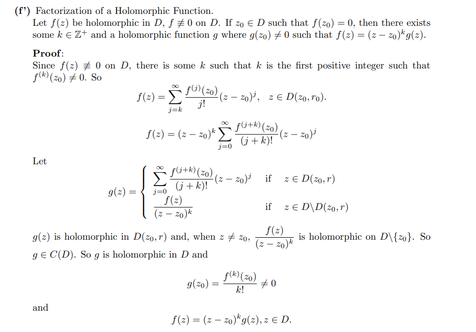

:::{.fact}
Useful facts:
\[
f' = \dd{f}{z} = {1\over i}\dd{f}{y} = \dd{f}{x} = \dd u x + i \dd v x
.\]
:::

# Complex Calculus

:::{.fact}
Various differentials:
\[
dz &= dx + i~dy \\
d\bar z &= dx - i~dy \\ \\
f_z &= f_x = f_y / i
.\]

Integral of a complex exponential:
\[
\int_{0}^{2 \pi} e^{i \ell x} d x
&=\left\{\begin{array}{ll}
{2 \pi} & {\ell=0} \\ 
{0} & \text{else}
\end{array}\right.
.\]

\[
\int_{\gamma} f(z) \dz = \int_0^{2\pi } f(Re^{i\theta}) \, iRe^{i\theta} \dtheta
.\]

:::

:::{.warnings}
$f(z) = \sin(z), \cos(z)$ are unbounded on $\CC$!
An easy way to see this: they are nonconstant and entire, thus unbounded by Liouville.

:::

:::{.example title="?"}
You can show $f(z) = \sqrt{z}$ is not holomorphic by showing its integral over $S^1$ is nonzero.
This is a direct computation:
\[
\int_{S^1} z^{1/2} \dz 
&= \int_0^{2\pi} (e^{i\theta})^{1/2} ie^{i\theta} \dtheta \\
&= i \int_0^{2\pi} e^{i3\theta \over 2}\dtheta \\
&= i \qty{2\over 3i} e^{i3\theta \over 2}\evalfrom_{0}^{2\pi} \\
&= {2\over 3}\qty{e^{3\pi i - 1}} \\
&= -{4\over 3}
.\]

Note an issue: a different parameterization yields a different (still nonzero) number
\[
\cdots 
&= \int_{-\pi}^{\pi} (e^{i\theta})^{1/2} ie^{i\theta} \dtheta \\
&= {2\over 3}\qty{ e^{3\pi i \over 2} - e^{-3\pi i \over 2}} \\
&= -{4i\over 3}
.\]
This is these are paths that don't lift to closed loops on the Riemann surface defined by $z\mapsto z^2$.
:::

# Holomorphy

:::{.definition title="Complex differentiable / holomorphic /entire"}
A function $f: \CC\to \CC$ is **complex differentiable** or **holomorphic** at $z_0$ iff the following limit exists:
\[
\lim_{h\to 0} { f(z_0 + h) - f(h) \over h  } 
.\]
A function that is holomorphic on $\CC$ is said to be **entire**.

Equivalently, there exists an $\alpha\in \CC$ such that
\[
f(z_0+h) - f(z_0) = \alpha h + R(h) && R(h) \converges{h\to 0}\too 0 
.\]
In this case, $\alpha = f'(z_0)$.

:::

:::{.example title="Holomorphic vs non-holomorphic"}
\envlist

- $f(z) \da \abs{z}$ is not holomorphic.
- $f(z) \da \arg{z}$ is not holomorphic.
- $f(z) \da \Re{z}$ is not holomorphic.
- $f(z) \da \Im{z}$ is not holomorphic.
- $f(z) = {1\over z}$ is holomorphic on $\CC\smz$ but not holomorphic on $\CC$
- $f(z) = \bar{z}$ is *not* holomorphic, but is real differentiable:
\[
{f(z_0 + h) - f(z_0) \over h } = {\bar{z_0} + \bar h - \bar{z_0} \over h} = {\bar{h} \over h} = {re^{-i\theta} \over re^{i\theta}} = e^{-2i\theta} \converges{h\to 0}\too e^{-2i\theta}
,\]
which is a complex number that depends on $\theta$ and is thus not a single value.

:::

:::{.definition title="Real (multivariate) differentiable"}
A function $F: \RR^n\to \RR^m$ is **real-differentiable** at $\vector p$ iff there exists a linear transformation $A$ such that
\[
{ \norm{ F(\vector p + \vector h) - F(\vector p) - A(\vector h) } \over \norm{ \vector h } } \converges{\norm{\vector h}\to 0}\too 0
.\]
Rewriting,
\[
\norm{ F(\vector p + \vector h) - F(\vector p)  - A(\vector h) } = \norm{ \vector{h} } \norm{ R(\vector h) }
&& \norm{R(\vector h) }\converges{\norm{\vector h } \to 0}\too 0
.\]

Equivalently, 
\[
F(\vector p + \vector h) - F(\vector p) = A(\vector h) + \norm{\vector h} R(\vector h) && \norm{R(\vector h) }\converges{\norm{\vector h } \to 0}\too 0
.\]

Or in a slightly more useful form,
\[
F(\vector p + \vector h) = F(\vector p) + A(\vector h) + R(\vector h) && R\in o( \norm{\vector h}), \text{ i.e. }
{ \norm{ R(\vector h) } \over  \norm{\vector h}} \converges{\vector h\to 0}\too 0
.\]
:::

:::{.proposition title="Holomorphic implies continuous."}
$f$ is holomorphic at $z_0$ iff there exists an $a\in \CC$ such that
\[  
f(z_0 + h) - f(z_0) - ah = h \psi(h), \quad \psi(h) \converges{h\to 0}\to 0
.\]
In this case, $a = f'(z_0)$.
:::

#todo proof

:::{.proposition title="Holomorphic functions have isolated zeros"}
If $f:\CC\to \CC$ is holomorphic and not identically zero, then $f$ has isolated zeros.
:::

:::{.proof title="?"}
Suppose not, then pick a limit point $z_0$ with $f(z_0)=0$ with a sequence $\ts{z_k}\to z_0$ where $f(z_k) = 0$ for all $k$.
Expand $f$ in a Laurent series; since $f\not\equiv 0$ there is a smallest nonzero coefficient $c_m$:
\[
f(z) = \sum_{k\geq m}c_k (z-z_0)^k = c_m(z-z_0)^m \cdot\qty{1 + \sum_{k\geq 1}c_k' (z-z_0)^k } \da c_m(z-z_0)^m \cdot(1 + g(z-z_0))
.\]
Note $g(z-z_0)\convergesto{z\to z_0} 0$, and since $z_k\to z_0$ we can find $k\gg 1$ such that $g(z_k - z_0) < \eps$.
In particular, for $k$ large enough, $1 < 1+g(z_k - z_0) 1 + \eps$, but this contradicts $f(z_k) = 0$:
\[
0 = f(z_k) = c_m(z_k - z_0)^m (1 + g(z_k - z_0)) \neq 0
.\]

$\contradiction$

:::

:::{.corollary title="Identity principle"}
If $f,g$ are holomorphic and $f=g$ on any set with a limit point, then $f\equiv g$.

The proof follows from the fact that $f-g$ is holomorphic and has nonisolated zeros.
:::

:::{.proposition title="Factorization of zeros out of holomorphic functions"}

:::

# Wirtinger Calculus

:::{.remark}
Some properties:

- $\bar{\delbar f(z)} = \del \bar{f}(z)$, or $\del f^*(z) = (\delbar f(z))^*$
  - E.g. $d(cz) = c\dz + 0\dzbar$ and $d(c\bar z) = 0\dz + c\dzbar$
  - E.g. $\del \abs{z}^2 = \del z\bar z = \bar{z}$ and $\delbar \abs{z}^2 = z$.
    - So $d(\abs{z}^2) = \bar{z}\dz + z\dzbar$
  - E.g. $\del \exp\qty{ - \abs{z}^2 } = \del \exp\qty{-z\bar z} = e^{-\abs{z}^2}\cdot \del(z\bar z) = \bar z e^{-\abs{z}^2}$.
:::

# Exercises

:::{.exercise title="?"}
Show that a real-valued holomorphic function is constant.
:::

