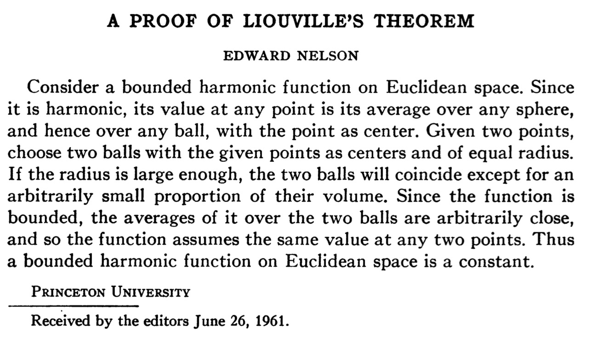

# Delbar and the Laplacian

:::{.definition title="Laplacian and Harmonic Functions"}
A real function of two variables $u(x, y)$ is **harmonic** iff it is in the kernel of the Laplacian operator:
\[  
\Delta u \definedas \qty{\dd{^2}{x^2} + \dd{^2}{y^2}}u = 0
.\]
:::

:::{.definition title="del and delbar operators"}
\[
\del \da \del_z \da {1\over 2}\qty{\del_x - i \del_y}
\quad
\text{ and }
\quad
\delbar
\da \del_{\bar z}
={1\over 2}\qty{ \del_x + i\del_y}
.\]
Moreover, the 1-form corresponding to $F$ can be written as 
\[
dF = \del F + \delbar F = \dd{F}{z} \dz + \dd{F}{\zbar}\dzbar
.\]

Written slightly more explicitly:
\[
\dd{F}{z} = {1\over 2}\qty{\dd{F}{x} + {1\over i}\dd{F}{y} } && 
\dd{F}{\zbar} = {1\over 2}\qty{\dd{F}{x} - {1\over i}\dd{F}{y} } 
.\]

:::

:::{.exercise title="Holomorphic iff delbar vanishes"}
Show that $f$ is holomorphic iff $\delbar f = 0$.
:::

:::{.solution}
\[
2\delbar f 
&\da (\del_x + i \del_y) (u+iv) \\
&= u_x + iv_x + iu_y - v_y \\
&= (u_x - v_y) + i(u_y + v_x) \\
&= 0 && \text{by Cauchy-Riemann}
.\]
:::

### Exercises: Harmonic Functions

:::{.exercise title="Holomorphic functions have harmonic components"}
Show that if $f = u+iv$ is holomorphic then $u, v$ are harmonic.
:::

:::{.solution title="?"}
Idea: use Cauchy-Riemann, take further derivatives, and use equality of partials.

- By CR, 
\[
u_x = v_y && u_y = -v_x
.\]

- Differentiate with respect to $x$: 
\[
u_{xx} = v_{yx} && u_{yx} = -v_{xx}
.\]
- Differentiate with respect to $y$:
\[
u_{xy} = v_{yy} && u_{yy} = -v_{xy}
.\]
- Clairaut's theorem: partials are equal, so
\[
u_{xx} - v_{yx} = 0 \implies u_{xx} + u_{yy} = 0 \\ \\
v_{xx} + u_{yx} = 0 \implies v_{xx} + v_{yy} = 0 \\ \\
.\]

:::

:::{.exercise title="Bounded harmonic function is constant"}
Show that if $u$ is harmonic on $\RR^2$ and bounded, then $u$ is constant.
:::

:::{.solution title="Using Liouville"}
Write $f=u+iv$ for $v$ a harmonic conjugate of $u$, then $f$ is holomorphic on $\CC$.
Now $e^f = e^{u+iv} = e^u e^{iv}$ and thus 
\[
\abs{e^f}\leq \abs{e^u} \abs{e^{iv}} = \abs{e^u}
\]
is bounded, so $f$ is a bounded entire function and thus constant by Liouville.
:::

:::{.solution title="Using the mean value property"}

:::

:::{.exercise title="Proving functions are harmonic using components of holomorphic functions"}
Show that if $u,v$ are harmonic conjugates, then

- $u^2-v^2$ is harmonic
- $uv$ is harmonic.
- $u_x$ is harmonic.

#complex/exercise/completed

:::

:::{.solution}
Write $f=u+iv$, which is analytic.

- $f^2$ is analytic, and $f^2 = (u+iv)^2 = u^2 - v^2 + i (2uv)$, which necessarily has harmonic components.

- Covered by the first case.

- $f'$ is analytic and one can write $f' = u_x + iv_x$, which has harmonic components.

As an alternative to show that $uv$ is harmonic directly by showing it's in the kernel of the Laplacian.
A computation:
\[
\laplacian(uv) 
&= (uv)_{xx} + (uv)_{yy} \\
&= (u_{xx}v + uv_{xx} + 2u_x v_x) + (u_{yy}v + uv_{yy} + 2u_y v_y) \\
&= (u_{xx} + u_{yy}) v + (v_{xx} + v_{yy}) u + 2(u_xv_x + u_yv_y) \\
&= (u_{xx} + u_{yy}) v + (v_{xx} + v_{yy}) u + 2(-u_x u_y + u_y u_x) && v_x = -u_y,\, v_y = u_x \\
&= (u_{xx} + u_{yy}) v + (v_{xx} + v_{yy})u  \\
&= \laplacian(u)v + \laplacian(v)u \\
&= 0
.\]
:::

:::{.exercise title="Finding harmonic conjugates"}
Find a harmonic conjugate for
\[
u(x, y) = x^3 - 3xy^2 -x -y
.\]

#complex/exercise/completed

:::

:::{.concept}
The standard procedure for harmonic conjugates:

- Start with $u$
- Take $\dd{}{x}$ to get $u_x$
- Apply CR to get $u_x = v_y$
- Take $\int \dy$ to get $v$, which is essentially the solution up to an unknown $f(x)$.
- Take $\dd{}{x}$ to get $v_x$ which involves $f_x$
- Apply CR to set $v_x = -u_y$ and solve for $f_x$
- Compute $\int f_x \dx$ to obtain $f(x)$.

My quick mnemonic:

\begin{tikzcd}
	u & f &&& \textcolor{rgb,255:red,92;green,214;blue,92}{v, f} \\
	&&&& {v, f(x)} \\
	& {u_y, f_x} && {v_x, f_x} \\
	{u_x} &&&& {v_y}
	\arrow["{\dd{}{x}}", from=1-1, to=4-1]
	\arrow["CR", dashed, from=4-1, to=4-5]
	\arrow["{\dd{}{x}}"', from=2-5, to=3-4]
	\arrow["CR", dashed, from=3-4, to=3-2]
	\arrow["{\int \dx}"', from=3-2, to=1-2]
	\arrow[squiggly, from=1-2, to=1-5]
	\arrow["{\int \dy}"', from=4-5, to=2-5]
\end{tikzcd}

> [Link to Diagram](https://q.uiver.app/?q=WzAsOCxbMCwwLCJ1Il0sWzAsMywidV94Il0sWzQsMywidl95Il0sWzQsMSwidiwgZih4KSJdLFszLDIsInZfeCwgZl94Il0sWzEsMiwidV95LCBmX3giXSxbMSwwLCJmIl0sWzQsMCwidiwgZiIsWzEyMCw2MCw2MCwxXV0sWzAsMSwiXFxkZHt9e3h9Il0sWzEsMiwiQ1IiLDAseyJzdHlsZSI6eyJib2R5Ijp7Im5hbWUiOiJkYXNoZWQifX19XSxbMyw0LCJcXGRke317eH0iLDJdLFs0LDUsIkNSIiwwLHsic3R5bGUiOnsiYm9keSI6eyJuYW1lIjoiZGFzaGVkIn19fV0sWzUsNiwiXFxpbnQgXFxkeCIsMl0sWzYsNywiIiwwLHsic3R5bGUiOnsiYm9keSI6eyJuYW1lIjoic3F1aWdnbHkifX19XSxbMiwzLCJcXGludCBcXGR5IiwyXV0=)

:::

:::{.solution}
First, check that $u$ is actually harmonic: 
\[
\laplacian u = \dd{}{x}(3x^2-3y^2-1) + \dd{}{y}(-6xy - 1) = 6x + (-6x) = 0
.\]

Standard procedure: integrate $v_y=u_x$ with respect to $x$,
\[
v_y = u_x = 3x^2 - 3y^2 - 1 \implies 
v = \int u_x \dy = 3x^2y - y^3 - y + f_1(x)
.\]
Now differentiate $v$ with respect to $x$ and set $v_x = -u_y$:
\[
v_x = 6xy + (f_1)_x = -u_y = 6xy + 1\implies f_1 = x + c_1
.\]
Thus
\[
v(x, y) = 3x^2y - y^3 - y + x + c_1
.\]

:::

