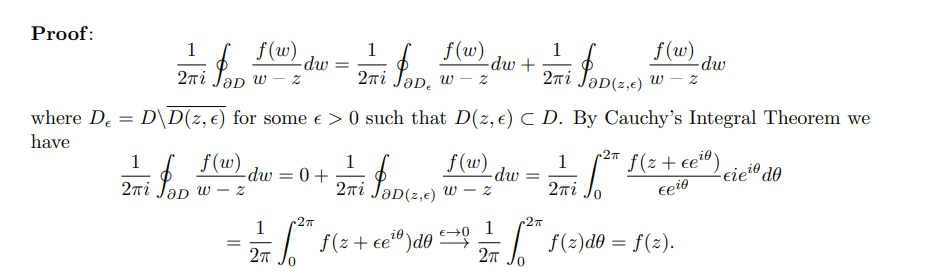
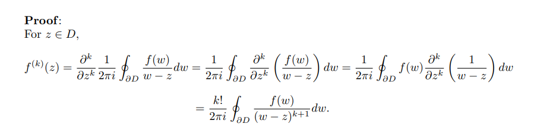

# Cauchy's Integral Formula

> See [reference](http://home.iitk.ac.in/~psraj/mth102/lecture_notes/comp8.pdf)

:::{.theorem title="Cauchy Integral Formula" ref="CauchyIntegral"}
Suppose $f$ is holomorphic on $\Omega$, then for any $z_0 \in \Omega$ and any open disc $\closure{D_R(z_0)}$ such that $\gamma \da \bd \closure{D_R(z_0)} \subseteq \Omega$,
\[
f(z_0) = {1 \over 2\pi i} \int_{\gamma} {f(\xi) \over \xi-z_0}\ \dxi
\]
and
\[
\dd{^nf }{z^n}(z_0) = {n! \over 2\pi i} \int_{\gamma} {f(\xi) \over (\xi - z_0)^{n+1}} \dxi
.\]
:::

:::{.proof title="?"}

:::

:::{.proof title="?"}

:::

:::{.proof title="Alternative"}

:::

:::{.exercise title="Integral computation"}
Compute
\[
\int_{\bd\DD} {e^z\over z^2}\dz
.\]
:::

:::{.solution}
By Cauchy's formula,
\[
\int {f(z) \over (z-0)^2}\dz = 2\pi i f^{(1)}(0) = 2\pi i
.\]
:::

:::{.exercise title="Integral computation"}
Without using the residue formula, compute
\[
\int_\RR f(x) \dx && f(x) \da {1\over x^4 + 16}
.\]
:::

:::{.solution}
Use a semicircular contour, noting the poles are at $\pm \sqrt 2 \pm i\sqrt 2$. 
Write

- $f_1(z) \da (\sqrt 2 + i\sqrt 2)f(z)$
- $f_2(z) \da (-\sqrt 2 + i\sqrt 2) f(z)$.

Break the curve up into two integrals $I_1, I_2$ enclosing the poles, by Cauchy one gets

- For the loop around the right pole: $I_1 = 2\pi i f_1(\sqrt 2 + i\sqrt 2) = {\pi \sqrt{2}(1-i) \over 32}$
- For the loop around the left pole: $I_2 = 2\pi i f_1(\sqrt 2 - i\sqrt 2) = {\pi \sqrt 2(1+i) \over 32}$.
:::

