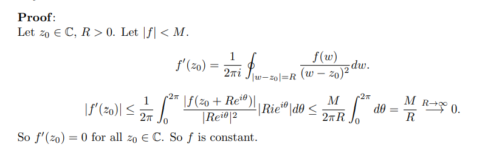

# Liouville's Theorem

:::{.theorem title="Liouville's Theorem" ref="Liouville"}
If $f$ is entire and bounded, $f$ is constant.
:::

:::{.proof title="of Liouville"}
\envlist

- Since $f$ is bounded, $f(z) \leq M$ uniformly on $\CC$.
- Apply Cauchy's estimate for the 1st derivative:
\[
\abs{f'(z)} \leq { 1! \norm{f}_{C_R} \over R } \leq {M \over R}\converges{R\to\infty}\too 0
,\]
  so $f'(z) = 0$ for all $z$.
:::

:::{.proof title="of Liouville, alternative"}

:::

:::{.exercise title="?"}
Show that an entire doubly periodic function is constant.

#work 

:::

:::{.exercise title="?"}
Show that if $f, g$ are entire with $\abs{f(z)}\leq \abs{g(z)}$, then $f(z) = cg(z)$ for some constant $c$.

#completed

:::

:::{.solution}
Write $h \da f/g$, so $h$ is meromorphic with $\abs h \leq 1$.
Moreover, $h$ can only have singularities where $g (z_k) = 0$, but is bounded by 1 in punctured neighborhoods about any such $z_k$.
So any such singularities are removable, and $h$ extends over the singularities by Riemann's removable singularity theorem to give an entire function.
Now $h$ is bounded and entire, thus constant, so $c = h = f/g \implies f=cg$.
:::

:::{.exercise title="?"}
Show that if $\abs{f(z)/z^n}$ is bounded for $\abs{z}\geq R$, then $f$ is a polynomial of degree at most $n$.
What happens if this bound holds on all of $\CC$?

#completed

:::

:::{.solution}
Use that $f$ is entire to Laurent expand at $z=0$ to get $f(z) = \sum_{k\geq 0}c_k z^k$ everywhere.
Claim: $c_{n+k} = 0$ for all $k\geq n+1$
By the formula for Taylor coefficients, it suffices to show $f^{(n+k)}(0) = 0$ for all $k\geq n+1$.
Apply the Cauchy estimate on a curve of radius $R\gg 1$:
\[
\abs{ f^{n+k} (0)} 
&\leq {(n+k)! \over 2\pi} \int_{\abs{z} = R} \abs{f(\xi) \over \xi^{n+k+1}}\dxi\\
&\leq {(n+k)! \over 2\pi} \int_{\abs{z} = R} \abs{M \over \xi^n \xi^{k+1}}\dxi\\
&= {(n+k)! \over 2\pi} \int_{\abs{z} = R} \abs{M \over R ^{k+1}}\dxi\\
&= {(n+k)! \over 2\pi} {M\over R^{k+1}} \cdot 2\pi R \\
&= \bigo(1/R) \to 0
.\]

If this holds on all of $\CC$, then $h(z) \da f(z)/z^n$ is constant and thus $f(z) = cz^n$.
:::

:::{.exercise title="?"}
Find all entire functions $f$ satisfying
\[
\abs{f(z)} \geq \abs{z} + 1 &&\forall z\in \CC
.\]

#completed

:::

:::{.solution}
The inequality implies $f$ has no zeros, so $g(z) \da 1/f(z)$ is entire.
Moreover it is bounded on $\CC$, since
\[
\abs{g(z)} \leq {1\over \abs{z} + 1} \leq 1
,\]
so $g\equiv c$ is constant by Liouville.
This means $f\equiv c$ is constant, but $\lim_{z\to \infty}g(z) = 0$ forces $c=\infty$, so there are no such entire functions.
:::

:::{.exercise title="Rudin 10.4"}
Let $f$ be entire and suppose that for $\abs{z} \geq M$,
\[
\abs{f} \leq A + B\abs{z}^k
\]
for some constants $A, B$ and $k$.
Show that $f$ is a polynomial of degree at most $k$.

#completed

:::

:::{.solution}
Apply a Cauchy estimate over a contour of radius $R> M$ to obtain
\[
\abs{f^{(n)}(0)} \leq n!{A+B R^k \over R^n} \asymptotic 1/R^{n-k}
,\]
and if $n>k$ then this goes to zero in $R$ and $c_n = 0$ for all $n>k$.
:::

:::{.exercise title="Rudin 10.3"}
Suppose $\abs{f(z)}\leq \abs{g(z)}$ for all $z$.
What conclusion can you draw?

#completed

:::

:::{.solution}
Write $h(z) \da f(z)/g(z)$, then $\abs{f}\leq 1$ is bounded.
Provided the zeros of $g$ do not have a limit point, the singularities of $h$ are isolated and thus removable.
By Riemann's removable singularity theorem, $h$ extends to an entire function.
By continuity, $\abs{h(z)}\leq 1$ on $\CC$ and is thus bounded.
By Liouville $h$ is constant, making $f = cg$ for some $c$.
:::

:::{.exercise title="?"}
Suppose $f$ is entire and for every $z$,
\[
\abs{f(z)}\leq \abs{\sin(z)}
.\]
Characterize all possibilities for $f$.

#completed 

:::

:::{.solution}
Write $g(z) \da f(z) / \sin(z)$, which is meromorphic with singularities at the zeros of $\sin(z)$ and bounded by 1.
By boundedness, these singularities are removable, so $g$ extends to a bounded entire and thus constant function.
So $f(z) = c\sin(z)$ where $\abs{c} \leq 1$.
:::

