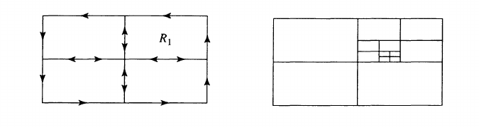

# Morera's Theorem 

:::{.theorem title="Morera's Theorem" ref="Morera"}
If $f$ is continuous on a domain $\Omega$ and $\int_T f = 0$ for every triangle $T\subset \Omega$, then $f$ is holomorphic.
:::

:::{.slogan}
If every integral along a triangle vanishes, implies holomorphic.
Equivalently, $f(z)\dz$ is a closed differential form iff $f$ is holomorphic.
:::

:::{.remark}
Sometimes stated for rectangles with sides parallel to axes.
The power of this theorem is that virtually no assumptions on $f$ are made, e.g. $f$ is not even assumed smooth or even differentiable.
:::

:::{.corollary title="Sufficient condition for a sequence to converge to a holomorphic function"}
If \( \ts{ f_n }_{n\in \NN} \) is a holomorphic sequence on a region \( \Omega  \) which uniformly converges to $f$ on every compact subset $K \subseteq \Omega$, then $f$ is holomorphic, and $f_n' \to f'$ uniformly on every such compact subset $K$.
:::

:::{.proof title="?"}
Commute limit with integral and apply Morera's theorem.
:::

:::{.remark}
This can be applied to series of the form $\sum_k f_k(z)$.
:::

:::{.theorem title="Goursat"}
Holomorphic implies analytic.
:::

:::{.proof title="?"}
Taken from Gamelin: the proof is based on Morera's theorem. 
Idea: break region into nested cubes:

Let $R$ be a closed rectangle in $D$. We subdivide $R$ into four equal subrectangles. Since the integral of $f(z)$ around $\partial R$ is the sum of the integrals of $f(z)$ around the four subrectangles, there is at least one of the subrectangles, call it $R_{1}$, for which
\[
\left|\int_{\partial R_{1}} f(z) d z\right| \geq \frac{1}{4}\left|\int_{\partial R} f(z) d z\right|
\]
Now subdivide $R_{1}$ into four equal subrectangles and repeat the procedure. This yields a nested sequence of rectangles $\left\{R_{n}\right\}$ such that
\[
\left|\int_{\partial R_{n}} f(z) d z\right| \geq \frac{1}{4}\left|\int_{\partial R_{n-1}} f(z) d z\right| \geq \cdots \geq \frac{1}{4^{n}}\left|\int_{\partial R} f(z) d z\right| .
\]
Since the $R_{n}$ 's are decreasing and have diameters tending to 0 , the $R_{n}$ 's converge to some point $z_{0} \in D$. Since $f(z)$ is differentiable at $z_{0}$, we have an estimate of the form
\[
\left|\frac{f(z)-f\left(z_{0}\right)}{z-z_{0}}-f^{\prime}\left(z_{0}\right)\right| \leq \varepsilon_{n}, \quad z \in R_{n},
\]
where $\varepsilon_{n} \rightarrow 0$ as $n \rightarrow \infty$. Let $L$ be the length of $\partial R$. Then the length of $\partial R_{n}$ is $L / 2^{n}$. For $z$ belonging to $R_{n}$ we have the estimate
\[
\left|f(z)-f\left(z_{0}\right)-f^{\prime}\left(z_{0}\right)\left(z-z_{0}\right)\right| \leq \varepsilon_{n}\left|z-z_{0}\right| \leq 2 \varepsilon_{n} L / 2^{n} .
\]
From the $M L$-estimate and Cauchy's theorem, we obtain
\[
\begin{aligned}
\left|\int_{\partial R_{n}} f(z) d z\right| &=\left|\int_{\partial R_{n}}\left[f(z)-f\left(z_{0}\right)-f^{\prime}\left(z_{0}\right)\left(z-z_{0}\right)\right] d z\right| \\
& \leq\left(2 \varepsilon_{n} L / 2^{n}\right) \cdot\left(L / 2^{n}\right)=2 L^{2} \varepsilon_{n} / 4^{n}
\end{aligned}
\]
Hence
\[
\left|\int_{\partial R} f(z) d z\right| \leq 4^{n}\left|\int_{\partial R_{n}} f(z) d z\right| \leq 2 L^{2} \varepsilon_{n}
\]
Since $\varepsilon_{n} \rightarrow 0$ as $n \rightarrow \infty$, we must have
\[
\int_{\partial R} f(z) d z=0 .
\]
By Morera's theorem, $f(z)$ is analytic.
:::

