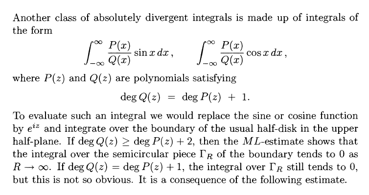

# Integrals

:::{.remark}
For guidelines for what techniques to use,
[see this very detailed note](https://math.mit.edu/~jorloff/18.04/notes/topic9.pdf).
A summary:

- $f(z) \sim 1/z^{1+\eps}$: semicircular contours.

	
	
	- The relevant theorem: $f(z) \leq {M \over \abs{z}^{1+\eps} }$ for $\abs{z} \gg 0$ implies $\int_{C_R} f \convergesto{R\to\infty} 0$.

-  $f(z) \sim 1/z$: rectangular contours.

	
	
	- The relevant theorem: $f(z) \leq {M \over \abs{z} }$ for $\abs{z} \gg 0$ implies $\int_{C_R} f(z) e^{i\alpha z} \convergesto{R\to\infty} 0$ where for $\alpha>0$ take $C_R$ to be the left rectangular contour, and $\alpha>0$ take $C_R$ the right.

- $f(z) \approx \cos(z), \sin(z), \tan(z), \cdots$: check if $\displaystyle\int f \approx \Re\displaystyle\int (g(e^{iz}))$.

- $f \in \CC[\cos(z), \sin(z)]$ rational functions of $\cos, \sin$: set 
	\[
	2\cos(z) = z + z\inv, \quad 2\sin(z) = z - z\inv, && \dtheta = {\dz\over iz}
	.\] 
	This reduces to a residue count in $\abs{z} \leq 1$.
	

:::

:::{.exercise title="?"}
\[
\int_\RR {1 \over (1+x^2)^2} = {\pi \over 2}
.\]

#completed 

:::

:::{.solution}
Use that $f(z) \sim 1/z^4$:

Then 
\[
\int_{C_1 + C_R} f = \int_{C_1} f + \int_{C_R} f = 2\pi i \Res_{z=i} {1\over (1+z^2)^2}
.\]

Note $f$ factors:
\[
f(z) = {1 \over \qty{(z-i)(z+i)}^2 }
,\]
so $z=i$ is a pole of order 2.

Compute the residue within the contour:
\[
\Res_{z=i} f(z) 
= \lim_{z\to i} \dd{}{z} {1\over (z+i)^2}
= - {2 \over (z+i)^3 }\evalfrom_{z=i}
= - {2\over (2i)^3 }
= {1\over 4i} = -{i\over 4}
.\]

Now solve:
\[
2\pi i \qty{- {i\over 4}} = \int_{C_1}f + \int_{C_R} f \da I_R + \int_{C_R}f \implies I_R = {\pi \over 4} - \int_{C_R} f
.\]

Note $I_R \convergesto{R\to \infty} I \da \int_\RR f$, so it suffices to show
the semicircular error term vanishes as $R\to \infty$. 
Parameterize $C_R = \ts{z=R e^{it} \st t\in [0, \pi]}$, so $\abs{z} = R$ on $C_R$.
Letting $z=e^{it}$, $\dz =iR e^{it}\dt$,
\[
\abs{\int_{C_R} f(z) \dz }
&= \abs{\int_{C_R} {1\over (1+z^2)^2} \dz } \\
&\leq \int_{C_R}\abs{ {1\over (1+z^2)^2} } \dz \\
&= \int_{C_R} {1\over \abs{1+z^2}^2 } \dz\\
&\leq \int_{C_R} {1\over \qty{1 - \abs{z}^2 }^2 } \dz \\
&= \int_{C_R} {1\over \qty{1 - R^2 }^2 } \dz \\
&= {1\over \qty{1 - R^2 }^2 } \int_{C_R} \dz\\
&= {1\over \qty{1 - R^2 }^2 } \cdot \length(C_R) \\
&= {1\over \qty{1 - R^2 }^2 } \cdot \qty{1\over 2}2\pi R \\
&= {\pi R \over R^4 + O(R^3)} \\
&= \pi\qty{ 1 \over R^3 + O(R^2)} \\
&\convergesto{R\to\infty} 0
,\]
where we've used a variant of the triangle inequality:
\[
\abs{a\pm b} \geq \abs{ \abs{a} - \abs{b} } \implies {1\over \abs{a \pm b}} \leq {1\over \abs{a} - \abs{b} }
.\]

:::

:::{.exercise title="?"}
#work

\[
\int_\RR {1 \over x^4 + 1} = {\pi \sqrt{2} \over 2}
.\]
:::

:::{.solution}

:::

:::{.exercise title="?"}
#work
\[
\int_{0}^{\infty} \frac{\cos (x)}{x^{2}+b^{2}} d x=\frac{\pi \mathrm{e}^{-b}}{2 b} .
.\]
:::

:::{.solution}
Extend to $\int_\RR$ using that $f$ is even.

:::

:::{.exercise title="Trigonometric functions"}
#work
\[
\int_{0}^{2 \pi} \frac{d \theta}{1+a^{2}-2 a \cos (\theta)}
= \begin{cases}\frac{2 \pi}{a^{2}-1} & \text { if }|a|>1 \\ \frac{2 \pi}{1-a^{2}} & \text { if }|a|<1\end{cases}
.\]
:::

:::{.solution}
Write $2\cos(z) = z + z\inv$ on $S^1$ to get
\[
=\int_{|z|=1} \frac{1}{i\left(\left(1+a^{2}\right) z-a\left(z^{2}+1\right)\right)} d z
.\]

:::

## Branch Cuts

:::{.exercise title="?"}
\[
\int_0^\infty {x^{1\over 3} \over 1 + x^2} \dx = {\pi \over \sqrt 3}
.\]
:::

:::{.solution}

:::

:::{.exercise title="?"}
\[
\int_{1}^{\infty} \frac{d x}{x \sqrt{x^{2}-1}} = {\pi \over 2}
.\]
:::

:::{.solution}

:::

