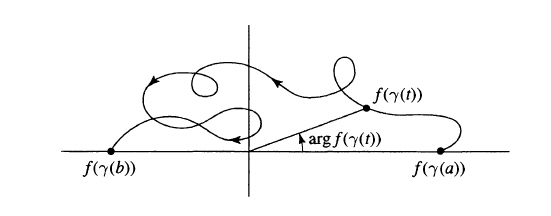

# Argument Principle

:::{.definition title="The logarithmic derivative"}
The **logarithmic derivative** is defined as 
\[
\logd f \da {f' \over f}
.\]
:::

:::{.fact}
It converts all poles and zeros of meromorphic $f$ into simple poles of $\logd f$.
If $z_0$ is a root of $f$ of multiplicity $m$, write $f(z) = (z-z_0)^m g(z)$ with $g$ holomorphic and nonzero near $z_0$.
Then take log derivatives:
\[
\logd f(z) 
&= \logd (z-z_0)^m g(z) \\
&= \logd (z-z_0)^m + \logd g(z) \\
&= {m\over (z-z_0)} + {g'(z) \over g(z)}
.\]

Then if $g$ is holomorphic and nonzero away from $z_0$, so is $g'/g$.
So the only contribution to $\Res_{z=z_0} \logd f$ is $m$.
:::

:::{.remark}
Note that the logarithmic derivative picks up the $p\dash$adic valuation for $\gens{x-p} \in \CC[x]$ a point:
\[
d \qty{ \log(f) } = {f'\over f}\dz  \implies \Res_{z=p}(d \log(f) ) = v_p(f)
.\]

:::

:::{.definition title="Winding Number"}
For $\gamma \subseteq \Omega$ a closed curve not passing through a point $z_0$, the **winding number of $\gamma$ about $z_0$** (or the **index**) is defined as
\[
\Index_{z=z_0}(\gamma) \da {1\over 2\pi i} \int_\gamma {1\over \xi -z_0}\dxi
.\]

:::

:::{.theorem title="Argument Principle, Zeros/Poles Version"}
For $f$ meromorphic in $\Omega$ with multisets of zeros \( Z_f \da \ts{ z_j } \) and poles \( P_f\da \ts{ p_k } \) (so repeated with multiplicity) 
for $\gamma \da \bd \Omega$ not intersecting any of the zeros/poles,

\[  
{1\over 2\pi i} \int_\gamma \logd f(z) \dz
\da {1\over 2\pi i} \int_\gamma {f'(z) \over f(z)} \dz =
&= \size Z_f - \size P_f
,\]
where $\size Z_f$ and $\size P_f$ are the number of zeros and poles respectively, counted with multiplicity.
:::

:::{.proof title="?"}
\envlist

- If $z_0$ is a zero of $f$ of order $m$, write $f(z) = (z-z_0)^m g(z)$ with $g(z)$ holomorphic and nonzero on some neighborhood of $z_0$.
- Compute
\[
\logd f(z)
&=
\frac{m\left(z-z_{0}\right)^{m-1} g(z)+\left(z-z_{0}\right)^{m} g^{\prime}(z)}{\left(z-z_{0}\right)^{m} g(z)} \\
&= {m \over z-z_0} + \logd g(z)
,\]
so $z_0$ is a simple pole of $\logd f$ and $\res_{z=z_0} \logd f = m$.

- If $z_0$ is a pole of $f$ of order $m$, write $f(z) = (z-z_0)^{-m} g(z)$, then
\[
\logd f = {-m \over z-z_0} + \logd g
,\]
  so $z_0$ is a simple pole and $\Res_{z=z_0} \del_{\log f} = -m$.

- Now apply the residue theorem, and group residues according to sign:
\[
{1\over 2\pi i } \int_{\gamma} \del_{\log }f(z) \dz 
&= \sum_{z_i \in P_{\logd f}} \Res_{z=z_i} \logd f(z)\\
&= \sum_{z_k \in Z_f} \Res_{z=z_k} f(z) - \sum_{z_j \in P_f} \Res_{z=z_j} f(z)
.\]
:::

:::{.theorem title="Argument Principle, Index Version"}
With the same setup as above, 
\[
{1\over 2\pi i} \int_\gamma \logd f(z) \dz
&= \Index_{w=0}(f\circ \gamma)(w)
.\]

:::

:::{.proof title="?"}
Make the change of variables $w = f(z)$, then $z=\gamma(t) \mapsto w = (f\circ \gamma)(t)$ and $\dw = f'(z) \dz$, so
\[
{1\over 2\pi i }\int_{\gamma} \logd f(z) \dz 
= {1\over 2\pi i} \int_{f\circ \gamma} {1\over w} \dw \da \Index_{w=0} (f\circ \gamma)(w)
.\]

:::

:::{.example title="Using the index version of the argument principle"}
Let $f(z) = z^2 + z = z(z+1)$.

- $\gamma_1 \da \ts{\abs z = 2}$ contains 2 zeros and 0 poles, so $f\circ \gamma$ winds twice around zero counterclockwise.
- $\gamma_2 \da \ts{\abs z = {1\over 2}}$ contains 1 zero and 0 poles, so $f\circ \gamma$ winds once.

:::

:::{.remark}
You can track the change in argument by just breaking a curve up into sub-curves and evaluating a branch of the $\arg$ function at the endpoints.
For example, in this picture, the change in argument is $\pi$ no matter what the curve does in $\HH$:

:::

## Exercises

:::{.exercise title="?"}
Show that $\logd(fg) = \logd f + \logd g$, i.e. 
\[
{ (fg)' \over fg} = {f'\over f} + {g' \over g}
.\]

#complex/exercise/completed

:::

:::{.solution}
\[
{(fg)' \over fg} = { f'g + fg' \over fg} = {f'g \over fg} + {fg' \over fg} = {f'\over f} + {g' \over g}
.\]

:::
