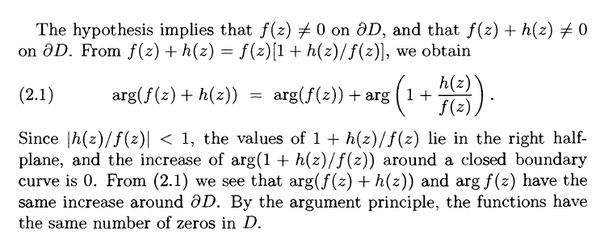
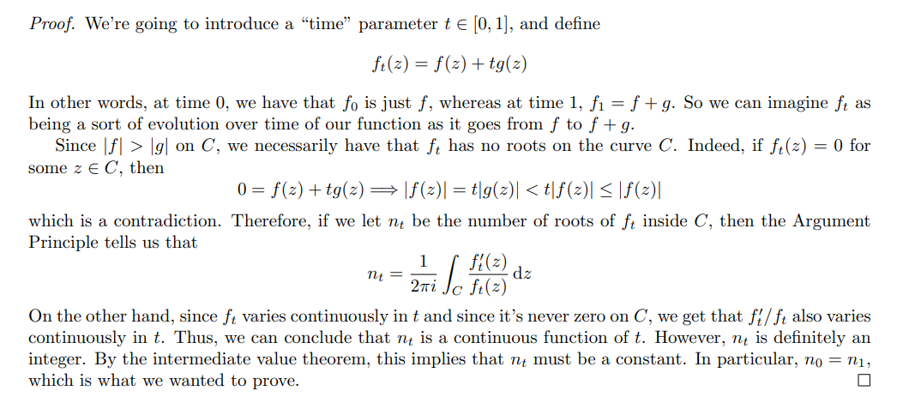
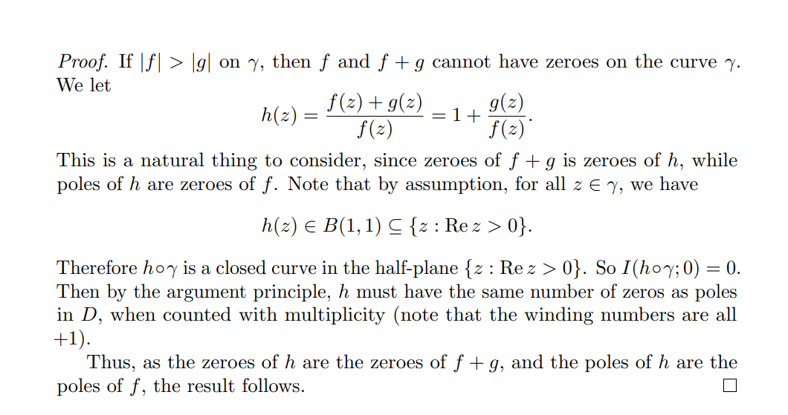

# Rouché 

:::{.theorem title="Rouché's Theorem" ref="Rouche"}
Let $M, m$ be meromorphic on $\Omega$ and write $Z_M, Z_m, P_M, P_m$ for the numbers of zeros and poles of $M$ and $m$ respectively.
Suppose $\gamma \subseteq \Omega$ is a toy contour winding about each zero and pole of $f$ and $g$ precisely once.
Then
\[
\abs{m} \leq \abs{M} \text{ on } \gamma \implies \Index_{z=0}(M\circ \gamma)(z) 
&= \Index_{z=0}((M+m)\circ \gamma)(z) \\
\implies Z_M - P_M 
&= Z_{M+m} - P_{M+m}
.\]
In particular, if $M, m$ are *holomorphic* on $\Omega$, then $M$ and $M+m$ have the same number of zeros in $\Omega$, i.e. $Z_M = Z_{M+m}$.
:::

:::{.slogan}
The number of zeros/poles in a region is determined by a dominating function on the boundary.
You can add a small perturbation $m$ to $M$ and preserve the number of zeros, where "small" means $\abs{m} < \abs{M}$ on the boundary.
:::

:::{.remark}
On how to use Rouché, and some common tricks:

- Given $f$ and a region, find a big part $M$ and a small part $m \da f-M$.
  Then show $\abs{m} < \abs{M}$ to get $\size Z_M = \size Z_f$.
  - It should also be clear how many zeros $M$ has in the region!
- Given $f$, just find a large part $M$, and show $\abs{f-M} < M$.
- Given $\abs{m} < \abs{M}$ with no ambient $f$, you can freely choose $f$ to be any of $\pm (M \pm m)$ to obtain $Z_M = Z_f$
- Given $f$ and $g$, show $\abs{f-g} < \abs{f}$ to get $Z_f = Z_g$.
  - This can be improved to $\abs{f-g} < \abs{f} + \abs{g}$ using the symmetric/extended version of the theorem.
- A common trick: show $\abs{f-g} < 1$ and either $\abs{f} > 1$ or $\abs{g} > 1$.
- For power series $f_n(z) \to f(z)$: find a *lower* bound $L$ for $f$ and an *upper* bound for the tail $f - f_n$ to get $\abs{f_n - f} < U < L < \abs{f}$ to get $Z_f = Z_{f_n}$.

:::

:::{.proof title="of Rouché"}
Idea: use argument principle on $(f+g)/f$.
Alternatively, use that $N(f+tg, \Omega)$ is a continuous $\ZZ\dash$valued function for all $t\in [0, 1]$.

:::

:::{.proof title="of Rouché, alternative"}

:::

# Exercises

:::{.exercise title="Explicit Rouché, $\mathbb{D}$"}
Find the number of zeros in $\abs{z} < 1$ of
\[
p(z) \da z^6 + 9z^4 + z^3 + 2z + 4
.\]

#complex/exercise/completed

:::

:::{.solution}
Strategy: bound the difference.
Find the big and small term:

- Big: $F(z) = 9z^4$, so $\abs{F(z)} = 9$ on the boundary
- Small: $g(z) = p(z) - F(z) = z^6 + z^3 + 2z + 4$, so $\abs{g(z)}\leq 1+1+2+4=8$ on the boundary.

So $\abs{p-F} \leq \abs{F}$ on $\abs{z} = 2$, meaning $Z_{p} = Z_F = 4$.

:::

:::{.exercise title="Explicit Rouche, $2\mathbb{D}$"}
Find the number of zeros in $\abs{z} < 2$ of
\[
h(z) \da z^5 + 3z + 1
.\]

#complex/exercise/completed
:::

:::{.solution}
Strategy: bound the difference.

- Big: $F(z) \da z^5$ so $\abs{F(z)} = 2^5 = 32$ on $\abs{z} = 2$
- Small: $g(z) \da p(z) - F(z) = 3z+1$, so $\abs{g(z)} \leq 3\abs{z}+ 1 = 7$ on $\abs{z} = 2$.

Then $\abs{g}\leq \abs{F}$ on $\abs{z} = 2$, $Z_{p} = Z_F = 5$.
:::

:::{.exercise title="Arbitrary Rouché, $R\mathbb{D}$"}
Find the number of zeros in $\abs{z} < R$ of 
\[
p(z) \da z^d + a_1z^{d-1} + \cdots + a_d
,\]
supposing that
$\abs{a_k}< {R^k \over d}$ for every $k$ (noting the strict inequality).

#complex/exercise/completed

:::

:::{.solution}
Strategy: bound the difference.
Find the big and small term:

- Big: $F(z) = z^d$, so $\abs{F(z)} = R^d$ on $\abs{z} = R$.
- Small: $g(z) = p(z) - F(z) = a_1 z^{d-1} + \cdots + a_d$, so
\[
\abs{g(z)} 
&\leq \abs{a_1} R^{d-1} + \abs{a_2} R^{d-2} + \cdots + \abs{a_d} \\
&< {R\over d} \cdot R^{d-1} + {R^2 \over d} \cdot R^{d-2} + \cdots + {R^{d-1} \over d} \cdot R + {R^{d} \over d} \\
&= d {R^d\over d} = R^d
,\]
so $\abs{g} < R^d = \abs{F}$, meaning $Z_{p-F} = Z_F = d$ in $R\DD$.

:::

:::{.exercise title="Explicit Rouché, half-plane"}
Find the number of solutions in $\ts{\Re(z) \leq 0}$ of
\[
-2e^z = z+3
.\]

> Hint: show $h(z) = z + 3 + 2e^z$ has one root in $\ts{ \Re(z) \leq 0}$.

#complex/exercise/completed

:::

:::{.solution}

Note that $\abs{e^z} = e^{\Re(z)} \leq e^{0} = 1$ since $\Re(z) \leq 0$, so if the equality holds then
\[
\abs{2e^z} = \abs{z+3} \implies \abs{z+3}\leq 2
.\]
So apply Rouché to $\Omega$ the circle of radius 2 centered at $z=-3$.
Write $p(z) \da z+3 + 2e^z$, then

- Big: $F(z) = z+3$, so $\abs{F(z)} = 2$ on $\bd \Omega$.
- Small: $g(z) = 2e^z$, so $\abs{g(z)} = 2e^{\Re(z)} < 2$ in $\Omega$.

Then $Z_p = Z_F = 1$, and any such zero is a solution to the original equation.
:::

:::{.solution title="Alternative"}
Use the following region:

Consider $p(z) \da z+3+2e^z$, take $F(z) \da z+3$ and $h(z) \da 2e^z$ for the perturbation.
On $C_1, z=it$ for $t\in [-R, R]$, so
\[
\abs{F(z)} &= \abs{3+it} \geq 3 \\
\abs{h(z)} &= 2e^{\Re(iy)}=2
,\]
so $\abs{h} < \abs{F}$ here.
On $\abs{z} = R$, $\abs{h(z)} < 2e^{\Re(z)} < 2$ since $\Re(z) < 0$, and $\abs{F(z)} = \bigo(R)$, so for $R\gg 1$ we have $\abs{F} > \abs{h}$ here too.

Thus $Z_{h+F} = Z_f = 1$ in this region, and taking $R\to\infty$ covers all of $\Re(z) \leq 0$.
:::

:::{.exercise title="?"}
Show that $P(z) \da z^4 + 6z + 3$ has 3 zeros in $\ts{1\leq \abs{z} \leq 2}$.

#complex/exercise/completed

:::

:::{.solution}
\envlist

- Take $P(z) = z^4 + 6z + 3$.
- On $\abs{z} < 2$:
  - Set $f(z) = z^4$ and $g(z) = 6z + 3$, then $\abs{g(z)} \leq 6\abs{z} + 3 = 15 < 16= \abs{f(z)}$.
  - So $P$ has 4 zeros here.
- On $\abs{z} < 1$:
  - Set $f(z) = 6z$ and $g(z) = z^4 + 3$.
  - Check $\abs{g(z)} \leq \abs{z}^4 + 3 = 4 < 6 = \abs{f(z)}$.
  - So $P$ has 1 zero here.
:::

:::{.exercise title="?"}
Show that $\alpha z e^z = 1$ where $\abs{\alpha} > e$ has exactly one solution in $\DD$.

#complex/exercise/completed

:::

:::{.solution}
\envlist 

- Set $f(z) = \alpha z$ and $g(z) = e^{-z}$.
- Estimate at $\abs{z} =1$ we have $\abs{g} =\abs{e^{-z}} = e^{-\Re(z)} \leq e^1 < \abs{\alpha} = \abs{f(z)}$
- $f$ has one zero at $z_0 = 0$, thus so does $f+g$.
:::

:::{.exercise title="Unique fixed points"}
Show that if $f$ is holomorphic on $\DD$ and continuous on $\bar\DD$ with $f(\bar \DD) \subseteq \DD$, then $f$ has a unique fixed point in $\DD$.

> Note: this is subtle because $\DD$ is not compact!

:::

:::{.solution}
Continuous images of compact sets are compact, so $f(\bar\DD)$ is a compact subset of $\DD$ and thus contained in some $\DD_r(0)$ with $0<r<1$.
On this disc,
\[
\abs{f(z)} = \abs{f(z) - z + z} < \abs{z}
.\]
By Rouché, $f(z)-z$ and $z$ have the same number of zeros, which is one.
This holds for any $r'$ with $r<r'<1$, and thus holds on $\DD$.
:::

