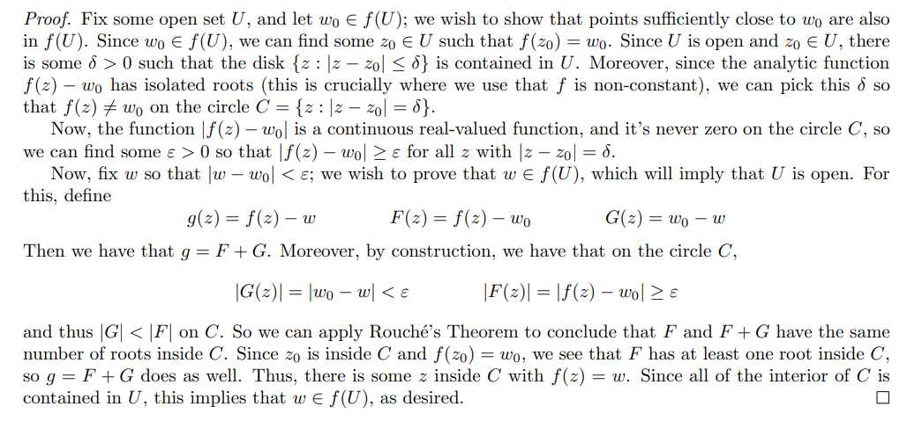
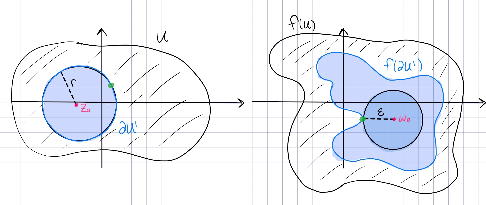
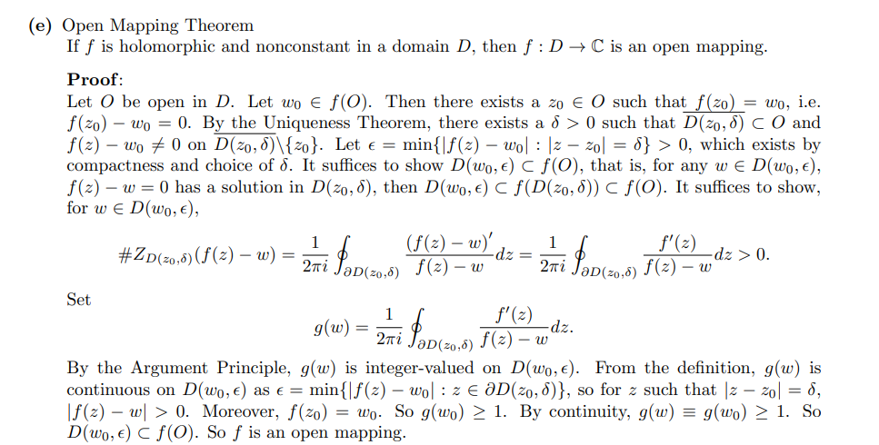

Idea: maximum modulus plus Rouche.

# Open Mapping Theorem

:::{.corollary title="Open Mapping"}
Any holomorphic non-constant map is an open map.
:::

:::{.proof title="Using Rouché"}

:::

:::{.proof title="using the argument principle"}

:::

:::{.proof title="using local degrees"}

:::

## Exercises

#todo
