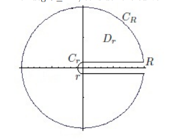
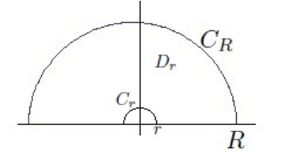
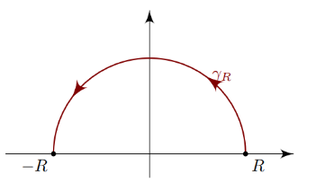
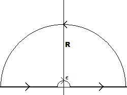

# Residues for Integrals

## Strategies

:::{.remark title="Resources"}
Some resources:

- For guidelines for what techniques to use,
[see this very detailed note](https://math.mit.edu/~jorloff/18.04/notes/topic9.pdf).

- Some good computations [here](https://math.mit.edu/~jorloff/18.04/notes/topic9.pdf).

:::

:::{.remark title="Rational functions $f$ with $\deg(f) \leq -2$ or $f\sim 1/z^{1+\varepsilon}$ "}
Semicircle. Always get 
\[
\int_\RR f = \sum_{z_0\in \HH} \Res_{z=z_0}f(z)
.\]

:::

:::{.remark title="Rational functions $f$ against a single $\sin$ or $\cos$, if $\deg(f) \geq -1$"}
Semicircles. Realize 
\[
\int_\RR f(z)\cos(z) = \Re\qty{\int_\RR f(z)e^{iz}}
.\]

This works for $f(z)e^{iz}$ where $f(z) = p(z)/q(z)$ with $\deg q \geq \deg p+2$ by the ML estimate, or $\deg q \geq \deg p +1$ by Jordan's lemma.
:::

:::{.remark title="?"}

:::

:::{.remark title="?"}

:::

:::{.remark title="?"}

:::

:::{.remark title="?"}

:::

:::{.remark title="?"}

:::

:::{.remark}

Let $\deg$ denote the $z\dash$adic valuation, so $\deg(p(x)/q(x)) = \deg(p) - \deg(q)$.
A summary of techniques:

- Rational functions in $z$:

  -  $f(z) \sim 1/z$: rectangular contours.

    
    
    - The relevant theorem: $f(z) \leq {M \over \abs{z} }$ for $\abs{z} \gg 0$ implies $\int_{C_R} f(z) e^{i\alpha z} \convergesto{R\to\infty} 0$ where for $\alpha>0$ take $C_R$ to be the left rectangular contour, and $\alpha>0$ take $C_R$ the right.

- Rational functions of $\cos, \sin$:
  - Set $z=e^{i\theta}$, then
	\[
	2\cos(z) = z + z\inv, \quad 2i\sin(z) = z - z\inv, && \dtheta = {\dz\over iz}
	.\] 
	Then $\int_{-\pi}^\pi f(\theta)\dtheta \to \int_{\abs{z} = 1} f(z) \dz$, which reduces to a residue count in $\DD$.
	
- $f(z) \approx \cos(z), \sin(z), \tan(z), \cdots$: check if $\displaystyle\int f \approx \Re\displaystyle\int (g(e^{iz}))$.

- $\int_\RR f(x)\cos(x) = \Im(f(z)e^{iz})$ or $\int_\RR f(x)\sin x = \Im(f(z)e^{iz})$: use a semicircular contour, then if $f(re^{i\theta})\to 0$ uniformly as $r\to \infty$ for $0<\theta<\pi$, then just picks up the residues in $\HH$.

- $\int_{\RR_{\geq 0}} f(x)x^\alpha$ for $\alpha$ rational with $\abs{\alpha} < 1$ 
  - For $f$ rational with $\deg f\leq -2$, take a keyhole

  

- $\int_{\RR_{\geq 0}} f(x) \log(x)$: indented semicircular contours

:::

:::{.remark}
The reverse triangle shows up here often!
\[
\abs{z-w} \geq \abs{ \abs{z} - \abs{w}} \implies {1\over \abs{z-w}}\leq \abs{1\over \abs z - \abs w} \\
\abs{z+w} = \abs{z -(-w)} \geq \abs{ \abs{z} - \abs{w}} \implies {1\over \abs{z+w}}\leq \abs{1\over \abs z - \abs w} \\
.\]

Also often useful: $e^{-x}$ is monotonically decreasing on $\RR$, so
\[
a\leq b \implies e^{-a} \geq e^{-b}
.\]

:::

## The ML Estimate

:::{.theorem title="ML Estimate"}
\[
\abs{ \int_\gamma f(z) \dz } \leq ML \da \sup_{\xi \in \gamma} \abs{f(\xi)} \cdot \length(\gamma) 
.\]

:::

:::{.remark}
If $C_R$ is a semicircular contour subtending an angle of $\theta$,
\[
\abs{\int_{C_R} f\, }\leq MR\theta
,\]
so provided $M = \bigo\qty{1\over R^{1+\eps}}$, this goes to zero as $R\to\infty$.
If $M = \bigo(R)$, use Jordan's lemma!
:::

:::{.proof title="?"}
\[
\abs{ \int_\gamma f(z) \dz } 
&\leq \int_\gamma \abs{f(z)} \dz \\
&\leq \int_\gamma \sup_{\xi\in \gamma} \abs{f(\xi)} \dz \\
&\da \int_\gamma M\dz \\
&= M \cdot \length(\gamma)
.\]
:::

:::{.exercise title="ML estimate for a semicircular contour"}
Use a semicircular contour and the residue theorem to evaluate
\[
I = \int_\RR {\cos(x) \over x^2 + 1 }\dx
.\]

#completed

:::

:::{.solution}
Write
\[
I = \Im \int_\RR f(z) \dz && f(z) \da {e^{iz} \over z^2 + 1}\dz
.\]
Define contours $C_1 = [-R, R]$, $C_2 = \ts{Re^{it} \st t\in [0, \pi]}$, and $\Gamma = C_1 + C_2$.
Then noting that $z_0 = i$ is the only pole of $f$ in $\HH$, by the residue theorem
\[
\int_\Gamma f(z) \dz = 2\pi i \Res_{z=i} f(z) = \qty{\int_{C_1} + \int_{C_2}} f
.\]
Note also that \[
I = \Re \lim_{R\to\infty} \int_{C_1} f
.\]

By the ML estimate,
\[
\abs{\int_{C_2} f(z)\dz } 
&\leq 2\pi R \sup_{z\in C_2} \abs{f(z)} \\
&\da 2\pi R \sup_{z\in C_2} \abs{e^{iz}\over z^2 + 1} \\
&\leq 2\pi R \sup_{z\in C_2} {1 \over \abs{ z^2 + 1} } \\
&\leq 2\pi R\sup_{z\in C_2} {1 \over \abs{z}^2 - 1 } \text{ by the reverse triangle ineq.}\\
&= {2\pi R\over R^2-1} \\
&= \bigo(R^{-1}) \\
&\convergesto{R\to\infty}0
.\]

For the residue, $z=i$ is at worst an order 1 pole, and remains order 1 since $i$ is not a zero of the numerator.
\[
\Res_{z=i} f(z) 
&= \Res_{z=i} {e^{iz} \over (z+i)(z-i)} \\
&= { e^{iz} \over z+i}\evalfrom_{z=i} \\
&= {1\over 2ei}
.\]
Thus 
\[
\lim_{R\to\infty}\int_{C_1} f = 2\pi i \Res_{z=i} f = {2\pi i \over 2ei} = {\pi \over e} \\
\implies I = \Re\qty{\pi \over e} = {\pi \over e}
.\]

Note that this also shows that
\[
\int_\RR { \sin(z) \over z^2 + 1} \dz = 0
.\]

:::

## Jordan's Lemma

:::{.theorem title="Jordan's Lemma"}
Define
\[
C_R \da \ts{ z=Re^{it} \st t\in [0, \pi] }
.\]

For $\alpha > 0$,
\[
\abs{\int_{C_R} e^{i\alpha z} g(z) \dz} \leq \pi\alpha\inv M_R \qquad M_R \da \sup_{z\in C_R} \abs{g(z)}
.\]
Note that if $M_R\to 0$ as $R\to \infty$, this integral vanishes -- so this works if $M_R \in \bigo\qty{1\over R^\eps}$ for $\eps>0$.
:::

:::{.remark}
Compare to the above computation of $\int_\RR { \cos(x) \over x^2 + 1}$.
Taking $\alpha = 1$, this yields
\[
\abs{ \int_{C_R} { e^{iz} \over z^2 + 1 } \dz } \leq \pi \sup_{z\in C_R} \abs{1\over z^2 +1} \leq {\pi \over R^2 - 1}\to 0
.\]
:::

:::{.proof title="of Jordan's lemma"}
\[
\abs{ \int_{C_R} f(z)\dz }
&= \abs{ \int_{C_R} e^{iaz}g(z) \dz} \\
&= \abs{ \int_{[0, \pi]} e^{ia\qty{Re^{it}}}g(Re^{it}) iRe^{it} \dt} \\
&\leq \int_{[0, \pi]} \abs{ e^{ia\qty{Re^{it}}}g(Re^{it}) iRe^{it}} \dt \\
&=R \int_{[0, \pi]} \abs{ e^{ia\qty{Re^{it}}}g(Re^{it})} \dt \\
&\leq R M_R \int_{[0, \pi]} \abs{ e^{ia\qty{Re^{it}}}} \dt \\
&= R M_R \int_{[0, \pi]} e^{\Re\qty{iaRe^{it}}}   \dt \\
&= R M_R \int_{[0, \pi]} e^{\Re\qty{iaR\qty{\cos(t) + i\sin(t) } }}   \dt \\
&= R M_R \int_{[0, \pi]} e^{-aR\sin(t) }   \dt \\
&= 2 R M_R \int_{[0, \pi/2]} e^{-aR\sin(t) }   \dt \\
&\leq 2R M_R \int_{[0, \pi/2]} e^{-aR\qty{2t\over \pi} }   \dt \\
&= 2RM_R \qty{\pi \over 2aR}\qty{1-e^{-aR}} \\
&= {\pi M_R \over a}
.\]

where we've used that on $[0, \pi/2]$, there is an inequality $2t/\pi \leq \sin(t)$.
This is obvious from a picture, since $\sin(t)$ is a height on $S^1$ and $2t/\pi$ is a height on a diagonal line:

:::

:::{.exercise title="Applying Jordan's lemma"}
Compute
\[
\int_\RR {\sin(x) \over x}\dx
.\]

#completed

:::

:::{.solution}
Note that the ML bound is not sufficient to bound a semicircular contour:
\[
\abs{\int_{C_R} { e^{iz} \over z}\dz } \leq \pi R \sup_{z\in C_R} \abs{1\over z} = \pi \not\to 0
.\]
Jordan's lemma on this contour yields
\[
\abs{\int_{C_R} {e^{iz} \over z} \dz } \leq \pi \sup_{z\in C_R}\abs{1\over Z} = {\pi \over R} \to 0
.\]

To compute the full integral, use an indented semicircular contour:

- $C_+ \da [\eps, R]$
- $C_i \da [-R, \eps]$
- $C_\eps \da \eps e^{it}$ with $t\in [0, \pi]$
- $C_R \da R e^{it}$ with $t\in [0, \pi]$
- $\Gamma \da C_+ + C_R + C_- - C_\eps$, noting that $C_\eps$ is is taken with a reversed orientation.

Write $I$ for the original integral, and
\[
f(z) \da { e^{iz} \over z} \implies I = \Im \lim_{\eps\to 0}\lim_{R\to \infty} \qty{\int_{C_-} + \int_{C_+}}f
.\]
By the residue theorem
\[
\int_\gamma f(z) \dz 
&= 2\pi i \sum_{z_k \in \HH} \Res_{z=z_k} f(z) = 0 \\
&= \qty{\int_{C_+} + \int_{C_R} + \int_{C_-} - \int_{C_\eps} }f \\
&= \tilde I + \qty{\int_{C_R} - \int_{C_\eps}}f
,\]
where $\Im(\tilde I) = I$ is the original integral, so
\[
\tilde I = -\qty{\int_{C_R} - \int_{C_\eps}}f
.\]

Since $\int_{C_R}f \to 0$, it just remains to compute $\int_{C_\eps}$.
By the fractional residue formula,
\[
\lim_{\eps \to 0} {e^{iz} \over z}\dz = i\pi \Res_{z=0} {e^{iz} \over z} = i\pi
.\]
Thus
\[
I = \Im(i\pi) = \pi
.\]
:::

