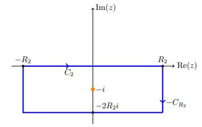

# Exercises: Integrals

## Rational Functions 

### Superlinear Decay

:::{.exercise title="$1/x^4+1$, balancing exponentials"}
\[
\int_\RR {1 \over x^4 + 1} = {\pi \sqrt{2} \over 2}
.\]

#completed

:::

:::{.solution}
The integrand $f\in \bigo\qty{1\over z^4} \subseteq \bigo\qty{1\over z^{1+\eps}}$, so a semicircular contour works.
Factoring the denominator: find a principal root 
\[
\omega^4 = -1 = e^{i\pi} \implies \omega = e{i\pi\over 4}
,\]
so 
\[
z^4 + 1 = (z-\omega)(z-\omega\zeta_4)(z-\omega\zeta_4^2)(z-\omega\zeta_4^3) \leadsto {\pi \over 4}, {3\pi \over 4}, {5\pi \over 4}, {7\pi \over 4}
.\]
So there are two simple poles in $\HH$:

Write them as $z_1 = e^{i\pi \over 4}$ and $z_2 = e^{3 i \pi \over 4}$.
Computing the residues:
\[
\Res_{z=z_k} f(z) 
&= \lim_{z\to z_k} {z-z_k \over z^4 + 1} \\
&\eqLH \lim_{z\to z_k} {1\over 4z^3} \\
&= {4z^{-3} }\evalfrom_{z=z_k}
,\]
so
\[
2\pi i \sum \Res_{z=z_k} 
&= {2\pi i \over 4}\qty{z_1^{-3} + z_2^{-3}} \\
&= {\pi i \over 2}\qty{e^{-3 i \pi \over 4} + e^{-9 i \pi \over 4}} \\
&= {\pi i \over 2}\qty{e^{-3 i \pi \over 4} + e^{-i \pi \over 4}} \\
&= {\pi i \over 2}\cdot e^{-2i\pi \over 4}\qty{e^{- i \pi \over 4} + e^{i \pi \over 4}} \\
&= \pi i\, {1\over i} \cos\qty{\pi \over 4} \\
&= {\pi \sqrt 2 \over 2}
.\]

:::

:::{.exercise title="$1/x^4+1$, half-line"}
\[
I \da \int_0^\infty {1\over x^4 + 1 }\dx = {2\pi \sqrt 3 \over 9}
.\]

#work

:::

:::{.exercise title="$1/(1+x^2)^2$"}
\[
\int_\RR {1 \over (1+x^2)^2} = {\pi \over 2}
.\]

#completed 

:::

:::{.solution}
Use that $f(z) \sim 1/z^4$:

Then 
\[
\int_{C_1 + C_R} f = \int_{C_1} f + \int_{C_R} f = 2\pi i \Res_{z=i} {1\over (1+z^2)^2}
.\]

Note $f$ factors:
\[
f(z) = {1 \over \qty{(z-i)(z+i)}^2 }
,\]
so $z=i$ is a pole of order 2.

Compute the residue within the contour:
\[
\Res_{z=i} f(z) 
= \lim_{z\to i} \dd{}{z} {1\over (z+i)^2}
= - {2 \over (z+i)^3 }\evalfrom_{z=i}
= - {2\over (2i)^3 }
= {1\over 4i} = -{i\over 4}
.\]

Now solve:
\[
2\pi i \qty{- {i\over 4}} = \int_{C_1}f + \int_{C_R} f \da I_R + \int_{C_R}f \implies I_R = {\pi \over 4} - \int_{C_R} f
.\]

Note $I_R \convergesto{R\to \infty} I \da \int_\RR f$, so it suffices to show
the semicircular error term vanishes as $R\to \infty$. 
Parameterize $C_R = \ts{z=R e^{it} \st t\in [0, \pi]}$, so $\abs{z} = R$ on $C_R$.
Letting $z=e^{it}$, $\dz =iR e^{it}\dt$,
\[
\abs{\int_{C_R} f(z) \dz }
&= \abs{\int_{C_R} {1\over (1+z^2)^2} \dz } \\
&\leq \int_{C_R}\abs{ {1\over (1+z^2)^2} } \dz \\
&= \int_{C_R} {1\over \abs{1+z^2}^2 } \dz\\
&\leq \int_{C_R} {1\over \qty{1 - \abs{z}^2 }^2 } \dz \\
&= \int_{C_R} {1\over \qty{1 - R^2 }^2 } \dz \\
&= {1\over \qty{1 - R^2 }^2 } \int_{C_R} \dz\\
&= {1\over \qty{1 - R^2 }^2 } \cdot \length(C_R) \\
&= {1\over \qty{1 - R^2 }^2 } \cdot \qty{1\over 2}2\pi R \\
&= {\pi R \over R^4 + O(R^3)} \\
&= \pi\qty{ 1 \over R^3 + O(R^2)} \\
&\convergesto{R\to\infty} 0
,\]
where we've used a variant of the triangle inequality:
\[
\abs{a\pm b} \geq \abs{ \abs{a} - \abs{b} } \implies {1\over \abs{a \pm b}} \leq {1\over \abs{a} - \abs{b} }
.\]

:::

:::{.solution title="Older solution"}
\envlist

- Factor $(1+z^2)^2 = ((z-i)(z+i))^2$, so $f$ has poles at $\pm i$ of order 2.
- Take a semicircular contour $\gamma \da I_R \union D_R$, then $f(z) \approx 1/z^4 \to 0$ for large $R$ and $\int_{D_R} f \to 0$.
- Note $\int_{I_R} f \to \int_\RR f$, so $\int_\gamma f \to \int_\RR f$.
- $\int_\gamma f = 2\pi i \sum_{z_0} \Res_{z=z_0} f$, and $z_0 = i$ is the only pole in this region.
- Compute
\[
\Res_{z=i} f 
&= \lim_{z\to i} {1\over (2-1)!} \dd{}{z} (z-i)^2 f(z) \\
&= \lim_{z\to i} \dd{}{z} {1\over (z+i)^2 } \\
&= \lim_{z\to i} {-2 \over (z+i)^3 } \\
&= -{2 \over (2i)^3 } \\
&= {1\over 4i} \\ \\
\implies
\int_\gamma f &= {2\pi i \over 4i} = \pi/2
,\]

:::

:::{.exercise title="$1/(1+x^2)^{n+1}$ "}

\[
I \da \int_{-\infty}^{\infty} \frac{d x}{\left(1+x^{2}\right)^{n+1}}=\frac{(2 n) !}{4^{n}(n !)^{2}} \pi .
\]

Note that this solution can be written many ways:
\[
I = {2n \choose n} {\pi \over 4^n}
= {\falling{2n}{n} \over n!} {\pi \over 4^n}
= {(2n)(2n-1)\cdots(n+1)\over n!} {\pi \over 4^n}
.\]

#completed

:::

:::{.solution}
The integrand is $f\in \bigo\qty{1\over z^{2n+2}} \subseteq \bigo\qty{1\over z^{1+\eps}}$, so a semicircular contour will work and thus
\[
I 
&= 2\pi i \sum_{z_k \in \HH} \Res_{z=z_k} {1\over (1+z^2)^{n+1}} \\
&= 2\pi i \Res_{z=i} {1\over (z+i)^{n+1}(z-i)^{n+1} } \\
&= 2\pi i \lim_{z\to i}{1\over n!}\qty{\dd{}{z}}^n (z+i)^{-(n+1)} \\
&= 2\pi i \lim_{z\to i}{1\over n!}\qty{\dd{}{z}}^{n-1} -(n+1)(z+i)^{-(n+2)} \\
&= 2\pi i \lim_{z\to i}{1\over n!}\qty{\dd{}{z}}^{n-2} -(n+1) \cdot -(n+2) (z+i)^{-(n+3)} \\
&= \qquad \vdots \\
&= 2\pi i \lim_{z\to i}{1\over n!}\qty{\dd{}{z}}^{n-k} (-1)^k (n+1)(n+2)\cdots(n+k) (z+i)^{-(n+k-1)} \\
&= \qquad \vdots \\
&= 2\pi i \lim_{z\to i} {1 \over n!}(-1)^n (n+1)(n+2)\cdots(2n)(z+i)^{-(2n-1)} \\
&= { \falling{2n}{n} \over n!} 2\pi i (-1)^n (2i)^{-(2n-1)} \\
&= { \falling{2n}{n} \over n!} 2\pi i (-1)^n {1\over 2^{2n+1} i^{2n+1}} \\
&= { \falling{2n}{n} \over n!} \pi (-1)^n {1\over 4^n i^{2n}} \\
&= { \falling{2n}{n} \over n!} \pi (-1)^n {1\over 4^n (-1)^n } \\
&= { \falling{2n}{n} \over n!} {\pi \over 4^n } 
.\]
:::

:::{.exercise title="$x/(x^2+4x+13)^2$"}

\[
I\da \int_\RR {x\over (x^2 + 4x+13)^2}\dx
.\]

#completed

:::

:::{.solution}
Factor the denominator:
\[
x^2 + 4x + 13 = 0 
&\implies x^2 + 4x + \qty{4\over 2}^2 = -13 + \qty{4\over 2}^2 \\
&\implies (x+2)^2 = -9 \\
&\implies x = -2 \pm 3i
,\]
one of which is in $\HH$.
Write these as 
\[
z_1 \da -2+3i && z_2 \da -2 - 3i
.\]

Write the integrand as $f$, then $f\in \bigo\qty{1\over z^{3}} \subseteq \bigo\qty{1\over z^{1+\eps}}$ means that a semicircular contour will work.
A quick justification: for $R>1$, if $n>k$ then $\abs{z}^n > \abs{z}^k$, so using the reverse triangle inequality,
\[
\abs{z\over (z^2 + 4z + 13)^2} 
&= \abs{z\over z^4 + 8z^3 + 42z^2 + 104z + 169}\\
&\leq \abs{z\over \abs{z}^4 - 8\abs{z}^3 - 42\abs{z}^2 - 104\abs{z} - 169}\\
&\leq \abs{z\over \abs{z}^4 - 8\abs{z}^4 - 42\abs{z}^4 - 104\abs{z}^4 - 169\abs{z}^4}\\
&= \abs{z\over \abs{z}^4( 1 - 8 - 42 - 104 - 169)}\\
&= 322 {\abs{z} \over \abs{z}^4} \\
&= 322 \abs{z}^{-3} \\
&= 322 R^{-3} \to 0 \text{ as } R\to\infty
.\]

So let $C_1 = [-R,R]$, $C_2 = \ts{Re^{it} \st t\in [0, \pi]}$, $\Gamma = C_1 + C_2$, then
\[
2\pi i \sum_{z_k\in \HH} \Res_{z=z_k}f(z) = \int_\Gamma f = \qty{\int_{C_1} + \int_{C_2}}f
,\]
where $\int_{C_2} f\to 0$ and $\int_{C_1} f\to I$.
So in the limit, $I = 2\pi i \Res_{z=z_1} f(z)$.
Computing this residue: note $z_1$ is a pole of order 2, so
\[
\Res_{z=z_1} 
&= \lim_{z\to z_1} \dd{}{z} (z-z_1)^2f(z)
&= \lim_{z\to z_1} \dd{}{z} {z \over (z-z_2)^2} \\
&= \lim_{z\to z_1} { (z-z_2)^2 - 2z(z-z_2 ) \over (z-z_2)^4} \\
&= \lim_{z\to z_1} { (z-z_2) - 2z \over (z-z_2)^3} \\
&= \lim_{z\to z_1} -{ z+z_2 \over (z-z_2)^3} \\
&= - {z_1 + z_2 \over (z_1 - z_2)^2}\\
&= - {z_1 + \bar{z_1} \over (z_1 - \bar{z_1} )^2}\\
&= - {2\Re(z_1) \over (2i\Im(z_1))^3} \\
&= - {2\cdot (-2) \over (2i\cdot 3) ^3} \\
&= {4\over 2^3 \cdot 3^3 \cdot i^3} \\
&= {-i \over 2 \cdot 3^3 i^2} \\
&= {i\over 54}
,\]
so 
\[
I = 2\pi i \cdot {i\over 54} = -{\pi \over 27}
.\]

:::

:::{.exercise title="$\cos(x) / x^2 + b^2$"}
\[
I \da \int_{0}^{\infty} \frac{\cos (x)}{x^{2}+b^{2}} d x=\frac{\pi \mathrm{e}^{-b}}{2 b}
.\]

#completed

:::

:::{.solution}
The integrand is even, so 
\[
I = \Re{1\over 2} \tilde I \da {1\over 2} \int_\RR {e^{iz} \over (z+ib)(z-ib)}
\]

Since $f \sim 1/x^2$, the ML estimate on a semicircular contour works:

Then $\int_{C_R} f\to 0$ and $\int_{C_1} f\to \tilde I$.
Thus
\[
\tilde I 
&= 2\pi i \Res_{z=ib} \\
&= 2\pi i \lim_{z\to ib}{e^{iz}\over (z+ib)} \\
&= 2\pi i {e^{-b} \over 2i b} \\
&= {\pi e^{-b} \over b}
\]
and 
\[
I = \Re {1\over 2} \tilde I = {\pi e^{-b} \over 2b}
.\]

:::

### Linear or sublinear decay

:::{.exercise title="$x\sin(x)/1+x^2$"}
\[
I = \int_\RR {x\sin(x) \over 1 + x^2}\dx
.\]

#completed

:::

:::{.solution}
Write $f(z) = {ze^{iz} \over 1+z^2}$, and note that $f\in \bigo\qty{1\over z}$, so the usual semicircular contour with the ML estimate won't work.
Writing $f(z) = e^{iz}g(z)$ where $g(z) \da {z\over 1 + z^2}$, we have $g\in \bigo\qty{1\over z} \to 0$ as $\abs{z}\to \infty$, so Jordan's lemma applies.
Write $C_1 = [-R, R]$ and $C_R = \ts{Re^{it} \st t\in [0, \pi]}$, then
\[
\abs{\int_{C_R} e^{iz} g(z)\dz }\leq \pi M_R,\, \qquad M_R \da \sup_{z\in C_R}\abs{z\over 1+z^2}
.\]
Now use that ${z+1\over z^2}\leq M\abs{z}$ for $\abs{z}$ large enough to conclude this integral goes to zero.
By the residue theorem,
\[
2\pi i \sum_{z_k\in \HH}\Res_{z=z_k}f(z) = \int_{C_1 + C_R} f = \qty{\int_{C_1} + \int_{C_R}}f \converges{R\to\infty} \int_{C_1} f = I
,\]
so it suffices to compute the residues of $f$.
Check that $1+z^2 = (1+i)(1-i)$, so $z_1 = i \in \HH$ is a simple pole and
\[
2\pi i \Res_{z=i} f(z) 
&= 2\pi i \lim_{z\to i} {e^{iz} \over z+i} \\
&= 2\pi i {i\over 2ei} = {\pi \over e}
,\]
so
\[
I = {\pi \over e}
.\]
:::

:::{.exercise title="$\cos(x) / i+x$"}
\[
I \da \int_\RR {\cos(x) \over x+i}\dx
.\]

#completed

:::

:::{.solution}
Use $\cos(z) = {1\over 2}(e^{iz} + e^{-iz})$ to decompose into two integrals:
\[
I \da \int {\cos(z) \over z+i} = {1\over 2} \int {e^{iz} \over z+i} + {1\over 2}\int {e^{-iz} \over z+i} \da \int f_1 + \int f_2
,\]
These both have $\deg(f_i) = -1$, so Jordan's lemma on semicircular contours will work.
For $e^{i\alpha z}$, one needs to take the upper half-plane for $\alpha>0$ (so $f_1$) and the lower for $\alpha<0$ ($f_2$).

Note that this is parameterized clockwise, so we need to introduce a negative sign.
The integrands only have poles at $z=-i\not \in \HH$, so $\int f_1 = 0$, so 
\[
I 
&= -2\pi i \Res_{z=-i} {e^{iz}\over 2(z+i)} \\
&= -2\pi i \lim_{z\to -i} {e^{iz}\over 2} \\
&= -\pi i e
.\]
:::

### No clear decay

:::{.exercise title="$e^{x/2} / 1+e^x,$ replication"}
\[
I \da \int_\RR {e^{x\over 2}\over 1+e^x}\dx
.\]

#completed

:::

:::{.solution}
Replication: find $b$ such that $f(z) = f(z+ib)$ and use a rectangle.
\[
f(z+ib) 
= {e^{z\over 2}e^{ib\over 2} \over 1 + e^{ib}e^z} 
= e^{ib\over 2} {e^{z\over 2} \over 1 + e^{ib}e^z } = f(z) \impliedby e^{ib} = 1 \impliedby b=2\pi
,\]
in which case
\[
f(z + 2\pi i) = e^{ib\over 2}f(z) = e^{2\pi i \over 2}f(z) = -f(z)
.\]

So take the following rectangle where $H_-$ is at $2\pi i$ and $H_+$ is at 0, with sides at $\pm R$:

Write $\Gamma$ for the entire contour.
Note that integrating left-to-right on $H_-$ yields $-I$, since $w = z+2\pi i$ for $w\in H_-$ and $f(w) = -f(z)$.
Then reversing the orientation, going right-to-left yields $\int_{H_i} f = I$.

Claim: the integrals over the sides $V_{\pm}$ vanish. For the right,
\[
\abs{\int_{V_+} f(z) \dz} 
&\leq 2\pi \sup_{t\in [0, 2\pi]} \abs{e^{R + it\over 2} \over 1 + e^{R + it} } \\
&\leq 2\pi \sup_t {\abs{ e^{R\over 2} e^{it \over 2} }  \over \abs{e^{R}e^{it}} - 1} \\
&\leq 2\pi \sup_t {\abs{ e^{R\over 2} }  \over \abs{e^{R}} - 1} \\
&\in \bigo(e^{- {R\over 2} }) \to 0
.\]

For the left:
\[
\abs{\int_{V_-} f(z) \dz} 
&\leq \sup_{t\in [0, 2\pi] } \abs{ e^{-R-it\over 2} \over 1 + e^{-R- it}} \\
&\leq \sup_{t\in [0, 2\pi]}\abs{e^{-R\over 2} e^{-it\over 2}} \\
&\leq \sup_{t\in [0, 2\pi]}\abs{e^{-R\over 2}} \\
&\in \bigo(e^{- {R\over 2} }) \to 0
,\]
where we've thrown away positive terms in the denominator, which only makes this quantity larger.

Finding the poles within $\Gamma$: by inspection, there are poles when $e^z=-1$, so at $z=(2k+1)\pi i$ for $k\in \ZZ$.
Exactly one falls into this contour, $z_k = i\pi$.
By the residue theorem,
\[
2\pi i \Res_{z=i\pi} f(z) = \int_\Gamma f(z) \dz = \qty{\int_{H_-} + \int_{H_+}} f = 2I \implies I = \pi i \Res_{z=i\pi } f
.\]
Computing this residue:
\[
\pi i \Res_{z=i\pi }f(z) 
&= \pi i \lim_{z\to i\pi} { (z-i\pi) e^{z\over 2}\over e^z + 1} \\
&\eqLH \pi i \lim_{z\to i\pi} {e^{z\over 2} \over e^z} \\
&= \pi i  e^{-i\pi \over 2} \\
&= \pi
.\]

> DZG: This is much easier than trying to find the Laurent expansion about $z=i\pi$ -- trust me!

:::

## Singularities along $\RR$, Principal Values

:::{.exercise title="$\sin(x)/x$ and $\cos(x)/x$"}
Compute
\[
I_1 \da \operatorname{PV}\int_\RR {\sin(x) \over x}\dx \\
I_2 \da \operatorname{PV}\int_\RR {\cos(x) \over x}\dx 
.\]

#completed

:::

:::{.solution}
Take $\Gamma$ an upper-half-plane semicircular contour indented at the origin; considering $f(z) = e^{iz}$, by Jordan's lemma $\int_{C_R}f \to 0$ and the pieces along $\RR$ converge to $\PV \int f$.
The singularity at $z_0 = 0$ contributes a fractional residue:
\[
\int_{C_\eps}f(z)\dz \to i\pi \Res_{z=z_0} f(z) = i\pi \lim_{z\to 0} {(z-0) e^{iz}\over z} = i\pi \cdot 1
.\]
Thus
\[
I \da \PV \int_\RR f(z)\dz = 0 + i\pi \implies I_1 = \Im(I) = \pi, \quad I_2 = \Re(I) = 0
.\]
:::

:::{.exercise title="$xe^{2ix}/x^2-1$ "}
\[
I \da \int_\RR {xe^{2ix} \over x^2-1}\dx
.\]

#completed

:::

:::{.solution}
Factor the denominator as $(z-1)(z+1)$, then there are two poles of order 1 on $\RR$.
Define a contour

- $C_1: [-R, 1-\eps_1]$
- $-C_2: -1 + Re^{it}, t \in [0, \pi]$ 
- $C_3: [1-\eps, 1+\eps]$
- $C_4: 1 + Re^{it}, t \in [0, \pi]$ 
- $C_R: Re^{it}, t\in [0, \pi]$
- $\Gamma = C_1 + \cdots + C_4 + C_R$

So this, but with a semicircular contour instead of a rectangle:

By Jordan's lemma, $\int_{C_R}\to 0$, and $\qty{\int_{C_2} + \int_{C_3} + \int_{C_4}}\to 0$, while $\int_\Gamma = 0$ since it encloses no singularities.
Thus
\[
0 = \int_{C_2} f + \int_{C_4} f
,\]
which converge to the fractional residues at $z=\pm 1$.

- For $z=-1$,
\[
\int_{C_2} 
&\to \pi i \Res_{z=-1} f(z) \\\
&= \pi i \lim_{z\to -1} {e^{2iz} \over z-1} \\
&= \pi i {e^{-2i} \over 2}
.\]

For $z=-1$:
\[
\int_{C_4} 
&\to \pi i \Res_{z=1} f(z) \\\
&= \pi i \lim_{z\to 1} {e^{2iz} \over z+1} \\
&= \pi i {e^{2i} \over 2}
.\]
So
\[
I 
&= \pi i {e^{-2i} \over 2} + \pi i {e^{2i}\over 2} \\
&=\pi i \cos(2)
.\]
:::

## Rational functions of $\cos, \sin$

:::{.exercise title="$1/1+\sin^2$"}
\[
\int_{[-\pi, \pi]} {1\over 1 + \sin^2(\theta)} \dtheta
.\]

#completed

:::

:::{.solution}
Set $z=e^{i\theta}$, so $\sin(\theta) = {z+z\inv\over 2i}$ and $\sin^2(\theta) = -{1\over 4}(z^{-2}-2+z^2)$.
Then
\[
I\da \int_{[-\pi, \pi]} {1\over 1 + \sin^2(\theta)} \dtheta
&= \int_{S^1} {1\over 1 - {1\over 4}(z^{-2} -2 + z^2) } {1\over iz}\dz \\
&= \int_{S^1} {-4i \over z(4-(z^{-2} -2 + z^2))}\dz \\
&= \int_{S^1} {-4iz \over z^2(6-z^{-2} - z^2)}\dz \\
&= \int_{S^1} {4iz \over z^4-6z^2+1}\dz \\
&= 2\pi i \sum_{z_k\in \DD} \Res_{z=z_k} {4iz\over z^4-6z^2+1}
.\]

Factoring the denominator:
\[
w^2 - 6w - 1 =0 
&\implies w^2 - 6w + \qty{-6\over 2}^2 - \qty{-6\over 2}^2 + 1 =0 \\
&\implies (w - 3)^2 = -1 + 9 = 8 \\
&\implies w-3 = \zeta_2^k \sqrt{8},\, k=0, 1 \\
&\implies w = 3 \pm \sqrt{8} \\
&\implies z= \pm\sqrt{3\pm \sqrt 8}
.\]
Write these roots as 

- $z_1 \da \sqrt{3-\sqrt 8}$
- $z_2 \da -\sqrt{3-\sqrt 8}$
- $z_3 \da \sqrt{3+\sqrt 8}$
- $z_4 \da -\sqrt{3 + \sqrt 8}$

Some numerology to figure out the modulus of these roots:

- $3 + \sqrt{8} = 3+2\sqrt{2} 3+2\cdot(1.4) \approx 5.8$, so $\abs{ \pm \sqrt{3+\sqrt 8}}>\sqrt{4}>2>1$.
- $3-\sqrt{8} \approx 3-2.8 \approx 0.2$ so $\abs{ \pm \sqrt{3-\sqrt 8} } < 1$.

So it suffices to compute the residues at $z_1, z_2 = \pm \sqrt{3-\sqrt 8}$:
At $z_1$:
\[
\Res_{z = z_1} 
&= \lim_{z\to z_1} {(z-z_1) 4i z \over z^4-6z^2+1 } \\
&\equalsbecause{\text{LH}} \lim_{z\to z_1} { 4iz + 4i(z-z_1) \over 4z^3 -12z} \\
&= {4iz_1 \over 4z_1^3 - 12z_1} \\
&= {i\over z_1^2 - 3} \\
&= {i\over (3-\sqrt 8) - 3} \\
&= -{i\over \sqrt 8}
.\]
At $z_2$:
\[
\Res_{z=z_2} 
&= \lim_{z\to z_2} {(z-z_2) 4i z \over z^4-6z^2+1 } \\
&= {4iz_2\over 4z_2^2 - 12z_2}\\
&= {i \over z_2^2 - 3} \\
&= -{i\over \sqrt 8}
.\]

Thus 
\[
I = 2\pi i \cdot -{2i\over \sqrt 8} = {4\pi \over \sqrt{8}}
.\]
:::

:::{.exercise title="$1/1+a^2+2a\cos(\theta)$"}
\[
\int_{0}^{2 \pi} \frac{d \theta}{1+a^{2}-2 a \cos (\theta)}
= \begin{cases}\frac{2 \pi}{a^{2}-1} & \text { if }|a|>1 \\ \frac{2 \pi}{1-a^{2}} & \text { if }|a|<1\end{cases}
.\]

#completed

:::

:::{.solution}
The usual substitution: $z=e^{i\theta}, \dz = (iz)\dtheta$.
\[
I\da \int_{[0, 2\pi]} \qty{a^2 - 2a\cos(\theta) + 1}\inv \dtheta
&= \oint \qty{a^2-2(z+z\inv) + 1}\inv (iz)\inv \dz \\
&= -i\oint \qty{za^2 - a(z^2+1) +z}\inv \dz \\
&= -i \oint\qty{-az^2 + (a^2+1)z - a}\inv\dz \\
&= {i\over a}\oint \qty{z^2 - \qty{a^2+a\over a}z + 1}\inv \dz \\
&= {i\over a}\oint (z-a)\inv (z-a\inv)\inv \dz
,\]
noting that ${a^2+a\over a} = a+a\inv$.
Now there are two cases:

- $\abs{a} < 1$: then $a\in \DD,a\inv\in \DD^c$, so there is a simple pole at $a$.
  Then 
  \[
  I 
  &= {i\over a}\, 2\pi i \Res_{z=a} (z-a)\inv(z-a\inv)\inv \\
  &=  -{2\pi \over a} (z-a\inv)\inv \evalfrom_{z=a} \\
  &= -{2\pi \over a(a-a\inv)} \\
  &= {2\pi \over 1 - a^2}
  .\]

- $\abs{a}> 1$: then $a\inv \in \DD, a\in \DD^c$ so there is a simple pole at $a\inv$.
  Then 
  \[
  I 
  &= {i\over a}\, 2\pi i \Res_{z=a\inv } (z-a)\inv(z-a\inv)\inv \\
  &=  -{2\pi \over a} (z-a)\inv \evalfrom_{z=a\inv} \\
  &= -{2\pi \over a(a\inv - a)} \\
  &= {2\pi \over a^2 - 1}
  .\]

:::

:::{.exercise title="$1/a+b\cos(\theta)$"}
\[
\int_{0}^{2 \pi} \frac{d \theta}{a+b \cos \theta}=\frac{2 \pi}{\sqrt{a^{2}-b^{2}}}
.\]

#completed

:::

:::{.solution}
The usual substitution: $z=e^{i\theta}, \dtheta = (iz)\inv \dz$.
\[
\int_{[0, 2\pi]} (a +b\cos(\theta))\inv \dtheta 
&= \oint \qty{ a + {b\over 2}(z+z\inv)}\inv (iz)\inv \dz \\
&= -i\oint \qty{ za + {b\over 2}(z^2 + 1)} \inv \dz \\
&= -i \oint \qty{{b\over 2}z^2 + az + {b\over 2} }\inv \dz \\
&= -{2i\over b} \oint \qty{z^2 + {2a\over b}z + 1}\inv \dz \\
&= -{2i\over b}\oint (z-r_1)\inv (z-r_2)\inv \dz
,\]
where the roots can just be found using the quadratic formula
\[
z_k 
&= {1\over 2} \qty{-{2a\over b} \pm \sqrt{\qty{2a\over b}^2 - 4}} \\
&= -{a\over b}\pm {1\over 2}\sqrt{{4a^2 \over b^2} - 4} \\
&= -{a\over b}\pm \sqrt{{a^2 \over b^2} - 1} \\
&= -{a\over b}\pm \sqrt{{a^2 - b^2 \over b^2}} \\
&= -{a\over b}\pm {1\over b } \sqrt{{a^2 - b^2}} 
.\]
Thus
\[
r_1 &\da b\inv\qty{-a + \sqrt{a^2-b^2}} \\
r_2 &\da b\inv\qty{-a - \sqrt{a^2-b^2}} 
.\]

Since $r_1 r_2 = 1$ and thus $\abs{r_1 r_2} = 1$, only one root is in $\DD$ and this yields one simple pole.
Assume $a>b$.
Note that for $r_2$, $\abs{a/b} > 1$ and $\abs{a^2-b^2}>0$, so $r_2 \approx -1 - \eps < -1$, so $r_1\in \DD$.
Computing the residue here:
\[
\Res_{z=r_1} (z-r_1)\inv (z-r_2)\inv 
&= (z-r_2)\inv \evalfrom_{z=r_1} \\
&= (r_1 - r_2)\inv \\
&= \qty{2b\inv \sqrt{a^2-b^2} }\inv
,\]
so 
\[
I &= 2\pi i \cdot -{2 i \over b}{b\over 2\sqrt{a^2-b^2}} \\
&= {2\pi \over \sqrt{a^2-b^2} }
.\]

:::

## Branch Cuts

:::{.exercise title="$x^\alpha/(x+1)^2$, keyhole contour"}
\[
I \da \int_0^\infty {x^\alpha \over (x+1)^2}\dx
.\]

#work

:::

:::{.exercise title="Keyhole contour and ML estimate: $\log(x) / (1+x^2)^2$"}
Compute
\[
\int_{[0, \infty]} {\log(x) \over (1+x^2)^2}\dx 
.\]
:::

:::{.solution}
Factor $(1+z^2)^2 = (z+i^2(z-i)^2$.
Take a keyhole contour similar to the following:

Show that outer radius $R$ and inner radius $\rho$ circles contribute zero in the limit by the ML estimate?
Compute the residues by just applying the formula and manually computing derivatives:
\[
\Res_{z= \pm i} f(z) 
&= \lim_{z\to \pm i} \dd{}{z} {\log^2(z) \over (z\pm i)^2} \\
&= \lim_{z\to \pm i} {2\log(z) (z\pm i)^2 - 2(z\pm i)^2 \log^2(z) \over \qty{(z\pm i )^2}^2} \\
&= {
2\log(\pm i)(\pm 2i)^2 - 2(\pm 2i)^2 \log^2(\pm i)
\over {\qty{\pm 2i}}^4 } \\
&=_? {\pi \over 4}\pm {i\pi^2 \over 16}
.\]

> See p.4: <http://www.math.toronto.edu/mnica/complex1.pdf>

:::

:::{.exercise title="$\log(x) / x^2+a^2$"}
\[
\int_0^\infty {\log(x) \over x^2+a^2}\dx &= {\pi\log(a)\over 2a} && a>0
.\]
:::

:::{.exercise title="$x^? / 1+x^2$"}
\[
\int_0^\infty {x^{1\over 3} \over 1 + x^2} \dx = {\pi \over \sqrt 3}
.\]
:::

:::{.solution}

:::

:::{.exercise title="$1/x\sqrt{x^2-1}"}
\[
\int_{1}^{\infty} \frac{d x}{x \sqrt{x^{2}-1}} = {\pi \over 2}
.\]
:::

:::{.solution}

:::

