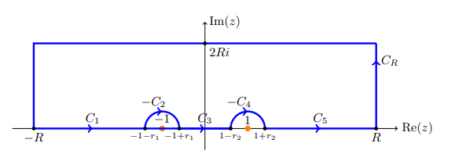

# Exercises: Integrals

## Rational Functions 

### Superlinear Decay

:::{.exercise title="$1/x^4+1$, balancing exponentials"}
\[
\int_\RR {1 \over x^4 + 1} = {\pi \sqrt{2} \over 2} = {\pi \over \sqrt 2}
.\]

#completed

:::

:::{.solution}
The integrand $f\in \bigo\qty{1\over z^4} \subseteq \bigo\qty{1\over z^{1+\eps}}$, so a semicircular contour works.
Factoring the denominator: find a principal root 
\[
\omega^4 = -1 = e^{i\pi} \implies \omega = e{i\pi\over 4}
,\]
so 
\[
z^4 + 1 = (z-\omega)(z-\omega\zeta_4)(z-\omega\zeta_4^2)(z-\omega\zeta_4^3) \leadsto {\pi \over 4}, {3\pi \over 4}, {5\pi \over 4}, {7\pi \over 4}
.\]
So there are two simple poles in $\HH$:

Write them as $z_1 = e^{i\pi \over 4}$ and $z_2 = e^{3 i \pi \over 4}$.
Computing the residues:
\[
\Res_{z=z_k} f(z) 
&= \lim_{z\to z_k} {z-z_k \over z^4 + 1} \\
&\eqLH \lim_{z\to z_k} {1\over 4z^3} \\
&= {4z^{-3} }\evalfrom_{z=z_k}
,\]
so
\[
2\pi i \sum \Res_{z=z_k} 
&= {2\pi i \over 4}\qty{z_1^{-3} + z_2^{-3}} \\
&= {\pi i \over 2}\qty{e^{-3 i \pi \over 4} + e^{-9 i \pi \over 4}} \\
&= {\pi i \over 2}\qty{e^{-3 i \pi \over 4} + e^{-i \pi \over 4}} \\
&= {\pi i \over 2}\cdot e^{-2i\pi \over 4}\qty{e^{- i \pi \over 4} + e^{i \pi \over 4}} \\
&= \pi i\, {1\over i} \cos\qty{\pi \over 4} \\
&= {\pi \sqrt 2 \over 2}
.\]

:::

:::{.exercise title="$1/x^4+1$, half-line"}
\[
I \da \int_0^\infty {1\over x^4 + 1 }\dx = {\pi \over 2\sqrt 2}
.\]

#completed

:::

:::{.solution title="Integrand symmetry"}
Note that the function is even, so
\[
\int_{0^\infty} f(x) \dx = {1\over 2} \int_\RR f(x)\dx = {1\over 2} {\pi \over \sqrt 2} = {\pi \over 2 \sqrt 2}
,\]
using the solution from a previous problem.
:::

:::{.solution title="Sector"}
A sector will work, since there is a symmetry under $z\to \zeta_4 z$ and $f(z) \sim z^{-4}$, so the semicircular piece will vanish.
Take the contour $\Gamma$ comprised of

- $\gamma_1: \ts{t + 0i \st t\in [0, R]}$,
- $C_R: \ts{Re^{it}\st t\in [0, \pi/2]}$,
- $\gamma_2: \ts{0 + it \st t\in [0, R]}$,

oriented counter-clockwise.
Note that $z^4+1 = \prod_{k=0}^3 (z-\omega \zeta_4)$ where $\omega = e^{i\pi \over 4}$ and $\zeta_4 = e^{2\pi i\over 4} = i$, so there is only one pole at $z_0 \da e^{i\pi\over 4}$ within this contour.

Computing the symmetry:
\[
\int_{\gamma_2} f(z) \dz 
&= \int_R^0 {i \over (ti)^4 + 1}\dt \qquad z=ti,\, \dz = i\dt \\
&= -i \int_0^R {1\over t^4 + 1}\dt \\
&= -i \int_{\gamma_1} f(z) \dz
,\]
so applying the residue theorem and noting that $\int_{C_R}f\to 0$,
\[
2\pi \Res_{z=z_0} f(z) = \int_\Gamma f(z) \dz = \qty{\int_{\gamma_1} + \int_{C_R} + \int_{\gamma_2}}f \too (1-i) I
.\]
Computing the residue:
\[
\Res_{z=z_0}f(z) 
&= {1\over 4z^3}\evalfrom_{z= e^{i\pi \over 4}} \\
&= {1\over 4}e^{-3i\pi \over 4} \\
&= {1\over 4}e^{5i\pi \over 4}
.\]

Thus
\[
I 
&= (1-i)\inv 2\pi i \Res_{z=z_0} f(z) \\
&= \qty{\bar{1-i} \over \abs{1-i}^2} 2\pi i \cdot {1\over 4}e^{5i\pi \over 4} \\
&= {1+i \over 2} {\pi i \over 2}e^{5i\pi \over 4} \\
&= {e^{i\pi \over 4} \over \sqrt{2} } {\pi i \over 2}e^{5i\pi \over 4} \\
&= {\pi i \over 2\sqrt{2}}e^{6i\pi \over 4} \\
&= {\pi i \over 2\sqrt{2}}(-i) \\
&= {\pi \over 2\sqrt{2}} 
.\]

:::

:::{.solution title="The log trick"}
Consider the auxiliary function $g(z) \da \log(z) f(z)$, and take a keyhole contour:

Let $\Gamma$ be the counterclockwise contour consisting of

- $C_\eps = \ts{\eps e^{it}\st t\in [0+\eps, 2\pi - \eps]}$
- $\gamma_+ = \ts{x+i\eps \st x\in [\eps, R]}$
- $C_R= \ts{R e^{it}\st t\in [0+\eps, 2\pi - \eps]}$
- $\gamma_- = \ts{x-i\eps \st x\in [\eps, R]}$

Computing the symmetry:
\[
\int_{\gamma_-}{\log(z) \over z^{4} + 1} \dz 
&= \int_{R}^\eps {\log(x-i\eps) \over (x-i\eps)^4 + 1} \dx \qquad z=x-i\eps, \dz = \dx \\
&\to - \int_{\eps}^R {\log(x) + 2\pi i\over x^4 + 1}\dz \\
&= -\int_{\gamma_+} {\log(z) \over z^4+1}\dz - 2\pi i\int_{\gamma_+} {1\over z^4+1} \dz
,\]
so
\[
\int_{\gamma_+} f + \int_{\gamma_-}f \too -2\pi i I
.\]
By the ML estimate, since $\log(z)/z^4\to 0$ as $\abs{z}\to \infty$, $\int_{C_R}g(z) \to 0$.
Similarly, since $\log(z) / (z^4+1)\to 0$ as $\abs{z}\to 0$, $\int_{C_\eps}\to 0$.
We're then left with the sum of residues at $e^{k i \pi \over 4}$ for $k = 1,3,5,7$.
We have
\[
\Res_{z=z_k} f(z) 
&= {1\over 4z^3}\evalfrom_{z=z_k} \\
&= {z\over 4z^4}\evalfrom_{z=z_k} \\
&= - {z\over 4}\evalfrom_{z=z_k} \qquad \text{ since } z_k^4 = -1 \\
&= -{z_k \over 4}
,\]
so
\[
\Res_{z=z_k}g(z) = -{z_k \over 4}\log(z_k) 
.\]

Now use that in the limit, 
\[
2\pi i \sum_k \Res_{z=z_k}g(z) 
&= \int_\Gamma g(z) \dz \\
&= \qty{\int_{\gamma_+} + \int_{\gamma_i}} f \\
&= -2\pi i I
,\]
so $I = -\sum_k \Res_{z=z_k} g(z)$.

Being very careful to note that we've chosen a branch of $\log$ where $\Arg(z) \in (0, 2\pi)$ in order to get the signs right,
\[
-\sum_k \Res(z=z_k) g(z) 
&= {1\over 4}\qty{ z_1\log(z_1) + z_2\log(z_2)+z_3\log(z_3)+z_4\log(z_4) } \\
&= {1\over 4}\qty{ z_1 {i\pi \over 4} + z_2 {3i\pi \over 4} + z_3 {5i\pi \over 4}+ z_4 {7i\pi \over 4} } \\
&= {i\pi \over 16}\qty{ z_1  + 3z_2  + 5z_3+ 7z_4 } \\
&= {i\pi \over 16}\qty{ \omega \zeta_4^0  + 3\omega\zeta_4^1  + 5\omega\zeta_4^2+ 7\omega \zeta_4^3 } \\
&= {i\pi \omega \over 16}\qty{ 1 + 3i  + -5 + -7i } \\
&= {i\pi \omega \over 16}(-4-4i) \\
&= -{i\pi \omega \over 4}(1+i) \\
&= -{i\pi \omega \over 2}{ \omega \over \sqrt{2} } \\
&= -i\omega^2 {\pi \over 2 \sqrt 2} \\
&= {\pi \over 2\sqrt{2} }
,\]
using that ${\sqrt 2\over 2}(1+i) = e^{i\pi \over 4} = \omega$ and $\omega^2 = i$.

:::

:::{.exercise title="$1/(1+x^2)^2$"}
\[
\int_\RR {1 \over (1+x^2)^2} = {\pi \over 2}
.\]

#completed 

:::

:::{.solution}
Use that $f(z) \sim 1/z^4$:

Then 
\[
\int_{C_1 + C_R} f = \int_{C_1} f + \int_{C_R} f = 2\pi i \Res_{z=i} {1\over (1+z^2)^2}
.\]

Note $f$ factors:
\[
f(z) = {1 \over \qty{(z-i)(z+i)}^2 }
,\]
so $z=i$ is a pole of order 2.

Compute the residue within the contour:
\[
\Res_{z=i} f(z) 
= \lim_{z\to i} \dd{}{z} {1\over (z+i)^2}
= - {2 \over (z+i)^3 }\evalfrom_{z=i}
= - {2\over (2i)^3 }
= {1\over 4i} = -{i\over 4}
.\]

Now solve:
\[
2\pi i \qty{- {i\over 4}} = \int_{C_1}f + \int_{C_R} f \da I_R + \int_{C_R}f \implies I_R = {\pi \over 4} - \int_{C_R} f
.\]

Note $I_R \convergesto{R\to \infty} I \da \int_\RR f$, so it suffices to show
the semicircular error term vanishes as $R\to \infty$. 
Parameterize $C_R = \ts{z=R e^{it} \st t\in [0, \pi]}$, so $\abs{z} = R$ on $C_R$.
Letting $z=e^{it}$, $\dz =iR e^{it}\dt$,
\[
\abs{\int_{C_R} f(z) \dz }
&= \abs{\int_{C_R} {1\over (1+z^2)^2} \dz } \\
&\leq \int_{C_R}\abs{ {1\over (1+z^2)^2} } \dz \\
&= \int_{C_R} {1\over \abs{1+z^2}^2 } \dz\\
&\leq \int_{C_R} {1\over \qty{1 - \abs{z}^2 }^2 } \dz \\
&= \int_{C_R} {1\over \qty{1 - R^2 }^2 } \dz \\
&= {1\over \qty{1 - R^2 }^2 } \int_{C_R} \dz\\
&= {1\over \qty{1 - R^2 }^2 } \cdot \length(C_R) \\
&= {1\over \qty{1 - R^2 }^2 } \cdot \qty{1\over 2}2\pi R \\
&= {\pi R \over R^4 + O(R^3)} \\
&= \pi\qty{ 1 \over R^3 + O(R^2)} \\
&\convergesto{R\to\infty} 0
,\]
where we've used a variant of the triangle inequality:
\[
\abs{a\pm b} \geq \abs{ \abs{a} - \abs{b} } \implies {1\over \abs{a \pm b}} \leq {1\over \abs{a} - \abs{b} }
.\]

:::

:::{.solution title="Older solution"}
\envlist

- Factor $(1+z^2)^2 = ((z-i)(z+i))^2$, so $f$ has poles at $\pm i$ of order 2.
- Take a semicircular contour $\gamma \da I_R \union D_R$, then $f(z) \approx 1/z^4 \to 0$ for large $R$ and $\int_{D_R} f \to 0$.
- Note $\int_{I_R} f \to \int_\RR f$, so $\int_\gamma f \to \int_\RR f$.
- $\int_\gamma f = 2\pi i \sum_{z_0} \Res_{z=z_0} f$, and $z_0 = i$ is the only pole in this region.
- Compute
\[
\Res_{z=i} f 
&= \lim_{z\to i} {1\over (2-1)!} \dd{}{z} (z-i)^2 f(z) \\
&= \lim_{z\to i} \dd{}{z} {1\over (z+i)^2 } \\
&= \lim_{z\to i} {-2 \over (z+i)^3 } \\
&= -{2 \over (2i)^3 } \\
&= {1\over 4i} \\ \\
\implies
\int_\gamma f &= {2\pi i \over 4i} = \pi/2
,\]

:::

:::{.exercise title="$1/(1+x^2)^{n+1}$ "}

\[
I \da \int_{-\infty}^{\infty} \frac{d x}{\left(1+x^{2}\right)^{n+1}}=\frac{(2 n) !}{4^{n}(n !)^{2}} \pi .
\]

Note that this solution can be written many ways:
\[
I = {2n \choose n} {\pi \over 4^n}
= {\falling{2n}{n} \over n!} {\pi \over 4^n}
= {(2n)(2n-1)\cdots(n+1)\over n!} {\pi \over 4^n}
.\]

#completed

:::

:::{.solution}
The integrand is $f\in \bigo\qty{1\over z^{2n+2}} \subseteq \bigo\qty{1\over z^{1+\eps}}$, so a semicircular contour will work:

Thus
\[
I 
&= 2\pi i \sum_{z_k \in \HH} \Res_{z=z_k} {1\over (1+z^2)^{n+1}} \\
&= 2\pi i \Res_{z=i} {1\over (z+i)^{n+1}(z-i)^{n+1} } \\
&= 2\pi i \lim_{z\to i}{1\over n!}\qty{\dd{}{z}}^n (z+i)^{-(n+1)} \\
&= 2\pi i \lim_{z\to i}{1\over n!}\qty{\dd{}{z}}^{n-1} -(n+1)(z+i)^{-(n+2)} \\
&= 2\pi i \lim_{z\to i}{1\over n!}\qty{\dd{}{z}}^{n-2} -(n+1) \cdot -(n+2) (z+i)^{-(n+3)} \\
&= \qquad \vdots \\
&= 2\pi i \lim_{z\to i}{1\over n!}\qty{\dd{}{z}}^{n-k} (-1)^k (n+1)(n+2)\cdots(n+k) (z+i)^{-(n+k-1)} \\
&= \qquad \vdots \\
&= 2\pi i \lim_{z\to i} {1 \over n!}(-1)^n (n+1)(n+2)\cdots(2n)(z+i)^{-(2n-1)} \\
&= { \falling{2n}{n} \over n!} 2\pi i (-1)^n (2i)^{-(2n-1)} \\
&= { \falling{2n}{n} \over n!} 2\pi i (-1)^n {1\over 2^{2n+1} i^{2n+1}} \\
&= { \falling{2n}{n} \over n!} \pi (-1)^n {1\over 4^n i^{2n}} \\
&= { \falling{2n}{n} \over n!} \pi (-1)^n {1\over 4^n (-1)^n } \\
&= { \falling{2n}{n} \over n!} {\pi \over 4^n } 
.\]
:::

:::{.exercise title="$x/(x^2+4x+13)^2$"}

\[
I\da \int_\RR {x\over (x^2 + 4x+13)^2}\dx
.\]

#completed

:::

:::{.solution}
Write the integrand as $f$.

:::{.claim}
$f\in \bigo\qty{1\over z^{3}} \subseteq \bigo\qty{1\over z^{1+\eps}}$ means that a semicircular contour will work:

:::

:::{.proof title="Of integrand decay"}
A quick justification: for $R>1$, if $n>k$ then $\abs{z}^n > \abs{z}^k$, so using the reverse triangle inequality,
\[
\abs{z\over (z^2 + 4z + 13)^2} 
&= \abs{z\over z^4 + 8z^3 + 42z^2 + 104z + 169}\\
&\leq \abs{z\over \abs{z}^4 - 8\abs{z}^3 - 42\abs{z}^2 - 104\abs{z} - 169}\\
&\leq \abs{z\over \abs{z}^4 - 8\abs{z}^4 - 42\abs{z}^4 - 104\abs{z}^4 - 169\abs{z}^4}\\
&= \abs{z\over \abs{z}^4( 1 - 8 - 42 - 104 - 169)}\\
&= 322 {\abs{z} \over \abs{z}^4} \\
&= 322 \abs{z}^{-3} \\
&= 322 R^{-3} \to 0 \text{ as } R\to\infty
.\]

:::

Factor the denominator:
\[
x^2 + 4x + 13 = 0 
&\implies x^2 + 4x + \qty{4\over 2}^2 = -13 + \qty{4\over 2}^2 \\
&\implies (x+2)^2 = -9 \\
&\implies x = -2 \pm 3i
,\]
one of which is in $\HH$.
Write these as 
\[
z_1 \da -2+3i && z_2 \da -2 - 3i
.\]

So let $\Gamma$ be comprised of

- $C_1 = [-R,R]$, 
- $C_2 = \ts{Re^{it} \st t\in [0, \pi]}$, 
- $\Gamma = C_1 + C_2$, then
\[
2\pi i \sum_{z_k\in \HH} \Res_{z=z_k}f(z) = \int_\Gamma f = \qty{\int_{C_1} + \int_{C_2}}f
,\]
where $\int_{C_2} f\to 0$ and $\int_{C_1} f\to I$.
So in the limit, $I = 2\pi i \Res_{z=z_1} f(z)$.
Computing this residue: note $z_1$ is a pole of order 2, so
\[
\Res_{z=z_1} 
&= \lim_{z\to z_1} \dd{}{z} (z-z_1)^2f(z)
&= \lim_{z\to z_1} \dd{}{z} {z \over (z-z_2)^2} \\
&= \lim_{z\to z_1} { (z-z_2)^2 - 2z(z-z_2 ) \over (z-z_2)^4} \\
&= \lim_{z\to z_1} { (z-z_2) - 2z \over (z-z_2)^3} \\
&= \lim_{z\to z_1} -{ z+z_2 \over (z-z_2)^3} \\
&= - {z_1 + z_2 \over (z_1 - z_2)^2}\\
&= - {z_1 + \bar{z_1} \over (z_1 - \bar{z_1} )^2}\\
&= - {2\Re(z_1) \over (2i\Im(z_1))^3} \\
&= - {2\cdot (-2) \over (2i\cdot 3) ^3} \\
&= {4\over 2^3 \cdot 3^3 \cdot i^3} \\
&= {-i \over 2 \cdot 3^3 i^2} \\
&= {i\over 54}
,\]
so 
\[
I = 2\pi i \cdot {i\over 54} = -{\pi \over 27}
.\]

:::

:::{.exercise title="$\cos(x) / x^2 + b^2$"}
\[
I \da \int_{0}^{\infty} \frac{\cos (x)}{x^{2}+b^{2}} d x=\frac{\pi \mathrm{e}^{-b}}{2 b}
.\]

#completed

:::

:::{.solution}
The integrand is even, so 
\[
I = \Re{1\over 2} \tilde I \da {1\over 2} \int_\RR {e^{iz} \over (z+ib)(z-ib)}
\]

Since $f \sim 1/x^2$, the ML estimate on a semicircular contour works:

Then $\int_{C_R} f\to 0$ and $\int_{C_1} f\to \tilde I$.
Thus
\[
\tilde I 
&= 2\pi i \Res_{z=ib} \\
&= 2\pi i \lim_{z\to ib}{e^{iz}\over (z+ib)} \\
&= 2\pi i {e^{-b} \over 2i b} \\
&= {\pi e^{-b} \over b}
\]
and 
\[
I = \Re {1\over 2} \tilde I = {\pi e^{-b} \over 2b}
.\]

:::

### Linear or sublinear decay

:::{.exercise title="$x\sin(x)/1+x^2$"}
\[
I = \int_\RR {x\sin(x) \over 1 + x^2}\dx
.\]

#completed

:::

:::{.solution}
Write $f(z) = {ze^{iz} \over 1+z^2}$, and note that $f\in \bigo\qty{1\over z}$, so the usual semicircular contour with the ML estimate won't work.
Claim: a semicircular contour with a better estimate *will* work:

Writing $f(z) = e^{iz}g(z)$ where $g(z) \da {z\over 1 + z^2}$, we have $g\in \bigo\qty{1\over z} \to 0$ as $\abs{z}\to \infty$, so Jordan's lemma applies.
Write $C_1 = [-R, R]$ and $C_R = \ts{Re^{it} \st t\in [0, \pi]}$, then
\[
\abs{\int_{C_R} e^{iz} g(z)\dz }\leq \pi M_R,\, \qquad M_R \da \sup_{z\in C_R}\abs{z\over 1+z^2}
.\]
Now use that ${z+1\over z^2}\leq M\abs{z}$ for $\abs{z}$ large enough to conclude this integral goes to zero.
By the residue theorem,
\[
2\pi i \sum_{z_k\in \HH}\Res_{z=z_k}f(z) = \int_{C_1 + C_R} f = \qty{\int_{C_1} + \int_{C_R}}f \converges{R\to\infty} \int_{C_1} f = I
,\]
so it suffices to compute the residues of $f$.
Check that $1+z^2 = (1+i)(1-i)$, so $z_1 = i \in \HH$ is a simple pole and
\[
2\pi i \Res_{z=i} f(z) 
&= 2\pi i \lim_{z\to i} {e^{iz} \over z+i} \\
&= 2\pi i {i\over 2ei} = {\pi \over e}
,\]
so
\[
I = {\pi \over e}
.\]
:::

:::{.exercise title="$\cos(x) / i+x$"}
\[
I \da \int_\RR {\cos(x) \over x+i}\dx
.\]

#completed

:::

:::{.solution}
Note that the usual thing won't work, since ${\cos(z) \over z+i}\neq \Re\qty{e^{iz}\over z+i};$ the complex constant in the denominator throws this off!
Instead, use $\cos(z) = {1\over 2}(e^{iz} + e^{-iz})$ to decompose into two integrals:
\[
I \da \int_\RR {\cos(z) \over z+i} 
= {1\over 2} \int_\RR {e^{iz} \over z+i} + {1\over 2}\int_\RR {e^{-iz} \over z+i} \da \int_\RR f_1 + \int_\RR f_2
,\]
These both have $\deg(f_i) = -1$, so Jordan's lemma on semicircular contours will work.
For $e^{i\alpha z}$, one needs to take the upper half-plane for $\alpha>0$ (so $f_1$) and the lower for $\alpha<0$ (for $f_2$).
For $f_1$, use the upper contour:

Then by Jordan's lemma, since $f(z) = e^{iz}g(z)$ with $g(z) \to 0$ as $\abs{z}\to \infty$, $\int_{\gamma_R} f \to 0$ and we're left with the residues in $\HH$.
Here, the only residue is at $z=-i$, so this integral is zero.
For $f_2$, use the lower contour:

This is parameterized counterclockwise, and so the piece along $\RR$ converges to $-I$.
By Jordan's lemma
\[
-I 
&= 2\pi i \Res_{z=-i} {e^{iz}\over 2(z+i)} \\
&= 2\pi i \lim_{z\to -i} {e^{iz}\over 2} \\
&= \pi i e\inv
,\]
so 
\[
I = -{i\pi \over e}
.\]
:::

### No clear decay

:::{.exercise title="$e^{x/2} / 1+e^x,$ replication"}
\[
I \da \int_\RR {e^{x\over 2}\over 1+e^x}\dx
.\]

#completed

:::

:::{.solution}
Replication: find $b$ such that $f(z) = f(z+ib)$ and use a rectangle.
\[
f(z+ib) 
= {e^{z\over 2}e^{ib\over 2} \over 1 + e^{ib}e^z} 
= e^{ib\over 2} {e^{z\over 2} \over 1 + e^{ib}e^z } = f(z) \impliedby e^{ib} = 1 \impliedby b=2\pi
,\]
in which case
\[
f(z + 2\pi i) = e^{ib\over 2}f(z) = e^{2\pi i \over 2}f(z) = -f(z)
.\]

So take the following rectangle where $H_-$ is at $2\pi i$ and $H_+$ is at 0, with sides at $\pm R$:

Write $\Gamma$ for the entire contour.
Note that integrating left-to-right on $H_-$ yields $-I$, since $w = z+2\pi i$ for $w\in H_-$ and $f(w) = -f(z)$.
Then reversing the orientation, going right-to-left yields $\int_{H_i} f = I$.

Claim: the integrals over the sides $V_{\pm}$ vanish. For the right,
\[
\abs{\int_{V_+} f(z) \dz} 
&\leq 2\pi \sup_{t\in [0, 2\pi]} \abs{e^{R + it\over 2} \over 1 + e^{R + it} } \\
&\leq 2\pi \sup_t {\abs{ e^{R\over 2} e^{it \over 2} }  \over \abs{e^{R}e^{it}} - 1} \\
&\leq 2\pi \sup_t {\abs{ e^{R\over 2} }  \over \abs{e^{R}} - 1} \\
&\in \bigo(e^{- {R\over 2} }) \to 0
.\]

For the left:
\[
\abs{\int_{V_-} f(z) \dz} 
&\leq \sup_{t\in [0, 2\pi] } \abs{ e^{-R-it\over 2} \over 1 + e^{-R- it}} \\
&\leq \sup_{t\in [0, 2\pi]}\abs{e^{-R\over 2} e^{-it\over 2}} \\
&\leq \sup_{t\in [0, 2\pi]}\abs{e^{-R\over 2}} \\
&\in \bigo(e^{- {R\over 2} }) \to 0
,\]
where we've thrown away positive terms in the denominator, which only makes this quantity larger.

Finding the poles within $\Gamma$: by inspection, there are poles when $e^z=-1$, so at $z=(2k+1)\pi i$ for $k\in \ZZ$.
Exactly one falls into this contour, $z_k = i\pi$.
By the residue theorem,
\[
2\pi i \Res_{z=i\pi} f(z) = \int_\Gamma f(z) \dz = \qty{\int_{H_-} + \int_{H_+}} f = 2I \implies I = \pi i \Res_{z=i\pi } f
.\]
Computing this residue:
\[
\pi i \Res_{z=i\pi }f(z) 
&= \pi i \lim_{z\to i\pi} { (z-i\pi) e^{z\over 2}\over e^z + 1} \\
&\eqLH \pi i \lim_{z\to i\pi} {e^{z\over 2} \over e^z} \\
&= \pi i  e^{-i\pi \over 2} \\
&= \pi
.\]

> DZG: This is much easier than trying to find the Laurent expansion about $z=i\pi$ -- trust me!

:::

:::{.exercise title="$e^{ax}\operatorname{sech}(z)$ "}
\[
I \da \int_\RR {e^{ax} \over \cosh(x) }\dx = \pi \sec\qty{a\pi \over 2} && \abs{\Re(a)} < 1
.\]

#completed

:::

:::{.solution}
Heuristically, $\int e^{ax} \sech(x)$ should converge since $\sech(x) \sim e^{-x}$, so $\abs{f} \sim \abs{e^{(a-1)x}}\sim e^{\Re(a-1)x} \sim e^{-x}$ when $\Re(a-1)$ is negative, so $\Re(a) < 1$.

We'll need a contour along $\RR$, so immediate options are a semicircular contour or a rectangle.
A semicircular contour is not a good idea here, since there are infinitely many poles of this function:
\[
\cosh(z) = 0 \implies e^z + e^{-z} = 0 \implies e^{2z} = -1 \implies z = {i\pi \cdot k \over 2}
.\]
It turns out the residues at these poles are all 1, the residue theorem would yield a divergent series.
So take the rectangle contour with one side long $\RR$ and one along $\ts{t+ib \st t\in [-R, R]}$ respectively, where we'll choose $ib$ so that the two integrals differ by a scalar.
Computing the symmetry by looking at $f(z+ib)$:
\[
{e^{a(z+ib)} \over \cosh(z+ib)} 
= e^{aib} {e^{z} \over e^z e^{ib} + e^{-z} e^{-ib} }
,\]
and we now need $e^{ib} = e^{-ib}$ in order to scale it out.
Noting that if $z\da e^{ib}$ then $\bar{z} = e^{-ib}$, this forces $z\in \RR$, so $z=\pm 1$.
Taking $z=+1$ forces $b=0$, which is the original contour, so taking $z=-1$ yields $b=\pi i$.
So we take the following contour:

Computing the integral on the upper contour:
\[
\int_{\gamma_1} f(z) \dz 
&= \int_R^{-R} f(t+ib) \dt \qquad z=t+ib, \dz = \dt \\
&= - \int_{-R}^R f(t+ib) \dt \\
&= - \int_{-R}^R {e^{a(t+i\pi)} \over \cosh(t+i\pi ) } \dt \\
&= - \int_{-R}^R e^{ai\pi} {e^{t} \over e^t e^{i\pi} + e^{-t} e^{-i\pi} } \dt \\
&= - \int_{-R}^R e^{ai\pi} {e^{t} \over -e^t - e^{-t} } \dt \\
&= \int_{-R}^R e^{ai\pi} {e^{t} \over e^t + e^{-t} } \dt \\
&= e^{ai\pi} \int_{-R}^R {e^{t} \over e^t + e^{-t} } \dt \\
&= e^{ai\pi} \int_{-R}^R {e^{t} \over \cosh(t) } \dt \\
&= e^{ai\pi} \int_{\gamma_0} f(z) \dz
,\]
so
\[
\qty{\int_{\gamma_0} + \int_{\gamma_1}} f = (1+e^{ai\pi}) I
.\]

:::{.claim}
The integrals along the sides vanish as $R\to\infty$.

The quick argument: $\cos(z) \sim e^z$ so $\sech(z) \sim e^{-z}$, so
\[
\abs{f(R+ it)} &= \abs{e^{a(R+it)}\sech(R+it)} \sim \abs{ e^{aR}e^{-R}}  = \abs{ e^{R(a-1)} } = e^{R\cdot \Re(a-1)} \\
\abs{f(-R+ it)} &= \abs{e^{a(-R+it)}\sech(-R+it)} \sim \abs{ e^{-aR}e^{R}}  = \abs{ e^{-R(a+1)}} = e^{-R \cdot \Re(a+1)}
,\]
where the first goes to zero when $\Re(a)<1$ and the second when $\Re(a) > -1$.
:::

:::{.proof title="That the side integral vanish"}
Parameterize the right contour as 
\[
\gamma^+ = \ts{R+it \st t\in [0, \pi]}
.\]
Then
\[
\abs{ \int_{\gamma^+} f(z) \dz }
&= \abs{ \int_0^\pi f(R+it) \dt} \qquad z=R+it, \dz=\dt \\
&= \abs{ \int_0^\pi { e^{a(R+it)} \over \cosh(R+it) }  \dt } \\
&= \abs{ \int_0^\pi { e^{aR}e^{ait} \over e^Re^{it} + e^{-R} e^{-it} }   \dt } \\
&\leq  \int_0^\pi \abs{{ e^{aR}e^{ait} \over e^Re^{it} + e^{-R} e^{-it} } }  \dt  \\
&=  \int_0^\pi {{ \abs{ e^{aR}e^{ait} } \over \abs{ e^Re^{it} + e^{-R} e^{-it} } } }  \dt  \\
&\leq  c\int_0^\pi {{ \abs{ e^{aR} } \over \abs{ e^{-R} (e^{2R}e^{it} + e^{-it}) } } }  \dt \qquad c\da e^{ait} \\
&=  c\int_0^\pi {{ \abs{ e^{(a-1)R} } \over \abs{(e^{2R}e^{it} + e^{-it}) } } }  \dt  \\
&\leq  c\int_0^\pi {{ \abs{ e^{(a-1)R} } \over \abs{e^{2R}e^{it} } - \abs{e^{-it} } } }  \dt  \\
&=  c\int_0^\pi {{ e^{\Re((a-1)R)} \over e^{2R} - 1 } }  \dt  \\
&=  {{ c\pi e^{\Re((a-1)R)} \over e^{2R} - 1 } }  \\
&\leq  {{ c\pi e^{R\cdot \Re((a-1))}} }
\]
which goes to zero provide $\Re(a-1) < 0$, so $\Re(a) < 1$ (as assumed).
Here we've thrown out positive denominators, which only makes the terms larger.

Similarly, parameterized the left contour as 
\[
\gamma^- = \ts{-R+it \st t\in [0, \pi]}
,\]
then
\[
\abs{ \int_{\gamma^-} f(z) \dz }
&= \abs{ \int_0^\pi f(-R+it) \dt \qquad z=-R+it, \dz=\dt} \\
&= \abs{ \int_0^\pi { e^{a(-R+it)} \over \cosh(-R+it) }  \dt } \\
&= \abs{ \int_0^\pi { e^{-aR}e^{ait} \over e^{-R}e^{it} + e^{R} e^{-it} }   \dt } \\
&\leq  \int_0^\pi \abs{{ e^{-aR}e^{ait} \over e^{-R}e^{it} + e^{R} e^{-it} } }  \dt  \\
&=  \int_0^\pi {{ \abs{ e^{-aR}e^{ait} } \over \abs{ e^{-R}e^{it} + e^{R} e^{-it} } } }  \dt  \\
&\leq  c\int_0^\pi {{ \abs{ e^{-aR} } \over \abs{ e^{-R} (e^{it} + e^{2R}e^{-it}) } } }  \dt  \\
&=  c\int_0^\pi {{ \abs{ e^{-R(a+1)} } \over \abs{(e^{it} + e^{2R}e^{-it}) } } }  \dt  \\
&\leq  c\int_0^\pi {{ \abs{ e^{-R(a+1)} } \over \abs{e^{2R}e^{-it} } - \abs{e^{it} } } }  \dt  \\
&=  c\int_0^\pi {{ e^{\Re(-R(a+1))} \over e^{2R} - 1 } }  \dt  \\
&=  {{ c\pi e^{\Re(-R(a+1))} \over e^{2R} - 1 } }  \\
&\leq  {{ c\pi e^{-R \cdot \Re((a+1))}} }
,\]
which now goes to zero provided $\Re(a+1)>0$, so $\Re(a) > -1$ (again as assumed).

:::

Given thus, noting that only the pole $z_0 = {i\pi \over 2}$ is enclosed, the residue theorem yields
\[
2\pi i \Res_{z=z_0}f(z) = \int_\Gamma f = (1+e^{ai\pi})I \implies I = {2\pi i \Res_{z=z_0} f(z) \over 1 + e^{ai\pi}}
.\]
Computing the residue:
\[
\Res_{z=z_0}f(z) 
&= \lim_{z\to z_0} {(z-z_0)e^{az} \over \cosh(z)}\\
&\eqLH \lim_{z\to z_0} {a(z-z_0) e^{az} \over \sinh(z)} + {e^{az}\over \sinh(z)} \\
&= {a \cdot 0 \cdot e^{ai\pi \over 2} \over i \sin\qty{\pi \over 2} } + {e^{a i \pi \over 2} \over i\sin\qty{\pi \over 2}} \\
&= {e^{ai\pi\over 2} \over i} \\
&= -i e^{ai\pi \over 2}
,\]
where we've used that $\sinh(iz) = i\sin(z)$.
Putting it all together:
\[
I 
&= {2\pi i \cdot -i e^{ai\pi \over 2} \over 1 + e^{a i \pi}} \\
&= {2\pi e^{ai\pi \over 2} \over 1 + e^{a i \pi}} \\
&= {2\pi \over e^{-ai\pi \over 2}\qty{ 1 + e^{a i \pi}} } \\
&= {2\pi \over e^{-ai\pi \over 2}+ e^{a i \pi\over 2} }  \\
&= {\pi \over \cos\qty{a\pi \over 2}}\\
&= \pi \csc\qty{a\pi \over 2}
.\]

  
:::

## Singularities along $\RR$, Principal Values

:::{.exercise title="$\sin(x)/x$ and $\cos(x)/x$"}
Compute
\[
I_1 \da \operatorname{PV}\int_\RR {\sin(x) \over x}\dx \\
I_2 \da \operatorname{PV}\int_\RR {\cos(x) \over x}\dx 
.\]

#completed

:::

:::{.solution}
Take $\Gamma$ an upper-half-plane semicircular contour indented at the origin; considering $f(z) = e^{iz}$, by Jordan's lemma $\int_{C_R}f \to 0$ and the pieces along $\RR$ converge to $\PV \int f$.
The singularity at $z_0 = 0$ contributes a fractional residue:
\[
\int_{C_\eps}f(z)\dz \to i\pi \Res_{z=z_0} f(z) = i\pi \lim_{z\to 0} {(z-0) e^{iz}\over z} = i\pi \cdot 1
.\]
Thus
\[
I \da \PV \int_\RR f(z)\dz = 0 + i\pi \implies I_1 = \Im(I) = \pi, \quad I_2 = \Re(I) = 0
.\]
:::

:::{.exercise title="$xe^{2ix}/x^2-1$ "}
\[
I \da \int_\RR {xe^{2ix} \over x^2-1}\dx
.\]

#completed

:::

:::{.solution}
Factor the denominator as $(z-1)(z+1)$, then there are two poles of order 1 on $\RR$.
Define a contour

- $C_1: [-R, 1-\eps_1]$
- $-C_2: -1 + Re^{it}, t \in [0, \pi]$ 
- $C_3: [1-\eps, 1+\eps]$
- $C_4: 1 + Re^{it}, t \in [0, \pi]$ 
- $C_R: Re^{it}, t\in [0, \pi]$
- $\Gamma = C_1 + \cdots + C_4 + C_R$

So this, but with a semicircular contour instead of a rectangle:

By Jordan's lemma, $\int_{C_R}\to 0$, and $\qty{\int_{C_2} + \int_{C_3} + \int_{C_4}}\to 0$, while $\int_\Gamma = 0$ since it encloses no singularities.
Thus
\[
0 = \int_{C_2} f + \int_{C_4} f
,\]
which converge to the fractional residues at $z=\pm 1$.

- For $z=-1$,
\[
\int_{C_2} 
&\to \pi i \Res_{z=-1} f(z) \\\
&= \pi i \lim_{z\to -1} {e^{2iz} \over z-1} \\
&= \pi i {e^{-2i} \over 2}
.\]

For $z=-1$:
\[
\int_{C_4} 
&\to \pi i \Res_{z=1} f(z) \\\
&= \pi i \lim_{z\to 1} {e^{2iz} \over z+1} \\
&= \pi i {e^{2i} \over 2}
.\]
So
\[
I 
&= \pi i {e^{-2i} \over 2} + \pi i {e^{2i}\over 2} \\
&=\pi i \cos(2)
.\]
:::

## Rational functions of $\cos, \sin$

:::{.exercise title="$1/1+\sin^2$"}
\[
\int_{[-\pi, \pi]} {1\over 1 + \sin^2(\theta)} \dtheta
.\]

#completed

:::

:::{.solution}
Set $z=e^{i\theta}$, so $\sin(\theta) = {z+z\inv\over 2i}$ and $\sin^2(\theta) = -{1\over 4}(z^{-2}-2+z^2)$.
Then
\[
I\da \int_{[-\pi, \pi]} {1\over 1 + \sin^2(\theta)} \dtheta
&= \int_{S^1} {1\over 1 - {1\over 4}(z^{-2} -2 + z^2) } {1\over iz}\dz \\
&= \int_{S^1} {-4i \over z(4-(z^{-2} -2 + z^2))}\dz \\
&= \int_{S^1} {-4iz \over z^2(6-z^{-2} - z^2)}\dz \\
&= \int_{S^1} {4iz \over z^4-6z^2+1}\dz \\
&= 2\pi i \sum_{z_k\in \DD} \Res_{z=z_k} {4iz\over z^4-6z^2+1}
.\]

Factoring the denominator:
\[
w^2 - 6w - 1 =0 
&\implies w^2 - 6w + \qty{-6\over 2}^2 - \qty{-6\over 2}^2 + 1 =0 \\
&\implies (w - 3)^2 = -1 + 9 = 8 \\
&\implies w-3 = \zeta_2^k \sqrt{8},\, k=0, 1 \\
&\implies w = 3 \pm \sqrt{8} \\
&\implies z= \pm\sqrt{3\pm \sqrt 8}
.\]
Write these roots as 

- $z_1 \da \sqrt{3-\sqrt 8}$
- $z_2 \da -\sqrt{3-\sqrt 8}$
- $z_3 \da \sqrt{3+\sqrt 8}$
- $z_4 \da -\sqrt{3 + \sqrt 8}$

Some numerology to figure out the modulus of these roots:

- $3 + \sqrt{8} = 3+2\sqrt{2} 3+2\cdot(1.4) \approx 5.8$, so $\abs{ \pm \sqrt{3+\sqrt 8}}>\sqrt{4}>2>1$.
- $3-\sqrt{8} \approx 3-2.8 \approx 0.2$ so $\abs{ \pm \sqrt{3-\sqrt 8} } < 1$.

So it suffices to compute the residues at $z_1, z_2 = \pm \sqrt{3-\sqrt 8}$:
At $z_1$:
\[
\Res_{z = z_1} 
&= \lim_{z\to z_1} {(z-z_1) 4i z \over z^4-6z^2+1 } \\
&\equalsbecause{\text{LH}} \lim_{z\to z_1} { 4iz + 4i(z-z_1) \over 4z^3 -12z} \\
&= {4iz_1 \over 4z_1^3 - 12z_1} \\
&= {i\over z_1^2 - 3} \\
&= {i\over (3-\sqrt 8) - 3} \\
&= -{i\over \sqrt 8}
.\]
At $z_2$:
\[
\Res_{z=z_2} 
&= \lim_{z\to z_2} {(z-z_2) 4i z \over z^4-6z^2+1 } \\
&= {4iz_2\over 4z_2^2 - 12z_2}\\
&= {i \over z_2^2 - 3} \\
&= -{i\over \sqrt 8}
.\]

Thus 
\[
I = 2\pi i \cdot -{2i\over \sqrt 8} = {4\pi \over \sqrt{8}}
.\]
:::

:::{.exercise title="$1/1+a^2+2a\cos(\theta)$, Poisson kernels"}
\[
\int_{0}^{2 \pi} \frac{d \theta}{1+a^{2}-2 a \cos (\theta)}
= \begin{cases}\frac{2 \pi}{a^{2}-1} & \text { if }|a|>1 \\ \frac{2 \pi}{1-a^{2}} & \text { if }|a|<1\end{cases}
.\]

#completed

:::

:::{.solution}
The usual substitution: $z=e^{i\theta}, \dz = (iz)\dtheta$.
\[
I\da \int_{[0, 2\pi]} \qty{a^2 - 2a\cos(\theta) + 1}\inv \dtheta
&= \oint \qty{a^2-2(z+z\inv) + 1}\inv (iz)\inv \dz \\
&= -i\oint \qty{za^2 - a(z^2+1) +z}\inv \dz \\
&= -i \oint\qty{-az^2 + (a^2+1)z - a}\inv\dz \\
&= {i\over a}\oint \qty{z^2 - \qty{a^2+a\over a}z + 1}\inv \dz \\
&= {i\over a}\oint (z-a)\inv (z-a\inv)\inv \dz
,\]
noting that ${a^2+a\over a} = a+a\inv$.
Now there are two cases:

- $\abs{a} < 1$: then $a\in \DD,a\inv\in \DD^c$, so there is a simple pole at $a$.
  Then 
  \[
  I 
  &= {i\over a}\, 2\pi i \Res_{z=a} (z-a)\inv(z-a\inv)\inv \\
  &=  -{2\pi \over a} (z-a\inv)\inv \evalfrom_{z=a} \\
  &= -{2\pi \over a(a-a\inv)} \\
  &= {2\pi \over 1 - a^2}
  .\]

- $\abs{a}> 1$: then $a\inv \in \DD, a\in \DD^c$ so there is a simple pole at $a\inv$.
  Then 
  \[
  I 
  &= {i\over a}\, 2\pi i \Res_{z=a\inv } (z-a)\inv(z-a\inv)\inv \\
  &=  -{2\pi \over a} (z-a)\inv \evalfrom_{z=a\inv} \\
  &= -{2\pi \over a(a\inv - a)} \\
  &= {2\pi \over a^2 - 1}
  .\]

:::

:::{.exercise title="$1/a+b\cos(\theta)$"}
\[
\int_{0}^{2 \pi} \frac{d \theta}{a+b \cos \theta}=\frac{2 \pi}{\sqrt{a^{2}-b^{2}}}
.\]

#completed

:::

:::{.solution}
The usual substitution: $z=e^{i\theta}, \dtheta = (iz)\inv \dz$.
\[
\int_{[0, 2\pi]} (a +b\cos(\theta))\inv \dtheta 
&= \oint \qty{ a + {b\over 2}(z+z\inv)}\inv (iz)\inv \dz \\
&= -i\oint \qty{ za + {b\over 2}(z^2 + 1)} \inv \dz \\
&= -i \oint \qty{{b\over 2}z^2 + az + {b\over 2} }\inv \dz \\
&= -{2i\over b} \oint \qty{z^2 + {2a\over b}z + 1}\inv \dz \\
&= -{2i\over b}\oint (z-r_1)\inv (z-r_2)\inv \dz
,\]
where the roots can just be found using the quadratic formula
\[
z_k 
&= {1\over 2} \qty{-{2a\over b} \pm \sqrt{\qty{2a\over b}^2 - 4}} \\
&= -{a\over b}\pm {1\over 2}\sqrt{{4a^2 \over b^2} - 4} \\
&= -{a\over b}\pm \sqrt{{a^2 \over b^2} - 1} \\
&= -{a\over b}\pm \sqrt{{a^2 - b^2 \over b^2}} \\
&= -{a\over b}\pm {1\over b } \sqrt{{a^2 - b^2}} 
.\]
Thus
\[
r_1 &\da b\inv\qty{-a + \sqrt{a^2-b^2}} \\
r_2 &\da b\inv\qty{-a - \sqrt{a^2-b^2}} 
.\]

Since $r_1 r_2 = 1$ and thus $\abs{r_1 r_2} = 1$, only one root is in $\DD$ and this yields one simple pole.
Assume $a>b$.
Note that for $r_2$, $\abs{a/b} > 1$ and $\abs{a^2-b^2}>0$, so $r_2 \approx -1 - \eps < -1$, so $r_1\in \DD$.
Computing the residue here:
\[
\Res_{z=r_1} (z-r_1)\inv (z-r_2)\inv 
&= (z-r_2)\inv \evalfrom_{z=r_1} \\
&= (r_1 - r_2)\inv \\
&= \qty{2b\inv \sqrt{a^2-b^2} }\inv
,\]
so 
\[
I &= 2\pi i \cdot -{2 i \over b}{b\over 2\sqrt{a^2-b^2}} \\
&= {2\pi \over \sqrt{a^2-b^2} }
.\]

:::

## Branch Cuts

:::{.exercise title="$x^\alpha/(x+1)^2$"}
\[
I \da \int_0^\infty {x^\alpha \over (x+1)^2}\dx && 0 < \alpha < 2
.\]

#completed

:::

:::{.solution title="Keyhole contour"}
Note the single pole of order 2 at $z=-1$, and also the branch singularity.
Choose a branch cut of $\log$ by deleting $\theta=0$, and take a keyhole contour.

Write the contours as 

- $\gamma_\eps = \ts{\eps e^{it} \st t\in[0+\eps, 2\pi - \eps]}$
- $\gamma_+ = \ts{x+i\eps \st x\in [\eps, R]}$
- $\gamma_R = \ts{Re^{it} \st t\in [0+\eps, 2\pi - \eps]}$
- $\gamma_- = \ts{x-i\eps \st t\in [\eps, R]}$,

all oriented so that the total curve $\Gamma$ is traversed counter-clockwise.

The claim is that $\int_{\gamma_\eps} f, \int_{\gamma_R} f\to 0$, and $\int_{\gamma_+} f$ is a multiple of $\int{\gamma_-} f$. 
For $z=x-i\eps$ on $\gamma_-$, we have
\[
\log(z) = \log(x-i\eps) = \ln\abs{x-i\eps} + i\Arg(x-i\eps)\convergesto{\eps\to 0} \ln\abs{x} + 2\pi i = e^{2\pi i}z
,\]
and 
\[
f(e^{2\pi i}z) = {(e^{2\pi i}z)^\alpha \over ((e^{2\pi i}z)^2+1)^2 } = e^{2\pi i\alpha } {z \over z^2+1} = e^{2\pi i\alpha}f(z)
.\]
Thus
\[
\int_{\gamma_-} f(z)\dz 
&\too \int_R^\eps f(e^{2\pi i }z)\dz \\
&= \int_R^\eps e^{2\pi i \alpha}f(z)\dz \\
&= -e^{2\pi i \alpha}\int_\eps^R f(z)\dz \\
&= -e^{2\pi i\alpha}\int_{\gamma_+}f(z)\dz
.\]

Thus in the limit,
\[
2\pi i \sum_{z_k\in \CC\sm\RR_{\geq 0}} \Res_{z=z_k}f(z) 
&= \int_\Gamma f(z)\dz \\
&= \int_{\gamma_+}f(z)\dz + \int_{\gamma_-}f(z)\dz \\
&= (1-e^{2\pi i\alpha})\int_{\gamma_+}f(z)\dz \\
&= (1-e^{2\pi i\alpha})\int_{\RR}f(z)\dz \\
.\]

Computing the residue at $z_0 = -1$:
\[
\Res_{z=-1}f(z) 
&= \lim_{z\to -1} \dd{}{z} (z+1)^2 f(z) \\
&= \lim_{z\to -1} \dd{}{z} z^\alpha \\
&= \alpha (-1)^{\alpha - 1} \\
&= \alpha e^{i\pi(\alpha - 1)} \\
&= -\alpha e^{i\pi \alpha}
.\]
Thus
\[
\int_\RR f(z) \dz 
&= 2\pi i \cdot {-\alpha e^{i\pi \alpha}\over 1 - e^{2\pi i \alpha}} \\
&=-2\pi i \alpha {1\over e^{-i\pi\alpha} (1- e^{2\pi i \alpha})} \\
&=-2\pi i \alpha {1\over e^{-i\pi\alpha} - e^{i\pi\alpha}} \\
&=2\pi i \alpha {1\over e^{-i\pi\alpha} - e^{-i\pi\alpha}} \\
&= \pi \alpha \csc(\pi\alpha)
.\]

:::

:::{.exercise title="$\log(x)/1+x^2$"}
\[
I \da \int_0^\infty {\log(x) \over 1+x^2}\dx = 0
.\]

#completed

:::

:::{.solution title="Semicircle, real reduction trick"}
Noting the partial $\zeta_2 = -1$ symmetry, take a branch cut for $\log$ along $\theta = -\pi/2$ and the following semicircular contour:

Since $f(z) \da {\log(z) \over z^2 + 1}$ goes to zero as $\abs{R}\to \infty$ and $\eps\to 0$, only the horizontal contours will contribute.
Parameterize, oriented counterclockwise:

- $\gamma_1 \da \ts{t+0i \st t\in [\eps, R]}$
- $\gamma_2 \da \ts{t+0i \st t\in [-\eps, -R]}$

Then $\int_{\gamma_1} f(z)\dz \to I$. 
Computing the contribution from $\gamma_2$:
\[
\int_{\gamma_2} f(z) \dz 
&= \int_{-R}^{-\eps} f(t) \dt \qquad z=t+0i, \dz=\dt \\
&= \int_{-R}^{-\eps} {\log(t) \over t^2 + 1}\dt \\
&= -\int_{R}^{\eps} {\log(-x) \over (-x)^2 + 1 }\dx \qquad t=-x, \dt = -\dx \\
&= \int_{\eps}^{R} {\log(x) + i\pi \over x^2 + 1 }\dx  \\
&= I + i\pi \cdot {\pi \over 2} \\
&= I + {i\pi^2\over 2}
,\]
using the known antiderivative $\arctan$.

Note that there are two simple poles at $\pm i$, so only the residue at $z_0=i$ contributes:
\[
\Res_{z=i} = \lim_{z\to i} {\log(z) \over (z+i)} = {\log(i) \over 2i} = {i\pi/2 \over 2i} = {\pi \over 4}
,\]
so by the residue theorem,
\[
2\pi i \Res_{z=i}f(z) = \int_{\Gamma}f(z) \dz = \qty{ \int_{\gamma_1} + \int{\gamma_2}}f = 2I + {i\pi^2 \over 2} \\
\implies 2\pi i \cdot {\pi \over 4} = I + {i\pi^2\over 2} \\
\implies {i\pi^2\over 4} = I + {i\pi^2\over 4} \\
\implies I = 0
.\]

:::

:::{.exercise title="$\log(x) / (1+x^2)^2$"}
\[
I\da \int_0^\infty {\log(x) \over (1+x^2)^2}\dx = -{\pi \over 4}
.\]

#completed

:::

:::{.solution title="Semicircle, real reduction trick"}
Let $f$ be the integrand, then $f\sim \log(z)/(z^4+1)$, so an indented semicircular contour will work since $\abs{f}\to 0$ as $\abs{z\to\infty}$, and the inner integral will be dominated by a term of the form $\eps\log(\eps)/\eps^4\to 0$ as $\eps\to 0$.
So take such a contour, branch cutting along $\theta = -\pi/2$:

Now consider the contribution from $\gamma_2$:
\[
\int_{\gamma_2} f(z) \dz 
&= \int_{-R}^{-\eps} f(t+0i) \dt \\
&= \int_{-R}^{-\eps} {\log(t) \over (t^2 + 1)^2 }\dt \\
&= -\int_{R}^{\eps} {\log(-x) \over ((-x)^2 + 1)^2 }\dx \\
&= \int_{\eps}^{R} {\ln\abs{x} + i\pi  \over (x^2 + 1)^2 }\dx \\
&\to I + i\pi \int_{0}^\infty {1\over (x^2 + 1)^2}\dx
.\]
This auxiliary integral can be handled easily with a usual semicircular contour, since the integrand is $\bigo(x^4)$:
\[
\int_{0}^\infty {1\over (z^2 + 1)}\dx 
&= 2\pi i \sum_{z_k\in \HH}\Res_{z=z_k} {1\over (z^2 + 1)} \\
&= 2\pi i \Res_{z=i} {1\over (z^2 + 1)} \\
&= 2\pi i \lim_{z\to i} \dd{}{z} {1\over (z+i)^2} \\
&= 2\pi i \cdot {-2\over (2i)^3 } \\
&= 2\pi i \cdot {-i\over 4} \\
&= {\pi \over 2}
.\]
Computing the residue of the main integral:
\[
2\pi i \Res_{z=i} f(z) 
&= 2\pi i \lim_{z\to i} \dd{}{z} { \log(z) \over (z+i)^2} \\
&= 2\pi i \lim_{z\to i} { (z+i)^2 z\inv - 2(z+i)\log(z) \over (z+i)^4 } \\
&= 2\pi i { -i(2i)^2 - 2(2i)\qty{i\pi \over 2} \over (2i)^4 } \\
&= \pi i { 2i + \pi \over 2^2 }\\
&= -{\pi \over 2} + {i\pi^2 \over 4}
.\]
Combining all of this:
\[
2\pi i \Res_{z=i} f(z) = \int_\Gamma f(z) \dz = \qty{\int_{\gamma_1} + \int_{ \gamma_2} } f 
= I + \qty{I + {i\pi^2\over 4}} \\
\implies -{\pi \over 2} + {i\pi^2 \over 4} = 2I + {i\pi^2\over 4} \\
\implies -{\pi\over 2} = 2I \\
implies I = -{\pi \over 4}
.\]

:::

:::{.solution title="Log squaring trick"}
Factor $(1+z^2)^2 = (z+i)^2(z-i)^2$.
Apropos of nothing, considering the auxiliary function
\[
g(z) \da \qty{\log(z) \over 1+x^2}^2 = {\log^2(z) \over (1+x^2)^2}
.\]
Use a keyhole contour for a branch cut along $\theta = -\pi$, so $\Arg(z) \in (-\pi, \pi)$:

- $\gamma_+: \ts{t + i\eps \st t \in [-\eps, -R]}$,
- $\gamma_{\eps}: \ts{\eps e^{it} \st t\in [-\pi + \eps, \pi - \eps] }$,
- $\gamma_+: \ts{t - i\eps \st t \in [-\eps, -R]}$,
- $\gamma_{R}: \ts{R e^{it} \st t\in [-\pi + \eps, \pi - \eps] }$,

and $\Gamma$ the combined contour oriented counterclockwise.
Note the symmetry:
\[
\int_{\gamma_+}g(z) 
&= \int_{-R}^{-\eps} { \log^2(t) \over (t^2 +1)^2 } \dt \\
&= - \int_{-eps}^{-R} { \log^2(t) \over (t^2 +1)^2 } \dt \\
&= \int_{\eps}^{R} { \log^2(e^{i\pi} s) \over ( ( e^{i\pi} s)^2 +1)^2 } \ds && t = e^{i\pi}s,\, \ds = -\dt \\
&= \int_{\eps}^{R} { \qty{ \log(s) + i\pi}^2 \over (s^2 +1)^2 } \ds \\
,\]
and similarly
\[
\int_{\gamma_-}g(z) 
&= \int_{-\eps}^{-R} { \log^2(t) \over (t^2 +1)^2 } \dt \\
&= -\int_{\eps}^{R} { \log^2(e^{-i\pi} s) \over ((e^{-i\pi} s)^2 +1)^2 } \ds && t=e^{-i\pi }s,\, \dt = -\ds \\
&= -\int_{\eps}^{R} { \qty{ \log(s) - i\pi}^2 \over (s^2 +1)^2 } \dt \\
.\]
Now note that
\[
(\log(s) + i\pi)^2 - (\log(s) - i\pi)^2 
&= \cdots \\
&= \qty{\log^2(s) + 2i\pi \log(s) - \pi^2 } - \qty{\log^2(s) -2i\pi\log(s) - \pi^2} \\
&= 4i\pi\log(s)
,\]
and so miraculously
\[
\int_{\gamma_+}f(z)\dz + \int_{\gamma_-}f(z)\dz 
&= \int_{\eps}^{R} { \qty{ \log(s) + i\pi}^2 \over (s^2 +1)^2 } \ds - \int_{\eps}^{R} { \qty{ \log(s) - i\pi}^2 \over (s^2 +1)^2 } \dt \\
&= \int_\eps^R { \qty{ \log(s) + i\pi}^2 - \qty{ \log(s) - i\pi}^2  \over (s^2+1)^2 }\ds \\
&= 4i\pi \int_{\eps}^R {\log(s) \over (s^2+1)^2}\ds \\
&\too 4i \pi I
.\]
The contributions from $\gamma_R$ vanish since ${\log(z) \over z^4}\to 0$ as $\abs{z}\to \infty$, and the contribution from $\gamma_\eps$ vanish since ${\eps \log(\eps) \over \eps^4+c}\to 0$ as $\eps \to 0$ (and applying the ML estimate).
Thus
\[
2\pi i \sum_{z_k\in \CC}\Res_{z=z_k}g(z) = \int_\Gamma g(z) \dz = 4i\pi I
.\]
Factoring the denominator as $(1+z^2)^2 = (z-i)^2(z+i)^2$, there are two order 2 poles at $\pm i$.
At $z=i$:
\[
\Res_{z=i}g(z) 
&= \lim_{z\to i} \dd{}{z} {\log^2(z) \over (z+i)^2} \\
&= \lim_{z\to i} {(z+i)^2 2\log(z)z\inv - \log^2(z) 2(z+i) \over (z+i)^4} \\
&= 2^{-4}\qty{(2i)^2 \cdot 2 \cdot {i\pi \over 2} {1\over i} - \qty{i\pi \over 2}^2 \cdot 2 \cdot 2i} \\
&= 2^{-4}\qty{2^3 i^2 {\pi \over 2} - 2^{-2}i^2 \pi^2 2^2 i} \\
&= 2^{-4}\qty{-2^2\pi + i\pi ^2} \\
&= r_1 \da - {\pi \over 4} + i {\pi^2\over 16} 
.\]
Similarly,
\[
\Res_{z=-i}g(z)
&= \lim_{z\to -i} \dd{}{z} {\log^2(z) \over (z+i)^2} \\
&= \lim_{z\to -i} {(z-i)^2 2\log(z) z\inv - \log^2(z) 2(z-i) \over (z-i)^4} \\
&= 2^{-4} \qty{ (-2i)^2 \cdot 2 \qty{-i\pi \over 2}{1\over -i} - \qty{-i\pi\over 2}^2 \cdot 2(-2i) } \\
&= 2^{-4} \qty{ 2^2 i^2 \pi - 2^{-2} \pi^2 (-4i) }\\
&= 2^{-4}\qty{-2^2\pi - \pi^2} \\
&= r_2 \da -{\pi \over 4} - i {\pi^2\over 16}
.\]
Solving for $I$ above, we have
\[
I &= {2\pi i \over 4\pi i}(r_1 + r_2) \\
&= {1\over 2} \qty{- {\pi \over 4} - {\pi \over 4}} \\
&= -{\pi \over 4}
.\]
:::

:::{.exercise title="$\log(x) / x^2+a^2$"}
\[
\int_0^\infty {\log(x) \over x^2+a^2}\dx &= {\pi\log(a)\over 2a} && a>0
.\]

#completed

:::

:::{.solution title="Semicircle monodromy"}
Note that the poles are at $z=\pm ia$, and since $\lim_{\abs{z}\to\infty}f(z) = 0$ and $\lim{R\to 0} {R\log(R)\over R^2 + a^2} = 0$, an indented semicircular contour will work.

Computing the contribution from the residues:
\[
\Res_{z=ia}f(z) 
&= \lim_{z\to ia }{\log(z) \over (z+ia)} \\
&= {\log(ia) \over 2ia} \\
&= {\log(a) + i\pi/2 \over 2ia} \\
&= {\pi \over 4a} + {\log(a) \over 2ia} \\ \\
\implies 2\pi i \Res_{z=ia}f(z) 
&= {i\pi^2 \over 2a} + {\pi\log(a) \over a}
.\]
The contribution from the integrals will come from $\qty{\int_{\gamma_1} + \int_{\gamma_2}}f$ where

- $\gamma_1 \da \ts{tR + (1-t)\eps \st t\in [\eps, R] }$
- $\gamma_2 \da \ts{t(-\eps) + (1-t)(-R) \st t\in [\eps, R] }$, 

so that the overall contour is oriented counterclockwise.
Noting that $\int_{\gamma_1}f(z)\dz \to I$ the desired integral, the other contribution is
\[
\int_{\gamma_2}f(z)\dz 
&= \int_{-R}^{-\eps} {\log(t)\over t^2 + a^2}\dt \\
&= - \int_{-\eps}^{-R} {\log(t) \over t^2+a^2} \dt \\
&= \int_{\eps}^{R} {\log(-x) \over x^2+a^2} \dt \qquad x=-t,\, \dx = -\dt\\
&= \int_\eps^R {\log(x) \over x^2 + a^2}\dx + i\pi \int_\eps^R {1\over x^2 +a^2}\dx \\
&= I + i\pi\qty{\pi \over 2a}
.\]
In the limit, by the residue theorem we have
\[
{i\pi^2 \over 2a} + {\pi\log(a) \over a}
&= 2I + i\pi\qty{\pi \over 2a} \\
\implies I &= {\pi \log(a) \over 2a}
.\]
:::

:::{.exercise title="$x^? / 1+x^2$"}
\[
I\da \int_0^\infty {x^{1\over 3} \over 1 + x^2} \dx = {\pi \over \sqrt 3}
.\]

#completed

:::

:::{.solution title="Semicircle monodromy"}
Write $f(z) \da {z^{1\over 3}\over z^2+1}$, the claim is that an indented semicircular contour will work:

Why:
after parameterizing $C_R$, the integrand is approximately $R\cdot R^{1\over 3}/ R^2 \sim R^{{4\over 3} - 2} = R{-{2\over 3}}$, which goes to zero as $R\to \infty$.
Similarly, on $C_\eps$, the integrand is approximately $\eps^{4\over 3}/(\eps^2+1)$, which goes to zero as $\eps\to 0$.

Note the poles at $z=\pm i$.
Computing the residue contribution at $z=i$:
\[
\Res_{z=i} f(z) &= {i^{1\over 3} \over 2i} = {1\over 2e^{i\pi \over 3}}
.\]

Computing the contribution from the integrals: let $\gamma_1$ be the contour along $\RR_{\geq \eps}$, and $\gamma_2$ along $\RR_{\leq \eps}$.
Noting that $I = \int_{\gamma_1}f(z)\dz$,
\[
\int_{\gamma_2}f(z)\dz 
&= \int_{-R}^{-\eps} { t^{1\over 3} \over t^2 +1 } \dt \\
&= -\int_R^\eps {(-x)^{1\over 3} \over x^2+1}\dx \qquad x=-t,\, \dx = -\dt \\
&= \int_\eps^R {(\zeta_2 x)^{1\over 3} \over x^2+1}\dx \\
&= \zeta_2^{1\over 3} I \\
&= e^{i\pi\over 3}I
,\]
so $\qty{\int_{\gamma_1} + \int_{\gamma_2}} f$ contributes $(1+e^{i\pi \over 3})I$.
By the residue theorem,
\[
2\pi i \cdot
{1\over 2e^{i\pi \over 3} }
&=
(1+e^{i\pi \over 3})I \\ \\
\implies
I 
&= {i\pi \over 2e^{i\pi \over 3} (1+e^{i\pi \over 3}) } \\
&= {i\pi \over 2} \qty{ e^{i\pi \over 3} + e^{2i\pi \over 3} }\inv \\
&= {i\pi \over 2} \qty{ e^{i\omega} + e^{2i\omega} }\inv,\qquad \omega={\pi\over 3} \\
&= {i\pi \over 2} \qty{ e^{3i\omega\over 2} \qty{ e^{-i\omega\over 2} + e^{i\omega\over 2}} }\inv \\
&= i\pi e^{-3i\omega\over 2}{1\over \cos\qty{\omega\over 2}} \\
&= i\pi e^{-i\pi\over 2 }{1\over \cos\qty{\pi \over 6}} \\
&= {\pi \over \sqrt{3}}
,\]
where we've used the "exponential balancing trick" (see complex arithmetic section).
:::

:::{.solution title="Keyhole monodromy"}
For the same reasons as in the semicircular solution, a keyhole will work:

The contributions from $C_2$: 
\[
\int_{C_2}f(z) \dz 
&= \int_R^\eps { (t-i\eps)^{1\over 3} \over (t-i\eps)^2 + 1 }\dt \\
&= - \int^R_\eps { e^{{1\over 3}\qty{\ln\abs{t-i\eps} + i\Arg(t-i\eps) } } \over (t-i\eps)^2 + 1 }\dt \\
&\to - \int^R_\eps { e^{{1\over 3}\qty{\ln\abs{t} + 2\pi i } } \over t^2 + 1 }\dt \\
&= -\int_\eps^R { e^{2\pi i \over 3} t^{1\over 3} \over t^2 + 1}\dt \\
&= - \zeta_3 I
,\]
so the contributions from the contours sums to $(1-\zeta_3 I)$.

The contributions from residues:
\[
\Res_{z=\pm i} f(z)
&= { (\pm i)^{1\over 3} \over \pm 2i} \cdot \\ 
&= { (e^{k\pi \over 2})^{1\over 3} \over \pm 2i},\qquad k=1,3\\ 
&= { e^{k\pi \over 6} \over \pm 2i} \\
&=
\begin{cases}
 { e^{\pi\over 6} \over 2i} &  z=i
\\
 {e^{3\pi \over 6} \over -2i} = -{1\over 2} & z=-i.
\end{cases}
.\]
So the contribution from the residue theorem is
\[
2\pi i\qty{ {e^{\pi\over 6} \over 2i} - {i\over 2i} } = \pi\qty{e^{\pi\over 6} - 1}
.\]

Solving for the integral:
\[
I 
&= {\pi (e^{\pi \over 6} - i) \over 1 - e^{2i\pi \over 3}} \\
&=\pi { e^{i\omega} - e^{3i\omega} \over e^{0i\omega} - e^{4i\omega}},\qquad \omega = {\pi\over 6} \\
&= \pi {e^{2i\omega} \qty{e^{-i\omega} - e^{i\omega} } \over e^{2i\omega}\qty{e^{-2i\omega} - e^{2i\omega} } } \\
&= \pi {-2i\sin(\omega) \over -2i\sin(2\omega)} \\
&= \pi {\sin\qty{\pi\over 6} \over \sin\qty{\pi\over 3}} \\
&= \pi{ 1/2\over \sqrt{3}/2}\\
&= {\pi \over \sqrt 3} 
.\]

:::

:::{.exercise title="$\log(z)/1+z^a$"}
\[
I\da \int_0^\infty {\log(x) \over 1+x^a}\dx 
&= - \qty{\pi \over a}^2\cos\qty{\pi\over a}\csc^2\qty{\pi \over a} \\
&= - {\pi^2\over a^2} {\cos\qty{\pi\over a} \over \sin^2\qty{\pi\over a}}
.\]

#completed

:::

:::{.solution title="Sector monodromy"}
For the usual reasons, integrals along semicircles of radius $R$ and $\eps$ go to zero, so noting the poles at $\omega_a \da e^{i\pi\over a}$, take an indented sector:

Set $\zeta_a \da e^{2\pi i \over a}$.
Contributions from the contours: let $\gamma_1$ be the contour along $\RR$ and $\gamma_2$ along $\zeta_a \RR$, oriented so the overall contour is counterclockwise.
Then $\int_{\gamma_1}f(z)\dz \to I$ for $f(z) \da {\log(z) \over 1+z^a}$, so compute the monodromy term: parameterize $\gamma_2 \da \ts{\zeta_a t \st t\in [\eps, R]}$, so
\[
\int_{\gamma_2}f(z) \dz 
&=\int_R^\eps f(\zeta_a t) \zeta_a \dt \\
&= -\zeta_a \int_\eps^R {\log(\zeta_a t) \over (\zeta_a t)^a + 1}\dt \\
&= -\zeta_a \int_{\eps}^R {\log(z) + {2\pi i \over a} \over  t^a+1}\dt \\
&\to -\zeta_a I - \zeta_a \int_0^\infty {1\over t^a + 1 }\dt \\
&\da -\zeta_a I - \zeta_a I' 
.\]

:::{.claim}
\[
I' = {\pi\over a}\csc\qty{\pi\over a}
.\]

:::

:::{.proof title="?"}
Computing the auxiliary integral $I'$:
the integrand has the same pole at $\omega_a$, so apply the same technique.
:::

Given this, the RHS of the residue theorem limits to
\[
(1-\zeta_a) I - {\zeta_a \pi \over a}\csc\qty{\pi\over a}
.\]

For the LHS, we compute the residue at $\omega_a$:
\[
\Res_{z=\omega_a} f(z) 
&= \lim_{z\to \omega_a} {(z-\omega_a) \log(z) \over z^a + 1} \\
&\eqLH \lim_{z\to \omega_k} {\log(z) \over az^{a-1}}\\
&= {\log\qty{e^{i\pi \over a}} \over ae^{i\pi \qty{a-1\over a}} } \\
&= -{i\pi /a \over ae^{- i\pi \over a} } \\
&= -{i\pi \over a^2} e^{i\pi\over a}
,\]
so
\[
2\pi i \Res_{z=\omega_a} f(z) = -2\pi i \qty{i\pi\over a^2}e^{i\pi \over a} = {2\pi^2\over a^2}e^{i\pi\over a}
.\]

:::

:::{.exercise title="$1/x\sqrt{x^2-1}$ "}
\[
\int_{1}^{\infty} \frac{d x}{x \sqrt{x^{2}-1}} = {\pi \over 2}
.\]

#work

:::

:::{.solution}

:::

:::{.exercise title="$1/x^2+3x+2$"}
\[
I\da \int_\RR {1\over x^2 + 3x+ 2 }\dx
.\]

#completed 

:::

:::{.solution title="Phantom log trick"}
Note that $f(x) = (x+2)(x+1)$, so the singularities on on $\RR_{< 0}$.
The function isn't even, so a semicircular contour won't work.
Attempting to find a ray-like symmetry only yields one option:
\[
f(z) = f(e^{i\theta } z) \implies \theta = 2k\pi
,\]
which suggests a keyhole.
But since there's no $\log$ in $f$, there's no monodromy, and the contributions cancel out.
So introduce a log with a branch cut along $\theta = 0$, and consider
\[
\int f(z) \log(z)
.\]

Let $\gamma_+ = \ts{t + i\eps \st t\geq 0}$ (right-to left) and $\gamma_0 = \ts{t-i\eps \st t\geq 0}$ (left-to-right).
Now use the general fact
\[
\int_{\gamma_+}f(z)\log(z) \dz &= \int_\eps^R f(t+i\eps)\log(t+i\eps) \dt \too \int_\RR f(t)\log(t)\dt \\
\int_{\gamma_-}f(z)\log(z) \dz &= \int_R^\eps f(t-i\eps)\log(t-i\eps) \dt \too -\int_\RR f(t)\qty{ \log(t) + 2\pi i} \dt \\
,\]
thus 
\[
\int_{\gamma_+}f(z)\log(z)\dz + \int_{\gamma_-}f(z)\log(z) 
&\too \int_0^\infty f(t)\log(t)\dt - \int_0^\infty f(t)(\log(t) + 2\pi i) \dt \\
&= -2\pi i \int_0^\infty f(t) \dt
.\]

By the ML estimate, the semicircular piece vanishes.
Miraculously, since $\lim_{x\to 0}{ x\log(x) \over x^n+c} = 0$ for any $c>0$ and $n\geq 1$, the inner indented pieces goes to zero.
Parameterize by $z= \eps e^{it}$
\[
\int_{C_\eps} f(z)\log(z)\dz
&\approx \int_{\eps}^{2\pi - \eps} {\log(\eps e^{it}) \over \eps^2 + 3\eps + 2} \eps e^{it}\dt \\
&= \int_{\eps}^{2\pi - \eps} {\log(\eps) + it \over \eps^2 + 3\eps + 2} \eps e^{it}\dt \\
&\approx \int_\eps^{2\pi - \eps} {\eps \log(\eps) + c_1 \over \eps^2 + c_2}\dt \\
&\convergesto{\eps\to 0} 0
,\]
where I've been *extremely* sloppy and left out many negligible $e^{it}$ terms.
By the residue theorem,
\[
2\pi i \sum_{z_k\in \CC} \Res_{z=z_k} f(z)\log(z) = \int_\Gamma f(z)\log(z)\dz = -2\pi i\int_\RR f(z)\dz
.\]
There are just two simple poles at $z_1 = -1, z_2 = -2$, so
For $z_1$:
\[
\Res_{z=-1}{\log(z) \over (z+1)(z+2)} 
= \lim_{z\to -1} {\log(z) \over z+2} 
= \log(-1)
,\]
and for $z_2$,
\[
\Res_{z=-2}{\log(z) \over (z+1)(z+2)} 
= \lim_{z\to -2} {\log(z) \over z+1}
= -\log(-2)
.\]

Thus
\[
I 
&= -(\log(-1) - \log(-2)) \\
&= - (\ln(1) + i\pi) + (\ln(2) + i\pi) \\
&= \ln(2)
,\]
noting that we've chosen a branch of $\log(z) \da \ln\qty{\abs{z}} + i\Arg(z)$ where $\Arg(z) \in (0, 2\pi)$.
:::

