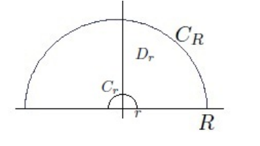

# Exercises: Integrals

## Strategies

:::{.remark}
For guidelines for what techniques to use,
[see this very detailed note](https://math.mit.edu/~jorloff/18.04/notes/topic9.pdf).

Some good computations [here](https://math.mit.edu/~jorloff/18.04/notes/topic9.pdf).

Let $\deg$ denote the $z\dash$adic valuation, so $\deg(p(x)/q(x)) = \deg(p) - \deg(q)$.
A summary of techniques:

- Rational functions in $z$ with $\deg(f) \leq -2$: 
  Semicircle. Always get $\int_\RR f = \sum_{z_0\in \HH} \Res_{z=z_0}f(z)$.

- Rational function in $z$ against a single $\sin$ or $\cos$:
  - Semicircles. Realize $\int_\RR f(z)\cos(z) = \Re\qty{\int_\RR f(z)e^{iz}}$.

- Rational functions in $z$:

  - $f(z) \sim 1/z^{1+\eps}$: semicircular contours.

    
    
    - The relevant theorem: $f(z) \leq {M \over \abs{z}^{1+\eps} }$ for $\abs{z} \gg 0$ implies $\int_{C_R} f \convergesto{R\to\infty} 0$.

  -  $f(z) \sim 1/z$: rectangular contours.

    
    
    - The relevant theorem: $f(z) \leq {M \over \abs{z} }$ for $\abs{z} \gg 0$ implies $\int_{C_R} f(z) e^{i\alpha z} \convergesto{R\to\infty} 0$ where for $\alpha>0$ take $C_R$ to be the left rectangular contour, and $\alpha>0$ take $C_R$ the right.

- Rational functions of $\cos, \sin$:
  - Set
	\[
	2\cos(z) = z + z\inv, \quad 2\sin(z) = z - z\inv, && \dtheta = {\dz\over iz}
	.\] 
	This reduces to a residue count in $\abs{z} \leq 1$.
	
- $f(z) \approx \cos(z), \sin(z), \tan(z), \cdots$: check if $\displaystyle\int f \approx \Re\displaystyle\int (g(e^{iz}))$.

- $\int_\RR f(x)\cos(x) = \Im(f(z)e^{iz})$ or $\int_\RR f(x)\sin x = \Im(f(z)e^{iz})$: use a semicircular contour, then if $f(re^{i\theta})\to 0$ uniformly as $r\to \infty$ for $0<\theta<\pi$, then just picks up the residues in $\HH$.

- $\int_{\RR_{\geq 0}} f(x)x^\alpha$ for $\alpha$ rational with $\abs{\alpha} < 1$ 
  - For $f$ rational with $\deg f\leq -2$, take a keyhole

  

- $\int_{\RR_{\geq 0}} f(x) \log(x)$: indented semicircular contours

:::

## Rational Functions 

:::{.exercise title="$1/(1+x^2)^2$"}
\[
\int_\RR {1 \over (1+x^2)^2} = {\pi \over 2}
.\]

#completed 

:::

:::{.solution}
Use that $f(z) \sim 1/z^4$:

Then 
\[
\int_{C_1 + C_R} f = \int_{C_1} f + \int_{C_R} f = 2\pi i \Res_{z=i} {1\over (1+z^2)^2}
.\]

Note $f$ factors:
\[
f(z) = {1 \over \qty{(z-i)(z+i)}^2 }
,\]
so $z=i$ is a pole of order 2.

Compute the residue within the contour:
\[
\Res_{z=i} f(z) 
= \lim_{z\to i} \dd{}{z} {1\over (z+i)^2}
= - {2 \over (z+i)^3 }\evalfrom_{z=i}
= - {2\over (2i)^3 }
= {1\over 4i} = -{i\over 4}
.\]

Now solve:
\[
2\pi i \qty{- {i\over 4}} = \int_{C_1}f + \int_{C_R} f \da I_R + \int_{C_R}f \implies I_R = {\pi \over 4} - \int_{C_R} f
.\]

Note $I_R \convergesto{R\to \infty} I \da \int_\RR f$, so it suffices to show
the semicircular error term vanishes as $R\to \infty$. 
Parameterize $C_R = \ts{z=R e^{it} \st t\in [0, \pi]}$, so $\abs{z} = R$ on $C_R$.
Letting $z=e^{it}$, $\dz =iR e^{it}\dt$,
\[
\abs{\int_{C_R} f(z) \dz }
&= \abs{\int_{C_R} {1\over (1+z^2)^2} \dz } \\
&\leq \int_{C_R}\abs{ {1\over (1+z^2)^2} } \dz \\
&= \int_{C_R} {1\over \abs{1+z^2}^2 } \dz\\
&\leq \int_{C_R} {1\over \qty{1 - \abs{z}^2 }^2 } \dz \\
&= \int_{C_R} {1\over \qty{1 - R^2 }^2 } \dz \\
&= {1\over \qty{1 - R^2 }^2 } \int_{C_R} \dz\\
&= {1\over \qty{1 - R^2 }^2 } \cdot \length(C_R) \\
&= {1\over \qty{1 - R^2 }^2 } \cdot \qty{1\over 2}2\pi R \\
&= {\pi R \over R^4 + O(R^3)} \\
&= \pi\qty{ 1 \over R^3 + O(R^2)} \\
&\convergesto{R\to\infty} 0
,\]
where we've used a variant of the triangle inequality:
\[
\abs{a\pm b} \geq \abs{ \abs{a} - \abs{b} } \implies {1\over \abs{a \pm b}} \leq {1\over \abs{a} - \abs{b} }
.\]

:::

:::{.solution title="Older solution"}
\envlist

- Factor $(1+z^2)^2 = ((z-i)(z+i))^2$, so $f$ has poles at $\pm i$ of order 2.
- Take a semicircular contour $\gamma \da I_R \union D_R$, then $f(z) \approx 1/z^4 \to 0$ for large $R$ and $\int_{D_R} f \to 0$.
- Note $\int_{I_R} f \to \int_\RR f$, so $\int_\gamma f \to \int_\RR f$.
- $\int_\gamma f = 2\pi i \sum_{z_0} \Res_{z=z_0} f$, and $z_0 = i$ is the only pole in this region.
- Compute
\[
\Res_{z=i} f 
&= \lim_{z\to i} {1\over (2-1)!} \dd{}{z} (z-i)^2 f(z) \\
&= \lim_{z\to i} \dd{}{z} {1\over (z+i)^2 } \\
&= \lim_{z\to i} {-2 \over (z+i)^3 } \\
&= -{2 \over (2i)^3 } \\
&= {1\over 4i} \\ \\
\implies
\int_\gamma f &= {2\pi i \over 4i} = \pi/2
,\]

:::

:::{.exercise title="$1/x^4+1$"}

#work

\[
\int_\RR {1 \over x^4 + 1} = {\pi \sqrt{2} \over 2}
.\]
:::

:::{.solution}

:::

:::{.exercise title="$1/(1+x^2)^{n+1}"}

\[
\int_{-\infty}^{\infty} \frac{d x}{\left(1+x^{2}\right)^{n+1}}=\frac{(2 n) !}{4^{n}(n !)^{2}} \pi
.\]

:::

## Trig in Numerator

:::{.exercise title="$\cos(x) / x^2 + b^2$"}
#work
\[
\int_{0}^{\infty} \frac{\cos (x)}{x^{2}+b^{2}} d x=\frac{\pi \mathrm{e}^{-b}}{2 b}
.\]
:::

:::{.solution}
Extend to $\int_\RR$ using that $f$ is even.

:::

## Trig in Denominator

:::{.exercise title="$1/1+a^2+\cos(\theta)$"}
#work
\[
\int_{0}^{2 \pi} \frac{d \theta}{1+a^{2}-2 a \cos (\theta)}
= \begin{cases}\frac{2 \pi}{a^{2}-1} & \text { if }|a|>1 \\ \frac{2 \pi}{1-a^{2}} & \text { if }|a|<1\end{cases}
.\]
:::

:::{.solution}
Write $2\cos(z) = z + z\inv$ on $S^1$ to get
\[
=\int_{|z|=1} \frac{1}{i\left(\left(1+a^{2}\right) z-a\left(z^{2}+1\right)\right)} d z
.\]

:::

:::{.exercise title="$1/a+b\cos(\theta)$"}
\[
\int_{0}^{2 \pi} \frac{d \theta}{a+b \cos \theta}=\frac{2 \pi}{\sqrt{a^{2}-b^{2}}}
.\]
:::

## Branch Cuts

:::{.exercise title="Keyhole contour and ML estimate: $\log(x) / (1+x^2)^2$"}
Compute
\[
\int_{[0, \infty]} {\log(x) \over (1+x^2)^2}\dx 
.\]
:::

:::{.solution}
Factor $(1+z^2)^2 = (z+i^2(z-i)^2$.
Take a keyhole contour similar to the following:

Show that outer radius $R$ and inner radius $\rho$ circles contribute zero in the limit by the ML estimate?
Compute the residues by just applying the formula and manually computing derivatives:
\[
\Res_{z= \pm i} f(z) 
&= \lim_{z\to \pm i} \dd{}{z} {\log^2(z) \over (z\pm i)^2} \\
&= \lim_{z\to \pm i} {2\log(z) (z\pm i)^2 - 2(z\pm i)^2 \log^2(z) \over \qty{(z\pm i )^2}^2} \\
&= {
2\log(\pm i)(\pm 2i)^2 - 2(\pm 2i)^2 \log^2(\pm i)
\over {\qty{\pm 2i}}^4 } \\
&=_? {\pi \over 4}\pm {i\pi^2 \over 16}
.\]

> See p.4: <http://www.math.toronto.edu/mnica/complex1.pdf>

:::

:::{.exercise title="$\log(x) / x^2+a^2$"}
\[
\int_0^\infty {\log(x) \over x^2+a^2}\dx &= {\pi\log(a)\over 2a} && a>0
.\]
:::

:::{.exercise title="$x^? / 1+x^2$"}
\[
\int_0^\infty {x^{1\over 3} \over 1 + x^2} \dx = {\pi \over \sqrt 3}
.\]
:::

:::{.solution}

:::

:::{.exercise title="$1/x\sqrt{x^2-1}"}
\[
\int_{1}^{\infty} \frac{d x}{x \sqrt{x^{2}-1}} = {\pi \over 2}
.\]
:::

:::{.solution}

:::

## Misc 

