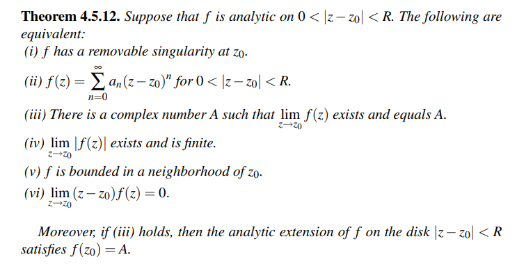

# Zeros and Singularities

:::{.remark}
On notation: for an analytic function $f$ expanded as a power series about $a$, write $v_a(f)$ as the $a\dash$adic valuation of $f$: expanding $f(z) = \sum_{k\in \ZZ} a_k (z-a)^k$ about $a$, define $v_a(f) = n$ iff $a_n\neq 0$ but $a_{\leq n} = 0$.
:::

:::{.definition title="Singularity"}
A point $z_0$ is an **isolated singularity** if $f(z_0)$ is undefined but $f(z)$ is defined in a punctured neighborhood $D(z_0)\sm\ts{z_0}$ of $z_0$.

There are three types of isolated singularities:

- Removable singularities, so $v_a(f) \in [0, \infty)$
- Poles, so $v_a(f) \in (-\infty, 0)$
- Essential singularities, so $v_a(f) = -\infty$, e.g. $\sin(z\inv )$ at $z=0$.
:::

:::{.definition title="Removable Singularities"}
If $z_0$ is a singularity of $f$. then $z_0$ is a **removable singularity** iff
there exists a holomorphic function $g$ such that $f(z) = g(z)$ in a punctured neighborhood of $z_0$.
Equivalently,
\[
\lim_{z\to z_0}(z-z_0) f(z) = 0
.\]
Equivalently, $f$ is bounded on a neighborhood of $z_0$.
Equivalently, $v_{z_0}(f) \geq 0$

:::

:::{.remark}
Singularities can be classified by Laurent expansions $f(z) = \sum_{k\in \ZZ} c_k z^k$:

- Essential singularity: infinitely many negative terms.
- Pole of order $N$: truncated at $k = -N$, so $c_{N-\ell} = 0$ for all $\ell$.
- Removable singularity: truncated at $k=0$, so $c_{\leq -1} = 0$.
:::

:::{.example title="Removable singularities"}
\envlist

- $f(z) \da \sin(z)/z$ has a removable singularity at $z=0$, and one can redefine $f(0) \da 1$.
- If $f(z) = p(z)/q(z)$ with $q(z_0)=0$ and $p(z_0)=0$, then $z_0$ is removable with $f(z_0)\da p'(z_0)/q'(z_0)$.
:::

:::{.example title="Essential singularities"}
$f(z) \da e^{1/z}$ has an essential singularity at $z=0$, since we can expand and pick up infinitely many negative terms:
\[
e^{1/z} = 1 + {1\over z} + {1\over 2! z^2} + \cdots
.\]
In fact there exists a neighborhood of zero such that $f(U) = \CC\smz$.
Similarly $g(z) \da \sin\qty{1\over z}$ has an essential singularity at $z=0$, and there is a neighborhood $V$ of zero such that $g(V) = \CC$.
:::

:::{.example title="?"}
The singularities of a rational function are always isolated, since there are finitely many zeros of any polynomial.
The function $F(z) \da \Log(z)$ has a singularity at $z=0$ that is **not** isolated, since every neighborhood intersects the branch cut $(-\infty, 0) \cross \ts{ 0 }$, where $F$ is not even defined.
The function $G(z) \da 1/\sin(\pi/z)$ has a non-isolated singularity at 0 and isolated singularities at $1/n$ for all $n$.
:::

:::{.warnings}
$f(z) \da z^{1\over 2}$ has a singularity at zero that does not fall under this classification -- the point $z=0$ is a **branch singularity** and $f$ admits no Laurent expansion around $z=0$.

A similar example: $\qty{z(z-1)}^{1\over 2}$ has two branch singularities at $z=0, 1$.
:::

:::{.theorem title="Extension over removable singularities"}
If $f$ is holomorphic on $\Omega\sm\ts{z_0}$ where $z_0$ is a removable singularity, then there is a unique holomorphic extension of $f$ to all of $\Omega$.
:::

:::{.proof title="?"}
Take $\gamma$ to be a circle centered at $z_0$ and use
\[
f(z) \da \int_\gamma { f(\xi) \over \xi - z} \dx
.\]
This is valid for $z\neq z_0$, but the right-hand side is analytic. (?)
:::

\todo[inline]{Revisit}

:::{.theorem title="Improved Taylor Remainder Theorem"}
If $f$ is analytic on a region $\Omega$ containing $z_0$, then $f$ can be written as
\[
f(z)
=\left(\sum_{k=0}^{n-1} \frac{f^{(k)}\left(z_{0}\right)}{k !}\left(z-z_{0}\right)^{k}\right)+ 
R_{n}(z)\left(z-z_{0}\right)^{n}
,\]
where $R_n$ is analytic.
:::

:::{.proposition title="Orders of zeros"}
A **zero** of an analytic function on a domain $\Omega$ is any $z_0$ such that $f(z_0)=0$, with no further conditions.
If $f$ is analytic and not identically zero on $\Omega$ with $f(z_0) = 0$, then there exists a  neighborhood $U\ni z_0$ and function $g$ that is holomorphic and nonvanishing on $U$ such that 
\[
f(z) = (z-z_0)^n g(z)
.\]
We refer to $z_0$ as a **zero of order $n$**.
:::

:::{.remark}
On terminology: if the order of $z_0$ for $f$ is $n$, we say $f$ **vanishes to order $n$**.
:::

:::{.proof title="of existence and uniqueness of order"}
Use that $\Omega$ is connected to find some neighborhood $U$ on which $f$ is not identically zero.
WLOG assume $z_0=0$. Expand $f$ as an honest power series at $z_0$ to write
\[
f(z) = \sum_{k\geq 0}c_k z^k = z^n\qty{c_n + c_{n+1}z + \cdots} \da z^n g(z)
,\]
where $a_n$ is the minimal nonvanishing coefficient.
Since $a_n\neq 0$, we have $\lim_{z\to z_0} g(z) = a_n \neq 0$, so $g$ is nonvanishing in some neighborhood of $z_0$.
Uniqueness follows from writing 
\[
z^n g(z) = z^m h(z) \implies g(z) = z^{m-n} h(z) 
,\]
assuming $m>n$, but then taking $z\to z_0 =0$ on the RHS yields $g(z) = 0$, a contradiction.
:::

:::{.definition title="Poles (and associated terminology)"}
A *pole* $z_0$ of a function $f(z)$ is a zero of $g(z) \definedas {1\over f(z)}$ where $g$ is holomorphic in some neighborhood of $z_0$.
Equivalently, $\lim_{z\to z_0} f(z) = \infty$.
:::

:::{.proposition title="?"}
In this case there exists a minimal $n$ and a holomorphic $h$ such that
\[  
f(z) = \qty{z-z_0}^{-n} h(z)
.\]
Such an $n$ is the *order* of the pole.
A pole of order 1 is said to be a *simple pole*.
:::

:::{.proof title="?"}
Use that $z_0$ is a zero of $1/f$ to write
\[
{1\over f(z) } = (z-z_0)^n g(z)
,\]
for $h$ holomorphic and nonvanishing in a neighborhood of $z_0$.
Taking reciprocals yields
\[
f(z) = (z-z_0)^{-n} h(z) && \quad h(z) \da {1\over g(z)}
.\]

:::

:::{.example title="Of using this characterization"}
Claim: if $f$ has a pole of order $m$ at $z_0$, then $g(z) \da f(z^2)$ has a pole of order $2m$ at $z_0$.
WLOG assume $z_0=0$.
Note that this is clear by multiplying Laurent expansions about $z_0$:
\[
f(z) = \sum_{k\geq -m} c_k z^k \implies g(z) = \sum_{k\geq -m} c_k z^{2k} 
= {c_{-m} \over z^{2m}} + \cdots
.\]
Using the other characterization, write $f(z) = z^{-m} h(z)$ with $g$ holomorphic and nonzero in a neighborhood $U$ of $z_0$, so in particular $h(0) \neq 0$.
Then $f(z^2) = z^{-2m} h(z^z)$ and $h(z^2)\mid_{z=0} = h(0) \neq 0$.
:::

:::{.definition title="Principal Part and Residue"}
If $f$ has a pole of order $n$ at $z_0$, then there exist a holomorphic $G$ in a neighborhood of $z_0$ such that
\[
f(z) = {a_{-n} \over (z-z_0)^n } + \cdots + {a_{-1} \over z-z_0} + G(z) \da P(z) + G(z)
.\]

The term $P(z)$ is referred to as the *principal part of $f$ at $z_0$* consists of terms with negative degree, and the *residue* of $f$ at $z_0$ is the coefficient $a_{-1}$.
:::

:::{.definition title="Essential Singularity"}
A singularity $z_0$ is *essential* iff it is neither removable nor a pole.
Equivalently, a Laurent series expansion about $z_0$ has a principal part with infinitely many terms.
:::

:::{.theorem title="Casorati-Weierstrass" ref="Casorati"}
If $f$ is holomorphic on $\Omega\setminus\theset{z_0}$ where $z_0$ is an essential singularity, then for every $V\subset \Omega\setminus\theset{z_0}$, $f(V)$ is dense in $\CC$.
:::

:::{.slogan}
The image of a punctured disc at an essential singularity is dense in $\CC$.
:::

:::{.proof title="of Casorati-Weierstrass"}
Pick $w\in \CC$ and suppose toward a contradiction that $D_R(w) \intersect f(V)$ is empty.
Consider
\[
g(z) \da {1\over f(z) - w}
,\]
and use that it's bounded to conclude that $z_0$ is either removable or a pole for $f$.
:::

:::{.definition title="Singularities at infinity"}
For any $f$ holomorphic on an unbounded region, we say $z=\infty$ is a singularity (of any of the above types) of $f$ if $g(z) \da f(1/z)$ has a corresponding singularity at $z=0$.
:::

:::{.definition title="Meromorphic"}
A function $f:\Omega\to\CC$ is *meromorphic* iff there exists a sequence $\theset{z_n}$ such that

- $\theset{z_n}$ has no limit points in $\Omega$.
- $f$ is holomorphic in $\Omega\setminus\theset{z_n}$.
- $f$ has poles at the points $\theset{z_n}$.

Equivalently, $f$ is holomorphic on $\Omega$ with a discrete set of points delete which are all poles of $f$.
:::

:::{.theorem title="Meromorphic implies rational"}
Meromorphic functions on $\CC$ are rational functions.
:::

:::{.proof title="?"}
Consider $f(z) - P(z)$, subtracting off the principal part at each pole $z_0$, to get a bounded entire function and apply Liouville.
:::

:::{.theorem title="Riemann Extension Theorem"}
A singularity of a holomorphic function is removable if and only if the function is bounded in some punctured neighborhood of the singular point.
:::

## Exercises

:::{.problem title="?"}
Show that $\sin(z)/z$ has no poles.
:::

:::{.solution}
Heuristic: $\sin(z)$ has a zero of order 1, so the $z$ in the denominator exactly cancels it.
Explicitly, this is evident from the Laurent expansion about zero:
\[
z\inv \sin(z) = z\inv\qty{ z - {z^3 \over 3!} + {z^5\over 5!} - \cdots} = 1 - {z^2\over 3!} + {z^4 \over 5!} - \cdots
,\]
which has no factors of $z^{-k}$.
So $z=0$ is a removable singularity.
:::

:::{.problem title="?"}
Classify the singularities at $z=0$ of the following
\[
f_1(z) &= {\Log(1+z) \sin(z) \over z^2} \\
f_2(z) &= e^{\sin\qty{1\over z}} \\
f_3(z) &= {1+z \over e^z-1}
.\]
:::

:::{.solution}
$f_1$: removable, evident from Laurent expansion at $z=0$:
\[
z^{-2}\Log(1+z)\sin(z) 
&= z\inv \qty{ \sum_{k\geq 1} { (-z)^k \over k} }
\qty{z - { z^3 \over 3!} + { z^5 \over 5!} - \cdots} \\
&= z^{-2}
\qty{ -z+ { z^2 \over 2}  - { z^3 \over 3} + \cdots}
\qty{z - { z^3 \over 3!} + { z^5 \over 5!} - \cdots} \\
&= z^{-2}\qty{ z^2(-1) + z^3\qty{1\over 2} + z^2\qty{ -{ 1 \over 3!} - { 1 \over 3} } + \cdots } \\
&= 1 + {z \over 2} + \cdots
.\]

$f_2$: essential, evident from a sequence like $z_k \da \qty{k\cdot {\pi\over 2} }\inv$ which makes $\sin(z_k)$ oscillate between 0 and 1.

$f_3$: pole of order 1 with residue 1, evident after some slightly clever Laurent manipulations:
\[
{1\over e^z-1} 
&= {1 \over z + {1\over 2}z^2 + \cdots} \\
&= {1 \over z\qty{1 + {1\over 2}z + \cdots} } \\
&\da {1\over z \qty{1 + p(z)}} && p(z) \da {1\over 2} z + {1\over 3!}z^2 + \cdots \\
&= z\inv \sum_{k\geq 0}(-p(z))^k z^k \\
&= z\inv \qty{1 - zp(z) + z^2p(z)^2 - z^3p(z)^3 + \bigo(z^4)} \\
&= z\inv\qty{1- \bigo(z^2) + \bigo(z^4) - \bigo(z^6) } \\
&={1\over z} - \bigo(z) + \bigo(z^3)
.\]

:::

:::{.problem title="?"}
Characterize all entire functions with a pole of order $m$ at $\infty$.
:::

:::{.solution}
Since $f$ is entire, $f(z) = \sum_{k\geq 0 } c_k z^k$.
Expanding about $z_0=\infty$, we have $f(1/z) = \sum_{k\geq 0} c_k z^{-k} = c_0 + {c_1\over z} + \cdots$.
If $z_0=\infty$ is a pole of order $m$, then $c_m\neq 0$ but $c_{>m} = 0$, which forces $f(z) = \sum_{0\leq k \leq m} c_k z^k$ to be a polynomial of degree $m$.
:::

:::{.problem title="?"}
Determine the order of the pole of 

- ${1\over z\sin(z)}$ at $z_0 = 0$.
- ${e^{z^2}-1\over z^4}$ at $z_0=0$
:::

:::{.solution}
- Order 2:
\[
\lim_{z\to 0}z^0 f(z) &= \infty\\
\lim_{z\to 0}z^1 f(z) &= \infty\\
\lim_{z\to 0}z^2 f(z) &= 1 \neq 0 
,\]
using that $z/\sin(z) \convergesto{z\to 0} 1$.

- Order 2: apply L'Hopital as necessary
\[
\lim_{z\to 0}z^0 f(z) &= \infty\\
\lim_{z\to 0}z^1 f(z) &= \infty\\
\lim_{z\to 0}z^2 f(z) &= 1 \neq 0 
.\]
  Alternatively, take the Laurent expansion:
  \[
  f(z) 
  &= z^{-4}(1 + z^2 + {1\over 2!} (z^2)^2 + {1\over 3!} (z^2)^3 + \bigo(z^4) - 1) \\
  &= z^{-2} + {1\over 2!} + {1\over 3!} z^2 + \bigo(z^4)
  .\]

:::

:::{.problem title="?"}
Fix $a\in \CC\union\ts{\infty}$ and let $f(z) \da e^{1\over z^2}$.
Find a sequence $z_k\to 0$ such that $f(z_k) \convergesto{k\to\infty} a$

:::

:::{.solution}
\envlist

- For $a\in \RR_{< 0}$: take $z_k\da {1\over \Log(a) + 2\pi i k - {\pi i \over 2}}$  
  Then $f(z_k) = a$ for all $k$ but $z_k\to 0$.
- For $a=0$: take $z_k = -1/k$.
- For $a=\infty$, take $z_k = 1/k$.
- For anything else, take $z_k \da {1\over \Log(a) + 2\pi i n}$ if $a \in \RR_{\geq 0}$.
  Again $f(z_k) = a$ for all $k$ but $z_k\to 0$.
  
:::

