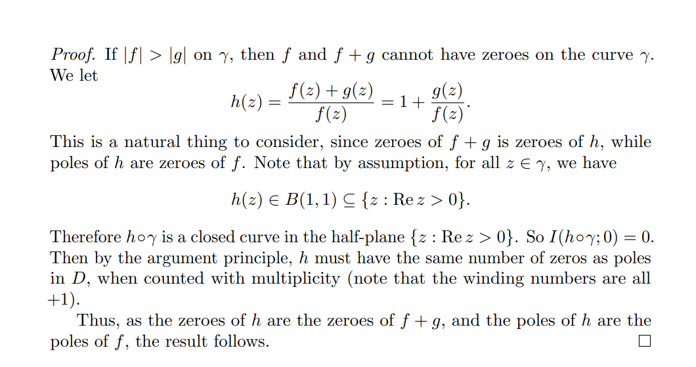

# Rouché 

:::{.theorem title="Rouché's Theorem" ref="Rouche"}
Let $f, g$ be meromorphic on $\Omega$ and write $Z_f, Z_g, P_f, P_g$ for the numbers of zeros and poles of $f$ and $g$ respectively.
Suppose $\gamma \subseteq \Omega$ is a toy contour winding about each zero and pole of $f$ and $g$ precisely once.
Then
\[
\abs{g} \leq \abs{f} \text{ on } \gamma \implies \Index_{z=0}(f\circ \gamma)(z) 
&= \Index_{z=0}((f+g)\circ \gamma)(z) \\
\implies Z_f - P_f 
&= Z_{f+g} - P_{f+g}
.\]
In particular, if $f, g$ are *holomorphic* on $\Omega$, then $f$ and $f+g$ have the same number of zeros in $\Omega$, i.e. $Z_f = Z_{f+g}$.

Some alternative formulations:

- Bounding a difference: given $f$, find a big part $g$, then
\[
\abs{f-g} \leq \abs{g}
\text{ on }\bd\Omega \implies Z_f = Z_g
.\]

:::

:::{.slogan}
You can add a small perturbation $g$ to $f$ and preserve the number of zeros, where "small" means $\abs{g} < \abs{f}$ on the boundary.
:::

:::{.slogan}
The number of zeros/poles are determined by a dominating function on the boundary.
:::

:::{.remark}
On strategy: write your function as big + small, where big $>$ small on the boundary and it's clear how many zeros big has inside. 
:::

:::{.proof title="of Rouché"}
Idea: use argument principle on $(f+g)/f$.
Alternatively, use that $N(f+tg, \Omega)$ is a continuous $\ZZ\dash$valued function for all $t\in [0, 1]$.

:::

:::{.proof title="of Rouché, alternative"}

:::

# Exercises

:::{.exercise title="Number of zeros of a standard polynomial in $\mathbb{D}$"}
Find the number of zeros in $\abs{z} < 1$ of
\[
p(z) \da z^6 + 9z^4 + z^3 + 2z + 4
.\]

#completed

:::

:::{.solution}
Strategy: bound the difference.
Find the big and small term:

- Big: $f(z) = 9z^4$, so $\abs{f(z)} = 9$ on the boundary
- Small: $g(z) = p(z) - f(z) = z^6 + z^3 + 2z + 4$, so $\abs{g(z)}\leq 1+1+2+4=8$ on the boundary.
So $\abs{f-g} \leq \abs{g}$ on $\abs{z} = 2$, meaning $Z_f = Z_g = 4$.

:::

:::{.exercise title="Number of zeros of an arbitrary polynomial in $R\mathbb{D}$"}
Show that if $p(z) \da z^d + a_1z^{d-1} + \cdots + a_d$ and $\abs{a_k}\leq {R^k \over d}$ for every $k$, then $p$ has $d$ zeros in $\abs{z} < R$.
:::

:::{.solution}
Strategy: bound the difference.
Find the big and small term:

- Big: $g(z) = z^d$, so $\abs{g} = R^d$ on $\abs{z} = R$
- Small: $f(z) = p(z) - g(z) = a_1 z^{d-1} + \cdots + a_d$, so
\[
\abs{f(z)} 
&\leq \abs{a_1} R^{d-1} + \abs{a_2} R^{d-2} + \cdots + \abs{a_d} \\
&\leq {R\over d} \cdot R^{d-1} + {R^2 \over d} \cdot R^{d-2} + \cdots + {R^{d-1} \over d} \cdot R + {R^{d} \over d}
.\]

#work

:::

:::{.exercise title="?"}
Show that $h(z) =z^5 + 3z + 1$ has 5 zeros in $\abs z \leq 2$.

#completed
:::

:::{.solution}
Write $h(z) = f(z) + g(z)$ where $f(z) = z^5$ and $g(z) = 3z+1$.
Then $\size Z(f) = 5$ and on $\abs{z} = 2$,
\[
\abs{f(z)} &= \abs{z}^5 = 32 \\
\abs{g(z)} &= \abs{3z+1} \leq 3\abs{z} +1 = 7 < \abs{f(z)} \\
,\]
so $f$ and $f+g \da h$ have the same number of zeros: 5.
:::

:::{.exercise title="?"}
Show that $h(z) = z + 3 + 2e^z$ has one root in $\ts{ \Re(z) \leq 0}$.
:::

:::{.solution}
Use the following contour:

Take $g(z) \da 2e^z < f(z) \da f(z) \da z+3$.
:::

:::{.exercise title="?"}
Show that $P(z) \da z^4 + 6z + 3$ has 3 zeros in $\ts{1\leq \abs{z} \leq 2}$.

#completed
:::

:::{.solution}
\envlist

- Take $P(z) = z^4 + 6z + 3$.
- On $\abs{z} < 2$:
  - Set $f(z) = z^4$ and $g(z) = 6z + 3$, then $\abs{g(z)} \leq 6\abs{z} + 3 = 15 < 16= \abs{f(z)}$.
  - So $P$ has 4 zeros here.
- On $\abs{z} < 1$:
  - Set $f(z) = 6z$ and $g(z) = z^4 + 3$.
  - Check $\abs{g(z)} \leq \abs{z}^4 + 3 = 4 < 6 = \abs{f(z)}$.
  - So $P$ has 1 zero here.
:::

:::{.exercise title="?"}
Show that $\alpha z e^z = 1$ where $\abs{\alpha} > e$ has exactly one solution in $\DD$.

#completed

:::

:::{.solution}
\envlist 

- Set $f(z) = \alpha z$ and $g(z) = e^{-z}$.
- Estimate at $\abs{z} =1$ we have $\abs{g} =\abs{e^{-z}} = e^{-\Re(z)} \leq e^1 < \abs{\alpha} = \abs{f(z)}$
- $f$ has one zero at $z_0 = 0$, thus so does $f+g$.
:::
