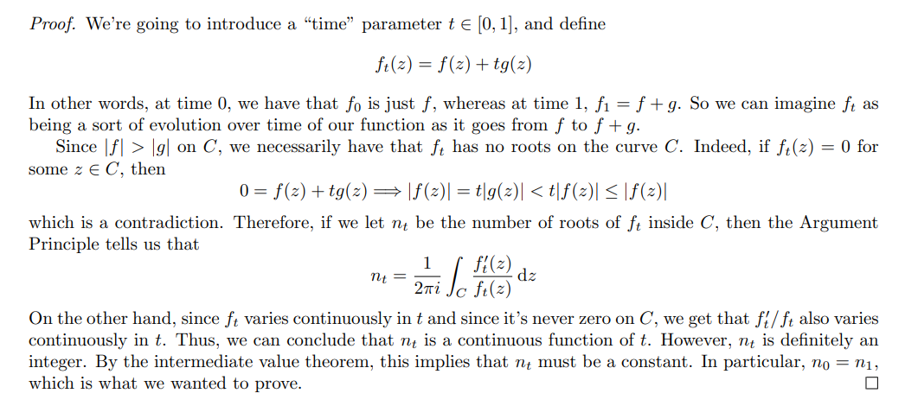

# Rouché 

Idea: use argument principle on $(f+g)/f$.

:::{.theorem title="Rouché's Theorem" ref="Rouche"}
If

- $f, g$ are meromorphic on $\Omega$
- $\gamma \subset \Omega$ is a toy contour winding about each zero/pole of $f, g$ exactly once,
- $\abs{g} < \abs{f}$ on $\gamma$

then
\[
\Ind_{z=0}(f\circ \gamma)(z) = \Ind_{z=0}((f+g)\circ \gamma)(z) \\
\implies Z_f - P_f = Z_{f+g} - P_{f+g}
.\]
In particular, if $f, g$ are holomorphic, they have the same number of zeros in $\Omega$.

:::

:::{.slogan}
The number of zeros/poles are determined by a dominating function.
:::

:::{.proof title="of Rouché"}

:::

:::{.proof title="of Rouché, alternative"}

:::

:::{.remark}

:::

:::{.example title="?"}

:::

# Exercises

:::{.exercise title="?"}
Show that $h(z) =z^5 + 3z + 1$ has 5 zeros in $\abs z \leq 2$.

#completed
:::

:::{.solution}
Write $h(z) = f(z) + g(z)$ where $f(z) = z^5$ and $g(z) = 3z+1$.
Then $\size Z(f) = 5$ and on $\abs{z} = 2$,
\[
\abs{f(z)} &= \abs{z}^5 = 32 \\
\abs{g(z)} &= \abs{3z+1} \leq 3\abs{z} +1 = 7 < \abs{f(z)} \\
,\]
so $f$ and $f+g \da h$ have the same number of zeros: 5.
:::

:::{.exercise title="?"}
Show that $h(z) = z + 3 + 2e^z$ has one root in $\ts{ \Re(z) \leq 0}$.
:::

:::{.solution}
Use the following contour:

Take $g(z) \da 2e^z < f(z) \da f(z) \da z+3$.
:::

:::{.exercise title="?"}
Show that $P(z) \da z^4 + 6z + 3$ has 3 zeros in $\ts{1\leq \abs{z} \leq 2}$.

#completed
:::

:::{.solution}
\envlist

- Take $P(z) = z^4 + 6z + 3$.
- On $\abs{z} < 2$:
  - Set $f(z) = z^4$ and $g(z) = 6z + 3$, then $\abs{g(z)} \leq 6\abs{z} + 3 = 15 < 16= \abs{f(z)}$.
  - So $P$ has 4 zeros here.
- On $\abs{z} < 1$:
  - Set $f(z) = 6z$ and $g(z) = z^4 + 3$.
  - Check $\abs{g(z)} \leq \abs{z}^4 + 3 = 4 < 6 = \abs{f(z)}$.
  - So $P$ has 1 zero here.
:::

:::{.exercise title="?"}
Show that $\alpha z e^z = 1$ where $\abs{\alpha} > e$ has exactly one solution in $\DD$.

#completed

:::

:::{.solution}
\envlist 

- Set $f(z) = \alpha z$ and $g(z) = e^{-z}$.
- Estimate at $\abs{z} =1$ we have $\abs{g} =\abs{e^{-z}} = e^{-\Re(z)} \leq e^1 < \abs{\alpha} = \abs{f(z)}$
- $f$ has one zero at $z_0 = 0$, thus so does $f+g$.
:::
