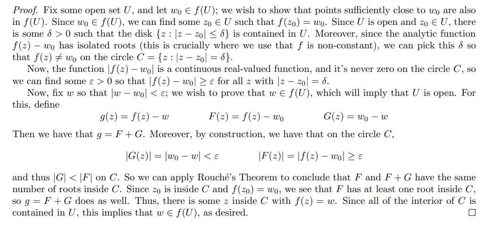
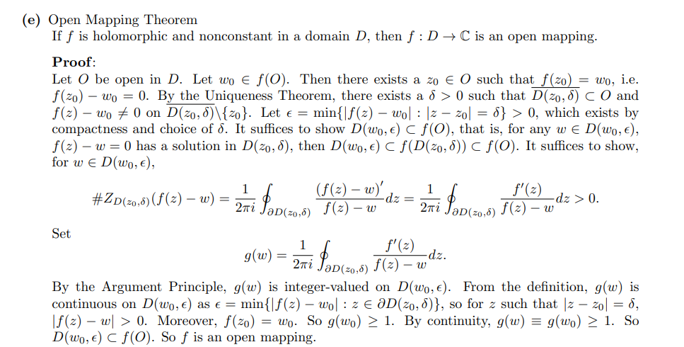

Idea: maximum modulus plus Rouche.

# Open Mapping Theorem

:::{.corollary title="Open Mapping"}
Any holomorphic non-constant map is an open map.
:::

:::{.proof title="?"}

:::

:::{.proof title="Alternative"}

:::

