# Standard Examples: Conformal Maps

:::{.remark}
A summary:

- $z\mapsto -z$ is a reflection about $y=x$, so for example sends $\HH \to Q_{34}$ and $\DD \intersect \HH \to \DD \intersect Q_{34}$ and vice-versa.
- $z\mapsto 1/z$: write as $Re^{it} \mapsto R\inv e^{-it}$, which is reflection about $\RR$ and inversion through $S^1$.
- $\DD\to \DD$:  $\lambda {z-a\over 1-\bar{a}z}$ for rotations $\lambda \in S^1$ 
- $\HH\to \DD$: the Cayley map $z\mapsto {z-i\over z+i}$
- Horizontal strips to $\HH$: use $z\mapsto e^z$ for $0<\Im(z) < \pi \to \HH$
	-   These send $\ts{\Im(z) \in (-\pi, \pi) }\too \CC\sm\RR_{\leq 0}$.
- Sectors to $\HH$: for $0<\Arg(z) < {\pi \over n}$, use $z\mapsto z^{n}$ to get $\HH$.
	- Some variants:
		- Unfolding a half-plane: 
		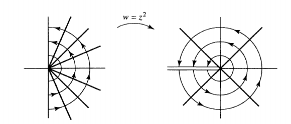
		Generally, $$\ts{\Arg(z) \in (-\theta_0, \theta_0) } \mapsvia{z^a} \ts{\Arg(z) \in (-a\theta_0, a\theta_0) }$$
		- Unfolding a symmetric sector:
		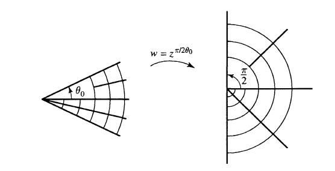

		  $$z\mapsto z^{\pi \over 2\theta_0}: \ts{\Arg(z) \in (-\theta_0, \theta_0)}\to \ts{\Arg(z) \in (-\pi/2, \pi/ 2)}.$$

- Half-discs to planes: the Joukowski maps $z\mapsto z+z\inv$
- Bigons/lunar domains: map the intersection points $z_0\to 0, z_1\to\infty$ to get strips.
	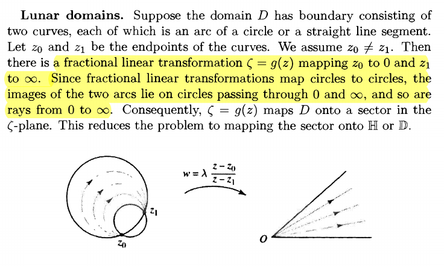

Some tips:

- A computational shortcut: $z\inv = {\bar{z}\over \abs{z}^2}$. 
  Use this to quickly compute images, e.g. for $\abs{z-1} = 1$ under $f(z) = 1/z$, write $f(1+i)={1\over 1+i} = {1-i \over 2}$.
- The locus of points equidistant to two fixed points is the perpendicular bisector.
- Seems obvious, but *use* that conformal maps preserve angles.
  You can use tangent vectors to reason about angles of intersection (even at $z=\infty$).
  E.g. Since $\abs{z-i}=1$ intersects $\RR$ in a parallel way, since the tangent vectors at zero will line up.
  So any conformal map must send them to parallel lines or circles with intersection angle zero.
  - Similarly if two circles intersect orthogonally, they must go to orthogonal lines or a line orthogonally intersecting a circle.
- $z\mapsto 1/z$ corresponds to a rotation of $\CP^1$ around the $x\dash$axis by $\pi$. 

:::

# The Big 9 Conformal Maps

## $\HH$ and $\DD$

:::{.proposition title="Half-plane to Disc (Cayley Transform, very important)"}
\[
\Psi: \HH&\mapstofrom \DD \\
z &\mapsto {z-i \over z+i} \\
i \qty{1+w \over 1-w} &\mapsfrom w
.\]

Mnemonic: every $z\in \HH$ is closer to $i$ than $-i$.
This restricts to a map
\[
\Psi: Q_1 &\mapstofrom \DD \intersect \HH
.\]

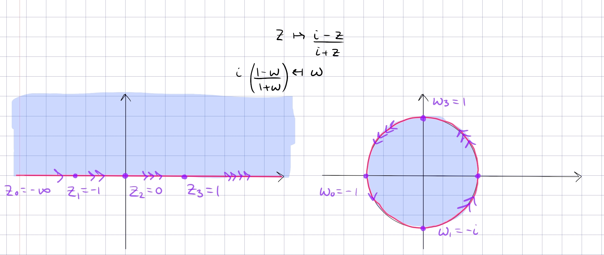

:::

:::{.proposition title="Disc to right half-plane"}
\[
F: \DD &\mapsto Q_{12} \da \ts{\Re(z) > 0} \\
z &\mapsto {1+z \over 1-z} \\
{w-1\over w+1} &\mapsfrom w
.\]

This satisfies 
\[
\tv{-1, 0, 1} \mapsto \tv{0, 1, \infty}
.\]

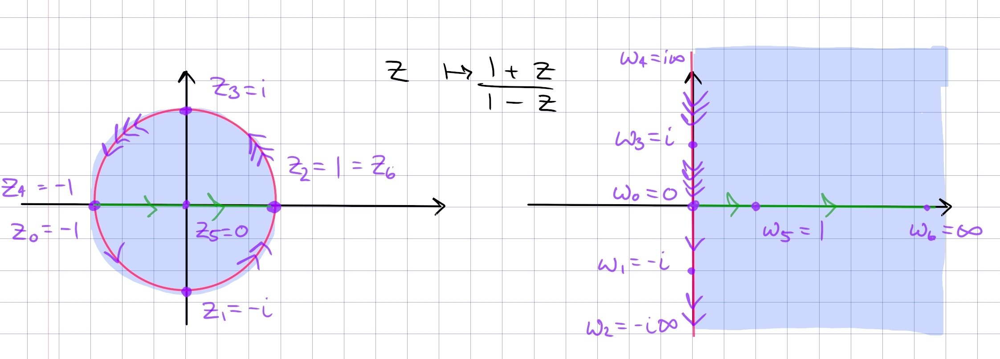

Note that $\Psi$ inverse from above can be recovered by post-composing with a rotation by $\pi/2$:
\[
\Psi\inv(z) = i\qty{1+z\over1-z} = i \cdot F(z) && \DD \mapsvia{F} Q_{12} \mapsvia{\cdot i} \HH
,\]
and up to a negative sign, we can recover $\Psi$ by recomposition with a rotation by $-\pi/2$:
\[
F(-iz) = {1+ iz \over 1-iz} = {-i + z \over -i-z} = -{z-i\over z+i} = -\Psi(z) && \HH \mapsvia{\cdot -i} Q_{12} \mapsvia{F} \DD
.\]

This restricts to a map $F: \DD \intersect \HH\to Q_1$:

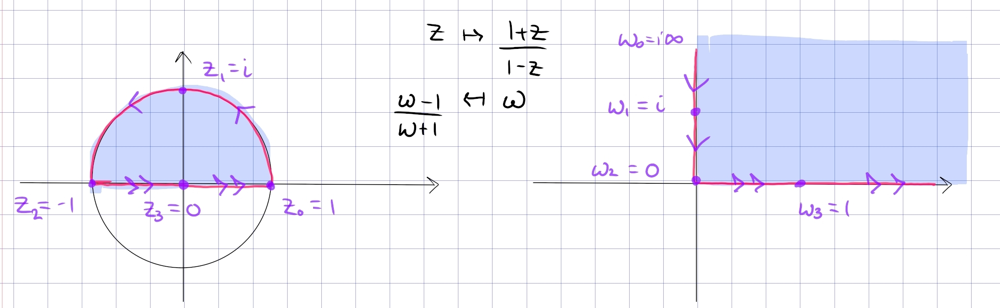

- Why this lands in the first quadrant: 
  - Use that squares are non-negative and $z=x+iy\in \DD \implies x^2 + y^2 < 1$:
\[
f(z)=\frac{1-\left(x^{2}+y^{2}\right)}{(1-x)^{2}+y^{2}}+i \frac{2 y}{(1-x)^{2}+y^{2}}
.\]
- Why the inverse lands in the unit disc:
  - For $w$ in Q1, the distance from $w$ to 1 is smaller than from $w$ to $-1$.
  - Check that if $w=u+iv$ where $u, v>0$, the imaginary part of the image is positive:

\[
{w-1 \over w+1} 
&= { (w-1) \bar{(w+1)} \over \abs{w+1}^2}\\
&={ \qty{u-1 + iv} \qty{u+1-iv} \over (u+1)^2 + v^2 } \\
&= {u^2 + v^2 + 1 \over (u+1)^2 + v^2}
+ i\qty{ 2v \over (u+1)^2 + v^2}
.\]

**Boundary behavior**:

- On the upper half circle \( \ts{ e^{it } \st t\in (0, \pi)  } \), write 
\[
f(z)=\frac{1+e^{i \theta}}{1-e^{i \theta}}=\frac{e^{-i \theta / 2}+e^{i \theta / 2}}{e^{-i \theta / 2}-e^{i \theta / 2}}=\frac{i}{\tan (\theta / 2)}
,\]
  so as $t$ ranges $0\to \pi$ we have $f(z)$ ranging from $0\to i\infty$ along the imaginary axis.

:::

## Sectors 

:::{.proposition title="Upper-half-plane to sectors and back"}
\[
F: \ts{z\st \Arg(z) \in \qty{0, {\pi \over n}} } &\to \HH \\
z &\mapsto z^n \\
w^{1\over n} &\mapsfrom w
.\]

More generally, for $0 < \alpha < 2$,
\[
F: \HH &\to \ts{z\st \Arg(z) \in \qty{0, \alpha} } \\
z &\mapsto z^{\alpha\over \pi} \\
w^{\pi \over \alpha} &\mapsfrom w
.\]

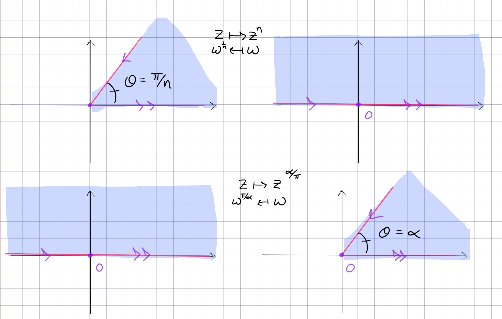

:::

## Logs and Exponentials

:::{.remark}
The exponential generally sends boxes to sectors, so
\[
\ts{z \st \Re(z) \in [a, b], \Im(z)\in [c, d]}\mapsto \ts{Re^{i\theta} \st R \in [e^a, e^b], \theta\in [c, d]}
.\]

Pictures of the situation:

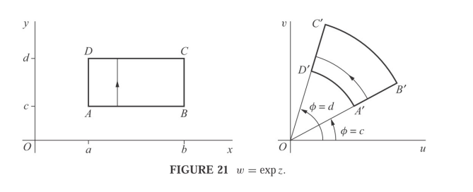

:::

:::{.proposition title="Upper half-plane to horizontal strip"}
\[
F: \HH &\to \RR \times i(0, \pi) \\
z &\mapsto \Log(z) \\
e^w &\mapsfrom w
.\]

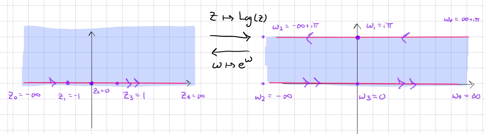

- Why this lands in a strip: use that $\arg(z) \in (0, \pi)$ and $\log(z) = \abs{z} + i\arg(z)$.
:::

:::{.proposition title="Slit plane to horizontal strip"}
\[
F: \CC\sm\RR_{\leq 0} &\to \RR \cross i(-\pi, \pi) \\
z &\mapsto \Log(z)
.\]

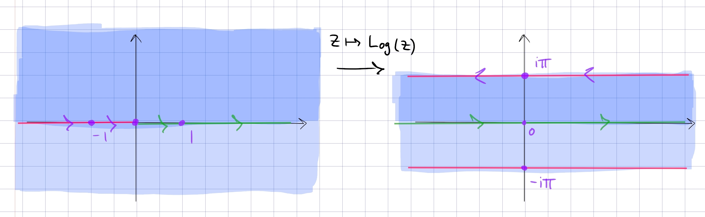

- Circles of radius $R$ are mapped to vertical line segments connecting $\ln(R) + i\pi$ to $\ln(R) - i\pi$, and rays are mapped to horizontal lines.
- Inverse is useful: $z\mapsto e^z$ sends $\ts{ \abs{ \Re(z) } < \pi/2 }$ to $Q_{14}$, the right half-plane.

:::

:::{.proposition title="Upper half-disc to horizontal upper-left-half-strip"}
\[
F: \DD \intersect \HH &\to \RR_{<0} \times i (0, i\pi) \\
z &\mapsto \Log(z) \\
e^w &\mapsfrom w
.\]

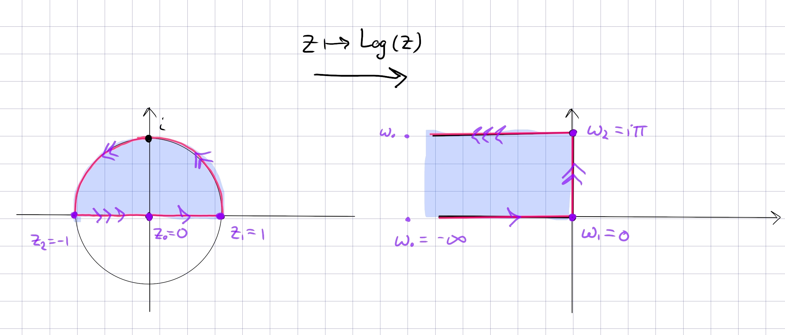

In general,

- $\DD \intersect \HH$ maps to a half-strip in $Q_2$
- $\DD \intersect Q_{34}$ maps to a half-strip in $Q_1$.
- $\DD^c \intersect \HH$ maps to a half-strip in $Q_1$
- $\DD^c \intersect Q_{34}$ maps to a half-strip in $Q_4$

:::

:::{.proposition title="Vertical half-strip to right half-disc"}
\[
F: \qty{-{\pi \over 2}, {\pi \over 2}} \cross i\RR &\to \DD \intersect \ts{\Re(z) > 0} \\
z &\mapsto e^{iz} \\
-i\Log(w) &\mapsfrom w
.\]

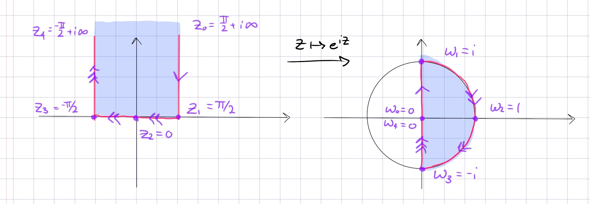

This is essentially polar coordinates: write $e^z = e^{-y} e^{ix}$, then $x\in (-\pi/2, \pi/2)$ and $y\in (0, \infty)$ so this fills out a half-disc as $x,y$ vary.
:::

## Joukowski Maps

:::{.remark}
A nice resource: <https://complex-analysis.com/content/joukowsky_airfoil.html>

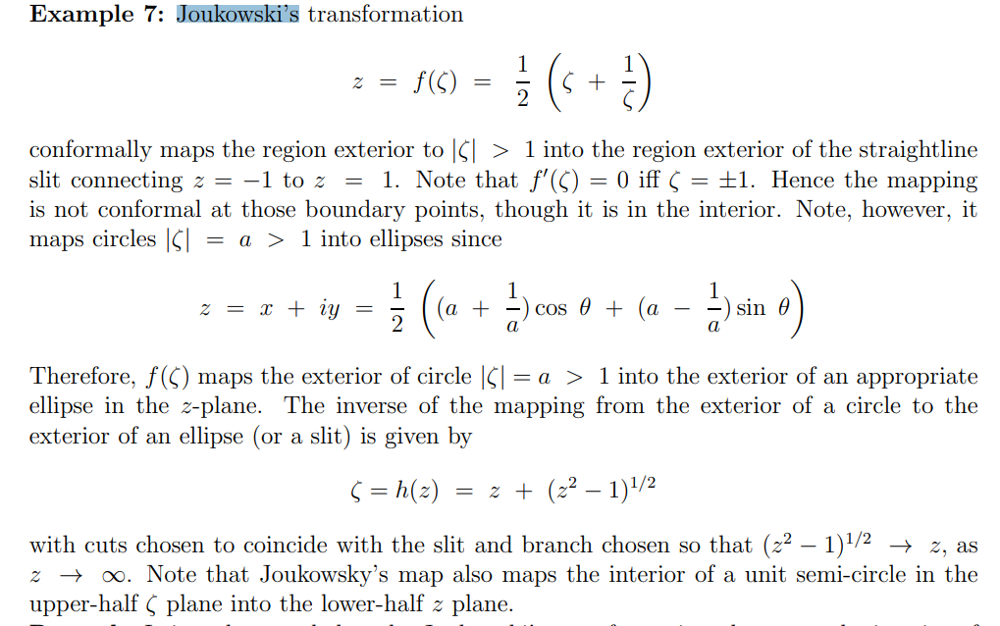

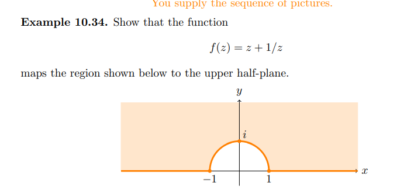

In general, $z\mapsto z+z\inv$ has the following effects:

- $\abs{z} = 1$ is mapped onto $[-2, 2]$
- $\DD \intersect \HH$ is mapped to $Q_{34}$
- $\DD^c \intersect \HH$ is mapped to $\HH$
- $\DD^c$ is mapped to $\CC\sm[-2, 2]$

:::

:::{.proposition title="Disc complement to doubly slit plane"}
\[
F: \DD^c \intersect \HH &\to \CC\sm[-2, 2] \\
z &\mapsto z+ z\inv
.\]

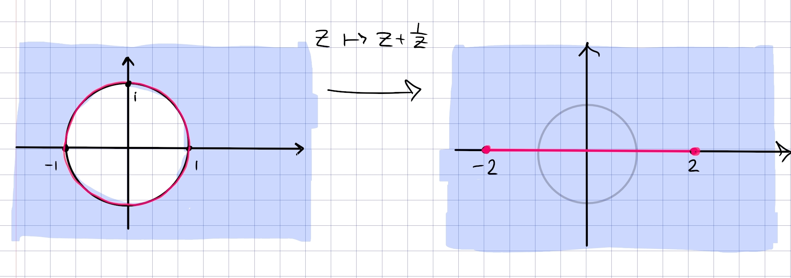

:::

:::{.proposition title="Upper half-disc to upper half-plane"}
\[
F: \DD \intersect \HH &\to \HH \\
z & \mapsto -{1\over 2}\qty{ z + z\inv }
.\]

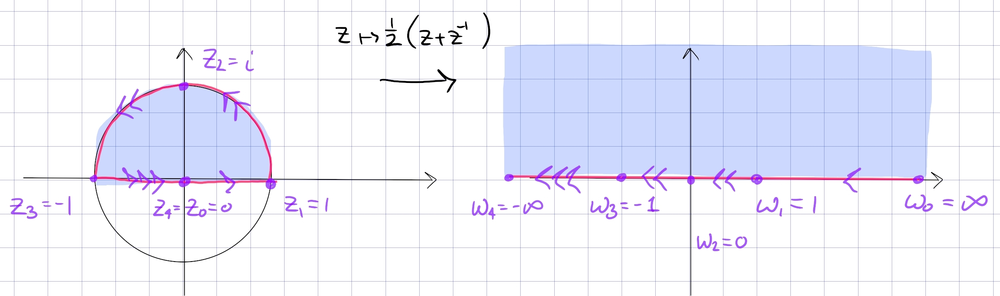

- It additionally maps $\DD^c\to \RR\sm[-1, 1]$.
- A similar variant: $z\mapsto {1\over 2i}(z+z\inv)$ sends $Q_{14}$ to $\CC\sm\ts{t\in \RR \st \abs{t} \geq 1}$, the plane with a slit on $\RR$ through infinity (i.e. a doubly slit plane).

> This is sometimes referred to as a *Joukowski map*.o
> The inverse is a bit complicated.

:::

:::{.proposition title="Upper half-plane to centered vertical half-strip"}
\[
F: \HH &\to \qty{-{\pi \over 2}, {\pi \over 2}} \cross i\RR \\
z &\mapsto \sin(z)
.\]

The mapping $z\mapsto \sin(z)$:
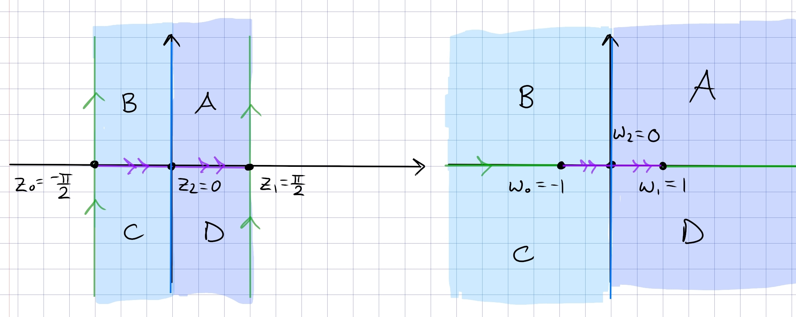

- As $z$ travels from $i\infty \to i0$, $\sin(iz) = i\sinh(z)$ also traverses $i\infty\to i0$ 
- For $z\in[-\pi/2, \pi/2]$, $\sin(z)$ is real and in $[-1, 1]$.
- As $z$ travels along $\pi/2 + it$ for $t\in [0, \infty)$, $\sin(\pi/2 + it) = \cosh(t)$ traverses $1\to \infty$ along $\RR$

Note that this isn't new: set $w \da e^{iz}$, then
\[
\sin(z) = -{1\over 2}\qty{iw + {1\over iw}}
,\]
which is the composition
\[
\qty{z \mapsto e^{z} } \circ \qty{z\mapsto iz} \circ \qty{z\mapsto {1\over 2}(z+z\inv)}
.\]

:::

