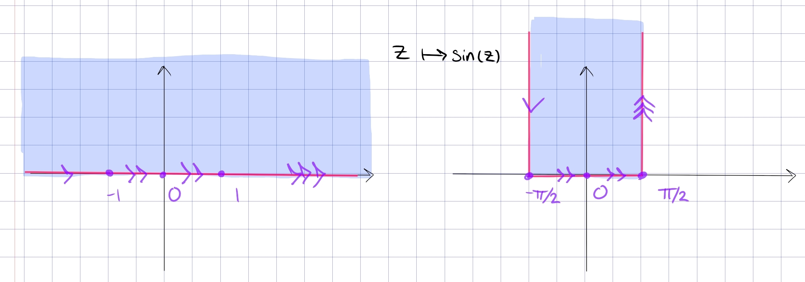

# Standard Conformal Maps

:::{.theorem title="Classification of Conformal Maps"}
There are 8 major types of conformal maps:

| Type/Domains                                            | Formula                                   |
| ------------                                            | -------                                   |
| Translation                                             | $z\mapsto z + h$            |
| Dilation                                                | $z\mapsto cz$            |
| Rotation                                                | $z\mapsto e^{i\theta}$            |
| Sectors to sectors                                      | $z\mapsto z^n$                            |
| $\DD_{1\over 2} \to \HH_{1\over 2}$, the first quadrant | $z\mapsto {1+z \over 1-z}$                |
| $\HH\to S$                                              | $z\mapsto \log(z)$                        |
| $\DD_{1\over 2} \to L_{1\over 2}$                       | $z\mapsto \log(z)$                        |
| $S_{1\over 2} \to \DD_{1\over 2}$                       | $z\mapsto e^{iz}$                         |
| $\DD_{1\over 2} \to \HH$                                | $z\mapsto {1\over 2}\qty{z + {1\over z}}$ |
| $L_{1\over 2} \to \HH$                                  | $z\mapsto \sin(z)$                        |

:::

## $\HH$ and $\DD$

:::{.proposition title="Half-plane to Disc"}
\[
F: \HH&\mapstofrom \DD \\
z &\mapsto {i-z \over i+z} \\
i \qty{1-w \over 1+w} &\mapsfrom w
.\]

Mnemonic: every $z\in \HH$ is closer to $i$ than $-i$.

Some write a similar map:
\[
\HH^\circ &\to \DD^\circ \\
z &\mapsto {z-i \over z+i}
.\]
This is just a composition of the above map with the flip $z\mapsto -z$:
\[
- {i-z \over i + z} = {z-i \over i+z} = {z-i \over z+i}
.\]

:::

:::{.proposition title="Right half-plane to Disc"}
\[
\DD &\mapsto \ts{\Re(z) > 0} \\
z &\mapsto {1+z \over 1-z} \\
{w-1\over w+1} &\mapsfrom w
.\]

Just map the *right* half-plane $\HH_R$ to the disc $\DD$ by precomposing with a rotation $e^{i\pi/2} = i$:

\[
\HH_{R} \to \HH &\to \DD \\
z \mapsto iz &\mapsto {i- (iz) \over i + (iz)} = {i(1-z) \over i(1+z) } = {1-z \over 1+z}
.\]

This can easily be inverted:
\[
&\quad w = {1+z \over 1+z} \\
&\implies -(1-w) + z(w+1) = 0 \\
&\implies z = {1-w \over 1+w}
.\]

**Boundary behavior**:
Just a rotated version of $\HH\to \DD$!

> Mnemonic: every $z\in \HH_R$ is closed to 1 than $-1$.

:::

## Sectors 

:::{.proposition title="Upper-half-plane to sectors and back"}
\[
F: \ts{z\st \Arg(z) \in \qty{0, {\pi \over n}} } &\to \HH \\
z &\mapsto z^n \\
w^{1\over n} &\mapsfrom w
.\]

More generally, for $0 < \alpha < 2$,
\[
F: \HH &\to \ts{z\st \Arg(z) \in \qty{0, \alpha} } \\
z &\mapsto z^{\alpha\over \pi} \\
w^{\pi \over \alpha} &\mapsfrom w
.\]

:::

:::{.proposition title="Sector to Disc"}
The unmotivated formula first:
\[
F: \ts{z \st \Arg(z) \in (0, \pi) } &\to \DD\\
z &\mapsto {z^{\pi\over \alpha} - i \over z^{\pi\over\alpha} + i}
.\]

Idea: compose some known functions.

\[
S_{\alpha} &\to S_{\pi} = \HH \to \DD \\
z &\mapsto z^{\pi \over \alpha} \mapsto {z-i\over z+i}\evalfrom_{z= z^{\pi\over \alpha}}
.\]
:::

:::{.proposition title="Upper half-disc to first quadrant"}
\[
F: \HH \intersect \DD &\to \HH \intersect \ts{\Re(z) > 0 } \\
z &\mapsto {1+z \over 1-z} \\
{w-1\over w+1} &\mapsfrom w
.\]

- Why this lands in the first quadrant: 
  - Use that squares are non-negative and $z=x+iy\in \DD \implies x^2 + y^2 < 1$:
\[
f(z)=\frac{1-\left(x^{2}+y^{2}\right)}{(1-x)^{2}+y^{2}}+i \frac{2 y}{(1-x)^{2}+y^{2}}
.\]
- Why the inverse lands in the unit disc:
  - For $w$ in Q1, the distance from $w$ to 1 is smaller than from $w$ to $-1$.
  - Check that if $w=u+iv$ where $u, v>0$, the imaginary part of the image is positive:

\[
{w-1 \over w+1} 
&= { (w-1) \bar{(w+1)} \over \abs{w+1}^2}\\
&={ \qty{u-1 + iv} \qty{u+1-iv} \over (u+1)^2 + v^2 } \\
&= {u^2 + v^2 + 1 \over (u+1)^2 + v^2}
+ i\qty{ 2v \over (u+1)^2 + v^2}
.\]

**Boundary behavior**:

- On the upper half circle \( \ts{ e^{it } \st t\in (0, \pi)  } \), write 
\[
f(z)=\frac{1+e^{i \theta}}{1-e^{i \theta}}=\frac{e^{-i \theta / 2}+e^{i \theta / 2}}{e^{-i \theta / 2}-e^{i \theta / 2}}=\frac{i}{\tan (\theta / 2)}
,\]
  so as $t$ ranges $0\to \pi$ we have $f(z)$ ranging from $0\to i\infty$ along the imaginary axis.

:::

## Logs and Exponentials

:::{.proposition title="Upper half-plane to horizontal strip"}
\[
F: \HH &\to \RR \times i(0, \pi) \\
z &\mapsto \Log(z) \\
e^w &\mapsfrom w
.\]

- Why this lands in a strip: use that $\arg(z) \in (0, \pi)$ and $\log(z) = \abs{z} + i\arg(z)$.
:::

:::{.proposition title="Slit plane to horizontal strip"}
\[
F: \CC\sm\RR_{\leq 0} &\to \RR \cross i(-\pi, \pi) \\
z &\mapsto \Log(z)
.\]

- Circles of radius $R$ are mapped to vertical line segments connecting $\ln(R) + i\pi$ to $\ln(R) - i\pi$, and rays are mapped to horizontal lines.

:::

:::{.proposition title="Upper half-disc to horizontal upper-left-half-strip"}
\[
F: \DD \intersect \HH &\to \RR_{<0} \times i (0, i\pi) \\
z &\mapsto \Log(z) \\
e^w &\mapsfrom w
.\]

:::

:::{.proposition title="Vertical half-strip to right half-disc"}
\[
F: \qty{-{\pi \over 2}, {\pi \over 2}} \cross i\RR &\to \ts{\abs{z} < 1,\, \Re(z) > 0} \\
z &\mapsto e^{iz} \\
-i\Log(w) &\mapsfrom w
.\]

This is essentially polar coordinates: write $e^z = e^{-y} e^{ix}$, then $x\in (-\pi/2, \pi/2)$ and $y\in (0, \infty)$ so this fills out a half-disc as $x,y$ vary.
:::

## Misc

:::{.proposition title="Upper half-disc to upper half-plane"}
\[
F: \DD \intersect \HH &\to \HH \\
z & \mapsto {1\over 2}\qty{ z + z\inv }
.\]

> This is sometimes referred to as a *Joukowski map*.o
> The inverse is a bit complicated.

:::

:::{.proposition title="Upper half-plane to centered vertical half-strip"}
\[
F: \HH &\to \qty{-{\pi \over 2}, {\pi \over 2}} \cross i\RR \\
z &\mapsto \sin(z)
.\]

Note that this isn't new: set $w \da e^{iz}$, then
\[
\sin(z) = -{1\over 2}\qty{iw + {1\over iw}}
,\]
which is the composition
\[
\qty{z \mapsto e^{iz} } \circ \qty{z\mapsto iz} \circ \qty{z\mapsto {1\over 2}(z+z\inv)}
.\]

:::

