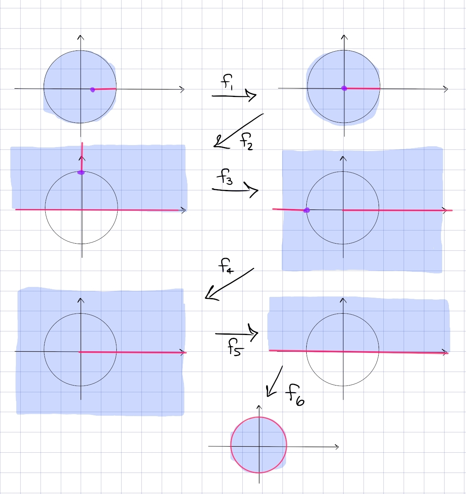

# Conformal Map Examples and Exercises 

:::{.example title="Mapping the half-disc to the half-plane"}
\[
(z: i, 1, -1) = \qty{z-1 \over z+1} \qty{i-1 \over i+1}\inv
.\]

#work

:::

:::{.example title="?"}
\envlist

- $(z; i, 1, -1): \DD\to \HH$
- $(z; 0, -1, 1): \DD \intersect \HH \to Q_1$.

A Mobius transformation of the following form:
\[
1 &\mapsto 3 \\
i &\mapsto 0 \\
2 &\mapsto -1
.\]
Write $T(z) = (z; 1, i, 2)$ and $S(w) = (w; 3, 0, -1)$.
Set $T(z) = S(w)$ and solve for $w$ to get
\[
\frac{-3 z+3 i}{(7-4 i) z+(-8+5 i)}
.\]
:::

:::{.example title="Cayley transform (important!!)"}
The fractional linear transformation given by $F(z) = {i - z \over i + z}$ maps $\DD\to \HH$ with inverse $G(w) = i {1-w \over 1 + w}$.
The following transformation is very important:
\[
F: \DD &\to \HH \\
z &\mapsto {i-z\over i+z} \\
i{1-w\over 1+w} &\mapsfrom w
.\]
:::

:::{.exercise title="Upper half-disc to upper half-plane"}
Find a conformal map from the upper half-disc to the upper half-plane.

#work

:::

:::{.solution}
![[2021-07-29_19-26-39.png]]
:::

:::{.exercise title="Half disc to full disc"}
Find a conformal map from $\ts{z\in \CC \st \abs{z} < 1, \Im(z) > 0}$ to $\DD$.

#work

:::

:::{.solution}
Note that $z\mapsto z^2$ doesn't actually work, because the image is $\DD\sm \RR_{\geq 0}$ and has a slit deleted.
Instead compose:

- $z\mapsto i{z-1\over z+1}$, which maps $\DD\to \HH$ and restricts to map $\DD \intersect \HH \to Q_1$.
- $z\mapsto z^2$, which maps $Q_1\to \HH$
- $z\mapsto {z-i\over z+i}$ which maps $\HH\to \DD$.
:::

:::{.exercise title="?"}
Find a conformal map
\[
\DD\sm [1/2, 1) \to \DD
.\]

#completed

:::

:::{.solution}
The picture:

In steps:

- $f_1$: send $1/2\to 0$ and $1\to 1$ in order to lengthen the slit.
  Mobius transformations preserve lines, so take $f_1(z) = {z-1/2 \over z-1/2}$.
  New domain: $\DD\sm [0, 1)$.

- $f_2$: send $\DD\to \HH$ and keep track of the slit.
  Use the standard inverse to the Cayley transform, $f_2(z) = i{1-z\over 1+z}$.
  New domain: $\HH\sm [i, i\infty)$, noting that $\HH$ is the open half-plane.

- $f_3$: rotate the slit so it becomes a line segment from $-1$ to $1$ passing through $\infty$.
  Use $f_3(z) = z^2$.
  New domain: $\CC\sm\qty{(-\infty, 1] \union [1, \infty) }$

- $f_4$: move the slit off to infinity to be left with a ray, so send $-1\to \infty$ and $0\to 0$.
  Take $f_4(z) = {z\over z+1}$, the new domain is $\CC\sm [0, \infty)$.

- $f_5$: fold it back. Branch cut log along $[0, \infty)$ to define $f_5(z) = z^{1\over 2}$, so the new domain is $\HH$.

- $f_6$: apply the standard Cayley transform $f_6(z) = {i-z\over i+z}$
:::

