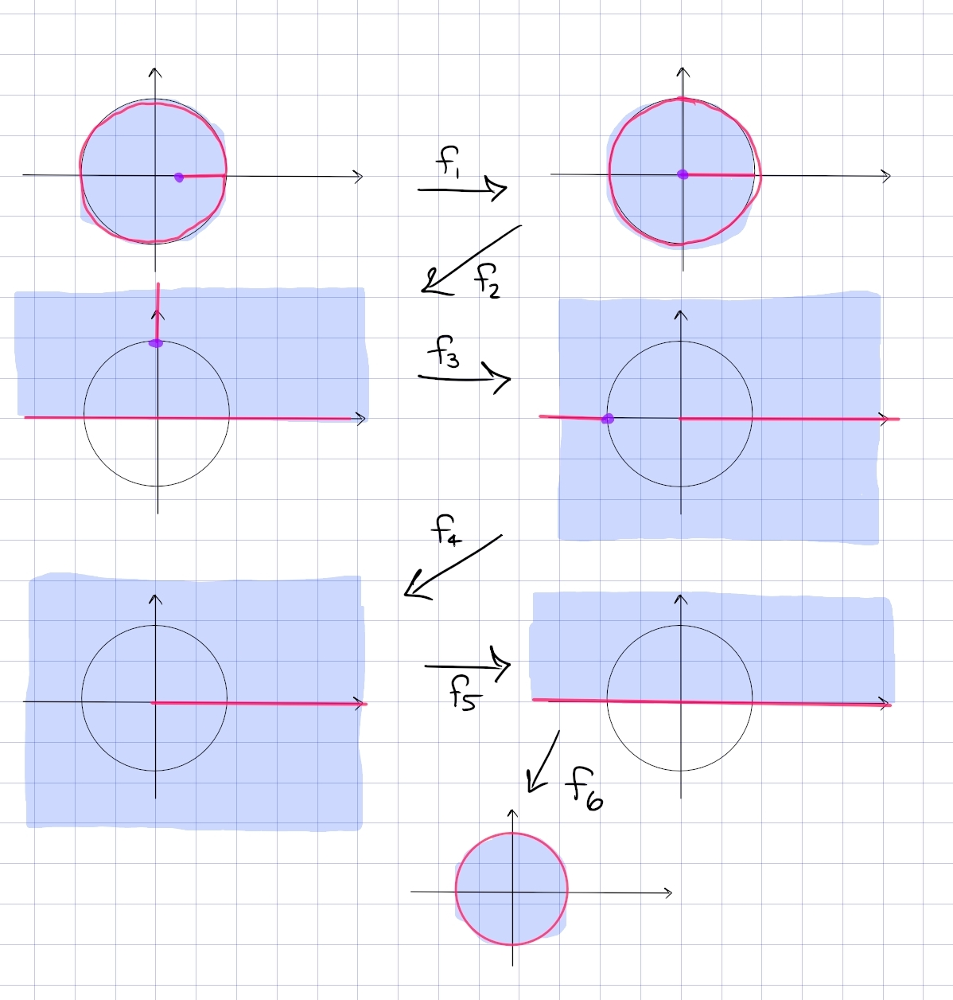
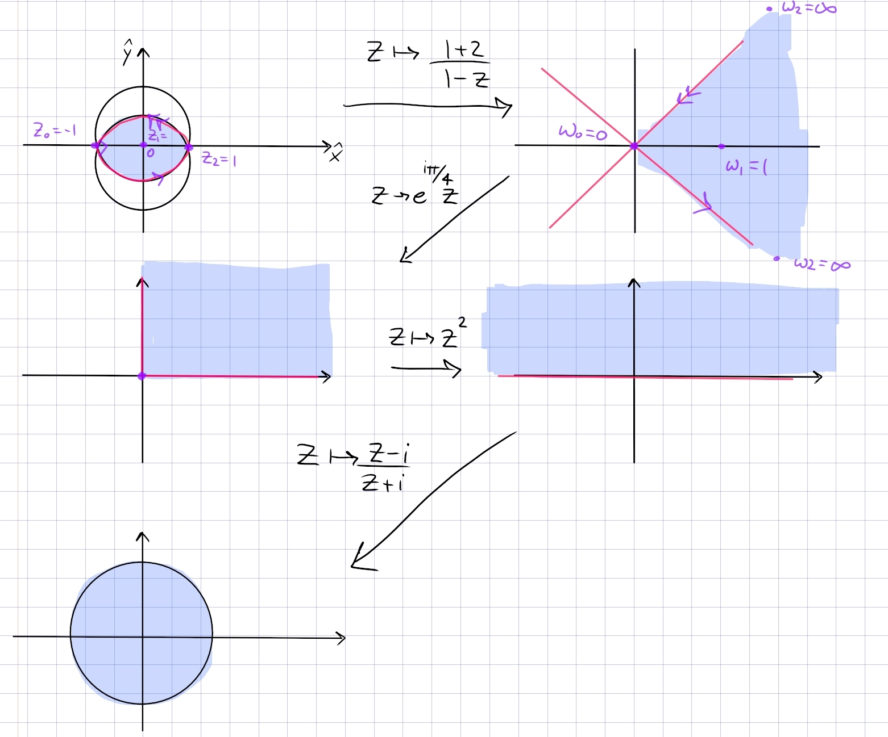
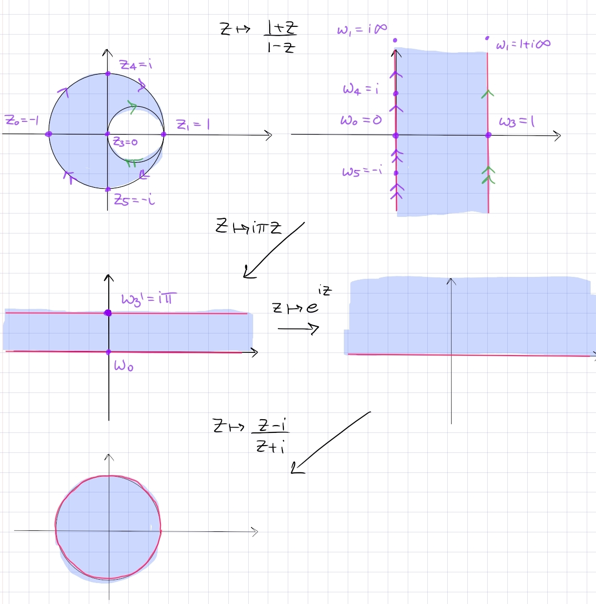
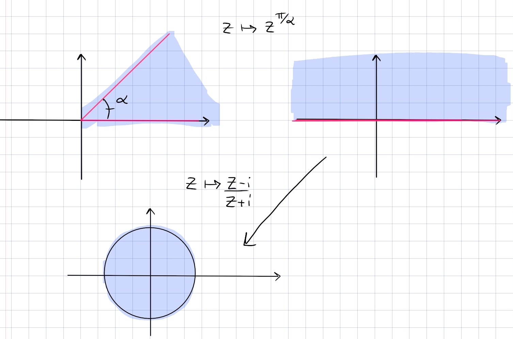
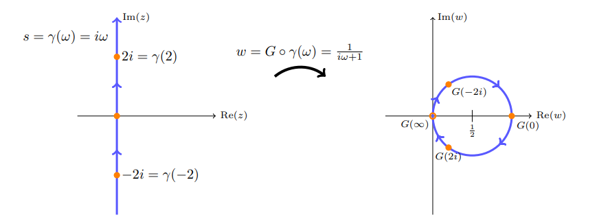
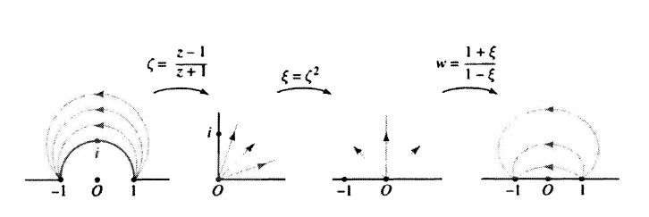

# Exercises: Conformal Maps 

:::{.remark title="Tips and tricks"}
Notation:

- Almost everything is an *open* set, so don't include boundaries in definitions.
- $Q_i$ is the $i$th quadrant, e.g. $Q_1 \da \ts{z \st \Re(z), \Im(z) > 0}$.
- $\DD \da \ts{z \st \abs{z} < 1}$ is the open unit disc.
- $\HH \da \ts{z \st \Im(z) > 0}$ is the open upper half-plane.
- $Q_{ij} \da Q_i \union Q_j$ is the union of two quadrants.
  E.g. $\HH = Q_{23}$, or $Q_{14}$ is the right half-plane.

Tips:

- If just mapping the disc to itself, use the hypberolic translations
\[
\psi_a \da {z-a\over 1-\bar a z}
.\]

- For lunes (regions bounded by arcs): map the cusps to $0$ and $\infty$ to get a sector.

- For discs with slits: aim for $\CC\sm[0, \infty) \mapsvia{\sqrt z} \HH$.

- For circles with tangencies: send the tangent point to $\infty$ to get parallel lines.

- Remembering the cross ratio: the order $1,0,\infty$ is very important (as images of $z_2, z_3, z_4$).
  - Send $z_3\to 0$ by including $z-z_3$ in the numerator.
  - Send $z_4\to \infty$ by including $z-z_4$ in the denominator.
  - Send $z_1\to 1$ by canceling the terms just added: 
    - Cancel $z-z_4$ in the denominator with $z_2 - z_4$ in the numerator.
    - Cancel $z-z_3$ in the numerator with a $z_2 - z_3$ in the denominator.
- Inverting conformal maps: just set $f(z) = w$ and solve for $w$.
- Conformal maps preserve generalized spheres, i.e. circles get mapped to circles (which could be lines on $\CP^1$). 
- Orthogonal circles must go to orthogonal circles.
- Arcs between two points must go to arcs between their images

- $\RR =\ts{\tan(t) \st t\in (-\pi/2, \pi/ 2)}$.
:::

:::{.exercise title="Conformal maps to arbitrary points"}
Find a Mobius transformation sending 

- $1\to 3$
- $i\to 0$
- $2\to -1$

#complex/exercise/completed

:::

:::{.solution}
Use cross ratios: set $T(z) \da (z;,1,i,2)$ and $S(w) = (w;,3,0,-1)$ and solve $T(z) = S(w) \implies w = (S\inv T)(z)$:
\[
{z-i \over z-2}{1-2\over 1-i} 
&= {w-0\over w+1}{3+1 \over 3-0} \\
\implies -\frac{\left(i + 1\right) \, {\left(z - i\right)}}{2 \, {\left(z - 2\right)}}
&=
\frac{4 \, w}{3 \, {\left(w + 1\right)}} \\
\implies w
&=
-\frac{3 \, {\left(\left(i + 1\right) \, z - i + 1\right)}}{\left(3 i + 11\right) \, z - 3 i - 13}
\\
&= - {3z - 3i \over {3i+11\over i+1}z + {-3i-13 \over 3i+11}} \\
&= - {3z - 3i \over (7-4i) z + {-8+5i} } \\
&= \frac{-3 z+3 i}{(7-4 i) z+(-8+5 i)}
.\]

:::

## Discs and Planes

### $\HH\to\DD$ #complex/exercise/completed

:::{.problem title="?"}
Find a fractional linear transformation $T$ which maps $\HH$ to $\DD$, and explicitly describe the image of the first quadrant under $T$.
:::

:::{.solution}
Unclear to me how to *motivate* this formula, but choose $f(z) = {z-i\over z+i}$.
Note that

- $f(-1) = i$
- $f(0) = -1$
- $f(1) = -i$,

so $\RR$ oriented from $-\infty\to\infty$ is sent to $S^1$ oriented counterclockwise.
Since this is conformal, it preserves handedness -- noting that $\HH$ is on the left with respect to $\RR$, it gets mapped to the left of $S^1$ with its induced orientation, i.e. the interior of $\DD$.
How to remember: $\abs{z-i}<\abs{z+i}$ in $\HH$, since points are closer to $i$ than $-i$.
:::

### $\DD\to\HH$ #complex/exercise/completed

:::{.exercise title="Disc to upper half-plane"}
Find a conformal map from $\DD$ to $\HH$.
:::

:::{.solution}
Note that the standard Cayley map $f(z)\da {z-i\over z+i}$ sends $\HH\to \DD$.
Why this is true: $\abs{f(z)} < 1$, since $\abs{z-i} < \abs{z+i}$ for $z\in \HH$.
Finding an explicit inverse:
\[
w &= {z-i\over z+i} \\
\implies w(z+i) - (z-i) &= 0 \\
\implies z &= -i {w+1\over w-1}
,\]
which is the desired map.
Why the image is in $\HH$: it suffices to show that $\Im(f(z)) > 0$ for all $z\in \DD$.
Write $z = x+iy$ and note that $\Im(iz) = \Re(z)$, then
\[
\Im(f(z)) 
&= \Re\qty{1-z\over 1+z} \\
&= \Re\qty{1-x-iy \over 1+x+iy} \\
&= \Re\qty{1-x^2-y^2 - i2y \over 1+x^2 + y^2} \\
&= {1-(x^2+y^2) \over 1+(x^2+y^2) } \\
&> 0
,\]
since $x^2+y^2<1$ for $x+iy \in \DD$.

:::

### $\DD\to\HH$, cross-ratio #complex/exercise/completed

:::{.exercise title="Disc to upper half-plane, cross-ratio"}
Find a conformal map $\DD \to \HH$ using cross-ratios.
:::

:::{.solution}
Idea: rotate the upper hemisphere $(\HH)$ of $\CP^1$ to make the equator $\bd \DD$, "zoom" by placing $i$ at the center so $0\to i\mapsto -1\to 0$ and $i\to \infty\mapsto 0\to 1$.
Accomplish this by sending

- $\infty\to 1$
- $i\to 0$
- $-i\to \infty$

Use the cross-ratio
\[
R(z) \da (z, \infty, i, -i) = {z-i \over z-(-i)} {\infty - (-i) \over \infty - i} = {z-i\over z+i}
.\]

Checking that this works:

- If $z\in \RR$ then $\abs{z-i} = \abs{z+i}$ so $\abs(F(z)) = 1$.
- If $z\in \HH$ then $\abs{z-i}\leq \abs{z+i}$ so $\abs{F(z)}< 1$.

:::

### Upper half-disc to $\DD$ #complex/exercise/completed

:::{.exercise title="Half disc to full disc"}
Find a conformal map from $\ts{z\in \CC \st \abs{z} < 1, \Im(z) > 0} = \DD \intersect \HH$ to $\DD$.
:::

:::{.solution}
Note that $z\mapsto z^2$ doesn't actually work, because the image is $\DD\sm \RR_{\geq 0}$ and has a slit deleted.
Instead compose:

- $z\mapsto i{z-1\over z+1}$, which maps $\DD\to \HH$ and restricts to map $\DD \intersect \HH \to Q_1$.
- $z\mapsto z^2$, which maps $Q_1\to \HH$
- $z\mapsto {z-i\over z+i}$ which maps $\HH\to \DD$.
:::

### Upper half-disc to $\HH$ #complex/exercise/completed

:::{.exercise title="Upper half-disc to upper half-plane"}
Find a conformal map from the upper half-disc to the upper half-plane.
:::

:::{.solution}

- $z\mapsto {1+z\over 1-z}$ is a standard map $\DD\to Q_{14}$ which restricts to $\DD \intersect \HH \to Q_1$
- $z\mapsto z^2$ unwraps $Q_1\to \HH$.

:::

### $\DD^c \intersect \HH \to\HH$ #complex/exercise/completed

:::{.exercise title="Complement of the disc to $\HH$"}
Find a conformal map $\HH \intersect \DD^c\to \HH$.
:::

:::{.solution}
Claim: the map $f(z) \da z+z\inv$ works.
Consider the images of circles $\gamma_r(t) \da rei^{t}$ where $t\in [-\pi, \pi]$.
For $r=1$, 
\[
f(\gamma_1(t)) = e^{it} + e^{-it} = 2\cos(t)
,\]
which sweeps out $[-2, 2]$ twice.
For arbitrary $r$,
\[
f(\gamma_r(t)) = re^{it} + r\inv e^{-it} = (r+r\inv)\cos(t) +i(r-r\inv)\sin(t)
,\]
which sweeps out an ellipse with horizontal radius $r+r\inv$ and vertical radius $r-r\inv$.
For $1<r<\infty$, these sweep out all of $\CC\sm \DD$.
Restricting $t\in [0, \pi]$, the $\gamma_r(t)$ are top halves of circles which cover all of $\HH\sm\DD$, and the images $f(\gamma_r(t))$ are top halves of ellipses which sweep out all of $\HH$.
This includes points inside of $\DD \intersect \HH$ -- this is because for any $t\in (0, \infty)$, there is always a solution $r$ to $t=r-r\inv$:
\[
t = r-r\inv \implies r^2-tr-1 \implies r = {t \pm \sqrt{t^2+4}\over 2}
.\]
So there is an image ellipse at that vertical height.
Since every point $z_0\in \HH$ is on an ellipse of *some* vertical height $t$, $\HH$ is in the image.

That this map is conformal: a computation shows $f'(z) = 1 + {1\over r^2}$, which vanishes only at $z=\pm 1$.
Since these are not in the domain, the derivative is nonvanishing, making $f$ conformal.
:::

## Slits

:::{.exercise title="Disc minus a slit"}
Find a conformal map
\[
\DD\sm [1/2, 1) \to \DD
.\]

#complex/exercise/completed

:::

:::{.solution}
The picture:

In steps:

- $f_1$: send $1/2\to 0$ and $1\to 1$ in order to lengthen the slit.
  Mobius transformations preserve lines, so take $f_1(z) = {z-1/2 \over 1-1/2}$.
  New domain: $\DD\sm [0, 1)$.

- $f_2$: send $\DD\to \HH$ and keep track of the slit.
  Use the standard inverse to the Cayley transform, $f_2(z) = i{1-z\over 1+z}$.
  New domain: $\HH\sm [i, i\infty)$, noting that $\HH$ is the open half-plane.

- $f_3$: rotate the slit so it becomes a line segment from $-1$ to $1$ passing through $\infty$.
  Use $f_3(z) = z^2$.
  New domain: $\CC\sm\qty{(-\infty, 1] \union [1, \infty) }$

- $f_4$: move the slit off to infinity to be left with a ray, so send $-1\to \infty$ and $0\to 0$.
  Take $f_4(z) = {z\over z+1}$, the new domain is $\CC\sm [0, \infty)$.

- $f_5$: fold it back. Branch cut log along $[0, \infty)$ to define $f_5(z) = z^{1\over 2}$, so the new domain is $\HH$.

- $f_6$: apply the standard Cayley transform $f_6(z) = {i-z\over i+z}$
:::

## Strips

### Horizontal strip to $\HH$ #complex/exercise/completed

:::{.problem title="Horizontal strip to upper half-plane"}
Find a conformal map from the strip $\theset{z\in \CC \suchthat 0 < \Im(z) < 1}$ to $\HH$.
:::

:::{.solution}
In steps:

- Dilate by $z\mapsto \pi z$ to get $0<\Im(z) < \pi$.
- Exponentiate by $z\mapsto e^z$ to get $\HH$.

Why $e^z$ works: apply $\Log$ to $\HH$, use polar coordinates to write $w=re^{i\theta}$ with $0<\theta<\pi$ and note
\[
\Log(w) = \ln\abs{w} +i\Arg(w) = \ln(r) + i\theta
,\]
and noting that the image of $\ln(\wait)$ is all of $\RR$.
:::

## Lunes

:::{.exercise title="Lune between circles"}

Find a conformal map $L\to \DD$ where
\[
L\da \ts{\abs{z - i } < \sqrt 2} \intersect \ts{\abs{z+i} < \sqrt 2}
,\]
i.e. a lune with vertices $-1$ and $1$.

#complex/exercise/completed

:::

:::{.solution}
The key insight: for lunes, map the corners to $0$ and $\infty$; this yields a sector.
Here we want $-1\mapsto 0$ and $1\mapsto \infty$, so $f(z) = {z+1\over z-1}$ gets things started.

In steps:

- $z\mapsto {1+z\over 1-z}$ sends the lune to the sector $\Arg(z) \in (-\pi/4, \pi/4)$, since it fixes and must be symmetric about the real axis, and preserves the right angle between the circles at $z=-1$.
- $z\mapsto e^{i\pi/4}z$ to rotate this into $Q_1$.
- $z\mapsto z^2$ to dilate into $\HH$.
- $z\mapsto {z-i\over z+i}$ the standard Cayley map $\HH\to\DD$.

:::

:::{.exercise title="Lune with a point at infinity"}
Find a conformal map:
\[
\DD \sm \ts{\abs{z - {1\over 2}} = {1\over 2} } \to \DD
.\]

#complex/exercise/completed

:::

:::{.solution}
The picture:

- Key insight: send the point of tangency to $\infty$ to get parallel lines.
  Send $z\mapsto {1+z \over 1-z}$ to send $-1\to 0, 0\to 1, 1\to \infty$ to get a vertical strip.

- Rotate and dilate: $z\mapsto i\pi z$ to get a strip $\RR \cross i(0, \pi)$.
- Standard exponential $z\mapsto e^{iz}$ sends this to $\HH$.
- Standard Cayley $z\mapsto {z-i \over z+i}$ sends this to $\DD$.

:::

## Sectors

:::{.exercise title="Standard sector"}
Find a conformal map from the sector $\ts{\Arg(z) \in (0, \alpha)} \to \DD$.

#complex/exercise/completed

:::

:::{.solution}
The picture:

In steps:

- Map the sector to $\HH$ using $z\mapsto z^{\pi/\alpha}$, choosing a branch cut for $\Log$ along $\RR_{\leq 0}$.
- Map $\HH\to \DD$ using the standard $z\mapsto {z-i\over z+i}$.

:::

## Joukowski-Type Regions

:::{.exercise title="Complement of a segment"}
Map $\CC\sm[-1, 1]$ to $\DD$.

#complex/exercise/completed

:::

:::{.solution}
In steps:

- Send $-1\to 0$ and $1\to \infty$ with $z\mapsto {z+1\over z-1}$.
  Checking that $f(0) = -1$, this yields $\CC\sm\RR_{\leq 0}$.

- Unwrap with $z\mapsto \sqrt{z}$ to obtain the right half-plane $-\pi/2<\Arg(z) < \pi/2$.
- Apply the rotated Cayley map $z\mapsto {z-1\over z+1}$ to map this to $\DD$.

Note that the composition is 
\[
{\sqrt{z+1\over z-1}  -1 \over \sqrt{z+1\over z-1} +1}
&= { \qty{ \sqrt{z+1} - \sqrt{z-1}}^2 \over (z+1)-(z-1) } \\
&= z - \sqrt{z^2-1}
,\]
which has inverse $z\mapsto {1\over 2}\qty{z+{1\over z}}$.
:::

## Misc

:::{.exercise title="?"}
Find a conformal map that sends $i\RR$ to $\abs{z-{1\over 2}} = {1\over 2}$.

#complex/exercise/completed

:::

:::{.concept}
\envlist

- The double angle formulas:
\[
\sin(2t) = {2\tan(t) \over 1+\tan^2(t)} && \cos(2t) = {1-\tan^2(2t) \over 1+\tan^2(t)}
.\]
- Parameterize a line by $x=\tan(t)$ for $t\in (-\pi/2, \pi/2)$
- The methods in SS Theorem 1.2: particularly the boundary behavior of $F(z) \da {i-z\over i+z}$, where $F(\RR) = \ts{\cos(2t)+i\sin(2t) = e^{2it} \st t\in (-\pi/2, \pi/2)}$.

- Nyquist plots: a common applied problem, essentially computing the image $F(i\RR)$.

:::

:::{.solution}
Idea: need the line $-i\infty\to 0 \to i\infty$ to get mapped to a circle $0\to 1\to 0$:

Take the cross ratio $R(z) = (z, 0, \infty, -1)$ to send

- $0\to 1$
- $\infty\to 0$
- $-1\to \infty$

This yields
\[
R(z) = {z-\infty \over z+1}{0+1\over 0-\infty} = {1\over z+1}
.\]
Some deductions:

- $R$ preserves circles, so $\RR\mapsto \RR$. 
  - The segment $0\to\infty\mapsto 1\to 0$
  - The ray $-1\to 0 \to \infty \mapsto \infty\to 1\to 0$
  - The ray $-\infty \to -1 \mapsto 0\to -\infty$

- $R$ preserves angles, to at $w=0$, the image of $i\RR$ must be orthogonal to $\RR$, so it's either a circle or $i\RR$ itself.
- Check $-i\infty \to 0 \to -\infty\mapsto 0\to 1\to 0$, so the image is a circle.
- Parameterize $i\RR = \ts{it\st t\in \RR}$, then compute the image
\[
f(i\RR) 
&= \ts{{1\over 1+it}} \\
&= \ts{1+t\over 1+t^2} \\
&= \ts{{1\over 1+t^2} + i {t\over 1+t^2}} \\
&= \ts{{1\over 2} \qty{ 1 + {1-t^2\over 1+t^2} } + i{1\over 2}\qty{2t\over 1+t^2}} \\
&= \ts{{1\over 2}\qty{1 + \cos(2t) + i\sin(2t)}} \\
&= \ts{{1\over 2} + {1\over 2}e^{2it} }
,\]
which is a circle of radius $1/2$ about $1/2$.

Conclusion:

- $i\RR \to \ts{\abs{z-{1\over 2}} = {1\over 2} }$ by $z\to {1\over 1+z}$.
- The reverse map: $w\mapsto {1-w\over w}$.
:::

:::{.exercise title="?"}
Map $\DD^c \intersect \HH$ to $\HH$, sending 

- $-1\to -1$
- $i\to 0$
- $1\to 1$

#complex/exercise/completed

:::

:::{.solution}

Compose to get:
\[
 {1\over z}{z + z\inv}
.\]

:::

