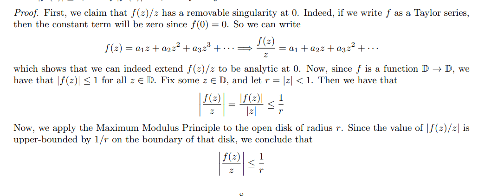
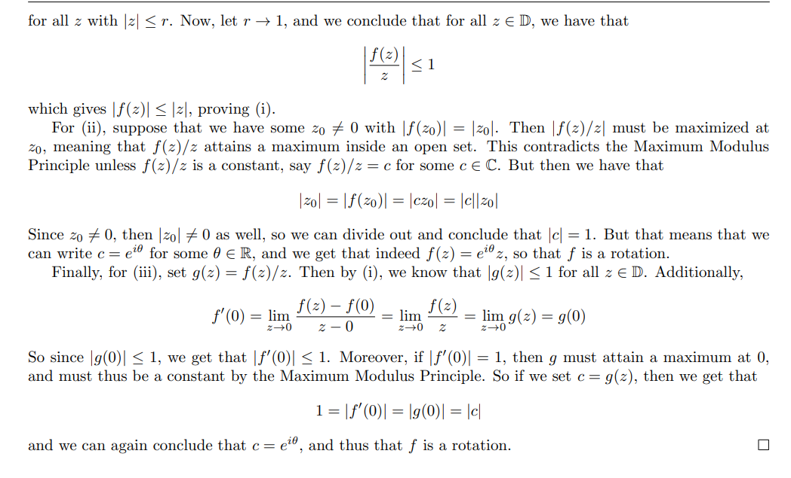
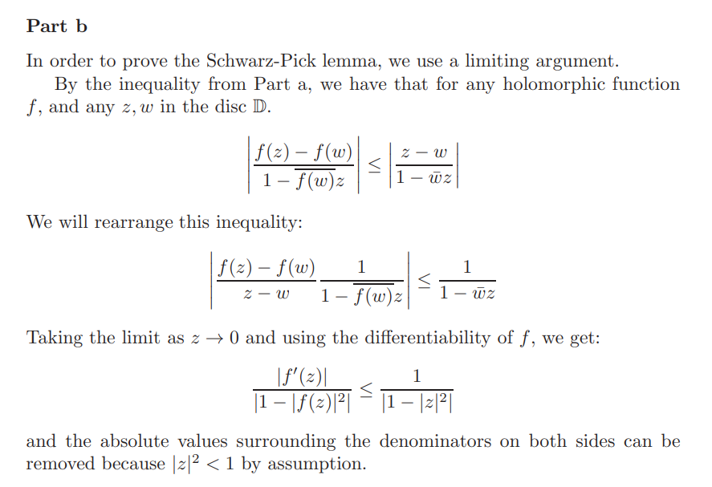

# Schwarz

## Hyperbolic Translations / Blaschke Factors

:::{.definition title="Hyperbolic translations/Blaschke factors"}
For $a\in \DD$, the maps
\[
\psi_a \da {a-z\over 1-\bar{a}z}
\]
are *hyperbolic translations* because they preserve the hyperbolic metric on the Poincaré disc.
They're also commonly called **Blaschke factors**, and also sometimes taken to be
\[
\phi_a \da {z-a \over 1-\bar{a} z} = - \psi_a
.\]
A rational map of the form
\[
\Psi_{\vector a}(z) = \lambda \prod_{1\leq k\leq n} \psi_a(z) = \lambda \prod_{1\leq k \leq n} {a_i - z\over 1 - \bar{a_i} z},\qquad \vector a\da\tv{a_1,\cdots, a_n}
\]
with zeros $a_i \in \DD$ is called a **Blaschke product** and is a map $\DD\to \DD$ that preserves $S^1$.
:::

:::{.proposition title="Properties of hyperbolic translations / Blaschke factors"}
Some useful properties:

- $\psi_a \in \Aut(\DD)$
- $\psi_a(S^1) = S^1$
- $\psi_a(0) = a$ and $\psi(a) = 0$
- With this choice of sign, $\psi_{a} \inv = \psi_{a}$, so $\psi_a^2 = \id$.
- $\psi_a'(z) = {\abs{a}^2 - 1 \over \qty{1-\bar{a} z}^2 }$
- $\psi_a(\lambda z) = \lambda\psi_{\bar\lambda a}(z)$
:::

:::{.proof title="of properties"}
Inverting: set $f(z) = w$ and solve for $z$:
\[
{a-z \over 1 - \bar{a}z} &= w \\
\implies a-z - w(1-\bar{a} z) &= 0 \\
\implies z&= {w-a \over \bar a w - 1} = {a-w\over 1-\bar a w}
.\]

Differentiating: the quotient rule
\[
\psi'_a(z) 
= {-(1-\bar a z) + \bar a(a-z) \over \qty{1-\bar a z}^2}
= {-1 + \abs{a}^2 \over \qty{1-\bar a z}^2}
.\]

Scaling: use a fun trick, insert $1=\bar\lambda \lambda$ like so
\[
\psi_a(\lambda z)
&=
{a - \lambda z \over 1 - \bar a \lambda z}\\
&=
{\lambda\bar\lambda a - \lambda z \over 1 - \bar a \lambda z} \\
&= \lambda {\bar\lambda a - z \over 1 - \bar{\bar\lambda a} z} \\
&= \lambda \psi_{\bar \lambda a}(z)
.\]

Being an involution: check $\psi_a(\psi_a(z))$ satisfies the Schwarz lemma and has two fixed points, forcing it to be the identity.
:::

:::{.theorem title="Characterization of conformal maps"}
Every map $g\in \Aut(\DD)$ is of the form $\Psi_{\vector a}(z)$, i.e. a Blaschke product.
:::

:::{.proof title="of theorem, sketch"}

- That these maps are biholomorphisms: they're compositions of $z\mapsto \lambda z$ and $z\mapsto {z-a\over 1-\bar a z}$, which are biholomorphisms.
- Let $f \in \BiHol(\Delta)$ be arbitrary, fix $a\in \Delta$ with $f(a) = 0$
- Write $M(z) = {z-a\over 1-\bar a z}$, then note that $M(a) = 0$ and this is a biholomorphism.
- $g\da f\circ M\inv \in \BiHol(\Delta)$ sends $0\to0$ and is thus a rotation, so $g(z) = \lambda z$.
- Write $g\circ M = f \circ M \circ M\inv = f$, which exhibits $f$ in the desired form.

- Claim: this representation is unique.
  Consider $f'(z)$, this determines $\Arg(\lambda)$.
:::

## The Schwarz Lemma

:::{.theorem title="Schwarz Lemma" ref="SchwarzzLemma"}
If $f: \DD \to \DD$ is holomorphic with $f(0) = 0$, then

1. $\abs{f(z)} \leq \abs z$ for all $z\in \DD$
2. $\abs{f'(0)} \leq 1$.

Moreover, if 

- $\abs{f(z_0)} = \abs{z_0}$ for any $z_0\in \DD\smz$, or 
- $\abs{f'(0)} = 1$, 

then $f$ is a rotation, i.e. $f(z) = \lambda z$ for some $\abs{\lambda} = 1$.
:::

:::{.theorem title="Schwarz lemma, a useful alternative statement"}
Let $f:\DD\to \DD$ be holomorphic with $f(0) = 0$. 
Then either

- $f(z) = e^{i\theta}z$ is a rotation, or
- $\abs{f'(0)} < 1$ and $\abs{f(z)} < \abs{z}$ for all $z\in \DD$, noting the strict inequalities.

:::

:::{.exercise title="Schwarz with domain/codomain scaled"}
If $f: \DD_R(a)\to\DD_M(0)$ with $f(a) = 0$, then 
\[
\abs{f(z)}\leq {M\over R}\abs{z-a}
.\]
:::

:::{.solution}
Set $g(z) \da {f(Rz + a) \over M}$, then $g: \DD\to \DD$ with $g(0) = f(a)/M = 0$, so unwinding Schwarz yields
\[
\abs{g(z)} \leq \abs{z} 
\implies \abs{f(Rz+a)\over M}
&\leq \abs{z} \\
\implies \abs{f(Rz+a)} &\leq M\abs{z} \\
\implies \abs{f(w)} &\leq M\abs{w-a\over R} \qquad w = Rz+a\implies z={w-a\over R}
.\]
:::

:::{.proof title="of Schwarz"}
\envlist

- Idea: apply the maximum modulus principle to $g(z) \da f(z)/z$.
- $\abs{g(z)} \leq 1$:
  - Expand $f$ at $z=0$ as $\sum_{k\geq 0} c_k z^k$.
    Since $f(0) = c_0$, we have $c_0 = 0$.
  - So $g(z) \da f(z)/z$ is holomorphic on $\DD$, since the singularity at $z=0$ is removable.
  - Set $\abs{z} = r < 1$, then $\abs{g(z)} = \abs{f(z)}/r \leq 1/r$ since $\abs{f(z)} \leq 1$.
  - By MMP, $\abs{g(z)} \leq 1/r$ holds in the entire disc $\abs{z} \leq r$, so take $r\to 1$ to get $\abs{g(z)} \leq 1$
- $\abs{f'(0)} \leq 1$ with equality iff $f$ is a rotation:
  - Note that $f(0) = 0$, so we can write $g(0) = \lim_{z\to 0} {f(z) - f(0) \over z-0} \da f'(0)$.
  - So $1 = \abs{f'(0)} = \abs{g(0)}$.
  - But $\abs{g(z)} \leq 1$ on $\DD$ and $g(z) = 1$ in the interior, so by MMP this makes $g$ constant.
  - So again $f(z) = cz$ with $\abs{c} = 1$.
- $\abs{f(z_0)} = \abs{z_0}\implies f$ is a rotation:
  - Again $\abs{g(z)} \leq 1$, but $\abs{f(z_0)} = \abs{z_0} \implies \abs{g(z_0)} = 1$, so $g$ attains a maximum on $\abs{z}\leq 1$, making it constant, so $f(z) = cz$.
  - Then $\abs{z_0} = \abs{f(z_0)} = \abs{cz_0}$ since $f(z_0) = z_0$, so $\abs{c} = 1$ and $c = e^{i\theta}$ for some $\theta$.
:::

:::{.proof title="of Schwarz, alternative"}

:::

# Exercises

:::{.exercise title="Forcing a map to be the identity"}
Let $\psi_a$ be a Blaschke factor and use the Schwarz lemma to prove that $\psi_a \circ \psi_a = \id_\DD$.

#complex/exercise/completed

:::

:::{.solution}
First, $\psi_a$ maps $\DD\to \DD$.
Fix $z\in S^1$, then
\[
\abs{\psi_a(z)} \da 
\abs{a-z\over 1-\bar{a} z}
&= \abs{a-z\over 1-\bar{a} z} \cdot \abs{\bar z}\inv \\
&= \abs{a-z\over \bar{a} - \bar{z}} \\
&= \abs{a-z \over \bar{a-z} } \\
&\da \abs{w \over \bar w } \\
&= \abs{w \over \abs{w}^2/w }\\
&= \abs{w^2 \over \abs{w}^2} \\
&= 1
.\]
$\psi_a$ is holomorphic on $\DD$ since it has a simple pole at $z=1/\bar{a}$, but $\abs{a}<1$ implies $\abs{1/\bar{a}} > 1$.
Let $g\da \psi_a\circ \psi_a$, then $g(0) = 0$ so Schwarz applies.
Since $g(a) = a$ with $a\neq 0$, the 2nd part of Schwarz also applies since $\abs{g(a)} = \abs{a}$ and $g(z) = \lambda z$ is a rotation.
Since $a = g(a) = \lambda a$, this forces $\lambda = 1$, so $g$ is the identity.
:::

:::{.exercise title="Schwarz-Pick Lemma"}
Prove the following:
suppose $\abs{f(z)}\leq 1$, then for all $z, w\in \DD$,
\[
\left|\frac{f(z)-f(w)}{1-\overline{f(w)} f(z)}\right| \leq\left|\frac{z-w}{1-\bar{w} z}\right|
\quad\text{ and }
\left|f^{\prime}(z)\right| \leq \frac{1-|f(z)|^{2}}{1-|z|^{2}}
.\]
If equality holds for some $z\neq w$ in either expression, then $f= \lambda F$ where $F$ is a linear fractional transformation and $\abs{\lambda} = 1$, so $f\in \Aut(\DD)$.

> Note that this does not require $f(0) = 0$.

#complex/exercise/completed

:::

:::{.proof title="of Schwarz-Pick"}

:::

:::{.exercise title="Special case of bijections"}
Show that if $f: \Delta\to\Delta$ is a biholomorphism with $f(0) = 0$ then $f$ is a rotation.

#complex/exercise/completed

:::

:::{.solution}
By Schwarz, $\abs{f(z)} \leq \abs{z}$, and if we write $h \da f\inv$ then $h(0) = 0$ and $\abs{h(z)} \leq \abs{z}$ as well.
Schwarz says $f$ will be a rotation if there is any $z_0$ such that $\abs{f(z_0)} = \abs{z_0}$.
Write $f(z) = w$, we'll then show that in fact $\abs{f(z)} = \abs{z}$ for all $z\in \DD$.
\[
\abs{z} = \abs{(h\circ f)(z)} = \abs{h(w)} \leq \abs{w} = \abs{f(z)}\leq \abs{z}
.\]
:::

:::{.exercise title="Using the estimates"}
Let $f\in \Hol(\DD)$.
Show that if $f$ has a fixed point $a$ then $\abs{f'(a)} \leq 1$, and that 
\[
\abs{f(0)}^2 + \abs{f'(0)}^2 \leq 1
.\]

#complex/exercise/completed

:::

:::{.solution}
Set $f(a) = a$ in Schwarz-Pick:
\[
\left|f^{\prime}(a)\right| \leq \frac{1-|f(a)|^{2}}{1-|a|^{2}} \implies 
\abs{f'(a)} \leq {1 - \abs{a}^2 \over 1 - \abs{a}^2} \leq 1
.\]
Set $a=0$:
\[
\left|f^{\prime}(0)\right| \leq \frac{1-|f(0)|^{2}}{1-|0|^{2}} \implies \abs{f'(0)}^2 \leq 1 - \abs{f(0)}^2
.\]
:::

:::{.exercise title="Using the estimates"}
Does there exist a map $f: \DD\to \DD$ with

- $f\qty{1\over 2} = {3\over 4}$
- $f'\qty{1\over 2} = {2\over 3}$

#complex/exercise/completed

:::

:::{.solution}
Apply Schwarz-Pick:
\[
\abs{f'\qty{1\over 2} } \leq {1 - \abs{f\qty{1\over 2}}^2 \over 1 - \abs{1\over 2}^2 } = {7\over 2}< {2\over 3}
,\]
so this is not possible.
:::

:::{.exercise title="The standard function juggling trick"}
Show that if $f:\HH\to \DD$ is holomorphic and $f(i) = 0$ then $\abs{f(z)} \leq \abs{z-i\over z+i}$.

#complex/exercises/completed

:::

:::{.solution}
Note that
\[
\abs{f(z)} \leq \abs{g(z)} \impliedby \abs{(f\circ g\inv)(z)} \leq \abs{z}
,\]
so one can use the Schwarz lemma on $F \da f\circ g\inv$.
Noting that $g(z) \da {z-i\over z+i}: \HH\to \DD$ is the Cayley map, the inverse is $g\inv(z) = i{1-z\over 1+z}: \DD\to \HH$. 
Then $F(0) = f(g\inv(0)) = f(i) = 0$ by assumption, so Schwarz yield $\abs{F(z)} \leq \abs{z}$.
:::

:::{.exercise title="Using the estimates"}
Suppose $f: \DD\to \DD$ with $f(0) = 0$ and $\abs{f(z)} \leq \abs{e^z}$ when $\abs{z} = 1$.
Find an upper bound for $f\qty{1+i\over 2}$.

#complex/exercise/completed

:::

:::{.solution}
Consider $g(z) \da f(z)/e^z$ -- since $g(0) = 0$ and $g: \DD\to \DD$, Schwarz applies and 
\[
\abs{g(z)}\leq \abs{z} \implies \abs{f(z)} \leq \abs{ze^z} \leq e\abs{z}
.\]
So
\[
\abs{f\qty{1+i\over 2}} \leq e\abs{1+i\over 2}= {e\sqrt{2} \over 2}
.\]
:::

:::{.exercise title="Liouville"}
Use a version of the Schwarz lemma to prove Liouville's theorem.

#complex/exercise/completed

:::

:::{.solution}
Suppose $f$ is entire and bounded, we'll show $f$ is constant.
If $f$ is bounded by $M$, then $f(\CC) \subseteq \DD_M(0)$.
Without loss of generality, replace $f$ with $g(z) \da f(z) - f(0)$, so $g(0) = 0$ and is still bounded by $M' \da M + \abs{f(0)}$ by the triangle inequality.
This is still finite since $0$ is not a singularity since $f$ is entire.

By the radius $R$ variant of the Schwarz lemma, for every $\DD_R(0)$,
\[
\abs{g(z)} \leq {M\over R}\abs{z} \qquad \text{for } z\in \DD_R(0)
.\]
Using that $g(0) = 0$,
\[
\abs{g(z) - g(0) \over z} \leq {M\over R}\convergesto{R\to\infty}0
,\]
where dividing by $z$ is not an issue since $z=0$ is a zero of $g$ of at least order one.
This forces $g(z) = g(0) = 0$ for all $z$, so $f(z) = f(z_0)$ is constant.
:::

:::{.exercise title="More juggling"}
Suppose $f:\DD\to \DD$ with $f(0) = 0$ and that there exists an $r\in (0, 1)$ with $f(r) = f(-r) = 0$.
Show that 
\[
\abs{f(z)} \leq \abs{z^2-r^2 \over 1-r^2 z^2}
.\]

#complex/exercise/completed

:::

:::{.solution}
The key observation is that this factors:
\[
{z^2 - r^2 \over 1-r^2 z^2} = {r-z\over 1+rz}{-r-z\over 1-rz} = \psi_{r}(z) \psi_{-r}(z)
,\]
so this inequality will follow from Schwarz on $g(z) \da f(z)/\psi_a(z)\psi_{-a}(z)$.
Schwarz does apply since $\abs{f}\leq 1$ in $\DD$ and $\abs{\psi_a(z)} = 1$ on $S^1$, so $\abs{g(z)} \leq 1$ on $S^1$ and by the MMP this inequality holds in all of $\DD$.
So $\abs{g(z)}\leq \abs{z}$ and unwinding gives the desired inequality.
:::

:::{.exercise title="Using the estimates"}
Suppose $f:\HH\to \CC$ with $\abs{f(z)}< 1$ and $f(i) = 0$.
Find an upper bound for $f(2i)$.

#complex/exercise/completed

:::

:::{.solution}
Compose with the inverse Cayley map $g(z) \da i{1+z\over 1-z}$ so $g: \DD\to \HH$ to get $F\da f\circ g:\DD\to \DD$, where $F(0) =f(g(0))=f(i) = 0$.
So Schwarz applies and $\abs{F(z)}\leq \abs{z}$.
Now a small trick:
\[
\abs{f(2i)} = \abs{(f\circ g\circ g\inv)(2i)} = \abs{ F \qty{z+i\over z-i}\evalfrom_{z=2i} } = \abs{F \qty{1\over 3} } \leq {1\over 3}
.\]
:::

:::{.exercise title="Combining with Rouche"}
Use Rouché's theorem and the Schwarz lemma to prove the following: if $f:\DD\to \bar{ \DD}$ is holomorphic with $f(0) = 0$, then there are exactly $m$ solutions (counted with multiplicity) to $f(z) = (2z)^m$ in the disc $\abs{z} < 1/2$.

#complex/exercise/completed

:::

:::{.solution}
First note that the image of $f$ is in fact $\DD$ rather than $\bar{\DD}$, using the open mapping theorem and that the domain $\DD$ is open.
So Schwarz applies to $f$.
Write $g(z) \da f(z) - (2z)^m$, the claim is that $g$ has $m$ zeros.
Toward applying Rouché, identify 

- The big part of $g$: $M(z) \da -(2z)^m$ 
- The small part of $g$: $m(z) \da g(z) - M(z) = f(z)$.

Now
\[
\abs{m(z)} \da \abs{f(z)} \leq \abs{z} = {1\over 2} < \abs{m(z)} = \abs{2z}^m = 1 \qquad \text{on } \abs{z} = {1\over 2}
,\]
so Rouché applies: $\size Z_m = \size Z_M$ on $\abs{z} < {1\over 2}$, where $m(z) = f(z)$ and $M(z) = -(2z)^m$ which has exactly $m$ zeros.
:::

