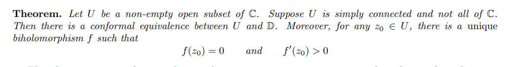
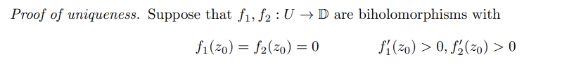
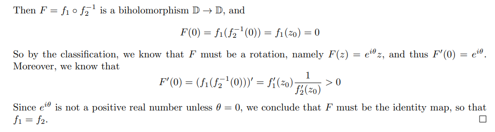
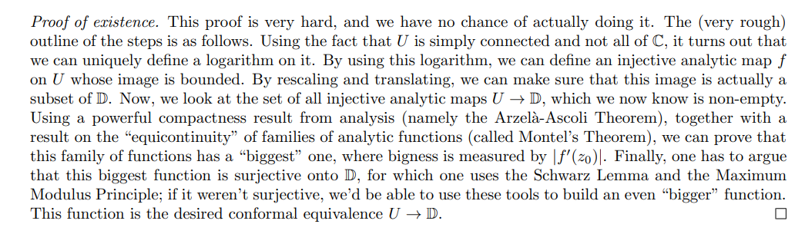
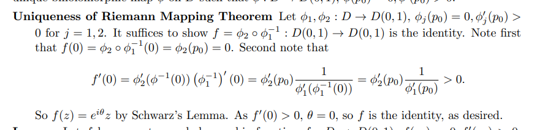

# Riemann Mapping

:::{.slogan}
If $\Omega \subseteq \CC$ with $\pi_1 \Omega = 1$ then $\Omega$ is biholomorphic to $\DD$.
:::

:::{.theorem title="Riemann Mapping"}
If $\Omega$ is simply connected, nonempty, and not all of $\CC$, then for every $z_{0}\in \Omega$ there exists a unique conformal map $F:\Omega \to \DD$.
Moreover, it can be arranged so that $F(z_{0}) = 0$ and $F'(z_{0}) > 0$.

Thus any two such sets $\Omega_{1}, \Omega_{2}$ are conformally equivalent.

:::

:::{.remark}
Necessity of hypothesis:

- Not all of $\CC$: $F: \CC \to \Omega$ with $\Omega$ bounded implies $F$ is constant by Liouville.
- Simply connected: since $\pi_1 \DD = 1$, any closed curve in $\Omega$ is nullhomotopic by finding $F$ and composing $F\inv$ with a homotopy in $\DD$.

:::

:::{.proof title="Sketch"}
The basic idea:

- Consider the set $\mcf$ of conformal $h: \Omega\to \DD$ with $h(z_0) = 0$ and $h'(z_0) > 0$ which are not necessarily surjective.
- Show there is a maximal $f\in \mcf$, and show $f$ is surjective.

More details:

- Fix some $z_0\in \Omega$ and set $\mcf = \ts{f\in \Hol(\Omega, \DD) \st f(z_0) = 0, f \text{ injective }}$.
  A lemma will show $\mcf$ is nonempty.

- Define the hyperbolic translations and compute
\[
h_w(z) &\da {z-w \over 1-\bar{w} z} \in \Hol(\DD)
h'_w(0) &= 1 - \ab{w}^2 \\
h'_w(w) &= {1\over 1 - \abs{w}^2}
.\]

- Show that if $f\in \mcf$ is not surjective, one can find another member with a larger derivative of $z_0$, say $g$ with $\abs{g'(z_0)} > \abs{f'(z_0)}$.

- Show that $\mcf$ is uniformly bounded and thus normal by Montel.
- Define $m\da \sup_{f\in \mcf} \abs{f'(z_0)}$, noting that $0<m<\infty$ since the maps are conformal and the Cauchy estimate supplies an upper bound:
\[
\abs{f'(z_0)} \leq \max_{\abs{z-z_0} = R} { \abs{f(z)} \over R} \leq {1\over R}
.\]

- Produce a sequence $\tilde \mcf = \ts{f_k}$ such that $\abs{f_k'(z_0)} \convergesto{k\to\infty} m$.
- Apply Montel to $\tilde \mcf$ which are uniformly bounded by 1 to extract a subsequence that converges locally uniformly to some $h$.
- Show $h\in \mcf$ by showing $h(z_0) = 0$, is analytic, and non-constant.
  Apply Hurwitz's theorem to conclude $h$ is injective as a uniform limit of injective functions.
- Show $h$ is surjective by showing $\abs{h'(z_0)} \geq \abs{g'(z_0)}$ (contrapositive to earlier step).

:::

:::{.corollary title="Uniformization"}
A simply connected nonempty domain $\Omega \subseteq \CC$ is conformally equivalent to exactly one of

- $\CP^1$,
- $\CC$, or
- $\DD$.

:::

:::{.proposition title="?"}
Prove that if $f:U\to V$ is holomorphic and injective then $f'(z)\neq 0$ on $U$.
:::

:::{.proof title="?"}
\envlist

- Idea: Rouché to get multiple roots, and translate a bit to make sure they're distinct.
- Toward a contradiction suppose $f'(z_0)=0$.
- Taylor expand and rearrange:
\[
f(z) 
&= f(z_0) + f'(z_0)(z-z_0) + f''(z_0)(z-z_0)^2 + \cdots \\
\implies f(z) - f(z_0) 
&= \sum_{j\geq 1} f^{(j)}(z_0)(z-z_0)^j = a(z-z_0)^k + (z-z_0)^{k+1}H(z)
,\]
where $k\geq 2$ is the first nonvanishing derivative and $a\da f^{(k)}(z_0)$.

- So we can write
\[
f(z) - f(z_0) \da F_1(z) + G(z) && F_1(z) \da f^{(k)}(z_0)(z-z_0)^k
,\]
where $G$ vanishes to order at least $k+1$ near $z_0$.

- For $\abs{z-z_0}$ small, note that $\deg F_1 = k$ and $\deg G \geq k+1$, so there is some neighborhood $N$ about $z_0$ where $\abs{F_1(z)} > \abs{G(z)}$.

- Subtract off a small $w$:
\[
f(z) - f(z_0) - w = F(z) + G(z) && F(z) \da a(z-z_0)^k - w
.\]

  Since $\abs{F_1} > \abs{G}$, picking $w$ small enough preserves this inequality, so $\abs{F} > \abs{G}$ on $N$.

- Apply Rouché: $\size Z(F) = \size Z(F+G) = \size Z(f(z) - f(z_0) - w)$.

- But $F(z) = a(z-z_0)^k - w$ has exactly $k$ zeros, and $k\geq 2$.
  It only remains to check if they are distinct: 
  $F'(z) = f'(z)$, and the claim is that we can choose a small enough neighborhood $N'$ of $z_0$ so that $f'(z)\neq 0$ for $z\neq z_0$, so $F$ and $f$ have distinct roots here.
  This would contradict injectivity.

- Toward a contradiction, suppose no such $N'$ exists.
  Form a sequence of shrinking neighborhoods $N_j$ about $z_0$.

- For each $N_j$, find a $z_j$ and $w_j$ such that $f(z_j) - w_j = 0$, so $f(z_j) = w_j$ with multiplicity at least 2 and $f'(z_j) = 0$.

- Choose them so that $\abs{w_{j+1}} < \abs{w_j}$ so $\ts{w_j}\to 0$.
  But then $\ts{z_j}\to z_0$ with the $z_j$ distinct, making it a set with an accumulation point.
  By the identity principal, $f' \equiv 0$, again contradicting injectivity.

:::

:::{.corollary title="Injective implies holomorphic inverse"}
If $f:U\to V$ is holomorphic and injective, then $f$ is invertible on its image.
:::

:::{.proof title="?"}
\envlist

- Idea: show that the usual formula from Calculus will work by defining $(f\inv)'$ directly.
- By the proposition, $f'(z) \neq 0$ for $z\neq z_0$ in $U$.
- Write $g\da f\inv$ on $\im f$, and without loss of generality, replace $V$ by $\im f$.
- For $w, w_0\in V$ with $0 < \abs{w-w_0}$ small, write $w = f(z)$ and $w_0 = f(z_0)$ for $z, z_o\in U$.
- Check the formula for $g'(w_0)$ and use that $f'(z_0)\neq 0$:
\[
\frac{g(w)-g\left(w_{0}\right)}{w-w_{0}}=\frac{1}{\frac{w-w_{0}}{g(w)-g\left(w_{0}\right)}}=\frac{1}{\frac{f(z)-f\left(z_{0}\right)}{z-z_{0}}}
\convergesto{z\to z_0} 
{1\over f'(z_0) } =
{1\over f'(g(w_0))}
.\]
:::

