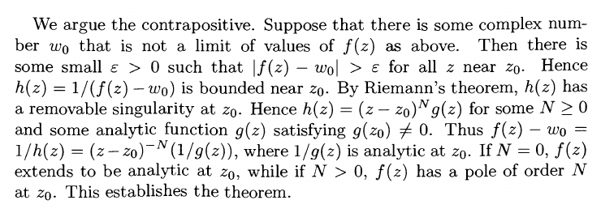

# Casorati-Weierstrass

:::{.theorem title="Casorati-Weierstrass" ref="Casorati"}
If $f$ is holomorphic on $\Omega\setminus\theset{z_0}$ where $z_0$ is an essential singularity, then for every $V\subset \Omega\setminus\theset{z_0}$, $f(V)$ is dense in $\CC$.

Equivalently, suppose $z_{0}$ is an essential isolated singularity of $f(z)$. Then for every complex number $w_{0}$, there is a sequence $z_{n} \rightarrow z_{0}$ such that $f\left(z_{n}\right) \rightarrow w_{0}$.
:::

:::{.slogan}
The image of a punctured disc at an essential singularity is dense in $\CC$.
:::

:::{.proof title="of Casorati-Weierstrass"}
Pick $w\in \CC$ and suppose toward a contradiction that $D_R(w) \intersect f(V)$ is empty.
Consider
\[
g(z) \da {1\over f(z) - w}
,\]
and use that it's bounded to conclude that $z_0$ is either removable or a pole for $f$.

In detail, from Gamelin:

:::

:::{.exercise title="?"}
Find all entire functions $f$ that satisfy
\[
\abs{f(z)} \geq e^{\abs{z}} && \forall z\in \CC
.\]

#completed

:::

:::{.solution}
Claim: there are no such functions.
Consider $g(z) \da f(z)/e^z$, which is entire since $e^z$ is nonvanishing.
Now $g$ is entire and $\abs{g} \geq 1$ everywhere, so $\im(g) \intersect \DD$ is empty.
This contradicts Casorati-Weierstrass, which requires that $\im g$ be dense in $\CC$.

Alternatively, note $f\neq 0$ by the inequality, so $1/f$ is bounded and entire and thus constant.
However, $f(z) = c$ contradicts the inequality, since $e^{\abs{z}}\to \infty$ as $\abs{z}\to \infty$.

Alternatively, note that $e^{\abs{z}} \geq 1$ for all $z$, so $\im(f) \intersect \DD$ is empty, again contradicting Casorati-Weierstrass.
:::

:::{.exercise title="?"}
Let $f$ be entire and define a function
\[
m: [0, \infty) &\to \RR \\
r &\mapsto \min_{\abs{z} = r} \abs{f(z)}
.\]
Suppose $\tilde m \da \lim_{r\to \infty}m(r)$ exists and is a finite positive real number, and show that $f$ is constant.

#work

> Hint: consider $g(z) \da f(1/z)$.

:::

