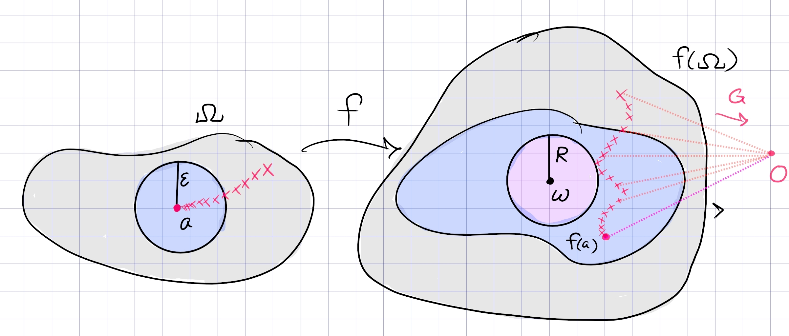

# Casorati-Weierstrass

:::{.theorem title="Casorati-Weierstrass" ref="Casorati"}
If $f$ is holomorphic on $\Omega\setminus\theset{z_0}$ where $z_0$ is an essential singularity, then for every $V\subset \Omega\setminus\theset{z_0}$, $f(V)$ is dense in $\CC$.

Equivalently, suppose $z_{0}$ is an essential isolated singularity of $f(z)$. Then for every complex number $w_{0}$, there is a sequence $z_{n} \rightarrow z_{0}$ such that $f\left(z_{n}\right) \rightarrow w_{0}$.

:::

:::{.slogan}
The image of a punctured disc at an essential singularity is dense in $\CC$.
:::

:::{.proof title="of Casorati-Weierstrass"}
Let $f$ have an essential singularity.
Suppose toward a contradiction that there exists a $z_0\in \CC$, a punctured neighborhood $\Omega$ of $z_0$, and $\eps > 0$ with $f(\Omega) \intersect \DD_\eps(z_0)$ empty.
So $\abs{f(z) - z_0}>\eps$ for every $z\in \Omega$.
Write $\tilde \Omega \da \Omega\union\ts{z_0}$.

Define $g(z) \da {1\over f(z) - z_0}$, noting that $z_0$ is the only singularity of $g$ in $\tilde\Omega$, making $g$ holomorphic on $\Omega$.
We have $\abs{g(z)} < \eps\inv < \infty$ for all $z\in \Omega$, so $g$ is bounded in $\Omega$ and $z_0$ must be a removable singularity.
By Riemann's removable singularity theorem, $g$ extends to a holomorphic function on all of $\tilde\Omega$.

We can now write $f(z) = {1\over g(z)} + z_0$.
If $g(z_0) = 0$, then it is a zero of some finite order for $g$, and thus a pole of finite order for $f$, contradicting that $z_0$ is essential for $f$.
Otherwise, if $g(z_0) = w_0\neq 0$, then 
\[
\abs{ f(z_0)} = \abs{ {1\over w_0} + z_0} \leq \eps + \abs{z_0} < \infty
,\]
making $z_0$ removable and again yielding a contradiction.
:::

:::{.proof title="of Casorati-Weierstrass, Gamelin"}
Pick $w\in \CC$ and suppose toward a contradiction that $D_R(w) \intersect f(V)$ is empty.
Consider
\[
g(z) \da {1\over f(z) - w}
,\]
and use that it's bounded to conclude that $z_0$ is either removable or a pole for $f$.

In detail, from Gamelin:

:::

# Exercises

:::{.exercise title="Entire functions missing a disc"}
Show that if $f$ is entire and there exists a disc $\DD_r(a)$ not intersecting $f(\CC)$, then $f$ must be constant.

#complex/exercise/completed

:::

:::{.solution}
Write $a\not\in f(\CC)$, and replace $f$ with $f(z) - a$ so that $f(a) = 0$ and there is some $\DD_R(0)$ not intersecting $f(\CC)$.
Then $f(z) \in \DD_R^c$ for all $z\in \CC$, so $\abs{f(z)} > R$ for all $z$.
Defining $G(z) \da {1\over f(z)}$ yields $\abs{G(z)} < R\inv$ for all $z$, making $G$ bounded.
The singularity of $G$ at $z=0$ is thus removable, so $G$ extends to an entire function by Riemann's removable singularity theorem.
By Liouville, $G$ is constant, so $f$ is constant.
:::

:::{.exercise title="Entire functions satisfying a bound"}
Find all entire functions $f$ that satisfy
\[
\abs{f(z)} \geq e^{\abs{z}} && \forall z\in \CC
.\]

#complex/exercise/completed

:::

:::{.solution}
Claim: there are no such functions.
Consider $g(z) \da f(z)/e^z$, which is entire since $e^z$ is nonvanishing.
Now $g$ is entire and $\abs{g} \geq 1$ everywhere, so $\im(g) \intersect \DD$ is empty.
This contradicts Casorati-Weierstrass, which requires that $\im g$ be dense in $\CC$.

Alternatively, note $f\neq 0$ by the inequality, so $1/f$ is bounded and entire and thus constant.
However, $f(z) = c$ contradicts the inequality, since $e^{\abs{z}}\to \infty$ as $\abs{z}\to \infty$.

Alternatively, note that $e^{\abs{z}} \geq 1$ for all $z$, so $\im(f) \intersect \DD$ is empty, again contradicting Casorati-Weierstrass.
:::

:::{.exercise title="Showing a function is constant"}
Let $f$ be entire and define a function
\[
m: [0, \infty) &\to \RR \\
r &\mapsto \min_{\abs{z} = r} \abs{f(z)}
.\]
Suppose $\tilde m \da \lim_{r\to \infty}m(r)$ exists and is a finite positive real number, and show that $f$ is constant.

#complex/exercise/work

> Hint: consider $g(z) \da f(1/z)$.

:::

:::{.solution}
Define 
\[
\ell(r) 
&\da {1\over m(r)} \\
&= {1\over \min_{\abs{z} = r} \abs{f(z)} } \\
&\leq \max_{\abs{z} = r} \abs{1\over f(z)} \\
&\leq \max_{\abs{z} \leq r} \abs{1\over f(z)} 
,\]
where the last equality follows from the MMP.
Now if $m(r) \to \tilde m$ then $\ell(r) \to \tilde m\inv$, which is again a finite positive real number.

:::

