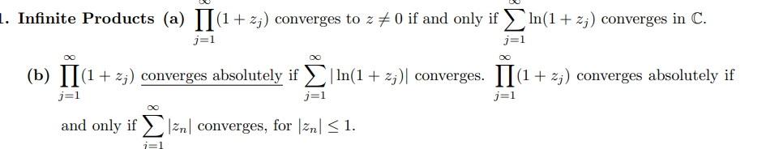
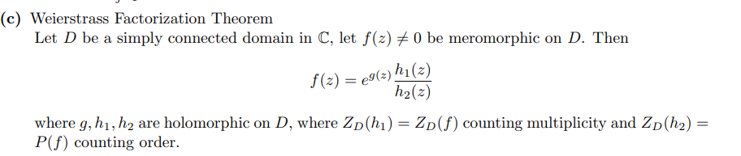

# Tuesday, December 14

:::{.fact title="Infinite products"}

:::

:::{.theorem title="Weierstrass factorization"}

:::

:::{.exercise title="?"}
Prove that if $D$ is a simply connected domain and $f(z)$ is holomorphic and nonzero on $D$, then $f(z)=e^{g(z)}$, where $g(z)$ is holomorphic on $D$.
:::

:::{.solution}

:::

:::{.proposition title="Special functions"}
The gamma function:
\[
\Gamma(z)=\int_{0}^{\infty} t^{z-1} e^{-t} d t
.\]

- Integrating by parts yields $z\Gamma(z) = \Gamma(z+1)$. 
- Simple poles on $-\ZZ_{\leq 0}$ with $\Res_{z=-k}\Gamma(z) = {(-1)^k \over k!}$.

The Riemann-Zeta function:
\[
\zeta(s) = \sum_{k\geq 1}k^{-s}
.\]

Its functional equation:
\[
\zeta(z)=2^{z} \pi^{z-1} \sin \left(\frac{\pi z}{2}\right) \Gamma(1-z) \zeta(1-z)
.\]

:::

