# Special Functions

## Transforms

:::{.remark}

\[
\hat{f}(\xi) \da \int_\RR e^{-i\xi x} f(x)\dx \\
f(x) = {1\over 2\pi}\int_\RR e^{i\xi x} \hat{f}(\xi) \dxi 
.\]

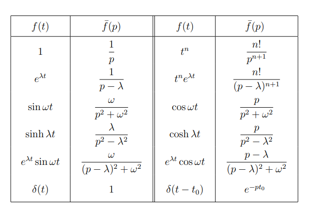

:::

## The Gamma Function

:::{.definition title="Gamma function"}
\[
\Gamma(z) = \int_0^\infty t^{z-1}e^{-t} \dt
.\]
:::

:::{.remark}
Some interesting properties of $\Gamma$:
$\Gamma(z+1) = z\Gamma(z)$ and has simple poles at $z=0,-1,-2,\cdots$ with residues $\Res_{z=-m} \Gamma(z) = (-1)^m/m!$.
There is also a factorization
\[
\Gamma(z) = {1 \over ze^{\gamma z} \prod_{n=1}^\infty \qty{1 + {z\over n}}e^{-z\over n} }
\]
where $\gamma \da \lim_{N\to\infty } \sum_{n=1^N} {1\over n} - \log(N)$

\[
\Gamma(z) \Gamma(1-z) = {\pi \over \sin(\pi z)}
,\]
which yields a product factorization for $\sin(\pi z)$.

$\mcl(t^{z-1}, s=1) = \Gamma(z)$ and $\mcl(t^n, s=1) = \Gamma(n+1)$.

The residues:

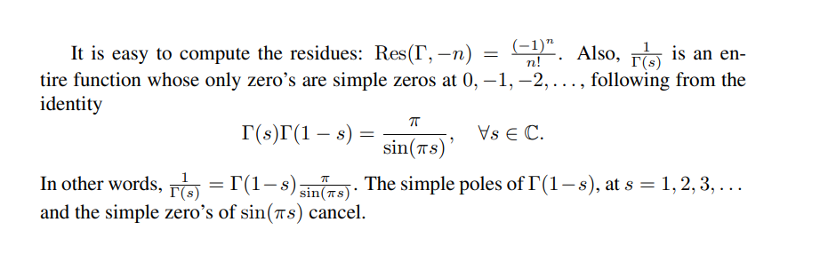

:::

:::{.proposition title="$\Gamma$ is holomorphic on the right half-plane"}

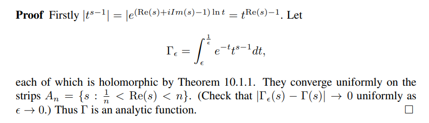

:::

:::{.proposition title="Functional equation for $\Gamma$"}

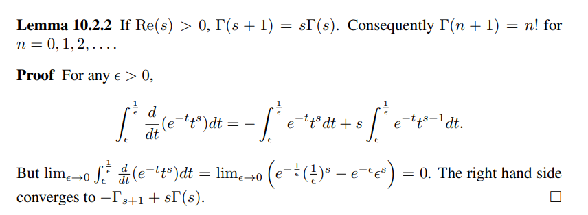

:::

:::{.proposition title="Meromorphic continuation of $\Gamma$"}

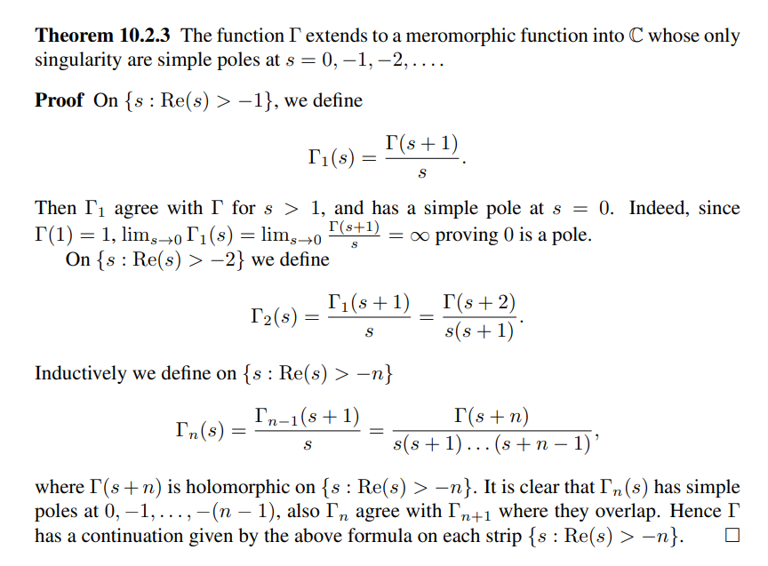
:::

## The Beta Function

:::{.definition title="Beta function"}
\[
B(z, w)=\int_{0}^{1} t^{z-1}(1-t)^{w-1} \mathrm{~d} t
.\]

:::

:::{.exercise title="?"}
Show that
\[
B(z, w) = {\Gamma(z) \Gamma(w) \over \Gamma(z+w)}
.\]

> Hint: find $\mcl(t^{z-1})$ and $\mcl(t^{z-1}\convolve t^{w-1})$.
:::

## Riemann Zeta

:::{.definition title="The Riemann Zeta Function"}

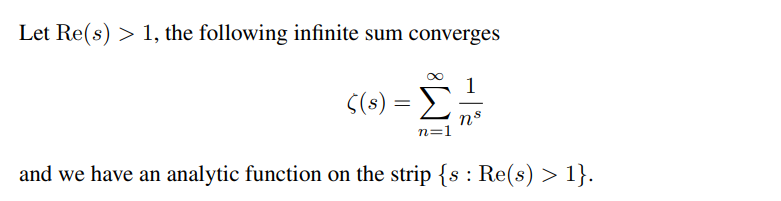

There is a product expansion
\[
\zeta(s) = \prod_{p\in \spec \ZZ} {1\over 1-p^{-s}}
,\]
where $\spec \ZZ$ are the primes of $\ZZ$.
:::

:::{.proposition title="Meromorphic continuation of $\zeta$"}

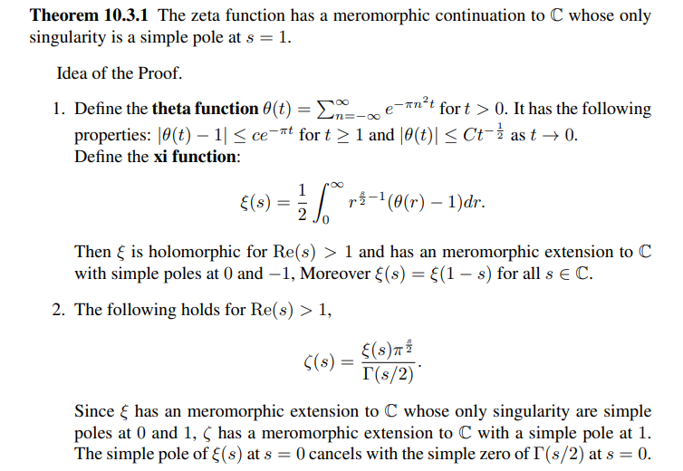

There is a functional equation:

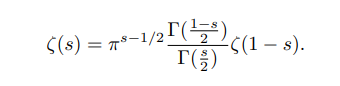

:::

:::{.proposition title="Zeros of $\zeta$"}

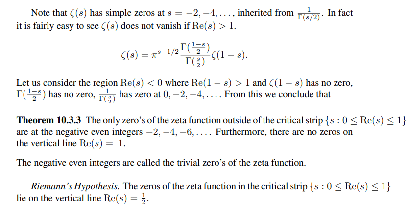

:::

## Weierstrass $\wp$

:::{.definition title="The Weierstrass $\wp$ function"}

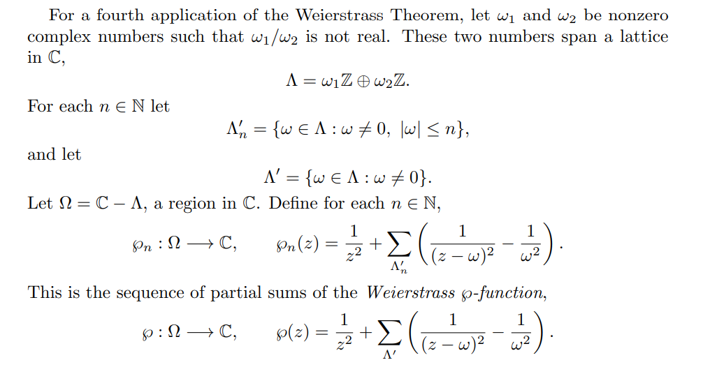

:::

:::{.remark}

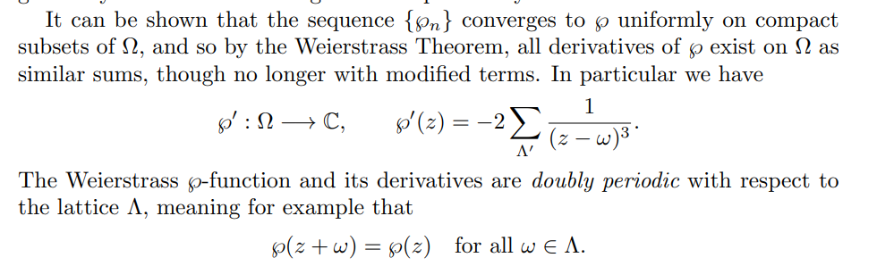

:::

# Elliptic Functions

#todo

## Infinite Series and Products

:::{.fact title="Infinite products"}

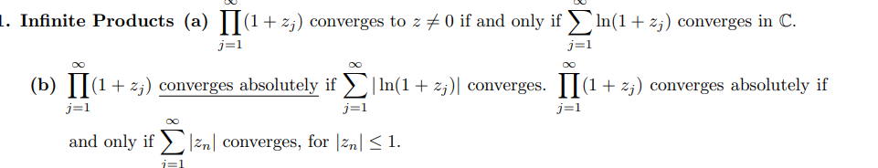

:::

:::{.theorem title="Weierstrass factorization"}

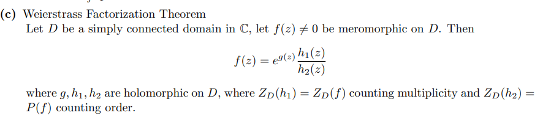

:::

:::{.remark}
An interesting way to sum infinite series:

\[
\sum_{n=-\infty}^{\infty} f(n) &=-(\operatorname{sum} \quad \text { of } \quad \text { residues } \quad \text { of } \quad \pi \cot \pi z f(z)) \\
\sum_{n=-\infty}^{\infty}(-1)^{n} f(n) &=-(\operatorname{sum} \quad \text { of } \quad \text { residues } \quad \text { of } \quad \pi \csc \pi z f(z)) \\
\sum_{n=-\infty}^{\infty} f\left(\frac{2 n+1}{2}\right) &=(\operatorname{sum} \quad \text { of } \quad \text { residues of } \quad \pi \tan \pi z f(z)) \\
\sum_{n=-\infty}^{\infty}(-1)^{n} f\left(\frac{2 n+1}{2}\right) &=(\operatorname{sum} \quad \text { of residues of } \pi \sec \pi z f(z)) .
.\]

:::

:::{.exercise title="Sum formulas: 1/(n-a)^2"}
Show that
\[
\sum_{k\in \ZZ}{1\over (z-k)^2} = (\pi \csc(\pi z))^2
.\]

#complex/exercise/work

:::

:::{.exercise title="Sum formulas: $1/n^2$"}
Show
\[
\sum_{n \geq 1} \frac{1}{n^{2}}=\frac{\pi^{2}}{6}
\]
by integrating $\pi \cot(\pi z)z^{-2}$.

#complex/exercise/work

:::

:::{.exercise title="Sum formulas: $1/n^2+a^2$"}
Show that
\[
\sum_{k\in \ZZ} {1\over k^2 + a^2} = {\pi \coth(\pi a) \over a} \qquad\text{for } a>0
.\]

#complex/exercise/work

:::

:::{.exercise title="?"}
Show that
\[
\sum_{k\geq 1}{1\over k^2 + a^2} = {1\over 2}{\pi \coth(\pi a)\over a} - {1\over 2a^2} \qquad a>0
.\]

#complex/exercise/work

:::

:::{.exercise title="?"}
Show that
\[
\sum_{k\in \ZZ} {1\over \qty{ k - {1\over 2}}^2 } = \pi^2
.\]

#complex/exercise/work

:::

:::{.exercise title="?"}
Show that
\[
\sim_{k\in \ZZ} { (-1)^k \over (k+a)^2} = \pi^2 \cos(\pi a)\csc^2(\pi a) && \text{for } a\in \RR\sm\ZZ
.\]

#complex/exercise/work

:::

