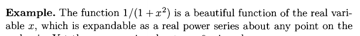

# Extra Questions

:::{.exercise title="Uniform limit of holomorphic is holomorphic"}
Show that if $f_k\to f$ uniformly on $\Omega$ with $f_k$ holomorphic then $f$ is holomorphic.
:::

:::{.solution}

:::

- Show that if $f$ is holomorphic on $\DD$ then $f$ has a power series expansion that converges uniformly on every compact $K\subset \DD$.
- Show that any holomorphic function $f$ can be uniformly approximated by polynomials.
- Show that if $f$ is holomorphic on a connected region $\Omega$ and $f'\equiv 0$ on $\Omega$, then $f$ is constant on $\Omega$.

- Show that if $\abs{f} = 0$ on $\bd \Omega$ then either $f$ is constant or $f$ has a zero in $\Omega$.
- Show that if $\theset{f_n}$ is a sequence of holomorphic functions converging uniformly to a function $f$ on every compact subset of $\Omega$, then $f$ is holomorphic on $\Omega$ and $\theset{f_n'}$ converges uniformly to $f'$ on every such compact subset.
- Show that if each $f_n$ is holomorphic on $\Omega$ and $F \definedas \sum f_n$ converges uniformly on every compact subset of $\Omega$, then $F$ is holomorphic.
- Show that if $f$ is once complex differentiable at each point of $\Omega$, then $f$ is holomorphic.
- Show that if $f_k \to f$ uniformly with $f$ holomorphic then every $n$th derivative satisfies $f_k^{(n)}\to f^{(n)}$ uniformly.
