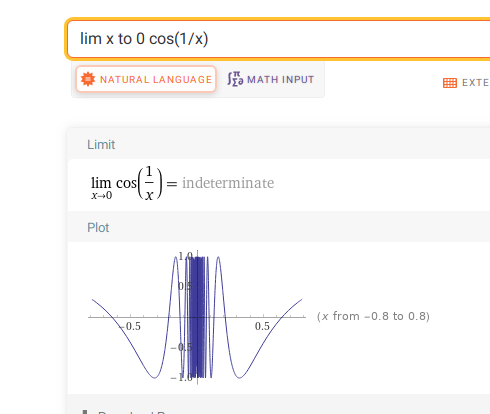

# Real Analysis Review

## Spring 2019.1 #work/qual

^0a8ca5

Define

$$
E(z)=e^{x}(\cos y+i \sin y) .
$$

- Show that $E(z)$ is the unique function analytic on $\mathbb{C}$ that satisfies

$$
E^{\prime}(z)=E(z), \quad E(0)=1 .
$$

- Conclude from the first part that 
\[
E(z)=\sum_{n=0}^{\infty} \frac{z^{n}}{n !}
.\]

## Recurrences #work/qual

:::{.problem title="?"}
Let $x_0 = a, x_1 = b$, and set
\[  
x_n \definedas {x_{n-1} + x_{n-2} \over 2} \quad n\geq 2
.\]

Show that $\theset{x_n}$ is a Cauchy sequence and find its limit in terms of $a$ and $b$.

:::

:::{.solution}
With some substitution, one can compute
\[
\abs{x_n - x_{n-1}}
= \abs{{1\over 2} x_{n-1} + {1\over 2} x_{n-2} - x_{n-1}}
= {1\over 2} \abs{x_{n-1} - x_{n-2}}
,\]
which holds for all $n$.
This is enough to show that the sequence is contractive, i.e. 
\[
\abs{x_n - x_{n-1}} = c \abs{x_{n-1} - x_{n-2}} && c\in (0, 1)
.\]

Apply this recursively yields
\[
\abs{x_n - x_{n-1}} = \qty{1\over 2}^{n-1} \abs{b-a} \convergesto{n\to\infty} 0
,\]
since $\abs{b-a}$ is a constant.
So in fact $x_n$ is convergent and thus Cauchy convergent.

Note: to compare $\abs{x_i - x_j}$ directly, assume $i>j$ and apply the above estimate $i-j+1$ on $\abs{x_i - x_{i-1}}, \abs{x_{i-1} - x_{i-2}}, \cdots$ to reduce to this case.
This yields something like
\[
\abs{x_i - x_j} = \qty{1\over 2}^{i-j+1}\abs{x_{j} - x_{j-1}} = \qty{1\over 2}^{i-j+1} \qty{1\over 2}^{j-1} \abs{b-a}\to 0
.\]
One could equivalently use the triangle inequality and a partial geometric sum to write
\[
\abs{x_i - x_j} \leq \sum_{j\leq k \leq i-1} \abs{x_{k+1} - x_{k}} \implies \abs{x_i - x_j} \leq c^j\qty{1\over 1-c}\abs{b-a}
.\]

Computing its limit: the usual trick of setting $L \da \lim x_n = \lim x_{n-1} = \lim x_{n-2}$ only yields $L = {L + L \over 2}$ here, and thus no information.
Instead assume $x_n = r^n$ is geometric, then
\[
2x_n - x_{n-1} - x_{n-2} = 0 \implies 2r^n - r^{n-1} - r^{n-2} = 0 \implies 2r^2 - r - 1 = 0 \iff (2r+1)(r-1) = 0 \implies r = -1/2, 1
.\]
Write a general solution as 
\[
x_n = c_1 (-1/2)^n + c_2 (1)^n = c_1 (-1/2)^n + c_2
,\]
and solve for initial conditions:
\[
x_0: \quad a &= c_1 + c_2 \\
x_1: \quad b &= (-1/2)c_1 + c_2 \\ \\
\implies
\matt 1 1 {-1/2} 1
\begin{bmatrix}
c_1  
\\
c_2 
\end{bmatrix} &=
\begin{bmatrix}
a  
\\
b 
\end{bmatrix} \\
\implies 
\begin{bmatrix}
c_1  
\\
c_2 
\end{bmatrix} &=
{1\over 1 + (1/2)}
\matt 1 {-1} {1/2} 1
\begin{bmatrix}
a  
\\
b 
\end{bmatrix} 
\\
&=
\qty{1\over 3}
\matt 2 {-2} {1} 2
\begin{bmatrix}
a  
\\
b 
\end{bmatrix} \\
&=
\qty{1\over 3}
\begin{bmatrix}
2a-2b
\\
a+b
\end{bmatrix} 
.\]

So the general solution is
\[
x_n = {2\over 3}(a-b) \qty{-1\over 2}^n + {1\over 3}(a+b)\convergesto{n\to \infty} \qty{1\over 3}(a+b)
.\]
:::

## Uniform continuity #work/qual

:::{.problem title="?"}
Suppose $f:\RR\to\RR$ is continuous and $\lim_{x\to \pm \infty} f(x) = 0$.
Prove that $f$ is uniformly continuous.
:::

:::{.solution}
Fix $\eps>0$, we need to find a $\delta = \delta(\eps)$ such that
\[
\abs{x-y}<\delta \implies \abs{f(x) - f(y)} < \eps && \forall x, y\in \RR
.\]
Use that $\lim_x\to \pm \infty f(x) = 0$ to choose $M\gg 0$ such that
\[
\abs{x} \geq M \implies \abs{f(x)} \leq \eps/2
,\]
then
\[
\abs{x}, \abs{y} \geq M \implies \abs{f(x) - f(y)} \leq \abs{f(x)} + \abs{f(y)} \leq \eps
.\]
So in this region choose (say) $\delta_1 < \eps$ to ensure that $B_\delta(x), B_\delta(y) \subseteq [-M, M]^c$.
On $[-M, M]$, note that this region is compact and $f$ continuous on a compact set implies uniformly continuous.
So use this to choose $\delta_2 = \delta_2(\eps)$ in this region to ensure $\abs{f(x) - f(y)} < \eps$.

This handles the cases $x, y \in (M, M)^c$, or $x,y\in [M, M]$, so it only remains to handle $x\in [M, M]$ and $y\in (M, M)^c$ (wlog, relabeling $x,y$ if necessary).
In this case, use the triangle inequality:
\[
\abs{f(x) - f(y)} 
&= \abs{f(x) - f(M) + f(M) -f(y)} \\
&\leq \abs{f(x) - f(M)} + \abs{f(M) -f(y)} \\
&\leq \eps + \abs{f(M)} + \abs{f(y)} \\
&\leq \eps + \eps + \eps 
,\]
where we've used that $M, y\in (M, M)^c$ to apply the first bound and $M, x\in [M, M]$ to apply the second.
:::

## Negating uniform continuity #complex/qual/completed

> Tie, Fall 2009

:::{.problem title="?"}
Show that $f(z) = z^2$ is uniformly continuous in any open disk $|z| < R$, where $R>0$ is fixed, but it is not uniformly continuous on $\mathbb C$.
:::

:::{.solution}
A direct computation: fix $\eps>0$ and suppose $\abs{z-w} < R$. 
Then
\[
\abs{z^2-w^2} 
&= \abs{z-w}\abs{z+w} \\
&\leq \delta \qty{\abs z + \abs w} \\
&\leq \delta \cdot 2R
,\]
so choose $\delta < { \eps \over 2R}$ to get uniform continuity on $\DD_{R/2}(0)$.

To see $f$ can't be uniformly continuous on $\CC$, take $\eps \da c$ any constant and suppose the appropriate $\delta$ exists.
We'll look for a bad pair of $z, w$, so take $w = z + {1\over 2}\delta$.
This would imply
\[
\abs{z^2 - w^2}
&= \abs{z^2 - (z+\delta)^2} \\
&= \abs{-2z\delta - \delta^2} \\
&= \abs{2z\delta + \delta^2} \\
&= \delta \abs{2z + \delta} \\
&\convergesto{\abs{z}\to\infty}\infty
,\]
using the $\delta = \delta(\eps)$ can't depend on $z$ or $w$, and is thus constant in this expression.
This contradicts that $\abs{z^2-w^2} < \eps = c < \infty$.
:::

## Non-continuously differentiable #complex/qual/completed

:::{.problem title="?"}
Give an example of a function $f:\RR\to \RR$ that is everywhere differentiable but $f'$ is not continuous at 0.
:::

:::{.solution}
The standard example:
\[
f(x) \da 
\begin{cases}
x^2\sin\qty{1\over x} & x\neq 0 
\\
0 & x=0.
\end{cases}
.\]

Away from zero, this is clearly differentiable since we can just compute the derivative by the chain rule. It turns out that
\[
f'(x) = 
\begin{cases}
2x\sin\qty{1\over x} + x^2 \cos\qty{1\over x}\qty{-1\over x^2} = 2x\sin\qty{1\over x} - \cos\qty{1\over x} & x\neq 0 
\\
0 & x=0.
\end{cases}
.\]
Here we check differentiability and compute the derivative at $x=0$ directly:
\[
{f(x) - f(0) \over x-0} = {x^2\sin\qty{1\over x} - 0 \over x-0} = x\sin\qty{1\over x} \convergesto{x\to 0} 0 
,\]
using that $-x \leq \abs{x\sin \qty{1\over x}}\leq x$.

But now notice that the $\cos\qty{1\over x}$ term in $f'$ isn't enveloped by an $x^c$ term, so $\lim_{x\to 0} f'(x)$ does not exist for oscillatory reasons:

In particular, $\lim_{x\to 0}f'(x) \neq f'(0) = 0$.
:::

## Uniformly convergent + uniformly continuous #complex/qual/completed

:::{.problem title="?"}
Suppose $\theset{g_n}$ is a uniformly convergent sequence of functions from $\RR$ to $\RR$ and $f:\RR\to \RR$ is uniformly continuous.
Prove that the sequence $\theset{f\circ g_n}$ is uniformly convergent.
:::

:::{.solution}
Uniformly convergent means that $\norm{g_i - g_j}_{\infty} \to 0$, so $\sup_{x\in X}\abs{g_i(x)-g_j(x)} \convergesto{i, j\to\infty} 0$.
We want to show that given $\eps$ we can find $N_0$ such that $i, j > N_0$ yields
\[
\sup_{x\in X}\abs{ f\circ g_i(x) - f\circ g_j(x) } < \eps
.\]

Fix $\eps> 0$, then choose $\delta_1 = \delta_1(\eps)$ by uniform continuity of $f$ to guarantee
\[
\abs{y_1 - y_2} \leq \delta_1 \implies \abs{f(y_1) - f(y_2) } < \eps \, \forall y_1, y_2\in X
.\]
Now by uniform convergence of $\ts{g_n}$, choose $N_0 = N_0(\delta_1)$ such that 
\[
i, j \geq N_0 \implies \abs{ g_i(x) - g_j(x) } < \delta_1 \, \forall x\in X
.\]

Now writing $y_1 \da g_i(x), y_2 \da g_j(x)$, choose $i, j > N_0$ yields
\[
\abs{y_1 - y_2} \da \abs{g_i(x) - g_j(x) } < \delta_1 \\
\implies \abs{f(y_1) - f(y_2)} \da \abs{f(g_i(x)) - f(g_j(x))} < \eps
,\]
and taking the supremum over $x\in X$ preserves the inequality since $\delta_1$ and consequently $N_0$ only depend on $\eps$.
:::

## Uniform differentiability #complex/qual/completed

:::{.problem title="?"}
Let $f$ be differentiable on $[a, b]$.
Say that $f$ is *uniformly differentiable* iff 

\[  
\forall \varepsilon > 0,\, \exists \delta > 0 \text{ such that } \quad \abs{x-y} < \delta \implies \abs{ {f(x) - f(y) \over x-y}  - f'(y)}  < \eps
.\]

Prove that $f$ is uniformly differentiable on $[a, b] \iff f'$ is continuous on $[a, b]$.
:::

:::{.solution}
$\implies$:
Fix $\eps>0$ and choose $\delta = \delta(\eps)$ to get a bound corresponding to $\eps/2$, then for all $x,y$ with $\abs{x-y} < \delta$ on $[a, b]$, we have
\[
\abs{f'(x) - f'(y) } \leq 
\abs{f'(x) - {f(x) - f(y) \over x- y} } + \abs{ {f(x) - f(y) \over x-y} - f'(y)} < \eps
.\]
This uses uniformity to bound by $\eps/2$ the terms involving $f'(x)$ and $f'(y)$ respectively.
So $f'$ is in fact uniformly continuous on $[a, b]$.

$\impliedby$:
Let $\eps> 0$ and $x,y\in [a, b]$ be arbitrary.
Then by the MVT, we can a $\xi\in [x, y]$ with $f'(\xi)(x-y) = f(x) - f(y)$.
Then use continuity of $f'$ to choose $\delta = \delta(\eps, x, y)$ so that $\abs{x-y} < \delta \implies \abs{f(x) - f(y)} < \eps$, and note that $\abs{x-\xi} \leq \abs{x-y} < \delta$, so 
\[
\abs{ {f(x) - f(y) \over x-y } - f'(y) } = \abs{ f'(\xi) - f'(y)} < \eps
.\]

:::

## Inf distance #complex/qual/completed

:::{.problem title="?"}
Suppose $A, B \subseteq \RR^n$ are disjoint and compact.
Prove that there exist $a\in A, b\in B$ such that
\[  
\norm{a - b} = \inf\theset{\norm{x-y} \suchthat x\in A,\, y\in B}
.\]
:::

:::{.solution}
Define a function
\[
d: A \cross B &\to \RR \\
(x, y) &\mapsto \norm{x- y}
.\]
Then $d$ is a continuous function on a compact topological space (where the product is compact by Tychonoff), and the extreme value theorem applies: $d$ attains its min/max for some pair $(a, b)$ in its domain.

> Note that disjointness just guarantees that $\norm{a-b}>0$, since $\norm{a-b} = 0 \implies a=b$ and $A \intersect B = \emptyset$.

:::

## Connectedness #complex/qual/completed

:::{.problem title="?"}
Suppose $A, B\subseteq \RR^n$ are connected and not disjoint.
Prove that $A\union B$ is also connected.
:::

:::{.solution}
Use that $X$ is connected iff $\Hom_{\Top}(X, S^0) = \ts{c_{-1}, c_1}$, i.e. every continuous map from $X\to \ts{-1, 1}$ is a constant map $x \mapsvia{c_{-1}} -1$ or $x \mapsvia{c_1} 1$.
Let $f: A\union B \to S^0$ be arbitrary, and let $f_1 \da \ro{f}{A}$ and $f_2 \da \ro{f}{B}$.
By connectedness of $A$, $f_1$ is a constant map, as is $f_2$.
On the intersection, for $x\in A \intersect B \neq \emptyset$, we have $f_1(x) = f_2(x)$ since $x\in A$ and $x\in B$.
So $f_1$ and $f_2$ are constant functions that must map to the *same* constant, so $f$ is constant and this $A\union B$ is connected.
:::

## Pointwise and uniform convergence #complex/qual/completed

:::{.problem title="?"}
Suppose $\theset{f_n}_{n\in \NN}$ is a sequence of continuous functions $f_n: [0, 1]\to \RR$ such that 
\[  
f_n(x) \geq f_{n+1}(x) \geq 0 \quad \forall n\in \NN,\, \forall x\in [0, 1]
.\]
Prove that if $\theset{f_n}$ converges pointwise to $0$ on $[0, 1]$ then it converges to $0$ uniformly on $[0, 1]$.
:::

:::{.solution}
Let $\eps>0$, we want to show that there exists an $N_0$ such that $n\geq N_0$ implies $\norm{f_n}_\infty<\eps$.
Fix $x$, by pointwise convergence pick $M_x = M_x(x, \eps)$ so that $n\geq M \implies \abs{f_n(x)} < \eps$.
By continuity, this bound holds in some neighborhood $U_x \ni x$.
Produce a cover $\ts{U_x}_{x\in [0, 1]}\covers [0, 1]$; by compactness produce a finite subcover $\ts{U_1, \cdots, U_m} \covers [0, 1]$.
Each $U_i$ corresponds to some $x_i$ and some $M_{x_i}$, so choose $N_0 > \max_{i\leq m} \ts{M_{x_i}}$.
Then $n\geq N_0 \implies N\geq M_{x_i}$ for each $i$, so $\abs{f_n(x)} < \eps$ for each $x\in [0, 1]$ since $x\in U_i$ for some $i$.
So $\sup_{x\in X} \abs{f_n(x)} = \norm{f_n}_{\infty } < \eps$.
:::

## #work/qual

:::{.problem title="?"}
Show that if $E\subset [0, 1]$ is uncountable, then there is some $t\in \RR$ such that $E\intersect (-\infty ,t)$ and $E\intersect (t, \infty)$ are also uncountable.
:::

:::{.solution}
See 3.2.12 of Understanding analysis 2ed. of Abbott.
Show something stronger, that the following set is nonempty and open:
\[
S \da \ts{t\in \RR \st E \intersect (-\infty, t), E \intersect (t, \infty) \text{ are uncountable}}
\subseteq \RR
.\]
Write
\[
S_- &\da \ts{ t\in \RR \st E \intersect (- \infty, t) \text{ is countable}} \\
S_+ &\da \ts{ s\in \RR \st E \intersect (s, \infty) \text{ is countable}}
.\]

Note that $S_- \neq \RR$ since then we could write $E = \Union_{n\in \ZZ} E \intersect (- \infty, n)$ as a countable union of countable sets.

Claim: $S = (\sup S_-,, \inf S_+)$.

???

:::

## #work/qual

:::{.problem title="?"}
Suppose $f, g: [0, 1] \to \RR$ where $f$ is Riemann integrable and for $x, y\in [0, 1]$,
\[
\abs{g(x) - g(y)} \leq \abs{f(x) - f(y)}
.\]

Prove that $g$ is Riemann integrable.
:::

:::{.solution}
Write $U(f), L(f)$ for the upper and lower sums of $f$, so for $\Pi$ the collection of all partitions of $[0, 1]$,
\[
U(f) \da \inf_{P\in \Pi} U(f, P) && U(f, P) \da \sum_{k=1}^n \sup_{x\in I_k}f(x) \cdot \mu(I_k) \\
L(f) \da \sup_{P\in \Pi} L(f, P) && L(f, P) \da \sum_{k=1}^n \inf_{x\in I_k} f(x) \cdot \mu(I_k)
.\]

Note that integrability of $f$ is equivalent to
\[
\forall \eps \exists P \text{ such that }
U(f, P) - L(f, P) < \eps \\
\iff 
\sum_{k=1}^n \qty{ \sup_{x\in I_k} f(x) - \inf_{x\in I_k} f(x)} \mu(I_k) < \eps
.\]

:::

## Exercises

:::{.problem title="Uniform continuity of $x^n$"}
Show that $f(x) = x^n$ is uniformly continuous on any interval $[-M, M]$.

#work/exercise

:::

:::{.solution}
\[
\abs{x^n - y^n} = \abs{y-x}\abs{\sum_{1\leq k \leq n} x^k y^{n-k}} \leq n M^{n-1}\abs{y-x} \convergesto{y\to x}0
.\]
:::

:::{.problem title="?"}
Show $f(x) = x^{-n}$ for $n\in \ZZ_{\geq 0}$ is uniformly continuous on $[0, \infty)$.

#work/exercise

:::

:::{.solution}
\[
x^{1\over n} - y^{1\over n} \leq (x-y)^{1\over n} \convergesto{x\to y}0
,\]
using $(a+b)^m \geq a^m + b^m$
:::

:::{.problem title="?"}
Show that $f'$ bounded implies $f$ is uniformly continuous.

#work/exercise

:::

:::{.solution}
Apply the MVT:
\[
\abs{f(x) - f(y)} = \abs{f(\xi)} \abs{x-y} \convergesto{y\to x} 0
.\]

:::

:::{.problem title="?"}
Show that the Dirichlet function $f(x) = \chi_{I \intersect \QQ}$ is not Riemann integrable and is everywhere discontinuous.

#work/exercise

:::

:::{.solution}
Check $\sup f = 1$ and $\inf f = 0$ on every sub-interval, so $L(f, P) = 0$ and $U(f, P) = 1$ for every partition $P$ of $[0, 1]$.

Discontinuity: #todo

:::

