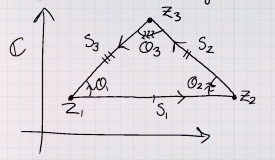

# Geometry

## Some Geometry
Let $z_{k}(k=1, \cdots, n)$ be complex numbers lying on the same side of a straight line passing through the origin. Show that

$$
z_{1}+z_{2}+\cdots+z_{n} \neq 0, \quad 1 / z_{1}+1 / z_{2}+\cdots+1 / z_{n} \neq 0
$$

> Hint: Consider a special situation first.

## Images of circles

Let $f(z)=z+1 / z$. Describe the images of both the circle $|z|=r$ of radius $r(r \neq 0)$ and the ray $\arg z=\theta_{0}$ under $f$ in terms of well known curves.

## Geometric Identities

Prove that $\left|z_{1}+z_{2}\right|^{2}+\left|z_{1}-z_{2}\right|^{2}=2\left(\left|z_{1}\right|^{2}+\left|z_{2}\right|^{2}\right)$ for any two complex numbers $z_{1}, z_{2}$, and explain the geometric meaning of this identity

## Geometric Identities

Use $n$-th roots of unity (i.e. solutions of $z^{n}-1=0$ ) to show that

$$
\cos \frac{2 \pi}{n}+\cos \frac{4 \pi}{n}+\cos \frac{6 \pi}{n}+\cdots+\cos \frac{2(n-1) \pi}{n}+=-1 \text { and } \\
\sin \frac{2 \pi}{n}+\sin \frac{4 \pi}{n}+\sin \frac{6 \pi}{n}+\cdots \frac{2(n-1) \pi}{n}=0
$$

> Hint: If $z^{n}+c_{1} z^{n-1}+\cdots+c_{n-1} z+c_{n}=0$ has roots $z_{1}, z_{2}, \ldots, z_{n}$, then
$$
z_{1}+z_{2}+\cdots+z_{n}=-c_{1} \\
z_{1} z_{2} \cdots z_{n}=(-1)^{n} c_{n} \text { (not used) }
$$

## Geometry from equations

Describe each set in the $z$-plane in (a) and (b) below, where $\alpha$ is a complex number and $k$ is a positive number such that $2|\alpha|<k$.

(a) $|z-\alpha|+|z+\alpha|=k$;

(b) $|z-\alpha|+|z+\alpha| \leq k$.

## Spring 2020.1, Spring 2020 HW 1.4 #complex/qual/completed 

^ea471a

:::{.problem title="?"}
\envlist

a. Prove that if $c>0$,
\[
\abs{w_1} = c\abs{w_2} \implies \abs{w_1 - c^2 w_2} = c\abs{w_1 - w_2}
.\]

b. Prove that if $c>0$ and $c\neq 1$, with $z_1\neq z_2$, then the following equation represents a circle:
\[
\abs{z-z_1 \over z-z_2} = c
.\]
Find its center and radius.

> Hint: use part (a)

:::

:::{.solution title="part 1"}
\[
\abs{w_1 - c^2 w_2}^2 
&= (w_1 - c^2 w_2) ( \bar{w_1} - c^2 \bar{w_2} ) \\
&= \abs{w_1}^2 + c^4 \abs{w_2}^2 - 2c^2 \Re(w_1 \bar{w_2}) \\
&= {\color{green} c^2 \abs{w_2}^2 } + c^4 \abs{w_2}^2 - 2c^2 \Re(w_1 \bar{w_2}) \\
&= c^2 \abs{w_2}^2 + {\color{green} c^2 \abs{w_1}^2 } - 2c^2 \Re(w_1 \bar{w_2}) \\
&= c^2 \abs{w_1 - w_2}
,\]
where we've applied the assumption $\abs{w_1} = c\abs{w_2}$ twice.
:::

:::{.solution title="part 2"}
Using part 1:
\[
w_1\da z-z_1, w_2 \da z-z_2 \implies \abs{w_1} &= c\abs{w_2} \\
\implies \abs{w_1 - c^2 w_2} &= c \abs{w_1 - w_2} \\
\implies \abs{ z-z_1 - c^2 (z-z_2) } &= \abs{(z-z_1) - (z-z_2)} \\
\implies \abs{(1-c^2) z - z_3} &= \abs{ z_2 - z_1 } \\
\implies \abs{z-z_4} &= r
,\]
where the $z_i$ and $r$ are all constant, so this is the equation of a circle.
:::

## Spring 2020 HW 1.1  #complex/exercise/completed

:::{.problem title="?"}
Geometrically describe the following subsets of $\CC$:

a. $\abs{z-1} = 1$
b. $\abs{z-1} = 2\abs{z-2}$
c. $1/z = \bar z$
d. $\Re(z) = 3$
e. $\Im(z) = a$ with $a\in \RR$.
f. $\Re(z) > a$ with $a\in \RR$.
g. $\abs{z-1} < 2\abs{z-2}$

:::

:::{.solution}
\envlist

a. A circle of radius 1 about $z=1$.
b. A circle, using that Apollonius circles are characterized as the locus of distances whose ratios to some fixed points $A, B$ are constant.
  To actually compute this:
  \[
  \abs{z-1}^2 &= 4\abs{z-2}^2 \\
  \implies (x-1)^2 + y^2 - 4\qty{(x-2)^2 + y^2 } &=0 \\
  -3x^2 + 14x - 3y^2 - 15 &= 0 && \star\\
  \implies x^2 - {14\over 3}x + y^2 + 5 &= 0 \\
  \implies (x- {14\over 2\cdot 3})^2 - {14\over 2\cdot 3}^2 + y^2 + 5 &= 0 \\
  \implies (x-{14\over 6})^2 + y^2 = \qty{2\over 3}^2
  ,\]
  which is a circle of radius $2/3$ with center $\qty{{14\over 6}, 0}$.
  To avoid the calculation, use
  \[
  Ax^2 + Bxy + Cy + \cdots = 0,\quad A=1, B=0, C=1 \implies \Delta \da B^2 - 4AC < 0
  ,\]
  which is an ellipse, and since $A=C$ it is in fact a circle.

c. $S^1$, using that ${1\over z} = {\bar{z} \over z\bar{z}} = {\bar z\over \abs{z}^2}$ and if this equals $\bar{z}$, then $\abs{z}^2=1$.
Alternatively, $1 = \bar{z}z = \abs{z}^2$.
d. Vertical line through $z=3$.
e. Horizontal line through $z=ia$.
f. Region to the right of the vertical line through $z=a$.
g. Exterior of a circle: same calculation is (2), replacing $=0$ with $<0$.
Note that the line marked $\star$ involves dividing by a negative, so this flips the sign, and we get $\cdots > \qty{2\over 3}^2$ at the end.
:::

## Fixed argument exercise #complex/exercise/completed

:::{.exercise title="?"}
Fix $a,b\in \CC$ and $\theta$, and describe the locus
\[
\ts{z\st \Arg\qty{z-a\over z-b} = \theta}
.\]

:::

:::{.solution}
The geometry at hand:

By the inscribed angle theorem, this locus is an arc of a circle whose center $O$ is the point for which the angle $aOb$ is $2\theta$:

:::

## Fall 2019.2, Spring 2020 HW 1.11 #complex/qual/completed

^a35657

:::{.problem title="?"}
Prove that the distinct complex numbers $z_1, z_2, z_3$ are the vertices of an equilateral triangle if and only if
\[
z_{1}^{2}+z_{2}^{2}+z_{3}^{2}=z_{1} z_{2}+z_{2} z_{3}+z_{3} z_{1}
.\]
:::

:::{.solution}
$\implies$:
Write the vertices as $z_1, z_2, z_3$ and the sides as

- $s_1 \da z_2-z_1$
- $s_2 \da z_3 - z_2$
- $s_1 \da z_1 -z_3$

Note that $s_i = \pm \zeta_3 s_{i-1}$, dividing yields
\[
{s_2 \over s_3} &= {s_1\over s_2} \\
&\iff s_2^2 - s_1 s_3 = 0 \\
&\iff \left(z_{2}-z_{3}\right)^{2}-\left(z_{2}-z_{1}\right)\left(z_{1}-z_{3}\right)=0 \\
&\iff \left(z_{2}^{2}+z_{3}^{2}-2 z_{2} z_{3}\right)-\left(z_{2} z_{1}-z_{2} z_{3}-z_{1}^{2}+z_{1} z_{3}\right)=0 \\
&\iff z_{1}^{2}+z_{2}^{2}+z_{3}^{2}-\left(z_{1} z_{2}+z_{2} z_{3}+z_{3} z_{1}\right)=0
.\]

$\impliedby$:
We still have $s_i = \theta_i s_{i-1}$ for some angles $\theta_i$
We have

and
\[
{s_1\over s_2} &= {\theta_1 \over \theta_2} \cdot {s_3\over s_1} \\
{s_2\over s_3} &= {\theta_2 \over \theta_3} \cdot {s_1\over s_2} \\
{s_3\over s_1} &= {\theta_3 \over \theta_1} \cdot {s_2\over s_3} 
.\]

Running the above calculation backward yields $s_2/s_3 = s_1/s_2$, and by the 2nd equality above, this forces $\theta_2 = \theta_3$.
Similar arguments show $\theta_1=\theta_2 = \theta_3$ which forces $s_1=s_2 = s_3$.

:::

# Complex Arithmetic

## Sum of Sines

Use de Moivre's theorem (i.e. $\left(e^{i \theta}\right)^{n}==\cos n \theta+i \sin n \theta$, or $\left.(\cos \theta+i \sin \theta)^{n}=\cos n \theta+i \sin n \theta\right)$ to find the sum

$$
\sin x+\sin 2 x+\cdots+\sin n x
$$

## Solving Equations

Characterize positive integers $n$ such that $(1+i)^{n}=(1-i)^{n}$

## Characters

Let $n$ be a natural number. Show that

$$
[1 / 2(-1+\sqrt{3} i)]^{n}+[1 / 2(-1-\sqrt{3} i)]^{n}
$$

is equal to 2 if $n$ is a multiple of 3 , and it is equal to $-1$ otherwise.

## Spring 2019.3 #complex/qual/stuck

^c8872d

:::{.problem title="?"}
Let $R>0$. Suppose $f$ is holomorphic on $\ts{z\st \abs{z} < 3R}$. Let
$$
M_{R}:=\sup _{|z| \leq R}|f(z)|, \quad N_{R}:=\sup _{|z| \leq R}\left|f^{\prime}(z)\right|
$$

a.
Estimate $M_{R}$ in terms of $N_{R}$ from above.

b.
Estimate $N_{R}$ in terms of $M_{2 R}$ from above.

:::

:::{.solution}
First note that by the maximum modulus principal, it suffices to consider sups on the boundary, i.e.
\[
M_R = \sup_{\abs{z} = R}\abs{f(z)}, \qquad N_R = \sup_{\abs{z} = R} \abs{f'(z)}
.\]

The first estimate: **stuck!**

The second estimate:
suppose $z_0 \in \DD_R(0)$, then any $D_R(z_0)$ is contained in $D_{2R}(0)$, 
So for any such $z_0$, apply Cauchy's integral formula centered at $z_0$:
\[
f^{(1)}(z_0) &= {1\over 2\pi i }\oint_{\bd\DD_{R}(z_0)} {f(\xi)\over (\xi-z_0)^2 }\dxi \\
\implies 
\abs{ f^{(1)}(z_0)} 
&\leq {1\over 2\pi} \oint_{\bd\DD_{R}(z_0)} \abs{f(\xi)\over (\xi-z_0)^2 }\dxi \\
&= {1\over 2\pi} \oint_{\bd\DD_R(z_0)} { \abs{f(\xi)} \over \abs{\xi-z_0}^2 } \dxi \\
&= {1\over 2\pi} \oint_{\bd\DD_R(z_0)} { \abs{f(\xi)} \over R^2 } \dxi \\
&\leq {1\over 2\pi} R^{-2} \oint_{\bd\DD_R(z_0)} { \sup_{z\in \bd\DD_{R}(z_0) } \abs{f(z)} } \dxi \\
&= {1\over 2\pi} R^{-2} \sup_{\bd\DD_R(z_0) } \abs{f(z)} \cdot 2\pi R \\
&= R\inv \sup_{\bd\DD_R(z_0) } \abs{f(z)} \\
&\leq R\inv M_{2R}
,\]
where we've used in the last step that $\DD_R(z_0) \subseteq \DD_{2R}(0)$, and sups can only get larger when taken over larger sets.
Since this was an arbitrary $z_0\in \DD_R(0)$, this holds for all $z$ with $\abs{z} \leq R$.
Since taking sups preserves inequalities, we have
\[
\abs{f'(z_0)} 
\leq R\inv M_{2R}\,
\forall \abs{z} \leq R 
\implies 
N_R\da \sup_{\abs{z} \leq R}\abs{f'(z)}
\leq R\inv M_{2R}
.\]

:::

## Spring 2021.1 #complex/qual/completed

^7d0c77

:::{.warnings}
The question as written on the original qual has several errors.
What is below is the correct version of the inequality.
:::

:::{.problem title="?"}
1. Let $z_{1}$ and $z_{2}$ be two complex numbers.

(a) Show that 
\[
\left|1-\bar{z}_{1} z_{2}\right|^{2}-\left|z_{1}-z_{2}\right|^{2}=\left(1-\left|z_{1}\right|^{2}\right)\left(1-\left|z_{2}\right|^2\right)
\]

(b) Show that if $\left|z_{1}\right|<1$ and $\left|z_{2}\right|<1$, then $\left|\frac{z_{1}-z_{2}}{1-\bar{z}_{1} z_{2}}\right|<1 .$

(c) Assume that $z_{1} \neq z_{2}$. Show that $\left|\frac{z_{1}-z_{2}}{1-\bar{z}_{1} z_{2}}\right|=1$ if only if $\left|z_{1}\right|=1$ or $\left|z_{2}\right|=1$.
:::

:::{.solution}
**Part 1**:
For ease of notation, let $z=z_1$ and $w=z_2$
We want to show
\[
\abs{1- z\bar{w}} - \abs{z-w}^2 
= \qty{{1 - \abs{z}^2 }} \qty{{1 - \abs{w}^2}}
.\]

So write
\[
\abs{1- z\bar{w}} - \abs{z-w}^2 
&= (1-z\bar w)(1-\bar z w) - (z-w)(\bar z - \bar w) \\
&= 1 - z\bar w - \bar z w - \abs{z}^2\abs{w}^2 - \abs{z}^2 - \abs{w}^2 + w\bar{z} + z\bar{w} \\
&= 1 - \abs{z}^2\abs{w}^2 - \abs{z}^2 - \abs{w}^2 \\
&=(1-\abs z^2)(1-\abs w^2)
.\]

**Part 2 and 3**:
\[
\abs{z-w \over 1 - \bar z w}^2 \leq 1 
&\iff 0 \leq \abs{1 - \bar z w}^2 - \abs{z-w}^2 \\
&\iff 0 \leq (1 - \abs z^2 )(1 - \abs w^2)
,\]
where we've used part 1.
But this is clearly true when $\abs{z}, \abs{w} < 1$, so the RHS is positive.
Moreover if $\abs{z} = \abs{w} = 1$, the RHS is zero, yielding equalities at every step instead.

:::

## Spring 2020 HW 1.5 #complex/qual/completed

:::{.problem title="?"}
a. Let $z, w \in \CC$ with $\bar z w \neq 1$. 
Prove that
\[
\abs{w-z \over 1 - \bar w z} < 1 \quad\text{ if } \abs{z}<1,~ \abs{w} < 1
\]
with equality when $\abs{z} = 1$ or $\abs{w} = 1$.

b. Prove that for a fixed $w\in \DD$, the mapping $F: z\mapsto {w-z \over 1 - \bar w z}$ satisfies

- $F$ maps $\DD$ to itself and is holomorphic.
- $F(0) = w$ and $F(w) = 0$.
- $\abs{z} = 1$ implies $\abs{F(z)} = 1$.
- $F$ is a bijection.

:::

:::{.solution}

**Part 1**: 
See Spring 2021.1 above.

**Part 2, holomorphicity**: 
This is clearly meromorphic, as it's a rational function, and has a singularity only at $z$ such that $\bar w z = 1$.
This can only happen if $z, w \in S^1$: taking the modulus yields
\[
\bar w z = 1 \implies \abs{w}^2\abs{z}^2 = 1 
,\]
and moreover since $\abs{w}^2 \leq 1$ and $\abs{z}^2\leq 1$, the only way this product can be one is when $\abs{w}^2 = \abs{z}^2 = 1$.
This also forces $z=1/\bar w$.

The claim is that the singularity $1/\bar w$ is removable.
Note that $1\over w = \bar w$ on the circle, so $1/\bar{w} = \bar{\bar w} = 2$, so
\[
\qty{ z- \bar{w}\inv } \qty{w-z \over 1-\bar w z}
&= \qty{\bar w z - 1 \over \bar w} \qty{w-z \over 1-\bar w z} \\
&= \bar{w}\inv(w-z) \\
&= w(w-z) \\
&\converges{z\to \bar w\inv=w }\to 0
.\]

**Part 2, being a bijection**: 
This follows from finding an explicit inverse, using that $F^2 = \id$:
\[
F(F(z))
&= \frac{w- \qty{ \frac{w-z}{1-\bar{w} z} } }{1-\bar{w} 
\qty{ \frac{w-z}{1-\bar{w} z} } } \\
&= \frac{w(1-\bar{w} z)-(w-z)}{q-\bar{w} z-\bar{w}(w-z)} \\
&= \frac{w-|w|^{2} z-w+z}{1-\bar{w} z-|w|^{2}+\bar{w} z} \\
&= \frac{z\left(1-|w|^{2}\right)}{1-|w|^{2}} \\
&= z
.\]

**Part 2, being an involution**: 
A direct check shows that $F(w) = 0$, since the numerator vanishes, and $F(0) = {w - 0 \over 1 - 0} = w$.

**Part 3, preserving the circle**: 
Follows from the estimate in part 1.

:::

## Spring 2020 HW 1.2 #complex/qual/completed

:::{.problem title="?"}
Prove the following inequality, and explain when equality holds:
\[
\abs{z-w} \geq \abs{ \abs{z} - \abs{w} }
.\]

:::

:::{.solution}
\[
\abs{z-w}^2 
&= (z-w)(\bar z - \bar w) \\
&= \abs{z}^2 + \abs{w}^2 - z\bar{w} - \bar{z} w \\
&= \abs{z}^2 + \abs{w}^2 - 2\Re(\bar w z) \\
&\geq \abs{z}^2 + \abs{w}^2 - 2\abs{\bar w }\abs{z} \\
&\geq \qty{ \abs{z} - \abs{w} }^2
,\]
and taking square roots introduces an absolute value on the final term.
Here we've used the basic estimate 
\[
\Re(z) \leq \abs{z} \implies -\Re(z) \geq -\abs{z}
.\]

:::

## Fall 2020.1, Spring 2020 HW 1.6 #complex/qual/completed

^b9b6b4

:::{.problem title="?"}
Use $n$th roots of unity to show that
\[
2^{n-1} \sin\qty{\pi \over n} \sin\qty{2\pi \over n} \cdots \sin\qty{(n-1)\pi \over n} = n
.\]

> Hint:
\[
1 - \cos(2\theta) &= 2\sin^2(\theta) \\
2 \sin(2\theta) &= 2\sin(\theta) \cos(\theta)
.\]
:::

:::{.concept}
\envlist

- $\zeta_n \da e^{2\pi i \over n}$
- $\Phi_n(z) \da \prod_{1\leq j \leq n-1}(z-\zeta_n^j)$
- $\Phi_n(1) = n$, since $\Phi_n(z) = {z^n-1\over z-1} = \sum_{0\leq j\leq n-1} z^j$.
- $\sin(z) = \qty{e^{iz} - e^{-iz} \over 2i}$.
- $\prod_k \exp(c_k) = \exp\qty{\sum_k c_k}$.
:::

:::{.solution title="Newer"}
\[
\prod_{1\leq k \leq n-1} \sin\qty{k\pi\over n}
&= \prod_{1\leq k \leq n-1} {\omega_n^k - \omega_n^{-k} \over 2i} \\
&= \qty{1\over 2i}^{n-1} \prod_{1\leq k \leq n-1} \omega_n^{k} \qty{1 - \zeta_n^{-k}} \\
&= \qty{1\over 2i}^{n-1} \prod_{1\leq k \leq n-1} \exp\qty{i\pi k\over n} \prod_{1\leq k \leq n-1} \qty{1 - \zeta_n^{-k}} \\
&= \qty{1\over 2i}^{n-1} \exp\qty{ {i\pi\over n} \displaystyle\sum_{1\leq k \leq n-1} k } \prod_{1\leq k \leq n-1} \qty{1 - \zeta_n^{-k}} \\
&= \qty{1\over 2i}^{n-1} e^{i\pi n(n-1)\over 2n} \prod_{1\leq k \leq n-1} \qty{1 - \zeta_n^{-k}} \\
&= \qty{1\over 2}^{n-1}\qty{1\over i}^{n-1} \qty{ e^{i\pi \over 2} }^{n-1} \prod_{1\leq k \leq n-1} \qty{1 - \zeta_n^{-k}} \\
&= 2^{1-n} \prod_{1\leq k \leq n-1} \qty{1 - \zeta_n^{-k}} \\
&= 2^{1-n} \prod_{1\leq k \leq n-1} \qty{1 - \zeta_n^{k}} \\
&= 2^{1-n}  { \Phi_n(z) \over z-1}\evalfrom_{z=1} \\
&= 2^{1-n} \qty{ \sum_{0\leq k \leq n-1} z^k}\evalfrom_{z=1} \\
&= n2^{1-n}
.\]

:::

:::{.solution title="Older"}
\[
\prod_{1\leq j\leq n-1} 
\sin \left(\frac{j \pi}{n}\right)
&=\prod_{1\leq j\leq n-1} \frac{1}{2 i}
\qty{\zeta_n^{j\over 2} - \zeta_n^{- {j \over 2} }} \\
&=\left(\frac{1}{2 i}\right)^{n-1} \prod_{1\leq j\leq n-1} 
\zeta_n^{j\over 2} \prod_{1\leq j \leq n-1} \qty{1 - \zeta_n^{-j}} \\
&=\left(\frac{1}{2 i}\right)^{n-1} \prod_{1\leq j\leq n-1} 
\exp\qty{ij\pi \over n} \prod_{1\leq j \leq n-1} \qty{1 - \zeta_n^{-j}} \\
&=\left(\frac{1}{2 i}\right)^{n-1} \exp \left(\sum_{1\leq j\leq n-1} \frac{i j \pi}{n}\right) \Phi_{n}(1)\\
&=\left(\frac{1}{2 i}\right)^{n-1} \exp \left(\frac{(n-1) i \pi}{2}\right) \Phi_{n}(1)\\
&=\left(\frac{1}{2 i}\right)^{n-1}\left(e^{i \pi / 2}\right)^{n-1} \Phi_{n}(1)\\
&=\left(\frac{1}{2 i}\right)^{n-1} i^{n-1} \Phi_{n}(1)\\
&=\left(\frac{1}{2}\right)^{n-1} \Phi_{n}(1)\\
&=\frac{n}{2^{n-1}}
.\]

:::

## Spring 2020 HW 1.5 #complex/qual/completed

:::{.problem title="?"}
\envlist

a. Let $z, w \in \CC$ with $\bar z w \neq 1$. 
Prove that
\[
\abs{w-z \over 1 - \bar w z} < 1 \quad\text{ if } \abs{z}<1,~ \abs{w} < 1
\]
with equality when $\abs{z} = 1$ or $\abs{w} = 1$.

b. Prove that for a fixed $w\in \DD$, the mapping $F: z\mapsto {w-z \over 1 - \bar w z}$ satisfies

- $F$ maps $\DD$ to itself and is holomorphic.
- $F(0) = w$ and $F(w) = 0$.
- $\abs{z} = 1$ implies $\abs{F(z)} = 1$.
:::

:::{.solution title="part 1"}
\[
0 &\leq (1 - \abs{w}^2)(1-\abs{z}^2) \\
\implies \abs{w}^2 + \abs{z}^2 &\leq 1 + \abs{w}^2 \abs{z}^2 \\
\implies \abs{w}^2 + \abs{z}^2 - 2\Re(\bar{w} z) &\leq 1 + \abs{w}^2 \abs{z}^2 - 2\Re(\bar{w} z) \\
\implies \abs{w-z}^2 &\leq \abs{1-\bar{w}z}^2
.\]
Note that if either $\abs{w}^2 = 1$ or $\abs{z}^2 = 1$ then the first line is an equality, yielding equality in the final line.
:::

:::{.solution title="part 2"}
\envlist

- That $F: \DD\to \DD$: follows from the inequality, since $\abs{z}, \abs{w} < 1$ for $z,w\in \DD$.
Holomorphicity: follows from the fact that rational expressions of holomorphic functions are holomorphic away from where the denominators vanish.
- Then just note that $\abs{\bar{w} z} \lleq \abs{w}\abs{z} < 1$, so $\abs{1 - \bar{w} z} > 0$.

- $F(0) = {w-0 \over 1-0} = w$
- $F(w) = {w-w\over 1 - \bar w w} = 0$
- $\abs{z} = 1$ yields equality in part 1.

> Other notes: $F$ is bijective on $\DD$:
\[
F(F(z))
&= {w - \qty{w-z\over 1-\bar w z} \over 1 - \bar{w}\qty{w-z\over 1 - \bar w z} } \\
&= {w(1-\bar w z) - (w-z) \over (1-\bar w z) - \bar w (w-z)} \\
&= {z-\abs{w}^2 z \over 1 - \abs{w}^2 }\\
&= z
.\]

:::

