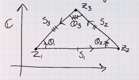

# Complex Geometry

## Spring 2020 HW 1.1  #completed

:::{.problem title="?"}
Geometrically describe the following subsets of $\CC$:

a. $\abs{z-1} = 1$
b. $\abs{z-1} = 2\abs{z-2}$
c. $1/z = \bar z$
d. $\Re(z) = 3$
e. $\Im(z) = a$ with $a\in \RR$.
f. $\Re(z) > a$ with $a\in \RR$.
g. $\abs{z-1} < 2\abs{z-2}$

:::

:::{.solution}
\envlist

a. A circle of radius 1 about $z=1$.
b. A circle, using that Apollonius circles are characterized as the locus of distances whose ratios to some fixed points $A, B$ are constant.
  To actually compute this:
  \[
  \abs{z-1}^2 &= 4\abs{z-2}^2 \\
  \implies (x-1)^2 + y^2 - 4\qty{(x-2)^2 + y^2 } &=0 \\
  -3x^2 + 14x - 3y^2 - 15 &= 0 && \star\\
  \implies x^2 - {14\over 3}x + y^2 + 5 &= 0 \\
  \implies (x- {14\over 2\cdot 3})^2 - {14\over 2\cdot 3}^2 + y^2 + 5 &= 0 \\
  \implies (x-{14\over 6})^2 + y^2 = \qty{2\over 3}^2
  ,\]
  which is a circle of radius $2/3$ with center $\qty{{14\over 6}, 0}$.
  To avoid the calculation, use
  \[
  Ax^2 + Bxy + Cy + \cdots = 0,\quad A=1, B=0, C=1 \implies \Delta \da B^2 - 4AC < 0
  ,\]
  which is an ellipse, and since $A=C$ it is in fact a circle.

c. $S^1$, using that ${1\over z} = {\bar{z} \over z\bar{z}} = {\bar z\over \abs{z}^2}$ and if this equals $\bar{z}$, then $\abs{z}^2=1$.
Alternatively, $1 = \bar{z}z = \abs{z}^2$.
d. Vertical line through $z=3$.
e. Horizontal line through $z=ia$.
f. Region to the right of the vertical line through $z=a$.
g. Exterior of a circle: same calculation is (2), replacing $=0$ with $<0$.
Note that the line marked $\star$ involves dividing by a negative, so this flips the sign, and we get $\cdots > \qty{2\over 3}^2$ at the end.
:::

## Spring 2020 HW 1.4 #completed 

:::{.problem title="?"}
\envlist

a. Prove that if $c>0$,
\[
\abs{w_1} = c\abs{w_2} \implies \abs{w_1 - c^2 w_2} = c\abs{w_1 - w_2}
.\]

b. Prove that if $c>0$ and $c\neq 1$, with $z_1\neq z_2$, then the following equation represents a circle:
\[
\abs{z-z_1 \over z-z_2} = c
.\]
Find its center and radius.

> Hint: use part (a)

:::

:::{.solution title="part 1"}
\[
\abs{w_1 - c^2 w_2}^2 
&= (w_1 - c^2 w_2) ( \bar{w_1} - c^2 \bar{w_2} ) \\
&= \abs{w_1}^2 + c^4 \abs{w_2}^2 - 2c^2 \Re(w_1 \bar{w_2}) \\
&= {\color{green} c^2 \abs{w_2}^2 } + c^4 \abs{w_2}^2 - 2c^2 \Re(w_1 \bar{w_2}) \\
&= c^2 \abs{w_2}^2 + {\color{green} c^2 \abs{w_1}^2 } - 2c^2 \Re(w_1 \bar{w_2}) \\
&= c^2 \abs{w_1 - w_2}
,\]
where we've applied the assumption $\abs{w_1} = c\abs{w_2}$ twice.
:::

:::{.solution title="part 2"}
Using part 1:
\[
w_1\da z-z_1, w_2 \da z-z_2 \implies \abs{w_1} &= c\abs{w_2} \\
\implies \abs{w_1 - c^2 w_2} &= c \abs{w_1 - w_2} \\
\implies \abs{ z-z_1 - c^2 (z-z_2) } &= \abs{(z-z_1) - (z-z_2)} \\
\implies \abs{(1-c^2) z - z_3} &= \abs{ z_2 - z_1 } \\
\implies \abs{z-z_4} &= r
,\]
where the $z_i$ and $r$ are all constant, so thus is the equation of a circle.

:::

## Spring 2020 HW 1.11 #completed

:::{.problem title="?"}
Prove that the distinct complex numbers $z_1, z_2, z_3$ are the vertices of an equilateral triangle if and only if
\[
z_{1}^{2}+z_{2}^{2}+z_{3}^{2}=z_{1} z_{2}+z_{2} z_{3}+z_{3} z_{1}
.\]
:::

:::{.solution}
$\implies$:
Write the vertices as $z_1, z_2, z_3$ and the sides as

- $s_1 \da z_2-z_1$
- $s_2 \da z_3 - z_2$
- $s_1 \da z_1 -z_3$

Note that $s_i = \pm \zeta_3 s_{i-1}$, dividing yields
\[
{s_2 \over s_3} &= {s_1\over s_2} \\
&\iff s_2^2 - s_1 s_3 = 0 \\
&\iff \left(z_{2}-z_{3}\right)^{2}-\left(z_{2}-z_{1}\right)\left(z_{1}-z_{3}\right)=0 \\
&\iff \left(z_{2}^{2}+z_{3}^{2}-2 z_{2} z_{3}\right)-\left(z_{2} z_{1}-z_{2} z_{3}-z_{1}^{2}+z_{1} z_{3}\right)=0 \\
&\iff z_{1}^{2}+z_{2}^{2}+z_{3}^{2}-\left(z_{1} z_{2}+z_{2} z_{3}+z_{3} z_{1}\right)=0
.\]

$\impliedby$:
We still have $s_i = \theta_i s_{i-1}$ for some angles $\theta_i$
We have

and
\[
{s_1\over s_2} &= {\theta_1 \over \theta_2} \cdot {s_3\over s_1} \\
{s_2\over s_3} &= {\theta_2 \over \theta_3} \cdot {s_1\over s_2} \\
{s_3\over s_1} &= {\theta_3 \over \theta_1} \cdot {s_2\over s_3} 
.\]

Running the above calculation backward yields $s_2/s_3 = s_1/s_2$, and by the 2nd equality above, this forces $\theta_2 = \theta_3$.
Similar arguments show $\theta_1=\theta_2 = \theta_3$ which forces $s_1=s_2 = s_3$.

:::

## Spring 2020 HW 1.5 #completed

:::{.problem title="?"}
\envlist

a. Let $z, w \in \CC$ with $\bar z w \neq 1$. 
Prove that
\[
\abs{w-z \over 1 - \bar w z} < 1 \quad\text{ if } \abs{z}<1,~ \abs{w} < 1
\]
with equality when $\abs{z} = 1$ or $\abs{w} = 1$.

b. Prove that for a fixed $w\in \DD$, the mapping $F: z\mapsto {w-z \over 1 - \bar w z}$ satisfies

- $F$ maps $\DD$ to itself and is holomorphic.
- $F(0) = w$ and $F(w) = 0$.
- $\abs{z} = 1$ implies $\abs{F(z)} = 1$.
:::

:::{.solution title="part 1"}
\[
0 &\leq (1 - \abs{w}^2)(1-\abs{z}^2) \\
\implies \abs{w}^2 + \abs{z}^2 &\leq 1 + \abs{w}^2 \abs{z}^2 \\
\implies \abs{w}^2 + \abs{z}^2 - 2\Re(\bar{w} z) &\leq 1 + \abs{w}^2 \abs{z}^2 - 2\Re(\bar{w} z) \\
\implies \abs{w-z}^2 &\leq \abs{1-\bar{w}z}^2
.\]
Note that if either $\abs{w}^2 = 1$ or $\abs{z}^2 = 1$ then the first line is an equality, yielding equality in the final line.
:::

:::{.solution title="part 2"}
\envlist

- That $F: \DD\to \DD$: follows from the inequality, since $\abs{z}, \abs{w} < 1$ for $z,w\in \DD$.
Holomorphicity: follows from the fact that rational expressions of holomorphic functions are holomorphic away from where the denominators vanish.
- Then just note that $\abs{\bar{w} z} \lleq \abs{w}\abs{z} < 1$, so $\abs{1 - \bar{w} z} > 0$.

- $F(0) = {w-0 \over 1-0} = w$
- $F(w) = {w-w\over 1 - \bar w w} = 0$
- $\abs{z} = 1$ yields equality in part 1.

> Other notes: $F$ is bijective on $\DD$:
\[
F(F(z))
&= {w - \qty{w-z\over 1-\bar w z} \over 1 - \bar{w}\qty{w-z\over 1 - \bar w z} } \\
&= {w(1-\bar w z) - (w-z) \over (1-\bar w z) - \bar w (w-z)} \\
&= {z-\abs{w}^2 z \over 1 - \abs{w}^2 }\\
&= z
.\]

:::

