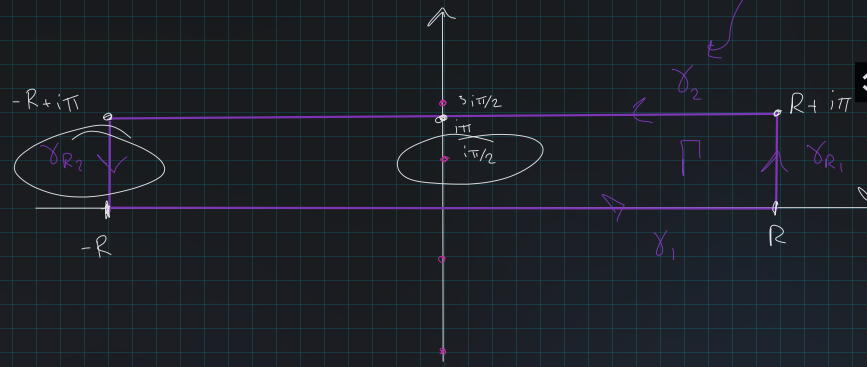

# Computing Integrals

## Rational, wedge 

### Fall 2021.3 #completed/exercise

^1eefcc

:::{.problem title="?"}
Suppose $n \geq 2$. Use a wedge of angle $\frac{2 \pi}{n}$ to evaluate the integral
\[
I=\int_{0}^{\infty} \frac{1}{1+x^{n}} d x
\]
:::

:::{.solution}
Write $\omega_{n, k} = \exp\qty{(2k+1)i\pi \over n}$ and factor $z^n+1$ as 
\[
z^n+1 
= \prod_{1\leq k \leq n}(z-\omega_{n, k})
= 
(z-e^{i\pi \over n})(z-e^{3i\pi \over n})
\cdots (z-e^{(2n-1)i\pi \over n})
.\]
Note that only the root $e^{i\pi\over n}$ lies in the $2\pi/n$ wedge, so it is the only (simple) pole of $f(z) \da {1\over 1+z^n}$ in this region.
Since the pole is simple, we can compute the residue easily.
Write $r_0 \da e^{e\pi\over n}$, then By L'Hopital,
\[
\Res_{z = r_0} {1\over 1+z^n}
&= \lim_{z\to r_0} {z-r_0 \over 1 + z^n} \\
&= \lim_{z\to r_0} {1\over nz^{n-1}} \\
&= {1\over nr_0^{n-1}} \\
&= {1\over n e^{i\pi (n-1) \over n}} \\
&= n\inv {\exp\qty{-i\pi (n-1)\over n }}
.\]

Take a contour $\Gamma$ comprised of

- $\gamma_1 = [0, R] \subseteq \RR$
- $\gamma_2 = \ts{Re^{it} \st t\in [0, 2\pi/n]}$
- $\gamma_3 = \zeta_n [0, R]$

By the residue theorem
\[
2\pi i \Res_{z=r_0} f(z) = I \da \int_\Gamma f = \qty{\int_{\gamma_1} + \int_{\gamma_2} + \int_{\gamma_3}}f
.\]

:::{.claim}
Taking orientations into account,
\[
\int_{\gamma_3} f = -\zeta_n \int_{\gamma_1} f
.\]
:::

:::{.claim}
\[
\int_{\gamma_2}f\convergesto{R\to\infty}0
.\]
:::

so in the limit we have
\[
2\pi i \Res_{z=r_0}f(z)  &= \qty{1 - \zeta_n}\int_{\gamma_1}f \\
\implies \int_{\gamma_1} f 
&= {2\pi i \Res_{z=r_0}f(z) \over 1 - \zeta_n}\\
&= {2\pi i e^{-\pi (n-1) \over n} \over n\qty{1-e^{2\pi i \over n}}} \\
&= {2\pi i \over n}
\left[
e^{i\pi} e^{-i\pi \over n}\qty{1 - e^{2\pi i \over n}}
\right]\inv \\
&= {2\pi i \over n}
\left[
-1\qty{e^{-i\pi \over n} - e^{\pi i \over n}}
\right]\inv\\
&= {2\pi i \over n}
\left[
2i \sin\qty{\pi\over n}
\right]\inv \\
&= {\pi \over n\sin\qty{\pi \over n}}
.\]

:::{.proof title="of claim 1"}
Parameterize the curves:

- $\gamma_1 \da \ts{t \st t\in [0, R]}, \dz = \dt$
- $\gamma_3 \da \ts{t\zeta_n \st t\in [0, R]}, \dz = \zeta_n \dt$

Then, a direct check:
\[
\int_{\gamma_3}f(z) \dz 
&= \int_0^R {1\over 1 + (\zeta_n t)^n}\zeta_n \dt \\
&= \zeta_n\int_0^R {1\over 1 + t^n}\dt \\
&= \zeta_n \int_{\gamma_1}f(z) \dz
.\]

:::

:::{.proof title="of claim 2"}
Parameterize $\gamma_2 = \ts{Re^{it} \st t\in [0, 2\pi/n]}$ and apply the ML estimate:
\[
{1\over 1 + (Re^{it})^n} \leq {1\over R^n - 1} \implies \int_{\gamma_2}f \leq {1\over R^n - 1} \qty{{2\pi R \over n}} = \bigo(R^{n-1})\convergesto{R\to\infty}0
.\]

:::

:::

### Spring 2020 HW 3, SS 3.8.2 #work/exercise/exercise

Evaluate the integral
\[
\int_\RR {dx \over 1 + x^4}
.\]

What are the poles of ${1\over 1 + z^4}$ ?

### Spring 2020 HW 3, SS 3.8.6 #work/exercise/exercise
Show that
\[
\int_{-\infty}^{\infty} \frac{d x}{\left(1+x^{2}\right)^{n+1}}=\frac{1 \cdot 3 \cdot 5 \cdots(2 n-1)}{2 \cdot 4 \cdot 6 \cdots(2 n)} \cdot \pi
.\]

### Quadratic over quartic #work/exercise

:::{.problem title="?"}
Let $a>0$ and calculate
\[
\int_0^\infty {x^2 \over (x^2 + a^2)^2} \, dx
.\]
:::

### Rational function #work/exercise

:::{.problem title="?"}
Calculate
\[
\int_{-\infty}^\infty {1+x^2 \over 1+x^4}\, dx
.\]

:::

### Denominator polynomial #work/exercise

:::{.problem title="?"}
Calculate
\[
\int_0^\infty {1 \over (1+z)^2 (z+9x^2)} \, dx
.\]
:::

## Rational, branch cut

### Standard example #work/exercise

:::{.problem title="?"}
Show that 
\[
\int_{\RR_{\geq 0}}{x^{-s} \over x+1} = {\pi \over \sin(\pi s)}
.\]
:::

:::{.solution}
Sketch: see [here](https://people.reed.edu/~jerry/311/lec08.pdf).

:::

### Fall 2019.1 #work/qual

^d9cb99

Show that 
\[
\int_{0}^{\infty} \frac{x^{a-1}}{1+x^{n}} d x=\frac{\pi}{n \sin \frac{a \pi}{n}}
\]
using complex analysis, $0<a<n$. Here $n$ is a positive integer.

### Spring 2020 HW 3.7 #work/exercise

Let $0<a<4$ and evaluate 
\[
\int_0^\infty \frac{x^{\alpha-1}}{1+x^3} ~dx
\]

### Tie's Extra Questions: Fall 2011, Spring 2015 #work/qual

Show that 
\[
\displaystyle \int_0^\infty \frac{x^{a-1}} {1+x^n} \dx=\frac{\pi}{n\sin \frac{a\pi}{n}}
.\]
using complex analysis, $0< a < n$. Here $n$ is a positive integer.

### Fall 2020.3, Spring 2019.2 #work/qual

^590fc7

^5fa654

Let $a \in \mathbb{R}$ with $0<a<3$. Evaluate 
\[
\int_{0}^{\infty} \frac{x^{a-1}}{1+x^{3}} d x
.\]

## Rational Functions of $\sin$ or $\cos$

### Cosine in denominator #work/exercise

:::{.problem title="?"}
Show 
\[
\int_0^{2\pi} {1\over a + \cos(\theta)} \dtheta = {2\pi \over \sqrt{a^2-1}}, && a> 1
.\]
:::

:::{.solution}
Sketch:

- Set $z=e^{i\theta}$ to get
\[
\frac{2}{i} \int_{|z|=1} \frac{\mathrm{d} z}{z^{2}+2 a z+1}
.\]

- Factor into two roots $r_1, r_2$.
  Use that without loss of generality, $r_1\in \DD$ and $r_2\in \DD^c$, with neither on $S^1$ to compute the residue $4\pi/(r_1 -r_2)$ 

:::

### Spring 2020 HW 2, SS 2.6.1 #work/exercise

Show that
\[
\int_{0}^{\infty} \sin \left(x^{2}\right) d x=\int_{0}^{\infty} \cos \left(x^{2}\right) d x=\frac{\sqrt{2 \pi}}{4}
.\]

> Hint: integrate $e^{-x^2}$ over the following contour, using the fact that $\int_{-\infty}^{\infty} e^{-x^{2}} d x=\sqrt{\pi}$:

\

### Spring 2020 HW 3, SS 3.8.8 #work/exercise
Show that if $a,b\in \RR$ with $a > \abs{b}$, then
\[
\int_{0}^{2 \pi} \frac{d \theta}{a+b \cos \theta}=\frac{2 \pi}{\sqrt{a^{2}-b^{2}}}
.\]

### Fresnel #work/exercise

:::{.problem title="?"}
Suppose $a>b>0$ and calculate
\[
\int_0^{2\pi} {1 \over (a+b\cos(\theta))^2} \,d\theta
.\]

:::

### Fresnel #work/exercise

:::{.problem title="?"}
Let $n\in \ZZ^{\geq 1}$ and $0<\theta<\pi$ and show that
\[
{1\over 2\pi i} \int_{\abs z = 2} {z^n \over 1 -3z\cos(\theta) + z^2} \,dz = {\sin(n\theta) \over \sin(\theta)}
.\]
:::

### Spring 2020 HW 3.10 #work/exercise

For $a> 0$, evaluate
\[
\int_0^{\pi/2} \frac{d\theta}{a + \sin^2 \theta}
\]

### Spring 2020 HW 3, SS 3.8.7 #work/exercise
Show that
\[
\int_{0}^{2 \pi} \frac{d \theta}{(a+\cos \theta)^{2}}=\frac{2 \pi a}{\left(a^{2}-1\right)^{3 / 2}}, \quad \text { whenever } a>1
.\]

## Rectangles

### Spring 2021.2 #completed/qual

^0a6802

:::{.problem title="?"}
Let $\xi\in \RR$, evaluate
\[
\int_\RR {e^{i\xi x} \over \cosh(x)} \dx
.\]

:::

:::{.solution}
Note $\cosh(z) \da {1\over 2}(e^z + e^{-z})$, and
\[
\cosh(z) &= 0 \\
\iff e^z + e^{-z} &= 0 \\
\iff e^{-z}(e^{2z} + 1) &= 0 \\
\iff e^{2z} &= -1 \quad \text{since }\abs{e^{-z}} = e^{\Re(z)} > 0 \\
\iff 2z &= (2k+1)i\pi \\
\iff z &\in \ts{\cdots, {-3i\pi \over 2}, {-i\pi \over 2}, {i\pi \over 2}, {3i\pi \over 2}, \cdots}
.\]
So take the following rectangular contour enclosing the singularity $z= i\pi/2$:

Then letting $\Gamma$ be the entire contour and $I$ be the desired integral, we can solve for $I$:
\[
\int_\Gamma f &= \int_{-R}^R f + \int_{\gamma_{R_1}} f + \int_{\gamma_2}f + \int_{\gamma_{R_2}} f \\
\int_\Gamma f &= I + \int_{\gamma_{R_1}} f + \int_{\gamma_2}f + \int_{\gamma_{R_2}} f \\ \\
I &= \int_{\gamma_{R_1}} f + \int_{\gamma_2}f + \int_{\gamma_{R_2}} f - \int_\Gamma f 
,\]
being very sloppy about the fact that we're going to take $R\to \infty$.

Computing the residue term $\int_\Gamma f = 2\pi i \Res_{z=i\pi/2} f(z)$:
\[
{1\over 2\ pi i } \int_\Gamma f 
&= \Res_{z = i\pi/2} f(z)\\
&= \Res_{z = i\pi/2} {e^{i\xi z} \over \cosh(z) } \\
&= {e^{i\xi z} \over \dd{}{t} \cosh(z) } \evalfrom_{i\pi/2}\\
&= {e^{i\xi \cdot i\pi/2} \over \sinh(i\pi/2)} \\
&= {e^{-\xi \pi/ 2} \over i} \\
\implies 2\pi i \Res_{z=i\pi/2} f(z) &= 2\pi e^{-\xi \pi/ 2}
.\]
using that $2\sinh(i\pi/2) = e^{i\pi/2} - e^{-i\pi/2} = i-(-i) = 2i$. 

The $\gamma_2$ term:
parameterize $\gamma_2 = \ts{t + i\pi \st t\in [-R, R]}$, then
\[
\int_{\gamma_2} f 
&= -\int_{-\gamma_2} f \\
&= -\int_{-R}^{R} { e^{iz} \over \cosh(t + i\pi) } \dz, \quad z = t+i\pi, \dz = \dt \\
&= -\int_{-R}^{R} { e^{i\xi(t+i\pi)} \over \cosh(t + i\pi) }\dt \\
&= -e^{-\xi \pi} \int_{-R}^R {e^{i\xi t} \over \cosh(t+i\pi)} \dt \\
&= e^{-\xi \pi} \int_{-R}^R {e^{i\xi t} \over \cosh(t)} \dt \\
&\da e^{-\xi \pi} I
,\]
using that $\cosh(z + i\pi) = -\cosh(z)$.

The two $\gamma_{R_i}$ terms:
the claim is that these vanish in the limit $R\to \infty$.
Parameterize $\gamma_{R_2} = \ts{R = i \pi t \st t\in [0, 1]}$, then
\[
\abs{\int_{\gamma_{R_2}} f} 
&= \abs{ \int_0^1 {e^{i\xi(R+i\pi t)} \over \cosh(R + i\pi t)} \dt } \\
&= \abs{ 2e^{i\xi R} \int_0^1 {e^{-\xi \pi t } \over {e^{R+ i\pi t} + e^{-R - i\pi t}} } \dt } \\
&\leq 2 \int_0^1 \abs{ {e^{-\xi \pi t } \over {e^{R+ i\pi t} + e^{-R - i\pi t}} }  } \dt \\
&\leq 2 \int_0^1 {e^{-\xi \pi t } \over { \abs{ e^{R+ i\pi t} }  -  \abs{ e^{-R - i\pi t} } }  }\dt \\
&= 2 \int_0^1 {e^{-\xi\pi t} \over e^R - e^{-R} } \\
&= { 2\over e^R - e^{-R}} \int_0^1 e^{-\xi \pi t} \dt \\
&= {2\over e^R - e^{-R}} \qty{-1\over \xi \pi} e^{\xi \pi t}\evalfrom_{t=0}^{t=1} \\
&= {2\over e^R - e^{-R}} \qty{1 - e^{-\pi \xi } \over \xi \pi} \\
&\convergesto{R\to\infty} 0
.\]

Putting it all together:
\[
(1 + e^{-\xi \pi}) I &= 2\pi e^{-\xi \pi / 2} \\
\implies I &= {2\pi e^{-\xi \pi / 2} \over 1 + e^{-\xi \pi }} \\
&= {2\pi \over e^{\xi\pi/2} (1 + e^{-\xi \pi })} \\
&= {2\pi \over e^{\xi\pi/2} + e^{-\xi\pi/2} } \\
&= {2\pi \over 2\cosh(\xi\pi/2)} \\
&= {\pi \over \cosh\qty{\xi\pi\over 2}} \\ \\
&= \pi \sech\qty{\xi\pi\over 2 } 
.\]

:::

### Spring 2020 HW 3, SS 3.8.9 #work/exercise
Show that
\[
\int_{0}^{1} \log (\sin \pi x) d x=-\log 2
.\]

> Hint: use the following contour.
>
> 

## Branch Cuts

### Tie's Extra Questions: Spring 2015 #work/exercise

Compute the following integrals:

- $\displaystyle \int_0^\infty \frac{x^{a-1}}{1 + x^n} \, dx$, $0< a < n$
- $\displaystyle \int_0^\infty \frac{\log x}{(1 + x^2)^2}\, dx$

### Spring 2020 HW 3, SS 3.8.10 #work/exercise
Show that if $a>0$, then
\[
\int_{0}^{\infty} \frac{\log x}{x^{2}+a^{2}} d x=\frac{\pi}{2 a} \log a
.\]

> Hint: use the following contour.
>
> 

### Spring 2020.2 #work/qual

^c765ed

Compute the following integral carefully justifying each step:

$$
\int_{0}^{\infty} \frac{\log x}{1+x^{3}} \text {. }
$$

### Square root in numerator #work/exercise

:::{.problem title="?"}
Calculate
\[
\int_0^\infty {\sqrt x \over (x+1)^2} \,dx
.\]

:::

### Square root #work/exercise

:::{.problem title="?"}
Calculate
\[
\int_0^\infty {\sqrt x \over 1 + x^2} \, dx
.\]

:::

## Trigonometric transforms 

### Spring 2020 HW 3, SS 3.8.4 #work/exercise
Show that
\[
\int_{-\infty}^{\infty} \frac{x \sin x}{x^{2}+a^{2}} d x=\pi e^{-a}, \quad \text { for all } a>0
.\]

### Spring 2020 HW 2, 2.6.2 #work/exercise

Show that

\[
\int_{0}^{\infty} \frac{\sin x}{x} d x=\frac{\pi}{2}
.\]

> Hint: use the fact that this integral eexercises $\frac{1}{2 i} \int_{-\infty}^{\infty} \frac{e^{i x}-1}{x} d x$, and integrate around an indented semicircle.

### Spring 2020 HW 3, SS 3.8.5 #work/exercise
Show that if $\xi\in \RR$, then
\[
\int_{-\infty}^{\infty} \frac{e^{-2 \pi i x \xi}}{\left(1+x^{2}\right)^{2}} d x=\frac{\pi}{2}(1+2 \pi|\xi|) e^{-2 \pi|\xi|}
.\]

### $\sin$ in numerator #work/exercise

:::{.problem title="?"}
Let $a>0$ and calculate
\[
\int_0^\infty {x\sin(x) \over x^2 + a^2} \,dx
.\]

:::

### $\sin$ in numerator #work/exercise

:::{.problem title="?"}
Calculate
\[
\int_0^\infty {\sin(x) \over x(x^2+1)}\, dx
.\]

:::

### $\sinc$ #work/exercise

:::{.problem title="?"}
Calculate
\[
\int_0^\infty {\sin(x) \over x}\, dx
.\]
:::

### $\cos$ in numerator #work/exercise

:::{.problem title="?"}
Let $a>0$ and calculate
\[
\int_0^\infty {\cos(x) \over (x^2 + a^2)^2}\, dx
.\]
:::

### $\sin$ in numerator #work/exercise

:::{.problem title="?"}
Calculate
\[
\int_0^\infty {\sin^3(x) \over x^3} \, dx
.\]
:::

### $\sin$ in numerator #work/exercise

:::{.problem title="?"}
Evaluate 
\[
\displaystyle{ \int_{0}^{\infty}\frac{x\sin x}{x^2+a^2} \, dx }
.\]

:::

### Tie's Extra Questions: Fall 2009

Evaluate $$\displaystyle{ \int_{0}^{\infty}\frac{x\sin x}{x^2+a^2} \,
dx }.$$

### Cosine over quadratic #completed/exercise

:::{.problem title="?"}
Show that
\[
\int_0^{\infty} {\cos(x) \over x^2 + b^2}\dx = {\pi e^{-b} \over 2b}
.\]
:::

:::{.solution}
\envlist

- Let $I$ be the integral over $\RR$.
  Since $f(x)$ is even, the original integral is ${1\over 2}I$.

- Write $f(z) = e^{iz} / (z^2 + b^2)$.
  Take a semicircular contour $\Gamma \da \gamma_1 + \gamma_2$ where $\gamma_1$ is $[-R, R]$ on $\RR$ and $\gamma_2$ is the usual half-circle of radius $R$.

- Claim: $\int_{\gamma_2} f \converges{R\to\infty}\too 0$, so $\int_\Gamma \to \int_\RR f(z)$.
  - Easy estimate, just be careful with the $i$ in the exponent:
  \[
  \abs{f} = { \abs{e^{iz} } \over \abs{z^2 + b^2} } = {e^{-\Re z} \over \abs{z^2 + b^2} } \leq {1\over \abs{z^2 + b^2}} \converges{R\to\infty}\too 0
  .\]

- Compute $\int_\Gamma f$ by residues: factor $z^2 + b^2 = (z+ib)(z-ib)$, so the contour only contains the order 1 pole $z_0 = ib$.

- Compute the residue:
\[
\Res_{z=ib}f = \lim_{z\to ib} (z-ib) {e^{iz} \over (z+ib)(z-ib) } = { e^{iz} \over z+ib} \evalfrom_{z=ib} = {e^{i(ib)} \over 2ib} = {e^{-b} \over 2ib}
.\]
- So the intermediate integral is $I$ is $2\pi i$ times this, i.e. $I = \pi e^{-b} / b$.
- And the original integral is ${1\over 2}I = \pi e^{-b} \over 2b$.

:::

### Tie's Extra Questions: Fall 2016

Compute the integral
$\displaystyle{\int_{-\infty}^{\infty} \frac{e^{-2\pi ix\xi}}{\cosh\pi x}dx}$
where $\displaystyle{\cosh z=\frac{e^{z}+e^{-z}}{2}}$.

### Tie's Extra Questions: Fall 2015 #work/exercise

Prove by *justifying all steps* that for all $\xi \in {\mathbb C}$ we have $\displaystyle e^{- \pi \xi^2} = \int_{- \infty}^\infty e^{- \pi x^2} e^{2 \pi i x \xi} dx \; .$

> Hint: You may use that fact in Example 1 on p. 42 of the textbook without proof, i.e., you may assume the above is true for real values of $\xi$.

### Multiple cosines in numerator #work/exercise

:::{.problem title="?"}
Calculate
\[
\int_0^\infty {\cos(x) - \cos(4x) \over x^2} \, dx
.\]
:::

### Tie's Extra Questions: Fall 2011

Evaluate $\displaystyle{ \int_{0}^{\infty}\frac{x\sin x}{x^2+a^2} \dx }$.

## Unsorted

### Spring 2020 HW 3.6 #work/exercise

a. 
Show (without using 3.8.9 in the S&S) that
\[
\int_0^{2\pi} \log\abs{1 - e^{i\theta}}~d\theta = 0
\]

b. 
Show that this identity is equivalent to S&S 3.8.9:
\[
\int_0^1 \log(\sin(\pi x)) ~dx = -\log 2
.\]

### Tie's Extra Questions: Spring 2015 #work/exercise

Compute the following integrals.

(i) 
$\displaystyle \int_0^\infty \frac{1}{(1 + x^n)^2} \, dx$, $n \geq 1$ 

(ii)
$\displaystyle \int_0^\infty \frac{\cos x}{(x^2 + a^2)^2} \, dx$, $a \in \mathbb R$ 

(iii)
$\displaystyle \int_0^\pi \frac{1}{a + \sin \theta} \, d \theta$, $a>1$

(iv) 
$\displaystyle \int_0^{\frac{\pi}{2}} \frac{d \theta}{a+ \sin ^2 \theta},$ $a >0$. 

(v)
$\displaystyle \int_{|z|=2} \frac{1}{(z^{5} -1) (z-3)} \, dz$ 

(vi)
$\displaystyle \int_{- \infty}^{\infty} \frac{\sin \pi a}{\cosh \pi x + \cos \pi a} e^{- i x \xi} \, d x$, $0< a <1$, $\xi \in \mathbb R$ 

(vii)
$\displaystyle \int_{|z| = 1} \cot^2 z \, dz$.

## Conceptual

### Spring 2020 HW 3, SS 3.8.1 #work/exercise
Use the following formula to show that the complex zeros of $\sin(\pi z)$ are exactly the integers, and they are each of order 1:
\[
\sin \pi z=\frac{e^{i \pi z}-e^{-i \pi z}}{2 i}
.\]

Calculate the residue of ${1\over \sin(\pi z)}$ at $z=n\in \ZZ$.

### Zeros using residue theorem #work/exercise

:::{.problem title="?"}
Suppose that $f$ is an analytic function in the region $D$ which
contains the point $a$. Let
$$F(z)= z-a-qf(z),\quad \text{where}\quad q \ \text{is a complex
parameter}.$$ 

1.
Let $K\subset D$ be a circle with the center at
point $a$ and also we assume that $f(z)\not =0$ for $z\in K$. Prove
that the function $F$ has one and only one zero $z=w$ on the closed
disc $\bar{K}$ whose boundary is the circle $K$ if 
\[
\displaystyle{ |q|<\min_{z\in K} \frac{|z-a|}{|f(z)|}.}
.\]

2.
Let $G(z)$ be an analytic function on the disk $\bar{K}$. Apply
the residue theorem to prove that
\[
\displaystyle{ \frac{G(w)}{F'(w)}=\frac{1}{2\pi i}\int_K \frac{G(z)}{F(z)} dz,}
\]
where $w$ is the zero from (1).

:::

### Tie's Extra Questions: Fall 2009 #work/exercise

Suppose that $f$ is an analytic function in the region $D$ which
contains the point $a$. Let
$$F(z)= z-a-qf(z),\quad \text{where}~ q \ \text{is a complex parameter}.$$

(1) Let $K\subset D$ be a circle with the center at
point $a$ and also we assume that $f(z)\not =0$ for $z\in K$. Prove
that the function $F$ has one and only one zero $z=w$ on the closed
disc $\bar{K}$ whose boundary is the circle $K$ if $\displaystyle{
|q|<\min_{z\in K} \frac{|z-a|}{|f(z)|}.}$\

(2) Let $G(z)$ be an analytic function on the disk $\bar{K}$. Apply
the residue theorem to prove that
$\displaystyle{ \frac{G(w)}{F'(w)}=\frac{1}{2\pi
i}\int_K \frac{G(z)}{F(z)} dz,}$ where $w$ is the zero from (1).\

(3) If $z\in K$, prove that the function
$\displaystyle{\frac{1}{F(z)}}$ can be represented as a convergent
series with respect to $q$: $\displaystyle{
\frac{1}{F(z)}=\sum_{n=0}^{\infty} \frac{(qf(z))^n}{(z-a)^{n+1}}.}$

