---
order: 105
---

# Conformal Maps 

## Fall 2019.5, Tie's extra questions: Fall 2009, Fall 2011, Spring 2014, Spring 2015 #complex/qual/completed

^043381

:::{.problem title="?"}
Find a conformal map from 
\[
D=\ts{ z\in \CC\st |z|<1 \text{ and } \abs{ z-{1\over 2}}>{1\over 2}}
\]
to the unit disk $\Delta=\{z:|z|<1\}$.
:::

:::{.solution}
This is a lune-type region:

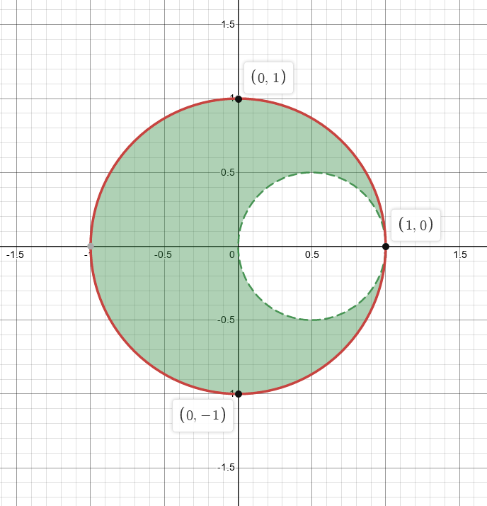

The usual strategy is to blow up the tangency, so send $1\to\infty$ with
\[
f(z) \da {1\over z-1}
.\]

:::{.claim}
$f$ has the following effect:

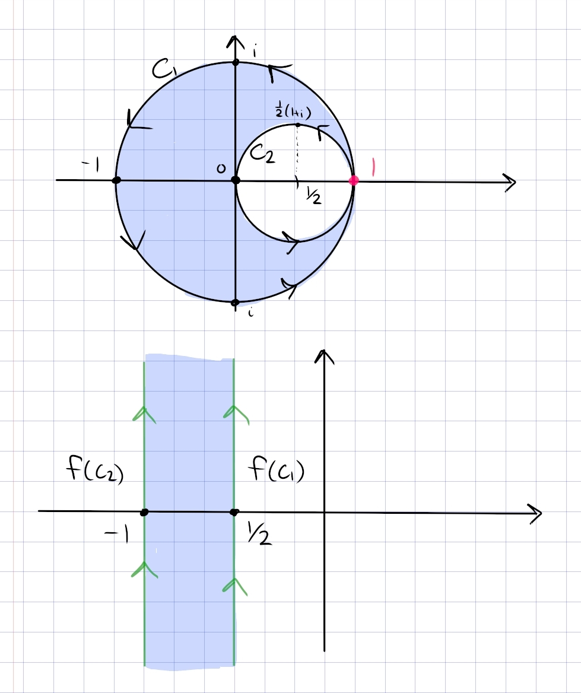

:::

:::{.proof title="of claim"}
Write $C_1$ for $S^1$ and $C_2$ for the smaller circle.
Computing the image of $C_1$: parameterize as $\gamma_1(t) = e^{it}$ for $t\in [-\pi, \pi]$, then
\[
f(\gamma_1(t)) 
&= {1\over e^{it} - 1} \\
&= {e^{-it/2} \over e^{it/2} - e^{-it/2}} \\
&= {e^{-it/2} \over 2i\sin(t/2) } \\
&= -{i\over 2}\csc(t/2)\qty{\cos(t/2) - i\sin(t/2)} \\
&= -{i\over 2}\qty{\cot(t/2) - i } \\
&= {1\over 2}\qty{-1-i\cot(t/2)} \\
&= -{1\over 2} - i\cdot {1\over 2}\cot(t/2)
.\]

Some analysis on $\cot(t/2)$:

- $-\pi\increasesto 0 \leadsto 0\decreasesto -\infty$ 
- $0\increasesto \pi \leadsto \infty\decreasesto 0$ 

Thus for $-\cot(t/2)$,

- $-\pi\increasesto 0 \leadsto 0\increasesto \infty$ 
- $0\increasesto \pi \leadsto -\infty\increasesto 0$ 

So the image is a vertical line through $\Re(z) = -{1\over 2}$ oriented from $-\infty\to\infty$.

For the image of $C_2$: parameterize as $\gamma_2(t) = {1\over 2}\qty{1 + e^{it}}$, then
\[
f(\gamma_2(t))
&= {1\over {1\over 2}\qty{1+e^{it}} - 1 } \\
&= {1\over -{1\over 2} + {1\over 2}e^{it} } \\
&= {1\over {1\over 2}\qty{e^{it} - 1}} \\
&= {2e^{-it/2} \over e^{it/2} - e^{-it/2} } \\
&= {2e^{-it/2} \over 2i\sin(t/2) } \\
&= -i\csc(t/2) \qty{\cos(-t/2) + i\sin(-t/2) } \\
&= -i\csc(t/2) \qty{\cos(t/2) - i\sin(t/2) } \\
&= -i \qty{\cot(t/2) - i } \\
&= -1 - i\cot(t/2)
.\]
By the same argument as above, this traces out a vertical line at $\Re(z) = -1$.

By handedness, since the original region is on the left with respect to $C_1$ and the right with respect to $C_2$, the new region is to the left of $\Re(z) = -{1\over 2}$ and the right of $\Re(z) = -1$ (since both are oriented from $-\infty$ to $\infty$).

:::

From here, it's a standard exercise.
In steps:

- Map $R$ to the vertical strip $-1< \Re(z) < -{1\over 2}$ using $z\mapsto {1\over z-1}$.
- Shift using $z\mapsto z+{1\over 2}$ to send this to $-{1\over 2}< \Re(z) < 0$.
- Rotate using $z\mapsto -iz$ to get $0<\Im(z) < {i\over 2}$, a horizontal strip.
- Dilate using $z\mapsto 2\pi z$, which sends ${i\over 2}\to \pi i$, so the resulting region is $0 < \Im(z) < \pi$.
- Apply $z\mapsto e^z$ to map the horizontal strip to $\HH$.
- Apply the Cayley map $z\mapsto {z-i\over z+i}$ to map $\HH\to\DD$.

:::

## Spring 2020.5 #complex/qual/completed

^0df993

:::{.problem title="Spring 2020.5"}
Find a conformal map that maps the region 
\[
R = \ts{z \st \Re(z) > 0,\, \abs{z - {1\over 2} }> {1\over 2} }
\]
to the upper half plane.
:::

^5c3979

:::{.problem title="Spring 2019.6"}
Find a conformal map from 
\[
\ts{ z\st  \abs{z -1 / 2} >1 / 2, \Re(z)>0 }
\]
to $\mathbb{H}$.

:::

:::{.solution}
The main step: blow up the tangency.

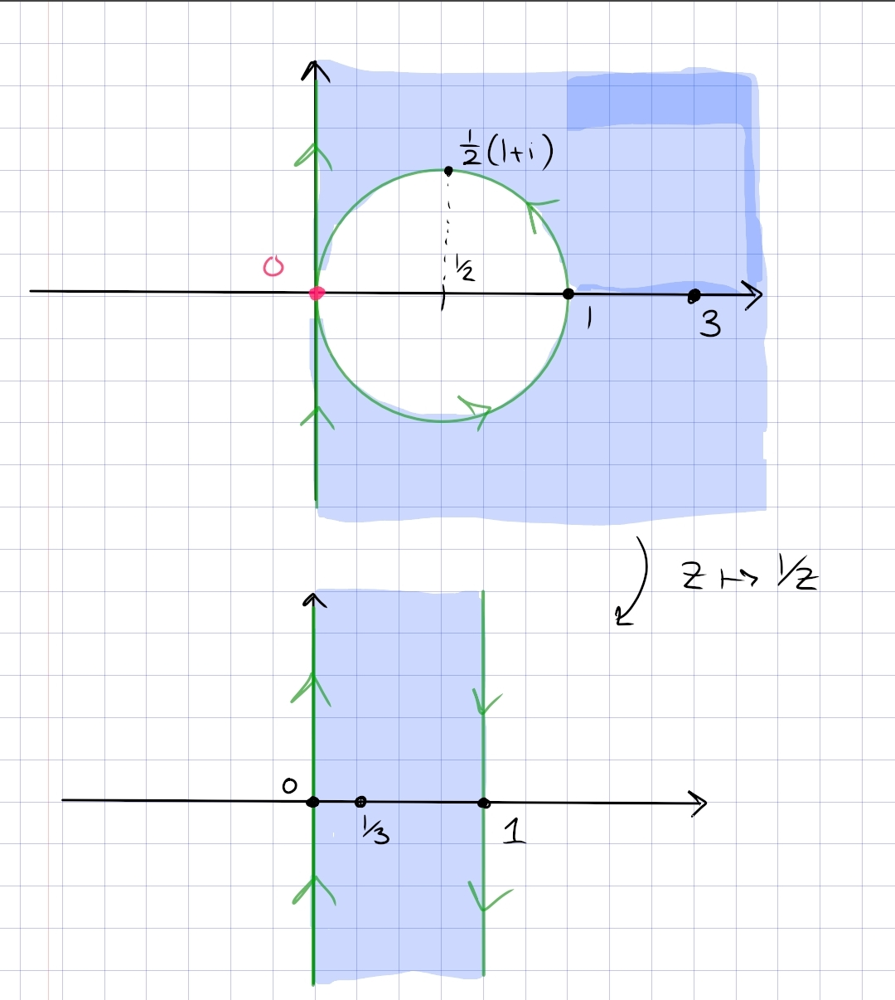

The individual maps:

- Send $0\to \infty$ by $z\mapsto {1\over z}$ to map $R$ to $0<\Re(z)<1$
- Rotate with $z\mapsto iz$ to map this to $0< \Im(z) < 1$
- Dilate by $z\mapsto \pi z$ to get $0 < \Im(z) < \pi$
- Apply $z\mapsto e^z$ to map to $\HH$.

That steps 1 and 2 work requires a bit of analysis.
Use that $f(z) \da 1/z$ satisfies $f(\RR) = \RR$ and $f(i\RR) = i \RR$.
To see where the circle $C_1$ gets mapped to, parameterize it as
\[
\gamma(t) \da \ts{{1\over 2}\qty{1+e^{it}} \st t\in [-\pi, \pi]}
.\]

Now computing its image:
\[
f(\gamma(t)) 
&= {2 \over 1 + e^{it}} \\
&= {2e^{-it\over 2} \over e^{-it\over 2}(1 + e^{it})} \\
&= {2e^{-it} \over e^{-it\over 2} + e^{it\over 2} } \\
&= { 2e^{-it\over 2} \over 2\cos\qty{t\over 2} } \\
&= \sec\qty{t\over 2}\qty{\cos\qty{-t\over 2} + i\sin\qty{-t\over 2}} \\
&= \sec\qty{t\over 2}\qty{\cos\qty{t\over 2} - i\sin\qty{t\over 2}} \\
&= 1 - i\tan\qty{t\over 2}
,\]
and as $t$ runs from $-\pi$ to $\pi$, $-\tan\qty{t\over 2}$ runs from $+\infty$ to $-\infty$.
So this is a line along $z=1$, oriented top to bottom as in the image.

Similarly, computing $f(i\RR)$: parameterize $\gamma(t) = it$ with $t\in (-\infty, \infty)$, then
\[
f(\gamma(t)) = {1\over it} = -{i\over t}
,\]
and as $t$ runs from $0$ to $\infty$, $-1/t$ runs from $-\infty$ to $0$, and as $t$ runs from $-\infty$ to $0$, $-1/t$ runs from $0$ to $\infty$.
So $f(i\RR)$ is oriented from bottom to top, as in the image.

That the region outside the disc is mapped to the strip shown: points $x\in \RR$ with $\abs{x} > 1$ map to $\abs{x}<1$, which is in the strip.
One can also conclude this by handedness: the original region is on the right with respect to $C_1$ and also on the right with respect to $i\RR$, so the new region should be on the right with respect to both $f(i\RR)$ and $f(C_1)$ with their induced orientations.
:::

## Spring 2021.7 #complex/qual/completed

^644ace

:::{.problem title="?"}
Let $R$ be the intersection of the right half-plane and the outside of the circle $\abs{z - {1\over 2}} = {1\over 2}$ with the line segment $[1, 2]$ removed, i.e. 
\[
R = \ts{z\in \CC\st \Re(z) > 0,\,\, \abs{z-{1\over 2}} > {1\over 2} } \sm \ts{z \da x+iy \st 1\leq x\leq 2,\,\, y=0}
.\]
Find a conformal map from $R$ to $\HH$ the upper half-plane.
:::

:::{.concept}
\envlist

- Blow up the point of tangency: inverting through a circle sends inner circles to lines, fixes the real line, and preserves regions between curves. 
E.g. the image of $\abs{z-i/2} =2$ is $\ts{ \Im(z) = 2}$

- So $z\to 1/z$ maps the region into a half-strip.

:::

:::{.solution}
Similar to a previous problem, just keeping track of the slit:

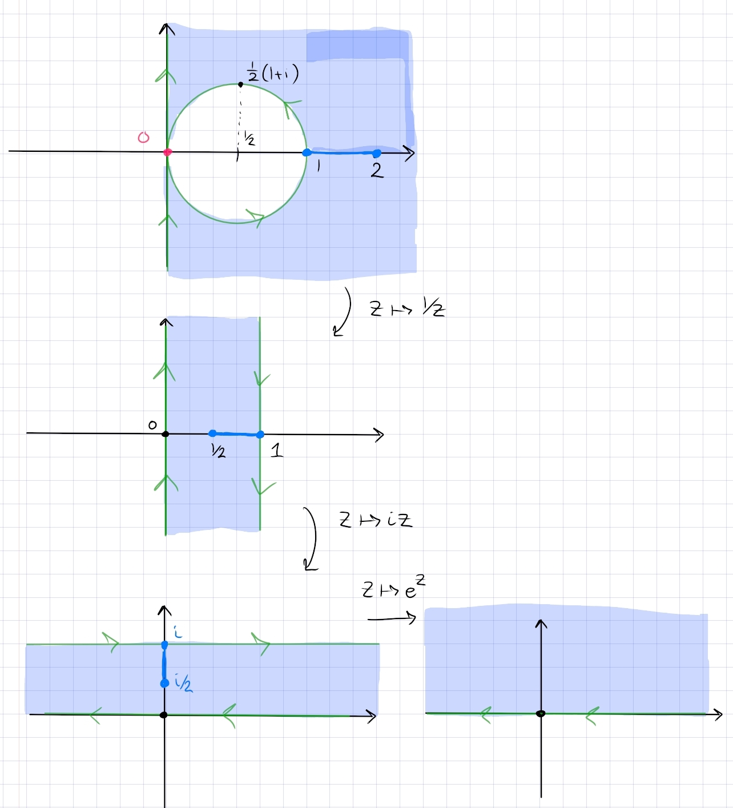

In steps:

- Send $0\to\infty$ with $z\mapsto 1/z$ to map $R$ to $0 < \Re(z) < 1$.
- Rotate by $z\mapsto iz$ to get $0<\Im(z) < 1$
- Dilate by $\pi$ and exponentiate using $z\mapsto e^{\pi z}$ to map this to $0 < \Im(z) < \pi$ and then to $\HH$.
:::

## Fall 2021.7 #complex/qual/completed

^efdbde

:::{.problem title="?"}
Find a conformal map from the intersection of $|z-1|<2$ and $|z+1|<2$ to the upper half plane.
:::

:::{.warnings}
DZG: I'm 90% sure this is meant to be $\abs{z-1}, \abs{z+1} < \sqrt{2}$ or $\abs{z-1}^2,\abs{z+1}^2 < 2$.
Otherwise computing the argument of the resulting lines is tricky...
:::

:::{.solution}
The region:

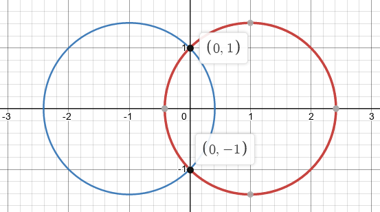

Note that you can find that $i, -i$ are the intersection points by noting that $i\RR$ is the perpendicular bisector through the line segment connecting the centers of the circles, then expanding $\abs{z-1}^2 = (x-1)^2 + y^2 = 2$ and setting $x=0$ to get $y=\pm i$.

First rotate this by $\pi/2$:

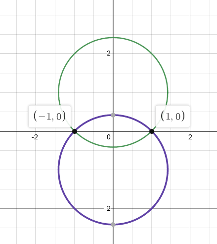

Call the upper circle $C_1$ and the lower $C_2$.
Send $-1\to 0, 1\to \infty$ by taking
\[
f(z) \da {z+1\over z-1}
.\]
This sends the circles to lines through zero, and the lune now spans a triangular sector.
Finding the angles of the lines: write $c\da 1 + \sqrt{2}$.
Note that $f$ fixes $\RR$, so the image regions are symmetric about $\RR$, and it suffices to find the angle of the line $f(C_1)$.
Note that $C_1 \intersect i\RR = ic$, so we compute $\Arg(f(ic))$:
\[
f(ic) 
&= {ic+1\over ic-1} \\
&= {(1+ic)^2 \over c^2 + 1} \\
&= {-1 + c^2 - 2ic \over c^2 + 1} \\
&= {c^2-1 \over c^2+1} -i {2c\over c^2+1}
,\]
so
\[
\Arg(f(ic)) 
&= \arctan\qty{ 2c\over -1 + c^2} \\
&= \arctan\qty{2(1+\sqrt 2) \over 1 - (3 + \sqrt 2)} \\
&= \arctan(-1) \\
&= {\pi\over 4} \text{ or } {3\pi \over 4}
.\]

Thus $f(C_1) = \ts{te^{-i\pi\over 4} \st t\in (-\infty, \infty)}$.
Note that $f(ic)\in Q_4$, since $c^2-1, c^2+1 > 0$ and ${-2c\over c^2+1} < 0$.
For the orientation of $f(C_1)$, note that $(1, ic, -1) \mapsto (\infty, f(ic), 0)$, so the line is oriented from $Q_4$ to $Q_2$.

A similar computation shows
\[
f(-ic) = {c^2-1\over c^2+1} + i{2\over c^2+1} \in Q_1
,\]
and $(-1, -ic, 1)\mapsto (0, f(-ic), \infty)$, so $f(C_2)$ is oriented from $Q_3$ to $Q_1$.

Since the origin region was to the left of the curves, it remains to the left, so the resulting region is $\ts{z\st 3\pi/4 < \Arg(z) < 5\pi/4}$:

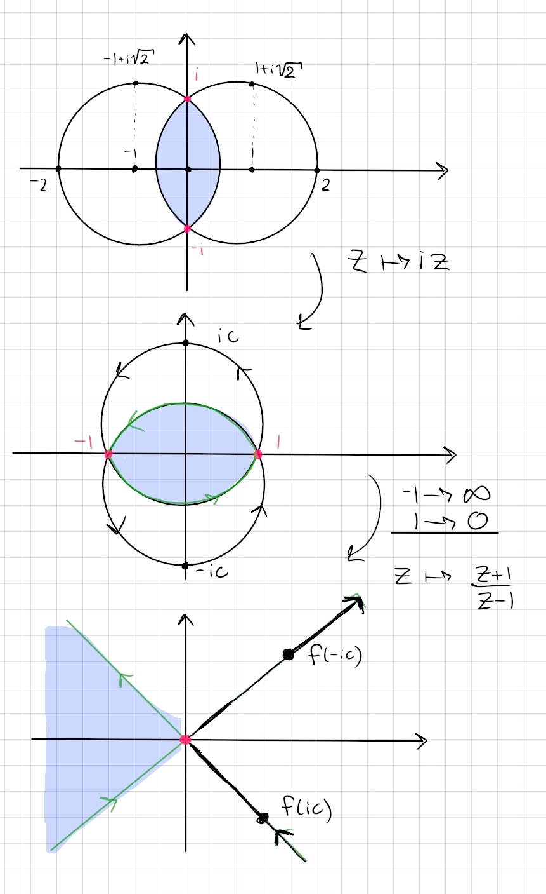

From here, it's a standard exercise, so to sum up:

- Rotate $R\to \tilde R$ by $z\mapsto iz$ to get a horizontal lune with intersection points $\pm 1$.
- Send $-1\to \infty, 1\to 0$ by $z\mapsto {z+1\over z-1}$ to send $\tilde R \to 3\pi/4 < \Arg(z) < 5\pi/4$.
- Reflect by $z\mapsto -z$ to get $-\pi/4 < \Arg(z) < \pi/4$.
- "Open" by $z\mapsto z^{\pi \over 2 \theta_0}$ to map to $-\pi/2<\Arg(z) < \pi/2$, where here $\theta_0 \da {\pi \over 4}$.
- Rotate by $z\mapsto iz$ to get $0 < \Arg(z) < {\pi \over 2}$, i.e. $\HH$.
- Use the Cayley map $z\mapsto {z-i\over z+i}$ to send $\HH\to \DD$.

:::

## Lune #complex/exercise/completed

:::{.problem title="?"}
Let $\lambda = {1\over 2}\qty{1 + i \sqrt{3}}$ and find a map 
\[
R \da \ts{\abs{z - \lambda} < 1} \intersect \ts{\abs{z-\bar{\lambda}} < 1 } \too \DD
.\]
:::

:::{.solution}
The region looks like the following:

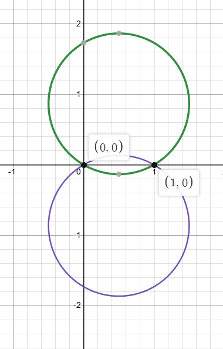

Following the general strategy for lunar regions, send the intersection points to $0$ and $\infty$ to get triangular sector.
So choose to send $0\to 0$ and $1\to \infty$ by taking
\[
f(z) \da {z\over z-1}
.\]

> Note: mistake here, really we need to compose with $z\mapsto -z$ to get the picture, so take $f(z) \da {z\over 1-z}$ instead!!

:::{.claim}
\[
f(R) = \ts{z\st -\theta_0 < \Arg(z) < \theta_0 },\qquad \theta_0 \da {\pi \over 6}
.\]

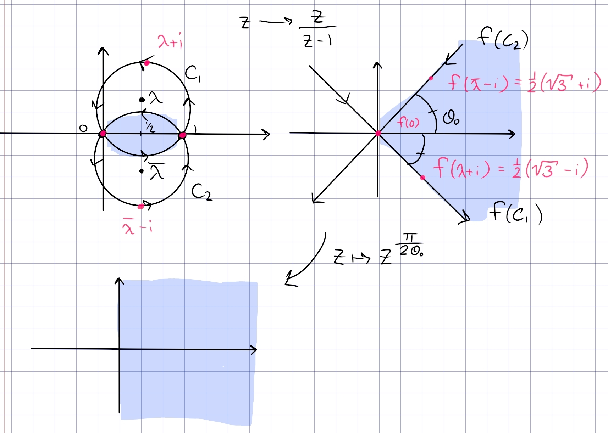

:::

From here it is easy to map to the disc:

- $z\mapsto {z\over z-1}$ sends $R$ to $\abs{\Arg(z)} < \theta_0$
- $z\mapsto z^{\pi \over 2\theta_0}$ maps $\abs{\Arg(z)}<\theta_0 \to \abs{\Arg(z)} < {\pi \over 2}$, the right half-plane.
- $z\mapsto iz$ rotates the right half-plane into $\HH$.
- $z\mapsto {z-i\over z+i}$ maps $\HH\to \DD$.

:::{.proof title="of claim"}
Since both $C_1, C_2$ pass through $0, 1$, their images become circles passing through $f(0)=0, f(1) = \infty$, so lines through the origin.
Since $f$ fixes $\RR$ and the original region is symmetric about $\RR$, the resulting region will also be symmetric about $\RR$.
As shown in the picture, since the interior of the region is to the left of each circle, the image will be to the left of each line.
So it suffices to find the orientation of the two lines, as well as the angle that one of them makes with the $x\dash$axis.

Consider $f(C_1)$ -- it suffices to find $\Arg(f(z_0))$ for any $z_0\in C_1$, so look for a point (other than $0, 1$) where $\Arg(f(z_0))$ is easy to compute.
Noting that $C_1$ intersects $i\RR$, we can find this point:
\[
C_1: \qty{ x-{1\over 2}}^2 + \qty{y - {\sqrt 3 \over 2}}^2 &= 1 \\
x=0 \implies y = \pm{1\over 2} \sqrt{3} + {1\over 2} \sqrt{3} = 0, \sqrt{3}
,\]
so choose $z_0 = i\sqrt{3}$:
\[
f(z_0) 
= {i\sqrt 3 \over i\sqrt 3 - 1} = {1\over 4}\qty{3-i\sqrt 3}
\implies \Arg(f(z_0)) = {-\pi \over 6}
.\]
So $C_1$ does get mapped to the line in the image running from $Q_2\to Q_4$.

To get the orientation of $C_1$, use that $i\sqrt{3}, 0, 1$ map to $f(z_0), 0, \infty$, which gives a $Q_4\to Q_2$ orientation -- oops.

> Mistake here: should have chosen $z\mapsto {z\over 1-z}$ to make the picture accurate!

Similarly for $C_2$, setting $z_1 \da -i\sqrt 3$ yields $f(z_1) = {1\over 4}\qty{3+i\sqrt{3}}$, so $\Arg(f(z_1)) = {\pi \over 6}$.
The orientation is found from $1,0,z_0 \mapsto \infty, 0, f(z_0)$, which is $Q_3\to Q_1$.

> Again, mistake in the picture!

Intersecting the regions that are to the left of each image curve yields $5\pi/6 < \Arg(z) < 7\pi/6$, and composing with $z\mapsto -z$ yields $-\pi/6 < \Arg(z) < \pi/6$.
:::

:::

## Fall 2020.5, Spring 2019.6 #complex/qual/completed

^931c0a

:::{.problem title="?"}
Consider the function $f(z)=\frac{1}{2}\left(z+\frac{1}{z}\right)$ for $z \in \mathbb{C} \backslash\{0\}$. Let $\mathbb{D}$ denote the open unit disc.

a.
Show that $f$ is one-to-one on the punctured disc $\mathbb{D} \backslash\{0\}$. What is the image of the circle $|z|=r$ under this map when $0<r<1$ ?

b.
Show that $f$ is one-to-one on the domain $\mathbb{C} \backslash \mathbb{D}$. What is the image of this domain under this map?

c.
Show that there exists a map $g: \mathbb{C} \backslash[-1,1] \rightarrow \mathbb{D} \backslash\{0\}$ such that $(g \circ f)(z)=z$ for all $z \in \mathbb{D} \backslash\{0\}$. Describe the map $g$ by an explicit formula.

:::

:::{.solution}
**Part a**:
That $f: \CC\smz\to \DD\smz$ is injective: compute the derivative as
\[
f'(z) = {1\over 2}\qty{1 - {1\over z^2}}
,\]
which only vanishes at $z=\pm 1$.
Away from 0 in $\DD$, $f'$ is nonzero and continuous, so by the inverse function theorem $f$ is a local homeomorphism onto its image, and in particular is injective.

The images of circles: parameterize one as $\gamma(t) = Re^{it}$ for $t\in [-\pi, \pi]$.
Note that if $R=1$, $f(\gamma(t)) = {1\over 2}\qty{e^{it} + e^{-it}} = \cos(t)$, so as $t$ increases from $-\pi\to \pi$, the interval $[-1, 1]$ is covered twice.
For $0<R<1$,
\[
f(\gamma(t)) 
&= {1\over 2}\qty{ Re^{it} + {1\over Re^{it}}} \\
&= {1\over 2}\qty{Re^{it} + R\inv e^{-it} } \\
&= {1\over 2}\qty{R\cos(t) + iR\sin(t) + R\inv\cos(-t) + iR\inv\sin(-t) } \\
&= {1\over 2}\qty{R\cos(t) + iR\sin(t) + R\inv\cos(t) - iR\inv\sin(-t) } \\
&= {1\over 2}\qty{R+R\inv}\cos(t) + i{1\over 2}\qty{R-R\inv}\sin(t) \\
&\da H_R \cos(t) + iV_R\sin(t)
,\]
which is generally the equation of an ellipse of horizontal radius $H_R$ and vertical radius $V_R$.
As $R$ varies, these sweep out ellipses of vertical radii from 0 to $\infty$.
One can compute the foci: their distance from $z=0$ is given by $c$, where
\[
c^2 = H_R^2 - V_R^2 = {1\over 4}(R+R\inv)^2 - {1\over 4}(R-R\inv)^2 = 1
,\]
so the foci are all at $\pm 1\in \RR$.
One can check that these are clockwise when $0<R<1$ and counterclockwise when $R>1$.

> In general, you take the coefficient for the major axis squared minus that of the minor axis squared. The foci are along the major axis.

**Part b**:
The claim is that $f(\CC\sm\DD) = \CC\sm[-1, 1]$.

Note that $f(z) = f(1/z)$, so for $z\neq 1/z$ there are exactly two preimages.
These points are exactly $z=\pm 1$, so we need to take the domain $\Omega \da \CC\sm(\DD\union\ts{\pm 1})$ to get injectivity.
Otherwise, for every $z\in \Omega$, exactly one of $z$ or $1/z$ is in $\DD$, so $f(z)$ takes on unique values in $\Omega$.
By part 1, the images of circles of radius $R$ are ellipses, and these sweep out the entire plane outside of $[-1, 1]$:

To be explicit, one can just solve for the two preimages.
Setting $w=f(z)$ and solving for $z$ yields
\[
w &= {1\over 2}\qty{z + {1\over z}} \\
\implies 2wz &= z^2 + 1 \\
\implies z^2 - 2wz + 1 &= 0 \\
\implies z &= {2w \pm \sqrt{4w^2 -4} \over 2} \\
\implies z &= w\pm \sqrt{w^2-1}
,\]
where in order to define $\sqrt{w^2-1}$, one needs a branch cut for $\Log$ along $[-1, 1]$, which is precisely what we're deleting from the image.

**Part c**:
as in a usual conformal map problem, find a map to $\CC\sm[-1,1]\to \DD$.

- Send $-1\to 0$ and $1\to \infty$ with $z\mapsto {z+1\over z-1}$.
  Checking that $f(0) = -1$, this yields $\CC\sm\RR_{\leq 0}$.

- Unwrap with $z\mapsto \sqrt{z}$ to obtain the right half-plane $-\pi/2<\Arg(z) < \pi/2$.
- Apply the rotated Cayley map $z\mapsto {z-1\over z+1}$ to map this to $\DD$.

This composes to 
\[
g(z) &= {\sqrt{z+1\over z-1}  -1 \over \sqrt{z+1\over z-1} +1} \\
&= { \qty{ \sqrt{z+1} - \sqrt{z-1}}^2 \over (z+1)-(z-1) } \\
&= z - \sqrt{z^2-1}
,\]
and checking that it has the right inverse: 
\[
w &= z-\sqrt{z^2-1} \\
\implies (z-w)^2 &= z^2-1 \\
\implies w^2+1 &= 2wz \\
\implies z = {1\over 2}\qty{w + {1\over w}}
.\]

:::

## Tie's Extra Questions: Spring 2015 #complex/exercise/work

:::{.problem title="?"}
Find a conformal map

1.  from $\{ z: |z - 1/2| > 1/2, \text{Re}(z)>0 \}$ to $\mathbb H$

2.  from $\{ z: |z - 1/2| > 1/2, |z| <1  \}$ to $\mathbb D$

3.  from the intersection of the disk $|z + i| < \sqrt{2}$ with
    ${\mathbb H}$ to ${\mathbb D}$.

4.  from ${\mathbb D}  \backslash [a, 1)$ to
    ${\mathbb D} \backslash [0, 1)$ ($0<a<1)$. 

    > Short solution possible using Blaschke factor.

5.  from $\{ z: |z| < 1, \text{Re}(z) > 0 \} \backslash (0, 1/2]$ to
    $\mathbb H$.

:::

:::{.solution}
**Part 1**:
this is a bigon with vertices $0, \infty$, so send $0\to\infty$ with $1/z$.
Orient $i\RR$ and the circle $S$ positively, note that both will be mapped to generalized circles.
To find the resulting region, use handedness -- it's on the right of $i\RR$ and the right of $S$.
The map preserves $i\RR$ and as $t$ traces out $(-\infty, 0^-, 0^+, \infty)$, $f(it)$ traces out $(0^+, \infty, -\infty, 0^-)$, so this preserves the orientation of $i\RR$.
For $S$, let $z_0\da {1\over 2}(1+i)\in S$, then $f(z_0) = 1-i$.
So the arc $(1,z_0, 0)$ maps to $(1, 1-i,\infty)$, so this is a vertical line through $\Re(z) = 1$ oriented downward.
The region is to the right of $S$, so we have

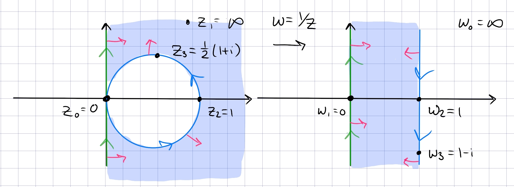

The rest is standard:

- Dilate and rotate to $0<\Im(z) < \pi$ using $z\mapsto i\pi z$.
- Exponentiate using $z\mapsto e^z$ \to get $\HH$.
- Apply the Cayley map $z\mapsto {z-i\over z+i}$ to get $\DD$.

**Part 2**:
a bigon with vertex $1$, i.e. a lune.
Send $1\to \infty$ with $f(z) \da {1\over z-1}$, and check that

- $1\mapsto \infty$
- ${1\over 2}(1+i) \mapsto -(1+i)$
- $0\mapsto -1$
- $i\mapsto -{1\over 2}(1+i)$
- $-1\mapsto -{1\over 2}$

By tracking tangent/normal vectors, this results in the region $-1<\Re(z) < -{1\over 2}$:

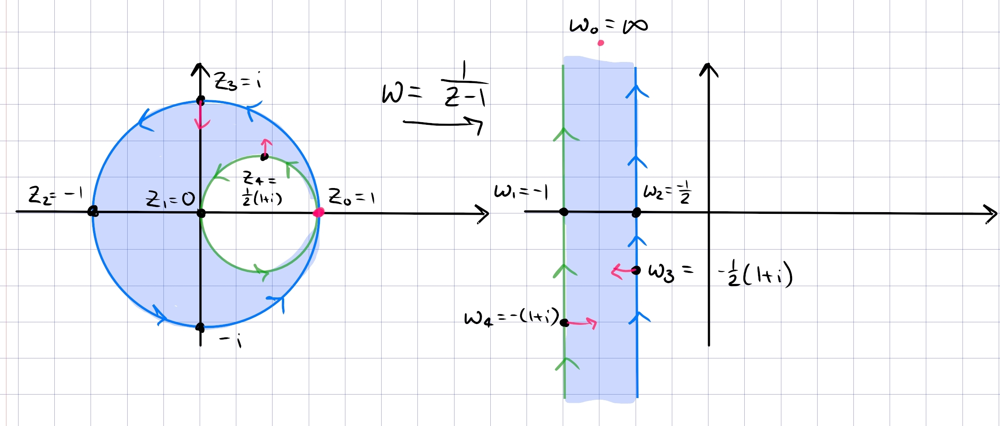

The rest is standard:

- Translate to the right by $z\mapsto z+{1\over 2}$ to get $-{1\over 2}<\Re(z) < 0$.
- Rotate and dilate by $z\mapsto -2i\pi z$ to get $0<\Im(z) < \pi$
- Exponentiate by $z\mapsto e^z$ to get $\HH$,
- Cayley map $z\mapsto {z-i\over z+i}$ to get $\DD$.

**Part 3**:
a bigon in $\HH$ with vertices $\pm 1$, with an arc passing through $z_3 \da i(\sqrt{2} - 1)$.
Take $z\mapsto {z+1\over z-1}$ to obtain

- $-1\mapsto 0$
- $1\mapsto \infty$
- $0\mapsto -1$

:::{.claim}
$z_3\mapsto w_0$ where $\arg(w_0) = -3\pi/4$
:::

:::{.proof title="?"}
Let $z_3 = ic$ where $c\da \sqrt{2} -1$, then
\[
f(z_3) 
&= -{1+z_3\over 1-z_3} \\
&= -{1+ic \over 1-ic} \\
&= -{(1+ic)^2 \over 1+c^2} \\
&= -\qty{ {1-c^2 \over 1+c^2} + i{2c\over 1+c^2} }
.\]
Now check that $c^2 = 3-2\sqrt 2$ and $1-c^2 = -2+2\sqrt{2}$, so
\[
{ 2c\over 1-c^2} = {2(\sqrt 2 - 1) \over -2 + 2\sqrt 2 } = 1
,\]
so the argument is $\arctan(1) = { \pi \over 4}$ or $-{3\pi \over 4}$.
Since $1-c^2>0, 2c>0$, noting the negative sign above, $f(z_3)$ is in $Q_3$, so take $-3\pi \over 4$.
:::

Orienting the bigon positively, we have $(-1, 0, 1)\mapsto (0, -1, \infty)$, i.e. the real axis oriented from $+\infty\to-\infty$.
Similarly $(1, z_3, -1)\mapsto (\infty, \omega_4^3, 0)$, which is a line passing through $\omega_4^3$, oriented from $Q_3\to Q_1$.
Since the original region was on the left of both curves, we get

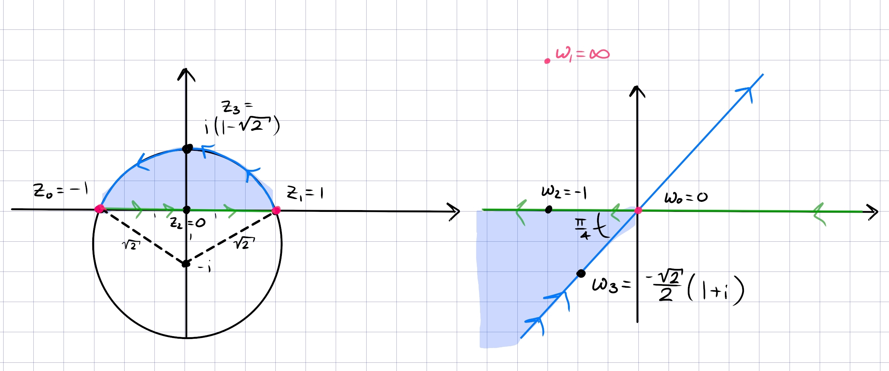

Now

- Flip this to $Q_1$ with $z\mapsto -z$ to get $0<\Arg(z) < \pi/4$.
- Rotate clockwise with $z\mapsto e^{-i\pi\over 8}$ to get $-\pi/8<\Arg(z) < \pi/8$.
- Dilate the argument to a half-plane with $z\mapsto z^{\pi\over 2\theta_0}$ where $\theta_0 = \pi/8$ to get $-\pi/2<\Arg(z) < \pi/2$.
- Rotate with $z\mapsto iz$ to get $\HH$.
- Cayley map, $z\mapsto {z-i\over z+i}$.

**Part 5**:

- Use a Blaschke factor to send $a\da -1/2\to 0$, so $z\mapsto {a-z\over 1-\bar{a} z}$.
  Checking that $(-1/2, 0, 1)\to (0, -1/2, -1)$, the image is $\DD\sm(-1, 0]$.
- Rotate with $z\mapsto e^{-i\pi}z$ to get $\DD\sm[0, 1)$.
- Unfold with $z\mapsto z^{1\over 2}$ to get $\DD \intersect \HH$, noting that the slit becomes $[-1, 1]$ and is erased here.
- Use $z\mapsto -1/z$ to get $\DD^c \intersect \HH$.
- Use the Joukowski map $z\mapsto z+z\inv$ to map to $Q_{34}$
- Use $z\mapsto -z$ to get $\HH$.

:::

		
		
## Tie's Extra Questions: Spring 2015 #complex/exercise/work

Prove that
$\displaystyle{f(z)=-\frac{1}{2}\left(z+\frac{1}{z}\right)}$ is a
conformal map from half disc $\{z=x+iy:\ |z|<1,\ y>0\}$ to upper
half plane $\mathbb H=\{z=x+iy:\ y>0\}$.

## Tie's Extra Questions: Fall 2016 #complex/exercise/work

Find the conformal map that takes the upper half-plane conformally onto the half-strip $\{w=x+iy:\ -\pi/2<x<\pi/2\ y>0\}$.

# Linear Fractional Transformations

## Tie's Extra Questions: Spring 2015 #complex/exercise/work

Let $C$ and $C'$ be two circles and let $z_1 \in C$, $z_2 \notin C$, $z'_1 \in C'$, $z'_2 \notin C'$. Show that there is a unique fractional linear transformation $f$ with $f(C) = C'$ and
$f(z_1) = z'_1$, $f(z_2) = z'_2$.

## Tie's Extra Questions: Spring 2015 #complex/exercise/work

Let $f(z)$ be an analytic function on
${\mathbb C} \backslash \{ z_0 \}$, where $z_0$ is a fixed point.
Assume that $f(z)$ is bijective from
${\mathbb C} \backslash \{ z_0 \}$ onto its image, and that $f(z)$
is bounded outside $D_r(z_0)$, where $r$ is some fixed positive
number. Show that there exist $a, b, c, d \in \mathbb C$ with
$ad-bc \neq 0$, $c \neq 0$ such that
$\displaystyle f(z) = \frac{az + b}{cz + d}$.

## Tie's Extra Questions: Spring 2015 #complex/exercise/work
Let $\displaystyle{\psi_{\alpha}(z)=\frac{\alpha-z}{1-\bar{\alpha}z}}$
with $|\alpha|<1$ and $\mathbb D = \{z:\ |z|<1\}$. 
Prove that

- a,
\[
\displaystyle{\frac{1}{\pi}\iint_{{\mathbb D}} |\psi'_{\alpha}|^2 dx dy =1}
.\]

- b,
\[
\displaystyle{\frac{1}{\pi}\iint_{{\mathbb D}} |\psi'_{\alpha}| dx dy =\frac{1-|\alpha|^2}{|\alpha|^2} \log \frac{1}{1-|\alpha|^2}}
.\]

