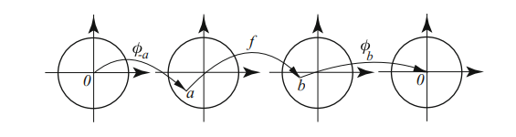

# Schwarz Lemma

## Spring 2021 # 5 #completed

:::{.problem title="?"}
Let $f$ be a holomorphic map of the open unit disc $\DD$ to itself.
Show that for any $z, w\in \DD$,
\[
\left|\frac{f(w)-f(z)}{1-\overline{f(w)} f(z)}\right| \leq\left|\frac{w-z}{1-\bar{w} z}\right|
.\]
Show that this inequality is strict for $z\neq w$ except when $f$ is a linear fractional transformation from $\DD$ to itself.
:::

:::{.concept}

:::

:::{.solution .foldopen}
This is the **Schwarz–Pick theorem**.

- Fix $z_1$ and let $w_1 = f(z_1)$.
  Define
  \[
  \psi_{a}(z) \da {a-z \over 1-\bar{a}z} \in \Aut(\DD)
  .\]

  - Note that inequality now reads
  \[
  \abs{\psi_{f(w)}(f(z)) } \leq \abs{\psi_w(z)}
  .\]
  Moreover $\psi_a$ is an involution that swaps $a$ and $0$.

- Now set up a situation where Schwarz's lemma will apply: 
\[
0 \mapsvia{\psi_{z_1}} z_1 \mapsvia{f} f(z) \mapsvia{\psi_{f(z_1)}} 0 
,\]
  so $F\da \psi_{f(z_1)} \circ f \circ \psi_{z_1} \in \Aut(\DD)$ and $F(0) = 0$.

- Apply Schwarz we get $\abs{F(z)} \leq \abs{z}$ for all $z$, so
\[
\abs{F(z)} &\leq \abs{z} \\
\implies \abs{
f(z_1) - (f\circ \psi_{z_1})(z) 
\over 
1 - \bar{f(z_1)} \cdot (f\circ \psi_{z_1}) (z)
} &\leq \abs{ z} \\
\implies \abs{f(z_1) - f(w) \over 1 - \bar{f(z_1)}\cdot f(w) }
&\leq \abs{\psi_{z_1}(z)}
&& w\da \psi_{z_1}(z) \\
\implies \abs{f(z_1) - f(w) \over 1 - \bar{f(z_1)}\cdot f(w) }
&\leq \abs{z_1 - z \over 1 - \bar{z_1} z }
.\]

- Since $z_1$ was arbitrary and fixed and $w$ was a free variable, this holds for all $z,w\in \DD$.

- Strictness: suppose equality holds, we'll show that $f(z) = {az+b\over cz+d}$
- By Schwarz, $F(z) = \lambda z$ for $\lambda \in S^1$.
  Thus
  \[
  (\psi_{f(z_1)} \circ f \circ \psi_{z_1}) (z) &= \lambda z \\
  \implies
  (f \circ \psi_{z_1}) (z) &= \psi_{f(z_1)}\inv(\lambda z ) \\
  \implies
  f(w) &= \psi_{f(z_1)}\inv(\lambda \psi_{z_1}\inv(w) ) 
  && w\da \psi_{z_1}(z) \\
  &= \psi_{f(z_1)} \qty{\lambda \psi_{z_1}(w)} \\
  &= \lambda \psi_{\bar \lambda f(z_1)} \qty{\psi_{z_1}(w)} \\
  &\da \lambda \psi_a(\psi_b(w)) \\
  &=\lambda\qty{ a- \psi_b(w) \over 1 - \bar a \psi_b(w) } \\
  &= \quad \vdots \\
  &= -\lambda \qty{ \frac{{\left(a \overline{b} - 1\right)} z - a + b}{{\left(\overline{a} - \overline{b}\right)}z - b \overline{a} + 1} } \\
  &= \qty{ \frac{-\lambda {\left(a \overline{b} - 1\right)} z + \lambda( a - b)}{{\left(\overline{a} - \overline{b}\right)}z + (- b \overline{a} + 1)} }
  ,\]
  which is evidently a linear fractional transformation.

:::

:::{.remark}
Note that Schwarz also provides an actual bound for $F'$ here -- applying the chain rule yields
\[
F' = \qty{ \psi_{f(z_1)} \circ f \circ \psi_{z_1}}'
= \qty{\psi'_{f(z_1)} \circ f \circ \psi_{z_1}} \cdot (f' \circ \psi_{z_1}) \cdot \psi'_{z_1}
.\]

Now use that (up to absolute values)

- $\psi_{z_1}(0) = z_1$
- $\psi'_{z_1}(0) = 1-\abs{z_1}^2$
- $\psi_a' = {1-\abs{a}^2 \over (1-\bar{a}z)^2 }$

and evaluate:
\[
F'(0) 
&= \psi'_{f(z_1)}(f(z_1)) \cdot f'(z_1) \cdot \qty{1 - \abs{z_1}^2} \\
&= \qty{ 1 - \abs{ f(z_1)}^2 \over \qty{1 - \bar{f(z_1)} f(z_1) }^2 } \cdot f'(z_1) \cdot \qty{1 - \abs{z_1}^2} \\
&= \qty{ 1 - \abs{ f(z_1)}^2 \over \qty{1 - \abs{f(z_1)}^2}^2 } \cdot f'(z_1) \cdot \qty{1 - \abs{z_1}^2} \\
&= f'(z_1) \qty{ 1 - \abs{z_1}^2 \over 1 - \abs{f(z_1)}^2 } \\
&\leq 1 &&\text{by Schwarz}
,\]
so
\[
f'(z_1) \leq {1- \abs{f(z_1)}^2 \over 1 - \abs{z_1}^2}
.\]

> Note: I've sloppily left absolute values off of everything and freely swapped orders of terms!

:::

## 1 #work
Suppose $f:\DD\to\DD$ is analytic and admits a continuous extension $\tilde f: \bar \DD \to \bar \DD$ such that $\abs{z} = 1 \implies \abs{f(z)} = 1$.

a.
Prove that $f$ is a rational function.

b.
Suppose that $z=0$ is the unique zero of $f$.
Show that
\[  
\exists n\in \NN, \lambda \in S^1 \qtext{ such that }f(z) = \lambda z^n
.\]

c
Suppose that $a_1, \cdots, a_n \in \DD$ are the zeros of $f$ and prove that
\[  
\exists \lambda \in S^1 \qtext{such that} f(z) = \lambda \prod_{j=1}^n {z - a_j \over 1 - \bar{a_j} z}
.\]

## 2 #work
Let $\bar B(a, r)$ denote the closed disc of radius $r$ about $a\in \CC$.
Let $f$ be holomorphic on an open set containing $\bar B(a, r)$ and let 
\[  
M \definedas \sup_{z\in \bar B(a, r)} \abs{f(z)}
.\]

Prove that 
\[  
z\in \bar B\qty{a, {r\over 2}},\,z\neq a, \qquad {\abs{ f(z) - f(a)} \over \abs{z-a}} \leq {2M \over r}
.\]

## 3 #work
Define
\[  
G \definedas \theset{z\in \CC\suchthat \Re(z) > 0, \, \abs{z-1} > 1}
.\]

Find all of the injective conformal maps $G\to \DD$.
These may be expressed as compositions of maps, but explain why this list is complete.

## 5 #work
Suppose $f: \DD\to \HH$ is analytic and satisfies $f(0) = 2$.
Find a sharp upper bound for $\abs{f'(0)}$, and prove it is sharp by example.

## 6 #work
Suppose $f:\DD\to\DD$ is analytic, has a single zero of order $k$ at $z=0$, and satisfies $\lim_{\abs z \to 1} \abs{f(z)} = 1$.
Give with proof a formula for $f(z)$.

## 8 #work
Suppose $f, g: \DD\to \Omega$ are holomorphic with $f$ injective and $f(0) = g(0)$.

Show that 
\[  
\Forall 0 < r < 1,\qquad g\qty{\theset{\abs{z} < r}} \subseteq f\qty{\theset{\abs{z} < r}}
.\]

> The first part of this problem asks for a statement of the Schwarz lemma.

## 9 #work
Let $S\definedas \theset{z\in \DD\suchthat \Im(z) \geq 0}$.
Suppose $f:S\to \CC$ is continuous on $S$, real on $S\intersect \RR$, and holomorphic on $S^\circ$.

Prove that $f$ is the restriction of a holomorphic function on $\DD$.

## 10 #work
Suppose $f:\DD\to \DD$ is analytic.
Prove that 
\[  
\forall a\in \DD, \qquad {\abs{f'(a)} \over 1 - \abs{f(a)}^2 } \leq {1 \over 1 - \abs{a}^2}
.\]

### Tie's Extra Questions: Fall 2009
Let $g$ be analytic for $|z|\leq 1$ and $|g(z)| < 1$ for $|z| = 1$.

1.  Show that $g$ has a unique fixed point in $|z| < 1$.

2.  What happens if we replace $|g(z)| < 1$ with $|g(z)|\leq 1$ for
    $|z|=1$? Give an example if (a) is not true or give an proof
    if (a) is still true.

3.  What happens if we simply assume that $f$ is analytic for
    $|z| < 1$ and $|f(z)| < 1$ for $|z| < 1$? Suppose that $f(z)
    \not\equiv  z$. Can f have more than one fixed point in
    $|z| < 1$?

> Hint: The map $\displaystyle{\psi_{\alpha}(z)=\frac{\alpha-z}{1-\bar{\alpha}z}}$ may be useful.

### Tie's Extra Questions: Fall 2015

(a) Let $z, w$ be complex numbers, such that $\bar{z} w \neq 1$.
Prove that
$$\abs{\frac{w - z}{1 - \bar{w} z}} < 1 \; \; \; \mbox{if} \; |z| < 1 \; \mbox{and}\; |w| < 1,$$
and also that
$$\abs{\frac{w - z}{1 - \bar{w} z}} = 1 \; \; \; \mbox{if} \; |z| = 1 \; \mbox{or}\; |w| = 1.$$

(b) Prove that for fixed $w$ in the unit disk $\mathbb D$, the
mapping $$F: z \mapsto \frac{w - z}{1 - \bar{w} z}$$ satisfies the following conditions:

(i) $F$ maps $\mathbb D$ to itself and is holomorphic. 

(ii) $F$ interchanges $0$ and $w$, namely, $F(0) = w$ and
$F(w) = 0$.

(iii) $|F(z)| = 1$ if $|z| = 1$.

(iv) $F: {\mathbb D} \mapsto {\mathbb D}$ is bijective.

> Hint: Calculate $F \circ F$.

### Tie's Extra Questions: Spring 2015

Suppose $f$ is analytic in an open set containing the unit disc $\mathbb D$ and $|f(z)| =1$ when $|z|$=1. Show that either $f(z) = e^{i \theta}$ for some $\theta \in \mathbb R$ or there are
finite number of $z_k \in \mathbb D$, $k \leq n$ and
$\theta \in \mathbb R$ such that
$\displaystyle f(z) = e^{i\theta} \prod_{k=1}^n \frac{z-z_k}{1 - \bar{z}_k z } \, .$

> Also cf. Stein et al, 1.4.7, 3.8.17

### Tie's Extra Questions: Spring 2015

Let $f$ and $g$ be non-zero analytic functions on a region $\Omega$.
Assume $|f(z)| = |g(z)|$ for all $z$ in $\Omega$. Show that
$f(z) = e^{i \theta} g(z)$ in $\Omega$ for some
$0 \leq \theta < 2 \pi$.
