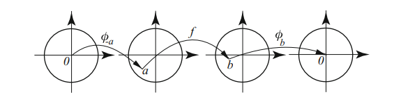

# Schwarz Lemma

## Fall 2020.4 (Schwarz double root) #stuck #complex/qual/completed

^0f90ac

:::{.problem title="?"}
Let $\mathbb{D}:=\{z:|z|<1\}$ denote the open unit disk. Suppose that $f(z): \mathbb{D} \rightarrow \mathbb{D}$ is holomorphic, and that there exists $a \in \mathbb{D} \backslash\{0\}$ such that $f(a)=f(-a)=0$.

- Prove that $|f(0)| \leq|a|^{2}$.

- What can you conclude when $|f(0)|=|a|^{2} ?$

:::

:::{.solution}
**Part 1**:

Write $\psi_a(z) \da {a-z\over 1-\bar a z}$ for the Blaschke factor of $a$, and define
\[
g(z) \da {f(z) \over \psi_a(z) \psi_{-a}(z)}
.\]

:::{.claim}
$\abs{g(z)}\leq 1$ on $\DD$.
:::

:::{.proof title="of claim"}
$\abs{\psi_a(z)} = 1$ on $\bd \DD$, so $\lim_{r\to 1}\psi_a(re^{it}) = 1$ for any fixed $t$.
Then for any $f$ with $\abs{f} \leq 1$ in $\DD$,
\[
\abs{f(re^{it} ) \over \psi_a(re^{it} ) } 
\leq {1\over \psi_a(re^{it})} 
\leq {1\over \sup_{t} \psi_a(re^{it}) }
\convergesto{r\to 1} 1
.\]
So apply this to $f=g$ and $f={g\over \psi_a}$ to get it for ${f\over \psi_a \psi_{-a}}.$

:::

In particular, $\abs{g(0)} \leq 1$, so
\[
1\geq \abs{g(0)} = {\abs{f(0)} \over \abs{B_a(0)} \cdot \abs{B_{-a}(0)}}
= {\abs{f(0)} \over \abs{a}^2} \implies \abs{a}^2 \geq \abs{f(0)}
.\]

**Part 2**:
Applying Schwarz-Pick:
\[
\abs{f'(0)} \leq {1 - \abs{f(0)}^2 \over 1 - \abs{0}^2 } = 1-\abs{a}^2 < 1
,\]
using that $a\neq 0$, so $f$ is a contraction.

> Can write $f_e(z) \da {f(a) + f(-a) \over 2}$ to write $f_e(z) = g(z^2)$.
  Compose with some $\psi_a$ to get $0\to 0$ and apply Schwarz -- unclear how to unwind what happens in the case of equality though.

:::

## Fall 2021.5  #complex/qual/completed

^ee1748

:::{.problem title="?"}
Assume $f$ is an entire function such that $|f(z)|=1$ on $|z|=1$. Prove that $f(z)=e^{i \theta} z^{n}$, where $\theta$ is a real number and $n$ a non-negative integer. 

> Suggestion: First use the maximum and minimum modulus theorem to show 
$$
f(z)=e^{i \theta} \prod_{k=1}^{n} \frac{z-z_{k}}{1-\bar{z_{k}} z}
$$ 
if $f$ has zeros.

:::

:::{.solution}
First show the hint: assume $f$ has nonzero zeros.
Write $Z(f) \da f\inv(0)$ for the set of zeros in $\bar{\DD}$.

:::{.claim}
If we assume $f$ is continuous on $\DD$, then $\size Z(f) < \infty$
:::

:::{.proof title="?"}
Suppose $\size Z(f) = \infty$, then by compactness of $\bar{\DD}$ there is a limit point $z_0$.
If $z_0 \in \DD$, then there is a sequence $\ts{z_k}\to z_0$ with $f(z_k) = 0$ for every $k$, so $f$ is zero on a set $S\da \ts{z_k}_{k\geq 1} \union \ts{z_0}$ with an accumulation point and this forces $f\equiv 0$ on $\bar{\DD}$ by the identity principle, contradicting $\abs{f} = 1$ on $\bd \DD$>

Otherwise, if $z_0\in \bd \DD$, using continuity of $f$ we have $f(z_k) = 0$ for all $k$ and $z_k\to z_0$ so $f(z_0) = 0$, again contradiicting $\abs{f} = 1$ on $\bd \DD$.
:::

So write $Z(f) = \ts{z_1,\cdots, z_m}$ and define 
\[
g(z) \da \prod_{1\leq k \leq m} {z-z_k \over 1 - \bar{z_k} z},
\quad
h(z) \da {f(z) \over g(z)}
.\]

:::{.claim}
$h(z) \equiv 1$ is constant on $\bar{\DD}$, so that $f = \lambda g$ for some $\lambda \in S^1$, i.e. $\lambda = e^{i\theta}$ for some $\theta$.
:::

:::{.proof title="?"}
Note that $h$ cancels all zeros of $f$, so $h$ is nonzero and holomorphic on $\bar{\DD}$.
Moreover $\abs{g(z)} \leq 1$ on $\bar{\DD}$ since these are well-known to be in $\Aut(\DD)$.
It's also well-known that $\abs{g(z)} = 1$ on $\bd \DD$.
Thus $\abs{h(z)} = 1$ and $\abs{1\over h(z)} =1$ on $\bd \DD$, and by the maximum modulus principle, 
\[
\abs{h(z)} \leq 1 \quad\text{ and }\quad \abs{1\over h(z)}\leq 1 \quad \text{ on } \DD
,\]
forcing $\abs{h(z)}\equiv 1$ and thus $h(z) = e^{i\theta}$ for some $\theta$.

:::

So we now have
\[
f(z) = e^{i\theta} \prod_{1\leq k\leq m} {z-z_k \over 1 -\bar{z_k} z}
,\]
which has poles at points $z$ for which $\bar{z_k}z=1$ for some $z_k\in Z(f)$.
However, since we assumed $f$ was entire, it can have no such poles, which forces $z_k = 0$ for all $k$.
But then
\[
f(z) = e^{i\theta}\prod_{1\leq k \leq m}{z- 0 \over 1 - 0\cdot z} = e^{i\theta}z^m
.\]

:::

## Fall 2021.6 (Schwarz manipulation) #complex/qual/completed

^33ab95

:::{.problem title="?"}
Show that if $f: D(0, R) \rightarrow \mathbb{C}$ is holomorphic, with $|f(z)| \leq M$ for some $M>0$, then
\[
\left|\frac{f(z)-f(0)}{M^{2}-\overline{f(0)} f(z)}\right| \leq \frac{|z|}{M R} .
\]
:::

:::{.concept}
The strategy:

- Write the RHS as $a$.
  Note that we need to get rid of the $M^2$ on the LHS, so keep the $M$ around and write $a \da z/R$ so $z = aR$.
- Make the substitution to get
\[
\abs{f(aR) - f(0) \over M^2 - \bar{f(0)} f(aR) } \leq M\inv \abs{a} \\
\implies
\abs{M\qty{ f(aR) - f(0)}  \over M^2 - \bar{f(0)} f(aR) } \leq \abs{a} \\
\abs{ f(aR)/M - f(0)/M  \over 1 - \bar{f(0)} f(aR)/M^2 } \leq \abs{a} 
.\]
  - Recognize the LHS as $\psi_w(g(a))$ for $w\da f(0)/M$ and $g(a) \da f(aR)/M$.

:::

:::{.solution}

> Proof due to Swaroop Hegde!

Fix $R, M$ and make a clever choice: define
\[
F: \DD &\to \CC \\
z &\mapsto {f(Rz) \over M}
.\]
Write $a\da F(0)$ and consider the Blaschke factor
\[
\psi_a(z) \da {a-z \over 1-\bar{a} z} \in \Aut(\DD)
,\]
and define
\[
g: \DD &\to \DD \\
z &\mapsto (\psi_a \circ F)(z)
.\]
Then $g(0) = 0$ and $\abs{g(z)} \leq 1$ for all $z\in \DD$, so by Schwarz we have $\abs{g(z)} \leq \abs{z}$ for all $z\in \DD$.
Thus for all $z\in \DD$,
\[
&\abs{g(z)} \leq z \\ \\
\iff & \abs{\psi_a(F(z)) } \leq \abs{z} \\ \\
\iff & \abs{ {f(Rz) \over M} - a \over 1 - {\bar a f(Rz) \over M}  } \leq \abs{z} \\ \\
\iff & \abs{f(Rz) - f(0) \over 1 - {\bar{f(0)} f(Rz) \over M^2 } } \leq \abs{z} \\ \\
\iff & \abs{f(Rz) - f(0) \over M^2 - \bar{f(0)} f(Rz) } \leq {\abs{z} \over M} \\ \\
\iff & \abs{f(w) - f(0) \over M^2 - \bar{f(0)} f(w) } \leq {\abs{w} \over MR}
,\]
which holds for all $w\in \DD$ by replacing $Rz$ with $w$ (i.e. to show this equality for arbitrary $w\in \DD$, write $w = Rz$ for some $z\in \DD$ and run this chain of inequalities backward).

:::

## Scaling Schwarz #complex/exercise/completed

:::{.problem title="?"}
Let $\bar B(a, r)$ denote the closed disc of radius $r$ about $a\in \CC$.
Let $f$ be holomorphic on an open set containing $\bar B(a, r)$ and let 
\[  
M \definedas \sup_{z\in \bar B(a, r)} \abs{f(z)}
.\]

Prove that 
\[  
z\in \bar B\qty{a, {r\over 2}},\,z\neq a, \qquad {\abs{ f(z) - f(a)} \over \abs{z-a}} \leq {2M \over r}
.\]

:::

:::{.solution}
Set 
\[
g(z) \da {f(Rz+a) - f(a) \over 2M}
,\]
so that $g(0) = 0$ and $g:\DD\to \DD$ so Schwarz applies,
\[
\abs{g(z)} \leq \abs{z} 
\implies \abs{ f(Rz+a) - f(a) \over 2M } &\leq \abs{z} \\
\implies \abs{ f(Rz+a) - f(a) } &\leq 2M \abs{z} \\
\implies \abs{ f(w) - f(a) } &\leq 2M\abs{ w-a\over R} \\
\implies \abs{f(w) - f(a) \over w-a} &\leq {2M \over R}
.\]

:::

## Bounding derivatives #complex/exercise/completed

:::{.problem title="?"}
Suppose $f: \DD\to \HH$ is analytic and satisfies $f(0) = 2$.
Find a sharp upper bound for $\abs{f'(0)}$, and prove it is sharp by example.
:::

:::{.concept}
Some useful facts about the Cayley map:

- $C(z) \da {z-i\over z+i}$ maps $\HH\to \DD$ sending $i\to 0$.
- $C\inv(z) \da -i {z+1\over z-1}$ maps $\DD\to\HH$ sending $0\to i$.
- $C'(z) = {2i\over (z+i)^2}$ and $C'(i) = -{1\over 2}i$.
- $(C\inv)'(z) = {2i\over (z-1)^2}$ and $C'(0) = 2i$.
- A mistake that's useful to know: $\psi_w'(z) = {1-\abs{w}^2 \over (1-\bar{w}z )^2}$ and $\psi_w'(w) \to \infty$.

:::

:::{.solution}
Define $g:\HH\to \HH$ by $g(z) = {1\over 2}iz$, so $g(2) = i$.
Then set $F \da C\circ g \circ f: \DD\to \DD$ where $C(z) \da {z-i\over z+i}$ is the Cayley map.Since $F(0) = C(g(f(0))) = C(g(2)) = C(i) = 0$, Schwarz applies to $F$ and $\abs{F'(z)}\leq 1$ for $z\in \DD$.
By the chain rule,
\[
F'(z) = f'( (g\circ C) (z))\cdot g'(C(z)) \cdot C'(z)
.\]
Setting $g(C(z)) = 0$ yields $z=C\inv(g\inv(0)) = C\inv(0) = i$.
\[
F'(i) &= f'(0) \cdot g'(0) \cdot C'(i) \\
\implies \abs{f'(0)} 
&\leq \abs{F'(i) \over g'(0) C'(i)} \\
&\leq {1\over \abs{g'(0)} \cdot \abs{C'(i)} } \\
&= {1\over \abs{i\over 2} \cdot \abs{-{i\over 2} } } \\
&= 4
.\]

By Schwarz, if $\abs{F'(z)} = 1$ for any $z\in \DD$, we'll have $F(z) = \lambda z$ for some $\abs{ \lambda} = 1$.
Unwinding this:
\[
F(z) &= \lambda z \implies (C\circ g\circ f)(z) = \lambda z \\
\implies f(z) &= g\inv(C\inv(\lambda z)) = g\inv\qty{-i {\lambda z + 1 \over \lambda z - 1}} \\
\implies f(z) &= -2 {\lambda z + 1\over \lambda z - 1}
.\]
Moreover $f'(z) = -2\qty{-2\lambda \over (\lambda z - 1)^2}$, so
\[
\abs{f'(0)} = 4\abs{\lambda} = 4
.\]

:::

## Schwarz for higher order zeros #complex/exercise/completed

:::{.problem title="?"}
Suppose $f:\DD\to\DD$ is analytic, has a single zero of order $k$ at $z=0$, and satisfies $\lim_{\abs z \to 1} \abs{f(z)} = 1$.
Give with proof a formula for $f(z)$.
:::

:::{.solution}
Note $\abs{f(z)}\leq 1$, and $g\da f(z)/z^k$ has a removable singularity at zero since $g$ is bounded on $\DD$: fixing $\abs{z} = r < 1$,
\[
\abs{g(z)} = \abs{f(z)\over z^k} = \abs{f(z)}r^{-k}\leq r^{-k}\convergesto{r\to 1} 1
.\]
So $g:\DD\to \DD$ since $\abs{g(z)}\leq 1$ on $\DD$ by the MMP.
Since $g$ has no zeros on $\DD$, by the MMP $\abs{g} \geq 1$ on $\DD$, so $\abs{g} = 1$ is constant, making $g(z) = \lambda z$ a rotation.
Then $f(z) = \lambda z^n$.

> Alternative to MMP: if $g$ has no zeros in $\DD$, $g$ admits a conjugate reflection through $\DD$ by $z\mapsto 1/\bar{f(1/\bar z)}$. This is bounded and entire, thus constant, making $g$ constant.

:::

## Schwarz with an injective function #complex/exercise/completed

:::{.problem title="?"}
Suppose $f, g: \DD\to \Omega$ are holomorphic with $f$ injective and $f(0) = g(0)$.

Show that 
\[  
\Forall 0 < r < 1,\qquad g\qty{\theset{\abs{z} < r}} \subseteq f\qty{\theset{\abs{z} < r}}
.\]

> The first part of this problem asks for a statement of the Schwarz lemma.

:::

:::{.solution}
Since $f$ is injective, it has a left-inverse $f\inv$, and $F\da f\inv g$ is well-defined.
Since $F:\DD\to \DD$ and $F(0) = 0$, Schwarz applies and $\abs{F(z)} \leq z$ on $\DD$.
Unwinding:
\[
\abs{(f\inv \circ g)(z)} \leq \abs{z} \implies \abs{g(z)} \leq \abs{f(z)} \qquad \forall \DD\in \ZZ
.\]
This says that $g(\DD) \subseteq f(\DD)$, and in particular this holds on all $\DD_r(0)$, so $g(\DD_r(0)) \subseteq f(\DD_r(0))$.
:::

## Reflection principle #complex/exercise/completed

:::{.problem title="?"}
Let $S\definedas \theset{z\in \DD\suchthat \Im(z) \geq 0}$.
Suppose $f:S\to \CC$ is continuous on $S$, real on $S\intersect \RR$, and holomorphic on $S^\circ$.

Prove that $f$ is the restriction of a holomorphic function on $\DD$.

:::

:::{.solution}
Define a function
\[
F(z) \da 
\begin{cases}
f(z) & \Im(z)\geq 0 
\\
\bar{f(\bar z)} & \Im(z) < 0
\end{cases}
.\]
Then $F$ is holomorphic on $\tilde S\da \ts{z\in \DD\st \Im(z) < 0}$ -- write $w_0\in \tilde S$ as $w_0 = \bar{z_0}$ for some $z_0\in S$, then
\[
f(z) 
&= \sum_{k\geq 0}c_k (z-z_0)^k \\
\implies \bar{f(\bar z)} 
&= \sum_{k\geq 0}\bar{c_k} \bar{\qty{\bar z - z_0}^k} \\
&= \sum_{k\geq 0}\bar{c_k} \qty{z - \bar{z_0}}^k \\
&= \sum_{k\geq 0}\bar{c_k} \qty{z - w_0}^k
,\]
which yields a power series expansion of $F$ about $w_0$.
So $f$ is analytic at every point in $\tilde S$ and thus holomorphic.
Since $\bar{f(\bar z)} = f(z)$ for $z, f(z)\in \RR$, $F$ is a continuous extension of $f$ to $\DD$.
By the symmetry principle, $F$ is holomorphic, and $\ro{F}{S} = f$.
:::

# Blaschke Factors

## Spring 2019.5, Spring 2021.5 (Blaschke contraction) #complex/qual/completed

^14ad86

:::{.problem title="?"}
Let $f$ be a holomorphic map of the open unit disc $\DD$ to itself.
Show that for any $z, w\in \DD$,
\[
\left|\frac{f(w)-f(z)}{1-\overline{f(w)} f(z)}\right| \leq\left|\frac{w-z}{1-\bar{w} z}\right|
.\]
Show that this inequality is strict for $z\neq w$ except when $f$ is a linear fractional transformation from $\DD$ to itself.
:::

:::{.concept}

The Schwarz conjugation trick:

Write the RHS as $a$, we then want something in the form $\abs{F(a)}\leq \abs{a}$.
The choice $a=\psi_w(z)$ is forced, so $z= \psi_w\inv(a)$.
This forces the choice for the LHS
\[
{ f(w) - (f\circ \psi_w\inv)(a) \over 1 - \bar{f(w)} (f\circ \psi_w\inv)(a) } 
= (\psi_{f(w)} \circ f \circ \psi_w\inv)(a) \da F(a)
.\]

:::

:::{.solution}
This is the **Schwarz–Pick lemma**.

- Fix $z_1$ and let $w_1 = f(z_1)$.
  Define
  \[
  \psi_{a}(z) \da {a-z \over 1-\bar{a}z} \in \Aut(\DD)
  .\]

  - Note that inequality now reads
  \[
  \abs{\psi_{f(w)}(f(z)) } \leq \abs{\psi_w(z)}
  .\]
  Moreover $\psi_a$ is an involution that swaps $a$ and $0$.

- Now set up a situation where Schwarz's lemma will apply: 
\[
0 \mapsvia{\psi_{z_1}} z_1 \mapsvia{f} f(z) \mapsvia{\psi_{f(z_1)}} 0 
,\]
  so $F\da \psi_{f(z_1)} \circ f \circ \psi_{z_1} \in \Aut(\DD)$ and $F(0) = 0$.

- Apply Schwarz we get $\abs{F(z)} \leq \abs{z}$ for all $z$, so
\[
\abs{F(z)} &\leq \abs{z} \\
\implies \abs{
f(z_1) - (f\circ \psi_{z_1})(z) 
\over 
1 - \bar{f(z_1)} \cdot (f\circ \psi_{z_1}) (z)
} &\leq \abs{ z} \\
\implies \abs{f(z_1) - f(w) \over 1 - \bar{f(z_1)}\cdot f(w) }
&\leq \abs{\psi_{z_1}(z)}
&& w\da \psi_{z_1}(z) \\
\implies \abs{f(z_1) - f(w) \over 1 - \bar{f(z_1)}\cdot f(w) }
&\leq \abs{z_1 - z \over 1 - \bar{z_1} z }
.\]

- Since $z_1$ was arbitrary and fixed and $w$ was a free variable, this holds for all $z,w\in \DD$.

- Strictness: suppose equality holds, we'll show that $f(z) = {az+b\over cz+d}$
- By Schwarz, $F(z) = \lambda z$ for $\lambda \in S^1$.
  Thus
  \[
  (\psi_{f(z_1)} \circ f \circ \psi_{z_1}) (z) &= \lambda z \\
  \implies
  (f \circ \psi_{z_1}) (z) &= \psi_{f(z_1)}\inv(\lambda z ) \\
  \implies
  f(w) &= \psi_{f(z_1)}\inv(\lambda \psi_{z_1}\inv(w) ) 
  && w\da \psi_{z_1}(z) \\
  &= \psi_{f(z_1)} \qty{\lambda \psi_{z_1}(w)} \\
  &= \lambda \psi_{\bar \lambda f(z_1)} \qty{\psi_{z_1}(w)} \\
  &\da \lambda \psi_a(\psi_b(w)) \\
  &=\lambda\qty{ a- \psi_b(w) \over 1 - \bar a \psi_b(w) } \\
  &= \quad \vdots \\
  &= -\lambda \qty{ \frac{{\left(a \overline{b} - 1\right)} z - a + b}{{\left(\overline{a} - \overline{b}\right)}z - b \overline{a} + 1} } \\
  &= \qty{ \frac{-\lambda {\left(a \overline{b} - 1\right)} z + \lambda( a - b)}{{\left(\overline{a} - \overline{b}\right)}z + (- b \overline{a} + 1)} }
  ,\]
  which is evidently a linear fractional transformation.

:::

## Schwarz-Pick derivative #complex/exercise/completed

:::{.problem title="?"}
Suppose $f:\DD\to \DD$ is analytic.
Prove that 
\[  
\forall a\in \DD, \qquad {\abs{f'(a)} \over 1 - \abs{f(a)}^2 } \leq {1 \over 1 - \abs{a}^2}
.\]

:::

:::{.solution}

:::{.claim}
Holomorphic maps on $\DD$ contract Blaschke factors:
\[
\abs{ \psi_w(z) } \geq \abs{\psi_{f(w)}(f(z)) } 
,\]
i.e. 
\[
\abs{f(w) - f(z) \over 1 - \bar{f(w)}f(z)} \leq \abs{w-z \over 1-\bar{w} z}
.\]
:::

:::{.proof title="?"}
Make a change of variables $a\da \psi_w(z)$ so $z=\psi_w\inv(a) = \psi_w(a)$, then the desired inequality follows if we can show
\[
\abs{ \psi_{f(w)}(f(\psi_w(a))) } \leq \abs{a}
.\]

So define $F \da \psi_{f(w)} \circ f \circ \psi_w$, then since $\psi_w(0) = w$,
\[
F(0) = \psi_{f(w)}(f(w)) = 0
.\]
Moreover $\abs{F(z)}\leq 1$ since each constituent is a map $\DD\to \DD$.
So $F$ satisfies Schwarz and the claim follows.
:::

Given this, there's just a clever rearrangement to obtain the stated result:
\[
\abs{f(w) - f(z) \over 1 - \bar{f(w)}f(z)} 
&\leq \abs{w-z \over 1-\bar{w} z} \\
\implies 
\abs{ 1\over 1-\bar{f(w)}f(z) } \cdot \abs{f(z) - f(w) \over z-w} 
&\leq \abs{1\over 1-\bar{w}z} \\
,\]
and taking $z\to w$ on both sides yields
\[
\abs{1\over 1 - \abs{f(w)}^2 } \abs{f'(w)} \leq {1\over \abs{w}^2}
\implies
\abs{f'(w)} \leq {1-\abs{f(w)}^2\over 1-\abs{w}^2 }
.\]

:::

## Schwarz and Blaschke products #complex/exercise/completed

:::{.problem title="?"}
Suppose $f:\DD\to\DD$ is analytic and admits a continuous extension $\tilde f: \bar \DD \to \bar \DD$ such that $\abs{z} = 1 \implies \abs{f(z)} = 1$.

a.
Prove that $f$ is a rational function.

b.
Suppose that $z=0$ is the unique zero of $f$.
Show that
\[  
\exists n\in \NN, \lambda \in S^1 \qtext{ such that }f(z) = \lambda z^n
.\]

c.
Suppose that $a_1, \cdots, a_n \in \DD$ are the zeros of $f$ and prove that
\[  
\exists \lambda \in S^1 \qtext{such that} f(z) = \lambda \prod_{j=1}^n {z - a_j \over 1 - \bar{a_j} z}
.\]

:::

:::{.solution}
**Part 1**:
use the reflection principle to define
\[
F(z) \da 
\begin{cases}
f(z) & \abs{z} \leq 1 
\\
{1\over \bar{f\qty{1/\bar{z}}} } & \abs{z} \geq 1
\end{cases}
.\]

Now $F:\CP^1\to \CP^1$ is holomorphic and all such functions are rational.
As a consequence, $f$ is rational.

**Part 2**:
As in the proof of Schwarz, define $g(z) \da {f(z)\over z^n}$ where $n = \ord_{f}(0)$.
Then $g$ is holomorphic on $\DD$ since the singularity at $z=0$ is removable.
On $\abs{z} = r<1$,
\[
\abs{g(z)} = { \abs{f(z)} \over \abs{z} } = {\abs{f(z)} \over r} \leq {1\over r} \convergesto{r\to 1^-} 1
,\]
using that $\abs{f} \leq 1$ on $\DD$.
By the MMP, $\abs{g} \leq 1$ on all of $\DD$.
Note that $\abs{g} = 1$ when $\abs{z}=1$, so $\abs{1/g}\leq 1$ in $\DD$ by the MMP, forcing $\abs{g} = 1$.
Unwinding this, $\abs{f} = \abs{z}^n$, go $f(z) = \lambda z^n$ for some $\abs{\lambda} = 1$.

**Part 3**:
Define $\Psi(z) \da \prod_{k\leq n} \psi_{a_k}(z)$ where $\psi_a(z) \da {a-z\over 1-\bar a z}$.
Set $g(z) \da {f(z) \over \Psi(z)}$, then by the same argument as above, $\abs{g} \leq 1$ and $\abs{g} = 1$ on $\abs{z} = 1$.
Then $g$ has no zeros, since they've all been divided out, and no poles since $f$ is holomorphic on $\DD$, so $1/g$ is holomorphic on $\DD$.
Since $\abs{1/g} = 1$ on $S^1$, this forces $g$ to be constant.
Equality in the Schwarz lemma implies $g(z) = \lambda z$ is a rotation, and unwinding this yields $f(z) = \lambda \Psi(z)$.
:::

### Tie's Extra Questions: Fall 2009 #complex/exercise/completed

:::{.problem title="?"}
Let $g$ be analytic for $|z|\leq 1$ and $|g(z)| < 1$ for $|z| = 1$.

1.  Show that $g$ has a unique fixed point in $|z| < 1$.

2.  What happens if we replace $|g(z)| < 1$ with $|g(z)|\leq 1$ for
    $|z|=1$? Give an example if (a) is not true or give an proof
    if (a) is still true.

3.  What happens if we simply assume that $f$ is analytic for
    $|z| < 1$ and $|f(z)| < 1$ for $|z| < 1$? Suppose that $f(z)
    \not\equiv  z$. Can f have more than one fixed point in
    $|z| < 1$?

> Hint: The map $\displaystyle{\psi_{\alpha}(z)=\frac{\alpha-z}{1-\bar{\alpha}z}}$ may be useful.
:::

:::{.solution title="Part 1"}
Use Rouché: if $\abs{f(z)} < 1$ is strict when $\abs{z} = 1$, then consider $F(z) \da f(z) - z$.
Write the big part as $M(z) = z$ and the small as $m(z) = f(z)$, then on $\abs{z} = 1$
\[
\abs{m(z)} = \abs{f(z)} < 1 = \abs{z} = \abs{M(z)}
,\]
so $M(z)$ and $m(z) + M(z) = f(z) - z$ have the same number of zeros in $\DD$ -- precisely one.
:::

:::{.solution title="Part 2"}
There is still a unique fixed point.
Use the Brouwer fixed point theorem: since $g$ is holomorphic on $\bar{\DD}$, it is in particular continuous.
By the Brouwer fixed point theorem, every continuous map $\bar{\DD} \to \bar{\DD}$ has a fixed point.
If $g$ is nonconstant, then the fixed point is unique by Schwarz: without loss of generality one can assume $f(0) = 0$ by composing with a Blaschke factor.
Apply Schwarz to $f$, then if $f(a) = a$ we have the equality clause and $f(z) = \lambda z$. 
Since $a = f(a) = \lambda a$, $\lambda = 1$ and $f$ is the identity.
If $g$ is constant, then $\abs{g(z)} < 1$ on $\abs{z} = 1$ forces $g\equiv 0$.
:::

:::{.solution title="Part 3"}
Note that there is a major difference between self maps to $\DD$ versus $\bar{\DD}$.
By the argument in part 2, if $f(z)$ is not the identity then $f$ can have at most one fixed point.
Moreover, not every map $f:\DD\to\DD$ need have a fixed point: consider
\[
g: \HH &\to \HH \\
z &\mapsto z+1
.\]
Now conjugate with the Cayley map $C:\HH\to \DD$ to define $f\da CgC\inv:\DD\to \DD$ which has no fixed points at all.
:::

### Tie's Extra Questions: Fall 2015 (Blaschke factor properties) #complex/exercises/completed

:::{.problem title="?"}
a.
Let $z, w$ be complex numbers, such that $\bar{z} w \neq 1$.
Prove that
$$\abs{\frac{w - z}{1 - \bar{w} z}} < 1 \; \; \; \mbox{if} \; |z| < 1 \; \mbox{and}\; |w| < 1,$$
and also that
$$\abs{\frac{w - z}{1 - \bar{w} z}} = 1 \; \; \; \mbox{if} \; |z| = 1 \; \mbox{or}\; |w| = 1.$$

b.
Prove that for fixed $w$ in the unit disk $\mathbb D$, the
mapping $$F: z \mapsto \frac{w - z}{1 - \bar{w} z}$$ satisfies the following conditions:

  - $F$ maps $\mathbb D$ to itself and is holomorphic. 

  - $F$ interchanges $0$ and $w$, namely, $F(0) = w$ and $F(w) = 0$.

  - $\abs{F(z)} = 1$ if $|z| = 1$.

  - $F: {\mathbb D} \mapsto {\mathbb D}$ is bijective.

> Hint: Calculate $F \circ F$.

:::

## Tie's Extra Questions: Spring 2015 #complex/exercise/completed

:::{.problem title="?"}
Suppose $f$ is analytic in an open set containing the unit disc $\mathbb D$ and $|f(z)| =1$ when $|z|$=1. Show that either $f(z) = e^{i \theta}$ for some $\theta \in \mathbb R$ or there are
finite number of $z_k \in \mathbb D$, $k \leq n$ and
$\theta \in \mathbb R$ such that
\[
\displaystyle f(z) = e^{i\theta} \prod_{k=1}^n \frac{z-z_k}{1 - \bar{z}_k z } \, .
.\]

> Also cf. Stein et al, 1.4.7, 3.8.17

:::

## Tie's Extra Questions: Spring 2015 (Equality of modulus) #complex/exercise/completed

:::{.problem title="?"}
Let $f$ and $g$ be non-zero analytic functions on a region $\Omega$.
Assume $|f(z)| = |g(z)|$ for all $z$ in $\Omega$. Show that
$f(z) = e^{i \theta} g(z)$ in $\Omega$ for some
$0 \leq \theta < 2 \pi$.

:::

:::{.solution}
Define $F(z) \da {f(z) \over g(z)}$.

:::{.claim}
$F$ is holomorphic on $\Omega$.
:::

:::{.proof title="of claim"}
Note that $g(a) = 0$ iff $f(a) = 0$, so $F$ has no poles.
If $F$ has a singularity at $z_0$, noting that $\abs{F(z_0)} = 1$, $F$ is bounded in a neighborhood of $z_0$ and thus the singularity must be removable.
By Riemann's removable singularity theorem, $F$ extends to a holomorphic function.
:::

Given this, note that $\abs{F(z)} = 1$ for all $z$, so $F(\Omega) \subseteq S^1$, which is codimension 1 in $\CC$ and not open.
By the open mapping theorem, $F$ must be constant, so $F(z) = \lambda$, and in particular since $\abs{F(z)} = 1$, $\lambda = e^{it}\in S^1$ for some $t$.
Then $f(z) = \lambda g(z)$.
:::

# Fixed Points

## Fall 2020.7 #complex/qual/completed

^4c605e

:::{.problem title="?"}
Suppose that $f: \mathbb{D} \rightarrow \mathbb{D}$ is holomorphic and $f(0)=0$. Let $n \geq 1$, and define the function $f_{n}(z)$ to be the $n$-th composition of $f$ with itself; more precisely, let

$$
f_{1}(z):=f(z), f_{2}(z):=f(f(z)), \text { in general } f_{n}(z):=f\left(f_{n-1}(z)\right) .
$$

Suppose that for each $z \in \mathbb{D}, \lim _{n \rightarrow \infty} f_{n}(z)$ exists and equals to $g(z)$. Prove that either $g(z) \equiv 0$ or $g(z)=z$ for all $z \in D$.

:::

:::{.solution}
Note that there is a unique fixed point.
We have $f(0) = 0$, so there is at least one, so suppose $a$ is another fixed point with $f(a) = a$.
By Schwarz, $\abs{f(z)}\leq \abs{z}$ with equality at any nonzero point implying $f$ is a rotation, and $f(a) = a\implies \abs{f(a)} = \abs{a}$, so write $f(z) = e^{i\theta}z$.
Now $f(a) = a = e^{i\theta }a$ forces $\theta = 0$, so $f(z) = z$ is the identity.

Since $f(0) = 0$, the Schwarz lemma applies and either

- $f(z) = e^{i\theta} z$ is a rotation, or
- $\abs{f'(0)} < 1$ and $\abs{f(z)} < z$ for all $z\in \DD$.

Supposing the latter, $f$ is a contraction, and $\abs{f_{n+1}(z)} < \abs{f_{n}(z)}$ for all $n$ and all $z$, so $\abs{f_n(z)} \convergesto{n\to\infty} 0$ for all $z$.
Since $f_n\to g$ pointwise, this means $g(z) = 0$ for all $z$, making $g\equiv 0$.

Otherwise, suppose $f$ is a rotation.
Then if $f(z) = e^{i\theta}z$, $f_n(z) = e^{in\theta}z$.
The pointwise limit $\lim_{n\to\infty}e^{in\theta}z$ can only exist if $\theta = 0$, otherwise this is periodic when $\theta$ is rational or the points $e^{i\theta}z, e^{2i\theta }z,\cdots$ form form a countably infinite set of distinct points.
So $f(z) = z$, making $\lim_{n\to \infty}f_n(z) = z$ as well.
:::

