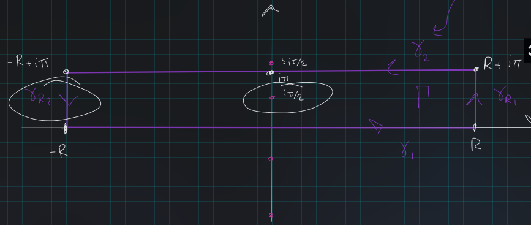

# Unsorted

## Spring 2021 # 1 #completed

:::{.problem title="?"}
Let $z_1, z_2$ be two complex numbers.

- Show that 
\[
\abs{1 - \bar z_1 z_2}^2 - \abs{z_1 - z_2}^2 = \qty{1 - \abs{z_1}^2}\qty{1 - \abs{z_2}^2}
.\]

- Show that if $\abs{z_1} < 1$ and $\abs{z_2} < 1$, then
\[
\left|\frac{z_{1}-z_{2}}{1-\bar{z}_{1} z_{2}}\right|<1
.\]

- Assume $z_1\neq z_2$, and show that
\[
\abs{z_1 - z_2 \over 1 - \bar z_1 z_2} = 1 \iff \abs{z_1} = 1 \text{ or } \abs{z_2} = 1
.\]

:::

:::{.solution}
Part 1:

Note that the RHS expands to
\[
1 - \abs{z_1}^2 - \abs{z_2}^2 + \abs{z_1 z_2}^2
.\]
The LHS expands to
\[
\cdots 
&= (1 - \bar{z_1} z_2)(1 - z_1 \bar z_2) - (z_1 - z_2)(\bar z_1 - \bar z_2) \\
&= 1 - \bar z_2 z_2 - z_1\bar z_2 + \abs{z_1 z_2}^2 - \qty{ \abs{z_1}^2 - \abs{z_2}^2 - z_1 \bar z_2 - \bar{z_1}z_2} \\
&= 1 + \abs{z_1 z_2}^2 - \abs{z_1}^2 - \abs{z_2}^2
.\]

Part b:
This isn't mentioned, but note that we need $\bar{z_1}z_2 \neq 1$.
Then
\[
\qty{ \abs{z_1 - z_2}^2 \over \abs{1 - \bar z_1 z_2 } } < 1 
&\iff \abs{z_1 - z_2}^2 - \abs{1 - \bar z_1 z_2}^2 < 0 \\
&\iff \qty{1 - \abs z_2^2}\qty{1 - \abs z_2^2} > 0 \\
&\iff \abs{z_1} < 1 \text{ and } \abs{z_2} < 1
.\]

Part c:
Suppose $z_1\neq z_2$, then
\[
\qty{ \abs{z_1 - z_2}^2 \over \abs{1 - \bar z_1 z_2 } } = 1 
&\iff \abs{z_1 - z_2}^2 - \abs{1 - \bar z_1 z_2}^2 = 0 \\
&\iff \qty{1 - \abs z_2^2}\qty{1 - \abs z_2^2} = 0 \\
&\iff \abs{z_1} = 1 \text{ or } \abs{z_2} = 1
.\]

:::

## Spring 2021 # 2 #completed

:::{.problem title="?"}
Let $\xi\in \RR$, evaluate
\[
\int_\RR {e^{i\xi x} \over \cosh(x)} \dx
.\]

:::

:::{.solution}
Note $\cosh(z) \da {1\over 2}(e^z + e^{-z})$, and
\[
\cosh(z) &= 0 \\
\iff e^z + e^{-z} &= 0 \\
\iff e^{-z}(e^{2z} + 1) &= 0 \\
\iff e^{2z} &= -1 \quad \text{since }\abs{e^{-z}} = e^{\Re(z)} > 0 \\
\iff 2z &= (2k+1)i\pi \\
\iff z &\in \ts{\cdots, {-3i\pi \over 2}, {-i\pi \over 2}, {i\pi \over 2}, {3i\pi \over 2}, \cdots}
.\]
So take the following rectangular contour enclosing the singularity $z= i\pi/2$:

Then letting $\Gamma$ be the entire contour and $I$ be the desired integral, we can solve for $I$:
\[
\int_\Gamma f &= \int_{-R}^R f + \int_{\gamma_{R_1}} f + \int_{\gamma_2}f + \int_{\gamma_{R_2}} f \\
\int_\Gamma f &= I + \int_{\gamma_{R_1}} f + \int_{\gamma_2}f + \int_{\gamma_{R_2}} f \\ \\
I &= \int_{\gamma_{R_1}} f + \int_{\gamma_2}f + \int_{\gamma_{R_2}} f - \int_\Gamma f 
,\]
being very sloppy about the fact that we're going to take $R\to \infty$.

Computing the residue term $\int_\Gamma f = 2\pi i \Res_{z=i\pi/2} f(z)$:
\[
{1\over 2\ pi i } \int_\Gamma f 
&= \Res_{z = i\pi/2} f(z)\\
&= \Res_{z = i\pi/2} {e^{i\xi z} \over \cosh(z) } \\
&= {e^{i\xi z} \over \dd{}{t} \cosh(z) } \evalfrom_{i\pi/2}\\
&= {e^{i\xi \cdot i\pi/2} \over \sinh(i\pi/2)} \\
&= {e^{-\xi \pi/ 2} \over i} \\
\implies 2\pi i \Res_{z=i\pi/2} f(z) &= 2\pi e^{-\xi \pi/ 2}
.\]
using that $2\sinh(i\pi/2) = e^{i\pi/2} - e^{-i\pi/2} = i-(-i) = 2i$. 

The $\gamma_2$ term:
parameterize $\gamma_2 = \ts{t + i\pi \st t\in [-R, R]}$, then
\[
\int_{\gamma_2} f 
&= -\int_{-\gamma_2} f \\
&= -\int_{-R}^{R} { e^{iz} \over \cosh(t + i\pi) } \dz, \quad z = t+i\pi, \dz = \dt \\
&= -\int_{-R}^{R} { e^{i\xi(t+i\pi)} \over \cosh(t + i\pi) }\dt \\
&= -e^{-\xi \pi} \int_{-R}^R {e^{i\xi t} \over \cosh(t+i\pi)} \dt \\
&= e^{-\xi \pi} \int_{-R}^R {e^{i\xi t} \over \cosh(t)} \dt \\
&\da e^{-\xi \pi} I
,\]
using that $\cosh(z + i\pi) = -\cosh(z)$.

The two $\gamma_{R_i}$ terms:
the claim is that these vanish in the limit $R\to \infty$.
Parameterize $\gamma_{R_2} = \ts{R = i \pi t \st t\in [0, 1]}$, then
\[
\abs{\int_{\gamma_{R_2}} f} 
&= \abs{ \int_0^1 {e^{i\xi(R+i\pi t)} \over \cosh(R + i\pi t)} \dt } \\
&= \abs{ 2e^{i\xi R} \int_0^1 {e^{-\xi \pi t } \over {e^{R+ i\pi t} + e^{-R - i\pi t}} } \dt } \\
&\leq 2 \int_0^1 \abs{ {e^{-\xi \pi t } \over {e^{R+ i\pi t} + e^{-R - i\pi t}} }  } \dt \\
&\leq 2 \int_0^1 {e^{-\xi \pi t } \over { \abs{ e^{R+ i\pi t} }  -  \abs{ e^{-R - i\pi t} } }  }\dt \\
&= 2 \int_0^1 {e^{-\xi\pi t} \over e^R - e^{-R} } \\
&= { 2\over e^R - e^{-R}} \int_0^1 e^{-\xi \pi t} \dt \\
&= {2\over e^R - e^{-R}} \qty{-1\over \xi \pi} e^{\xi \pi t}\evalfrom_{t=0}^{t=1} \\
&= {2\over e^R - e^{-R}} \qty{1 - e^{-\pi \xi } \over \xi \pi} \\
&\convergesto{R\to\infty} 0
.\]

Putting it all together:
\[
(1 + e^{-\xi \pi}) I &= 2\pi e^{-\xi \pi / 2} \\
\implies I &= {2\pi e^{-\xi \pi / 2} \over 1 + e^{-\xi \pi }} \\
&= {2\pi \over e^{\xi\pi/2} (1 + e^{-\xi \pi })} \\
&= {2\pi \over e^{\xi\pi/2} + e^{-\xi\pi/2} } \\
&= {2\pi \over 2\cosh(\xi\pi/2)} \\
&= {\pi \over \cosh\qty{\xi\pi\over 2}} \\ \\
&= \pi \sech\qty{\xi\pi\over 2 } 
.\]

:::

## Spring 2021 # 3 #completed

:::{.problem title="?"}
Suppose $f$ is entire, let $A, R> 0$ and $N \in \NN$, and suppose
\[
\abs{f(z)} \geq A\abs{z}^N && \text{for } \abs{z} \geq R
.\]

- Show that $f$ is polynomial.
- Show that $f$ has degree at least $N$.

:::

:::{.solution}
Note that the analogue of this problem where $\abs{f(z)} \leq A \abs{z}^N$ implies $f$ is a polynomial of degree at *most* $N$ is easy by the Cauchy estimate:
\[
\abs{f(z)} =\abs{\sum_{k\geq 0} c_k z^k } \implies 
\abs{c_n} = \abs{f^{(n)}(0)} 
&= \abs{{n!\over 2\pi i }\int_\gamma {f(\xi) \over (\xi-a)^{n+1} } \dxi } \quad \text{ at } a=0\\
&\leq {n!\over 2\pi }\int_\gamma {\abs{f(\xi)} \over \abs{\xi}^{n+1} } \dxi \\
&\leq {n!\over 2\pi }\int_\gamma {A {\abs{\xi}^N } \over \abs{\xi}^{n+1} } \dxi \\
&= {A n!\over 2\pi }\int_\gamma {{R ^N } \over R^{n+1} } \dxi \\
&= {An!\over 2\pi} \cdot {2\pi R \over R^{n+1-N}} \\
&= {An! \over R^{n-N}} \\
&\convergesto{R\to\infty} 0 \quad \iff n-N>0 \quad\iff n>N
,\]
so $f(z) = \sum_{0\leq k\leq N} c_k z^k$.

For the case at hand, a solution I liked from MSE:

- Write $g(z) \da f(1/z)$, so $g$ has a singularity at $z=0$.
  The claim is that this is a pole.

- It can't be removable: 
\[
\abs{g(z)} \geq A \abs{1\over z}^n \to\infty
\quad \text{ for }
\abs{1/z} \geq R \,\, (\iff \abs{z} < 1/R)
,\]
so $g$ is unbounded near $z=0$.
- It can't be essential: if so, take the neighborhood of $z=0$ given by $U\da D_{1\over R}(0)\smz = \ts{z\st 0< \abs{z} < {1\over R} }$.
Then $g(U) \subseteq \CC$ would be dense by Casorati-Weierstrass, but note that $g(z) = w\in g(U) \implies \abs{w} \da \abs{g(z)} \geq A\abs{1/z}^n$ since $\abs{z}<1/R$, so $g(U) \subseteq (\CC\sm D_{A\over R^n}(0))$ and in particular does not intersect the interior of $D_{A\over R^n}(0)$.

- Since $z=0$ is a pole, it has some finite order $m$, so write
\[
g(z) = \qty{c_{-m}z^{-m} + \cdots + c_{-1}z\inv} + \qty{c_0 + c_1 z + \cdots} \da p(1/z) + h(z)
,\]
where $p$ is polynomial of degree exactly $m$ (since $c_{-m} \neq 0$) and $h$ is entire.
In particular, $z=0$ is not a singularity of $h$.

- Now
\[
g(z) = p(1/z) + h(z) \implies f(z) = p(z) + h(1/z)
.\]

- Then
\[
f(z) - p(z) = h(1/z) \convergesto{\abs z\to \infty} c_0 \da h(0)
,\]
since holomorphic functions are continuous.

- Then $h$ is an entire function with a finite limit $L$ at $\infty$.
$h$ is bounded by $c_0$ in a neighborhood $U_\infty$ of $\infty$ and takes on a maximum on $U_\infty^c$ by compactness and the maximum modulus principle.
So $h$ is bounded on all of $\CC$, and thus constant by Liouville, and thus $h(1/z) = L$ for all $z$.

- So 
\[
f(z) &= p(z) + h(1/z) = p(z) + c_0 \\
\implies f(z) &= (c_{-1}z + \cdots + c_{-m}z^m) + c_0
,\]
which is a polynomial of degree exactly $m\da \deg p$.
- Why $m \geq N$: if not, $m<N$ so $N-m > 0$.
Then for large $z$,
\[
A \leq \abs{f(z) \over z^N} 
&= \abs{c_0 + c_{-1}z + \cdots + c_{-m}z^m \over z^N}\\
&= \abs{ {c_0 \over z^N} + {c_{-1} \over z^{N-1}} + \cdots + {c_{-m} \over z^{N-m}} } \\
&\convergesto{\abs{z}\to\infty} 0
,\]
since every term has a factor of $z$ in the denominator.
This contradicts $A>0$. $\contradiction$
:::

## Spring 2021 # 4 #completed

:::{.problem title="?"}
Let $f = u + iv$ be an entire function such that $\Re(f(x+iy))$ is polynomial in $x$ and $y$.
Show that $f(z)$ is polynomial in $z$.
:::

:::{.solution}
To clear up notation: write $f(z) = u(x, y) + iv(x, y)$, here we're assuming that $u$ is polynomial in $x$ and $y$.

:::{.claim}
If $u$ is polynomial in $x,y$, then so is $v$.
:::

:::{.proof title="?"}
Use that $\del_x^M v(x, y) = 0$ for large enough $M$: write $\del_x^M v = \del_x^{M-1} v_x = -\del_x^{M-1} u_y = 0$, since if $u$ is polynomial in $x,y$, so is $u_y$.
Similarly, $\del_y^N v = \del_y^{N-1}v_y = \del_y^{N-1}u_x = 0$.
:::

:::{.claim}
If $u, v$ are polynomial in $x$, there is an integer $M$ such that $\del_x^M f = \del_x^M(u+iv) = 0$.
:::

:::{.proof title="?"}
Write $\del_x^n f = \del_x^n u + i \del_x^n v$ by linearity and use that a high enough power $\del_x^n$ will annihilate both $u$ and $v$.
:::

Noting that $f'(z) = \del_x f(x + i y)$, this means $f^{(k)}(z) = \del_x^k f(x + iy)$, so $f^{(M)}(z) = 0$.
But now we can just integrate $N$ times and use that antiderivatives of polynomials are polynomials:
\[
f^{(N-1)}(z) &= c_1 \\
\int f^{(N-1)}(z) \dz = f^{(N-2)}(z) &= c_1 z + c_2 \\
\int f^{(N-2)}(z) \dz = f^{(N-3)}(z) &= {c_1 \over 2} z^2 + c_2z + c_3 \\
\vdots \quad &= \quad \vdots \\
\int f'(z) \dz = f(z) &= {c_1 \over N!} z^N + {c_2 \over (N-1)!} z^{N-1} + \cdots + c_N 
.\]

:::

## Spring 2021 # 5 #work

:::{.problem title="?"}
Let $f$ be a holomorphic map of the open unit disc $\DD$ to itself.
Show that for any $z, w\in \DD$,
\[
\left|\frac{f(w)-f(z)}{1-\overline{f(w)} f(z)}\right| \leq\left|\frac{w-z}{1-\bar{w} z}\right|
.\]
Show that this inequality is structure for $z\neq w$ except when $f$ is a linear fractional transformation from $\DD$ to itsself.
:::

## Spring 2021 # 6 #work

:::{.problem title="?"}
Let $\ts{f_n}_{n=1}^\infty$ is a sequence of holomorphic functions on $\DD$ and $f$ is also holomorphic on $\DD$. 
Show that the following are equivalent:

- $f_n\to f$ uniformly on compact subsets of $\DD$.
- For $0 < r < 1$,
\[
\int_{\abs z = r} \abs{f_n(z) - f(z)} \abs{dz} \convergesto{n\to\infty}0
.\]

:::

## Spring 2021 # 7 #work

:::{.problem title="?"}
Let $R$ be the intersection of the right half-plane and the outside of the circle $\abs{z - {1\over 2}} = {1\over 2}$ with the line segment $[1, 2]$ removed, i.e. 
\[
R = \ts{z\in \CC\st \Re(z) > 0,\,\, \abs{z-{1\over 2} > {1\over 2} }} \sm \ts{z \da x+iy \st 1\leq x\leq 2,\,\, y=0}
.\]
Find a conformal map from $R$ to $\HH$ the upper half-plane.
:::

## Fall 2021 # 1 #complete

:::{.problem title="?"}
Let $f(z)$ be an analytic function on $|z|<1$.
Prove that $f(z)$ is necessarily a constant if $f(\bar{z})$ is also analytic.
:::

:::{.solution}
Let $\tilde f(z) \da f(\bar z)$.
Using that $f$ is analytic iff its components solve Cauchy-Riemann, using that $f, \tilde f$ are analytic,
\[
u_x = v_y && u_y = -v_x \\
u_x = -v_y && u_y = v_x \\ \\
\implies 2u_x = v_y - v_y = 0 \implies u_x = 0 \\
\implies 2u_y = v_x - v_x = 0 \implies u_y = 0 \\
\implies 0 = u_y - u_y = v_x - (-v_x) = 2v_x  \implies v_x = 0 \\
\implies 0 = u_x - u_x = v_y - (-v_y) = 2v_y  \implies v_y = 0
,\]
so $\grad u = [u_x, u_y] \equiv \vector 0$ making $u$ constant.
Similarly $\grad v = [v_x, v_y] = \vector 0$, so $f: \RR^2\to \RR$ is constant.
:::

## Fall 2021 # 2  #work

Let $\gamma(t)$ be a piecewise smooth curve in $\mathbb{C}, t \in[0,1]$. Let $F(w)$ be a continuous function on $\gamma$. Show that $f(z)$ defined by
\[
f(z):=\int_{\gamma} \frac{F(w)}{w-z} d w
\]
is analytic on the complement of the curve $\gamma$.

## Fall 2021 # 5  #work

Assume $f$ is an entire function such that $|f(z)|=1$ on $|z|=1$. Prove that $f(z)=e^{i \theta} z^{n}$, where $\theta$ is a real number and $n$ a non-negative integer. 

> Suggestion: First use the maximum and minimum modulus theorem to show 
$$
f(z)=e^{i \theta} \prod_{k=1}^{n} \frac{z-z_{k}}{1-\bar{z_{k}} z}
$$ 
if $f$ has zeros.

## Fall 2021 # 6 #work

Show that if $f: D(0, R) \rightarrow \mathbb{C}$ is holomorphic, with $|f(z)| \leq M$ for some $M>0$, then
\[
\left|\frac{f(z)-f(0)}{M^{2}-\overline{f(0)} f(z)}\right| \leq \frac{|z|}{M R} .
\]

## Tie's Extra Questions: Fall 2015 #work

(1) 
Let $f(z) \in H({\mathbb D})$, $\text{Re}(f(z)) >0$ and $f(0)= a>0$. 
Show that 
$$
|\frac{f(z)-a}{f(z)+a}| \leq |z|, \; \; \; |f'(0)| \leq 2a
.$$

(2) 
Show that the above is still true if $\text{Re}(f(z)) >0$ is replaced with $\text{Re}(f(z)) \geq 0$.

## Tie's Extra Questions: Spring 2015 #work

(1) Let $p(z)$ be a polynomial, $R>0$ any positive number, and
$m \geq 1$ an integer. Let
$M_R = \sup \{ |z^{m} p(z) - 1|: |z| = R  \}$. Show that $M_R>1$.

(2) Let $m \geq 1$ be an integer and
$K = \{z \in {\mathbb C}: r \leq |z| \leq R \}$ where $r<R$.
Show (i) using (1) as well as, (ii) without using (1) that there exists a positive number $\varepsilon_0>0$ such that for each polynomial $p(z)$,
$$\sup \{|p(z) - z^{-m}|: z \in K  \} \geq \varepsilon_0 \, .$$

## Tie's Extra Questions: Spring 2015 #work

(1) Explicitly write down an example of a non-zero analytic function in $|z|<1$ which has infinitely zeros in $|z|<1$.

(2) Why does not the phenomenon in (1) contradict the uniqueness theorem?

## Tie's Extra Questions: Spring 2015 #work

Let $f$ be holomorphic in a neighborhood of $D_r(z_0)$. Show that
for any $s<r$, there exists a constant $c>0$ such that
$$||f||_{(\infty, s)} \leq c ||f||_{(1, r)},$$ where
$\displaystyle |f||_{(\infty, s)} = \text{sup}_{z \in D_s(z_0)}|f(z)|$
and $\displaystyle ||f||_{(1, r)} = \int_{D_r(z_0)} |f(z)|dx dy$.

> Note: Exercise 3.8.20 on p.107 in Stein et al is a
straightforward consequence of this stronger result using the integral form of the Cauchy-Schwarz inequality in real analysis.

## Tie's Extra Questions: Spring 2015 #work

Let $f$ be an analytic function on a region $\Omega$. Show that $f$
is a constant if there is a simple closed curve $\gamma$ in $\Omega$ such that its image $f(\gamma)$ is contained in the real axis.

## Tie's Extra Questions: Spring 2015 #work

(1) Show that $\displaystyle \frac{\pi^2}{\sin^2 \pi z}$ and
$\displaystyle g(z) = \sum_{n = - \infty}^{ \infty} \frac{1}{(z-n)^2}$
have the same principal part at each integer point.

(2) Show that
$\displaystyle h(z) = \frac{\pi^2}{\sin^2 \pi z} - g(z)$ is bounded
on $\mathbb C$ and conclude that
$\displaystyle \frac{\pi^2}{\sin^2 \pi z} = \sum_{n = - \infty}^{ \infty} \frac{1}{(z-n)^2} \, .$

## Tie's Extra Questions: Spring 2015 #work

Assume $f(z)$ is analytic in ${\mathbb D}: |z|<1$ and $f(0)=0$ and
is not a rotation (i.e. $f(z) \neq e^{i \theta} z$). Show that
$\displaystyle \sum_{n=1}^\infty f^{n}(z)$ converges uniformly to an
analytic function on compact subsets of ${\mathbb D}$, where
$f^{n+1}(z) = f(f^{n}(z))$.

## Tie's Extra Questions: Spring 2015 #work

Let $f$ be a non-constant analytic function on $\mathbb D$ with $f(\mathbb D) \subseteq \mathbb D$. Use $\psi_{a} (f(z))$ (where $a=f(0)$, $\displaystyle \psi_a(z) = \frac{a - z}{1 - \bar{a}z}$) to
prove that 
$\displaystyle \frac{|f(0)| - |z|}{1 + |f(0)||z|} \leq |f(z)| \leq \frac{|f(0)| + |z|}{1 - |f(0)||z|}$.

## Tie's Extra Questions: Spring 2015 #work

Let $f$ be holomorphic in a neighborhood of $D_r(z_0)$. Show that for any $s<r$, there exists a constant $c>0$ such that
$$
\|f\|_{(\infty, s)} \leq c \|f\|_{(1, r)}
,$$ 
where
$\displaystyle \|f\|_{(\infty, s)} = \text{sup}_{z \in D_s(z_0)}|f(z)|$
and $\displaystyle \|f\|_{(1, r)} = \int_{D_r(z_0)} |f(z)|dx dy$.

## Tie's Extra Questions: Spring 2015 #work

Let $\Omega$ be a simply connected open set and let $\gamma$ be a simple closed contour in $\Omega$ and enclosing a bounded region $U$ anticlockwise. Let $f: \ \Omega \to {\mathbb C}$ be a holomorphic function and $|f(z)|\leq M$ for all $z\in \gamma$. Prove that
$|f(z)|\leq M$ for all $z\in U$.

## Tie's Extra Questions: Spring 2015 #work

Let $f$ be holomorphic in a neighborhood of $D_r(z_0)$. Show that for any $s<r$, there exists a constant $c>0$ such that
$$\|f\|_{(\infty, s)} \leq c \|f\|_{(1, r)},$$ where
$\displaystyle \|f\|_{(\infty, s)} = \text{sup}_{z \in D_s(z_0)}|f(z)|$
and $\displaystyle \|f\|_{(1, r)} = \int_{D_r(z_0)} |f(z)|dx dy$.

## Tie's Extra Questions: Fall 2016 #work

a.
$f(z)= u(x,y) +i v(x,y)$ be analytic in a domain
$D\subset {\mathbb C}$. Let $z_0=(x_0,y_0)$ be a point in $D$ which
is in the intersection of the curves $u(x,y)= c_1$ and $v(x,y)=c_2$,
where $c_1$ and $c_2$ are constants. Suppose that $f'(z_0)\neq 0$.
Prove that the lines tangent to these curves at $z_0$ are
perpendicular.

b.
Let $f(z)=z^2$ be defined in $\CC$.

- Describe the level curves of $\mbox{\textrm Re}{(f)}$ and of $\mbox{Im}{(f)}$.

- What are the angles of intersections between the level curves $\mbox{\textrm Re}{(f)}=0$ and $\mbox{\textrm Im}{(f)}$? 
Is your answer in agreement with part a) of this question?

## Tie's Extra Questions: Fall 2016 #work

a.
$f: D\rightarrow {\mathbb C}$ be a continuous function, where
$D\subset {\mathbb C}$ is a domain.Let $\alpha:[a,b]\rightarrow D$
be a smooth curve. Give a precise definition of the *complex line integral* $$\int_{\alpha} f.$$

b.
Assume that there exists a constant $M$ such that
$|f(\tau)|\leq M$ for all $\tau\in \mbox{\textrm Image}(\alpha$). Prove that
$$\big | \int_{\alpha} f \big |\leq M \times \mbox{\textrm length}(\alpha).$$

c.
Let $C_R$ be the circle $|z|=R$, described in the counterclockwise direction, where $R>1$. Provide an upper bound for $\big | \int_{C_R} \dfrac{\log{(z)} }{z^2} \big |,$ which depends *only* on $R$ and other constants.

## Tie's Extra Questions: Fall 2016 #work

a.
Let $F$ be an analytic function inside and on a simple closed curve $C$, except for a pole of order $m\geq 1$ at $z=a$ inside $C$.
Prove that

$$\frac{1}{2 \pi i}\oint_{C} F(\tau) d\tau =
\lim_{\tau\rightarrow a} \frac{d^{m-1}}{d\tau^{m-1}}\big((\tau-a)^m F(\tau))\big).$$

b.
Evaluate $$\oint_{C}\frac{e^{\tau}}{(\tau^2+\pi^2)^2}d\tau$$
where $C$ is the circle $|z|=4$.

## Tie's Extra Questions: Spring 2014, Fall 2009, Fall 2011  #work

For $s>0$, the **gamma function** is defined by $\displaystyle{\Gamma(s)=\int_0^{\infty} e^{-t}t^{s-1} dt}$.

-   Show that the gamma function is analytic in the half-plane $\Re (s)>0$, and is still given there by the integral formula above.

-   Apply the formula in the previous question to show that
  $$
\Gamma(s)\Gamma(1-s)=\frac{\pi}{\sin \pi s}
.$$

> Hint: You may need $\displaystyle{\Gamma(1-s)=t \int_0^{\infty}e^{-vt}(vt)^{-s} dv}$ for $t>0$.

:::{.exercise title="?"}
Show that if $f$ is entire and $f(z) \convergesto{z\to\infty} \infty$ then $f$ is a polynomial.
:::

:::{.solution}

- Set $g(z) \da f(1/z)$, so $g(z) \convergesto{z\to 0} \infty$ making $z=0$ a singularity.
- This is not an essential singularity by Casorati-Weierstrass.
- So this is a pole and $g(z) = \sum_{-N\leq k \leq 0} c_k z^k$ for $N$ the order of the pole
- Thus $f(z) = \sum_{0<k<N}c_k z^k$ is a polynomial.
:::

