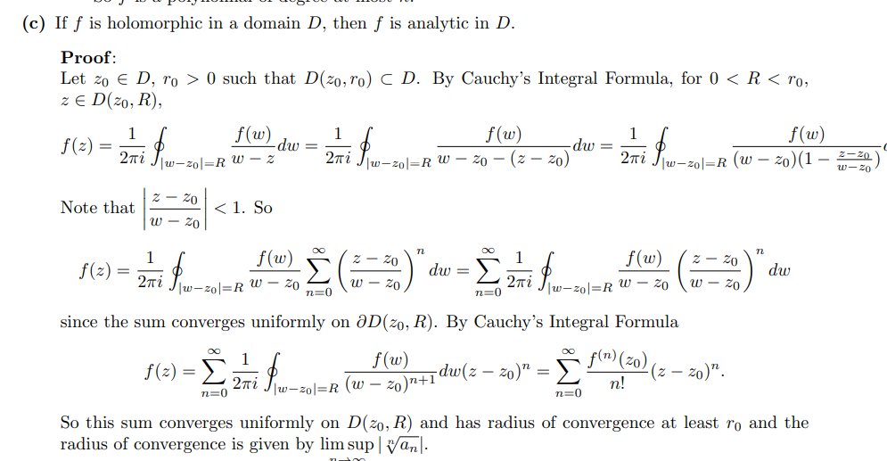

# Analytic Functions

:::{.definition title="Analytic"}
A function $f:\Omega \to \CC$ is *analytic* at $z_0\in \Omega$ iff there exists a power series $g(z) = \sum a_n (z-z_0)^n$ with radius of convergence $R>0$ and a neighborhood $U\ni z_0$ such that $f(z) = g(z)$ on $U$.
:::

:::{.proposition title="Power Series are Smooth"}
Any power series is smooth (and thus holomorphic) on its disc of convergence, and its derivatives can be obtained using term-by-term differentiation:
\[
\dd{}{z} f(z) = \dd{}{z} \sum_{k\geq 0} c_k (z-z_0)^k = \sum_{k\geq 1} kc_k (z-z_0)^k
.\]
Moreover, the coefficients are given by 
\[
c_k = {f^{(n)}(z_0) \over n! }
.\]
:::

:::{.theorem title="Function value as a convolution"}
For any $p\in U$,
\[
f(p) = {1\over 2\pi i }\int_{\bd U} {f(z) \over z-p} \dz
.\]
:::

:::{.corollary title="Formula for Laurent coefficients"}
Differentiating under the integral above yields
\[
c_k = \frac{f^{(k)}(p)}{k !}=\frac{1}{2 \pi i} \int_{\partial U} \frac{f(z) }{(z-p)^{k+1}} \dz
= {1 \over 2\pi R^n}\int_0^{2\pi} f(z_0 + Re^{i\theta})e^{-in\theta} \dtheta
.\]
For $R \da d(p, \bd U)$,
this yields a bound
\[
f(z) = \sum c_kz_k \implies \abs{c_k} \leq {\sup_{z\in \bd U}f(z) \cdot \length(\bd U) \over 2\pi R^{k+1}}
,\]
so $\limsup \abs{c_k}^{1\over k} < R\inv$, showing that $\sum c_k (z-p)^k$ has radius of convergence at least $R$ and is represented by its power series in $D_R(p)$.
This implies that $f$ is smooth at $p\in U$, and thus can only have poles on $\bd U$.
:::

:::{.theorem title="Holomorphic implies analytic"}
If $f$ is analytic on $D_R(p)$, then $f(z) = \sum c_k(z-p)^k$ on this disc.
:::

:::{.proof title="?"}
Reduce to $z\in \DD$, then for a fixed $z$ and any $w\in S^1$,
\[
{1\over w-z} = {1\over w} \qty{ 1 + \qty{z\over w} + \qty{z\over w}^2 + \cdots}
,\]
which converges uniformly on $S^1$.
Then
\[
f(z)=\frac{1}{2 \pi i} \int_{S^{1}} \frac{f(w) }{w-z} \dw 
= \sum z^{k} \frac{1}{2 \pi i} \int_{S^{1}} \frac{f(w)}{w^{k+1}} \dw 
=\sum c_{k} z^{k}
.\]

:::

:::{.proof title="Holomorphic implies analytic, alternative"}

:::

:::{.proposition title="Exponential is uniformly convergent in discs"}
$f(z) = e^z$ is uniformly convergent in any disc in $\CC$.
:::

:::{.proof}
Apply the estimate
\[  
\abs{e^z} \leq \sum {\abs {z}^n \over n!} = e^{\abs{z}}
.\]
Now by the $M\dash$test, 
\[  
\abs{z} \leq R < \infty \implies \abs{\sum {z^n \over n!}} \leq e^R < \infty
.\]
:::

# Exercises

:::{.exercise title="?"}
Show that if $f$ is non-constant, then $f'$ is analytic and the zeros of $f'$ are isolated.
Show that moreover if $f,g$ are analytic with $f'=g'$, then $f-g$ is constant.
:::

