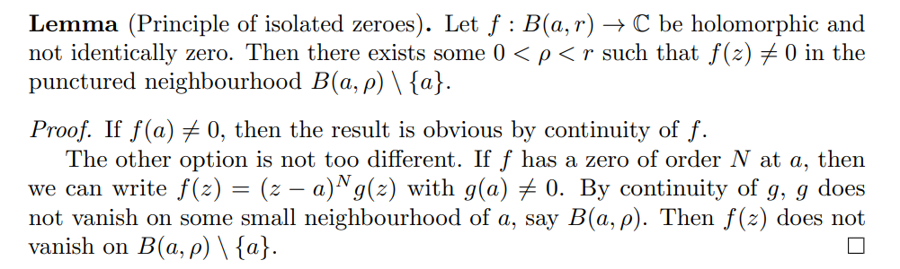

# Zeros and Singularities

## Definitions

:::{.remark}
On notation: for an analytic function $f$ expanded as a power series about $a$, write $v_a(f)$ as the $a\dash$adic valuation of $f$: expanding $f(z) = \sum_{k\in \ZZ} a_k (z-a)^k$ about $a$, define $v_a(f) = n$ iff $a_n\neq 0$ but $a_{\leq n} = 0$.
In other words, $v_a$ is the lowest power of $(z-a)$ occurring in a Laurent expansion of $f$ about $a$.
:::

:::{.definition title="Isolated singularities"}
A point $z_0$ is an **isolated singularity** if $f(z_0)$ is undefined but $f(z)$ is defined in a punctured neighborhood $D(z_0)\sm\ts{z_0}$ of $z_0$.

There is a classification of isolated singularities:

- Removable singularities, so $v_a(f) \in [0, \infty)$
- Poles, so $v_a(f) \in (-\infty, 0)$
- Essential singularities, so $v_a(f) = -\infty$, e.g. $\sin(z\inv )$ at $z=0$.
:::

:::{.warnings title="Branch singularities"}
Not all singularities are isolated, and thus don't fall into this classification.
One may also have **branch singularities**, e.g. $\Log(z)$ at $z=0$.
$f(z) \da z^{1\over 2}$ has a singularity at zero that does not fall under this classification -- the point $z=0$ is a **branch singularity** and $f$ admits no Laurent expansion around $z=0$.
A similar example: $\qty{z(z-1)}^{1\over 2}$ has two branch singularities at $z=0, 1$.
:::

:::{.remark title="Classification by Laurent expansion"}
Singularities can be classified by Laurent expansions $f(z) = \sum_{k\in \ZZ} c_k z^k$:

- Essential singularity: infinitely many negative terms.
- Pole of order $N$: truncated at $k = -N$, so $c_{N-\ell} = 0$ for all $\ell$.
- Removable singularity: truncated at $k=0$, so $c_{\leq -1} = 0$.
:::

:::{.remark title="Classification by limiting behavior"}
Isolated singularities can also be classified by their limiting behavior near the singularity:

- $\lim_{z\to z_0} f(z) < \infty$: removable (equivalently: bounded in a neighborhood).
- $\lim_{z\to z_0} f(z) = \infty$: pole.
- $\lim_{z\to z_0} f(z)$ does not exist: essential.

:::

:::{.definition title="Singularities at infinity"}
For any $f$ holomorphic on an unbounded region, we say $z=\infty$ is a singularity (of any of the above types) of $f$ if $g(z) \da f(1/z)$ has a corresponding singularity at $z=0$.
:::

## Removable

:::{.definition title="Removable Singularities"}
If $z_0$ is a singularity of $f$. then $z_0$ is a **removable singularity** iff
there exists a holomorphic function $g$ such that $f(z) = g(z)$ in a punctured neighborhood of $z_0$.
Equivalently,
\[
\lim_{z\to z_0}(z-z_0) f(z) = 0
.\]
Equivalently, $f$ is bounded on a neighborhood of $z_0$.
Equivalently, $v_{z_0}(f) \geq 0$

:::

:::{.example title="Removable singularities"}
\envlist

- $f(z) \da \sin(z)/z$ has a removable singularity at $z=0$, and one can redefine $f(0) \da 1$.
- If $f(z) = p(z)/q(z)$ with $q(z_0)=0$ and $p(z_0)=0$, then $z_0$ is removable with $f(z_0)\da p'(z_0)/q'(z_0)$.
:::

:::{.theorem title="Riemann's removable singularity theorem"}
Suppose $f$ is holomorphic on $\Omega\sm\ts{z_0}$.
TFAE:

- $z_0$ is a pole of order $0$.
- $z_0$ is a removable singularity of $f$.
- There exists some neighborhood of $z_0$ on which $f$ is bounded.
- $(z-a)f(z) \convergesto{z\to z_0} 0$
- $f$ admits a holomorphic extension $F$ to all of $\Omega$
- $f$ admits a continuous extension $F$ to all of $\Omega$.
- $f$ admits a Laurent expansion about $z_0$ with vanishing principal part, i.e. $f(z) = \sum_{k\geq 0}c_k (z-z_0)^k$.

:::

:::{.proof title="?"}
Take $\gamma$ to be a circle centered at $z_0$ and use
\[
f(z) \da \int_\gamma { f(\xi) \over \xi - z} \dx
.\]
This is valid for $z\neq z_0$, but the right-hand side is analytic. (?)
:::

#complex/exercise/work 

![[attachments/Pasted image 20211215021531.png]]
![[attachments/Pasted image 20211215021546.png]]

:::{.theorem title="Riemann Extension Theorem"}
A singularity of a holomorphic function is removable if and only if the function is bounded in some punctured neighborhood of the singular point.
:::

## Essential

:::{.definition title="Essential Singularity"}
A singularity $z_0$ is *essential* iff it is neither removable nor a pole.
Equivalently, a Laurent series expansion about $z_0$ has a principal part with infinitely many terms.
:::

:::{.example title="Essential singularities"}
$f(z) \da e^{1/z}$ has an essential singularity at $z=0$, since we can expand and pick up infinitely many negative terms:
\[
e^{1/z} = 1 + {1\over z} + {1\over 2! z^2} + \cdots
.\]
In fact there exists a neighborhood of zero such that $f(U) = \CC\smz$.
Similarly $g(z) \da \sin\qty{1\over z}$ has an essential singularity at $z=0$, and there is a neighborhood $V$ of zero such that $g(V) = \CC$.
:::

:::{.example title="?"}
The singularities of a rational function are always isolated, since there are finitely many zeros of any polynomial.
The function $F(z) \da \Log(z)$ has a singularity at $z=0$ that is **not** isolated, since every neighborhood intersects the branch cut $(-\infty, 0) \cross \ts{ 0 }$, where $F$ is not even defined.
The function $G(z) \da 1/\sin(\pi/z)$ has a non-isolated singularity at 0 and isolated singularities at $1/n$ for all $n$.
:::

## Zeros

:::{.theorem title="Bolzano-Weierstrass property"}
A subset of $\RR^n$ is closed and bounded iff it is sequentially compact.
Equivalently, every bounded sequence has a convergent subsequence.
:::

:::{.remark}
Why this is useful: every infinite subset of a disk has a limit point.
So e.g. if $f$ is holomorphic and has infinitely many zeros in $\DD$, $f$ is identically zero by the identity principle.
:::

:::{.proposition title="Zeros and their orders"}
A **zero** of an analytic function on a domain $\Omega$ is any $z_0$ such that $f(z_0)=0$, with no further conditions.
If $f$ is analytic and not identically zero on $\Omega$ with $f(z_0) = 0$, then there exists a  neighborhood $U\ni z_0$ and function $g$ that is holomorphic and nonvanishing on $U$ such that 
\[
f(z) = (z-z_0)^n g(z)
.\]
We refer to $z_0$ as a **zero of order $n$**.
Equivalently, $f^{(n-1)}(z_0)=0$ but $f^{(n)}(z) \neq 0$, so the Laurent expansion has the form $f(z) = \sum_{k\geq n} c_k (z-z_0)^k$ where $c_n\neq 0$.
:::

:::{.remark}
On terminology: if the order of $z_0$ for $f$ is $n$, we say $f$ **vanishes to order $n$**.
:::

:::{.proof title="of existence and uniqueness of order"}
Use that $\Omega$ is connected to find some neighborhood $U$ on which $f$ is not identically zero.
WLOG assume $z_0=0$. Expand $f$ as an honest power series at $z_0$ to write
\[
f(z) = \sum_{k\geq 0}c_k z^k = z^n\qty{c_n + c_{n+1}z + \cdots} \da z^n g(z)
,\]
where $a_n$ is the minimal nonvanishing coefficient.
Since $a_n\neq 0$, we have $\lim_{z\to z_0} g(z) = a_n \neq 0$, so $g$ is nonvanishing in some neighborhood of $z_0$.
Uniqueness follows from writing 
\[
z^n g(z) = z^m h(z) \implies g(z) = z^{m-n} h(z) 
,\]
assuming $m>n$, but then taking $z\to z_0 =0$ on the RHS yields $g(z) = 0$, a contradiction.
:::

:::{.proposition title="Zeros of holomorphic functions are isolated"}

:::

:::{.proposition title="Holomorphic functions have isolated zeros"}
If $f:\CC\to \CC$ is holomorphic and not identically zero, then $f$ has isolated zeros.
:::

:::{.proof title="?"}
Suppose not, then pick a limit point $z_0$ with $f(z_0)=0$ with a sequence $\ts{z_k}\to z_0$ where $f(z_k) = 0$ for all $k$.
Expand $f$ in a Laurent series; since $f\not\equiv 0$ there is a smallest nonzero coefficient $c_m$:
\[
f(z) = \sum_{k\geq m}c_k (z-z_0)^k = c_m(z-z_0)^m \cdot\qty{1 + \sum_{k\geq 1}c_k' (z-z_0)^k } \da c_m(z-z_0)^m \cdot(1 + g(z-z_0))
.\]
Note $g(z-z_0)\convergesto{z\to z_0} 0$, and since $z_k\to z_0$ we can find $k\gg 1$ such that $g(z_k - z_0) < \eps$.
In particular, for $k$ large enough, $1 < 1+g(z_k - z_0) 1 + \eps$, but this contradicts $f(z_k) = 0$:
\[
0 = f(z_k) = c_m(z_k - z_0)^m (1 + g(z_k - z_0)) \neq 0
.\]

$\contradiction$

:::

:::{.corollary title="Identity principle"}
If $f,g$ are holomorphic and $f=g$ on any set with a limit point, then $f\equiv g$.

The proof follows from the fact that $f-g$ is holomorphic and has nonisolated zeros.
:::

:::{.proposition title="Factorization of zeros out of holomorphic functions"}

:::

## Poles

:::{.definition title="Poles (and associated terminology)"}
Let $f$ be a meromorphic function with an isolated singularity at $z_0$.
TFAE:

- $z_0$ is a pole of $f$ of order $n$.
- $\abs{f(z)}\convergesto{z\to z_0} \infty$
- $z_0$ is a zero of order $n$ of $g(z) \da {1\over f(z)}$, and $g$ is holomorphic in a neighborhood of $z_0$
- $f(z) = (z-z_0)^{-n}h(z)$ where $h$ is holomorphic in a punctured neighborhood of $z_0$.
- $f$ admits a Laurent expansion of the form
\[
f(z) = \sum_{k\geq -n} c_k (z-z_0)^k, && c_{-n}\neq 0
.\]

:::

:::{.remark}
Any pole admits a neighborhood where $f$ is nonvanishing, and in fact bounded below.
:::

:::{.proposition title="Well-definedness of pole order"}
In this case there exists a minimal $n$ and a holomorphic $h$ such that
\[  
f(z) = \qty{z-z_0}^{-n} h(z)
.\]
Such an $n$ is the *order* of the pole.
A pole of order 1 is said to be a *simple pole*.
:::

:::{.proof title="?"}
Use that $z_0$ is a zero of $1/f$ to write
\[
{1\over f(z) } = (z-z_0)^n g(z)
,\]
for $h$ holomorphic and nonvanishing in a neighborhood of $z_0$.
Taking reciprocals yields
\[
f(z) = (z-z_0)^{-n} h(z) && \quad h(z) \da {1\over g(z)}
.\]
:::

:::{.example title="Of using this characterization"}
Claim: if $f$ has a pole of order $m$ at $z_0$, then $g(z) \da f(z^2)$ has a pole of order $2m$ at $z_0$.
WLOG assume $z_0=0$.
Note that this is clear by multiplying Laurent expansions about $z_0$:
\[
f(z) = \sum_{k\geq -m} c_k z^k \implies g(z) = \sum_{k\geq -m} c_k z^{2k} 
= {c_{-m} \over z^{2m}} + \cdots
.\]
Using the other characterization, write $f(z) = z^{-m} h(z)$ with $g$ holomorphic and nonzero in a neighborhood $U$ of $z_0$, so in particular $h(0) \neq 0$.
Then $f(z^2) = z^{-2m} h(z^z)$ and $h(z^2)\mid_{z=0} = h(0) \neq 0$.
:::

:::{.definition title="Principal Part and Residue at poles"}
If $f$ has a pole of order $n$ at $z_0$, then there exist a holomorphic $G$ in a neighborhood of $z_0$ such that
\[
f(z) = {a_{-n} \over (z-z_0)^n } + \cdots + {a_{-1} \over z-z_0} + G(z) \da P(z) + G(z)
.\]

The term $P(z)$ is referred to as the *principal part of $f$ at $z_0$* consists of terms with negative degree, and the *residue* of $f$ at $z_0$ is the coefficient $a_{-1}$.
:::

