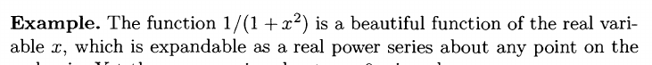
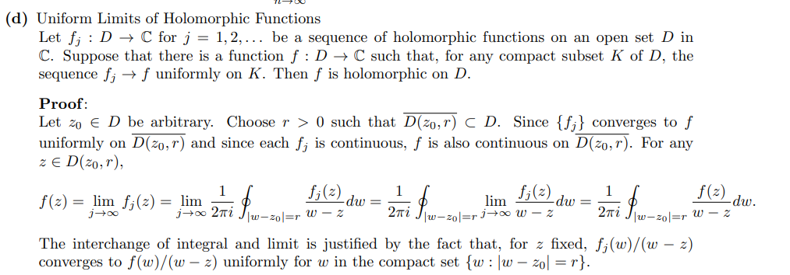
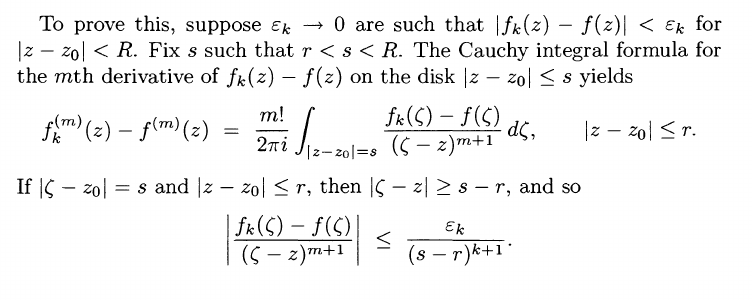
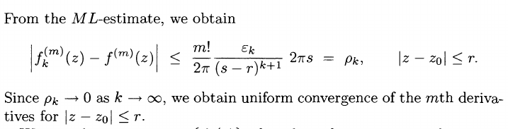
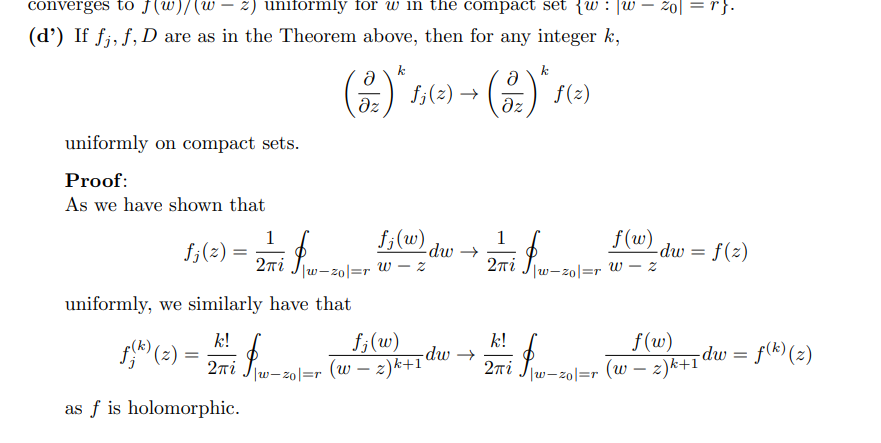

# Extra Questions

:::{.exercise title="Uniform limit of holomorphic is holomorphic"}
Show that if $f_k\to f$ uniformly on $\Omega$ with $f_k$ holomorphic then $f$ is holomorphic.

#complex/exercise/work

:::

:::{.solution}

Alternatively,

:::

:::{.exercise title="Uniform limit of holomorphic derivatives is the derivative"}
Show that if $f_k \to f$ uniformly with $f$ holomorphic then every $n$th derivative satisfies $f_k^{(n)}\to f^{(n)}$ uniformly.

#complex/exercise/work

:::

:::{.solution}

Alt:

:::

:::{.exercise title="?"}
Show that if $f$ is holomorphic on $\DD$ then $f$ has a power series expansion that converges uniformly on every compact $K\subset \DD$.

#complex/exercise/work

:::

:::{.exercise title="?"}
Show that any holomorphic function $f$ can be uniformly approximated by polynomials.

#complex/exercise/work

:::

:::{.exercise title="?"}
Show that if $f$ is holomorphic on a connected region $\Omega$ and $f'\equiv 0$ on $\Omega$, then $f$ is constant on $\Omega$.

#complex/exercise/work

:::

:::{.exercise title="?"}
Show that if $\abs{f} = 0$ on $\bd \Omega$ then either $f$ is constant or $f$ has a zero in $\Omega$.

#complex/exercise/work

:::

:::{.exercise title="?"}
Show that if $\theset{f_n}$ is a sequence of holomorphic functions converging uniformly to a function $f$ on every compact subset of $\Omega$, then $f$ is holomorphic on $\Omega$ and $\theset{f_n'}$ converges uniformly to $f'$ on every such compact subset.

#complex/exercise/work

:::

:::{.exercise title="?"}
Show that if each $f_n$ is holomorphic on $\Omega$ and $F \definedas \sum f_n$ converges uniformly on every compact subset of $\Omega$, then $F$ is holomorphic.

#complex/exercise/work

:::

:::{.exercise title="?"}
Show that if $f$ is once complex differentiable at each point of $\Omega$, then $f$ is holomorphic.

#complex/exercise/work

:::

## Polynomials

:::{.exercise title="?"}
Show that if $f$ is entire and $f(z) \convergesto{z\to\infty} \infty$ then $f$ is a polynomial.

#complex/exercise/completed

:::

:::{.solution}
\envlist

- Set $g(z) \da f(1/z)$, so $g(z) \convergesto{z\to 0} \infty$ making $z=0$ a singularity.
- This is not an essential singularity by Casorati-Weierstrass.
- So this is a pole and $g(z) = \sum_{-N\leq k \leq 0} c_k z^k$ for $N$ the order of the pole
- Thus $f(z) = \sum_{0<k<N}c_k z^k$ is a polynomial.
:::
