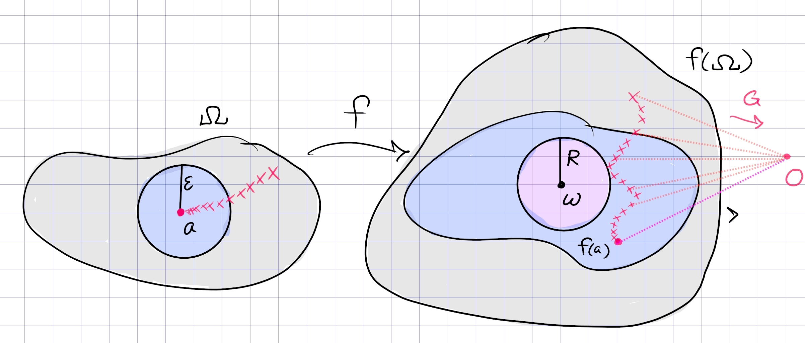

# Open Mapping, Riemann Mapping, Casorati-Weierstrass

## Spring 2020.6 (Prove the open mapping theorem) #complex/qual/completed

^128e58

:::{.problem title="?"}
Prove the open mapping theorem for holomorphic functions: If $f$ is a non-constant holomorphic function on an open set $U$ in $\mathbb{C}$, then $f(U)$ is also an open set.
:::

:::{.solution title="using the argument principle"}
Idea:

Let $f: U\to \CC$.
Pick $w_0\in W$ with $f(z_0) = w_0$ for some $z_0\in U$; we want to show that $w_0$ is an interior point of $f(U)$, so we're looking for a disc containing $w_0$ and contained in $f(U)$.

Write 
\[
g_0(z) \da f(z) - w_0
,\]
so $g_0$ is holomorphic and has a zero at $z_0$.
Since zeros of holomorphic functions are isolated, there is some $U' \da \DD_r(z_0)$ where $g_0$ is nonvanishing.
The claim is that if we choose $\eps$ small enough, we can arrange so that $W_\eps \da \DD_\eps(w_0) \subseteq f(U)$.
This will follow if for every $w\in W_\eps$, the equation $f(z) = w$ has a solution in $U$, i.e. 
Define a function that counts the number of zeros:
\[
F(w)
&\da {1\over 2\pi i}\int_{\bd U' } {f(z) \over f(z) - w_1 }\dz\\
&= {1\over 2\pi i}\int_{\bd U' } {\dd{}{z}\qty{f(z) - w} \over f(z) - w }\dz\\
&= \size Z(f(z) - w, U' ) 
,\]
which is the number of zeros of $f(z) - w$ in $U'$ by the argument principle.
Now $F$ is a $\ZZ\dash$valued function, and the only obstruction to continuity is if $f(z) - w = 0$ in the integrand for some $z$.
The claim is that $\eps$ can be chosen such 
\[
z\in \bd U' \implies \abs{f(z) - w} > 0 \qquad \forall w\in W_\eps
.\]
The theorem then follows immediately: $F(w): U' \to W_\eps$ is a continuous and $\ZZ\dash$valued, thus constant.
Then noting that $F(w_0) = 1$ since $z_0\in U'$ and $w_0\in W_\eps$, we have $F\equiv 1 > 0$ for all $w$.

:::{.proof title="of claim"}
Choose
\[
\eps \da \min_{z\in \bd U'}\abs{f(z) - w_0}
.\]
Now if $\abs{w-w_0} < \eps$ and $\abs{z-z_0} = r$, we have $\abs{f(z) - w} > \eps > 0$.
:::

:::

## Fall 2019.4, Spring 2020 HW 3 SS 3.8.14, Tie's Extras Fall 2009, Problem Sheet (Entire univalent functions are linear) #complex/qual/completed

^398dec

:::{.problem title="Entire univalent functions are affine/linear"}
Let $f: \mathbb{C} \rightarrow \mathbb{C}$ be an injective analytic (also called univalent) function. Show that there exist complex numbers $a \neq 0$ and $b$ such that $f(z)=a z+b$.

> Hint: Apply the Casorati-Weierstrass theorem to $f(1/z)$.
:::

:::{.solution}
Note that $f$ is non-constant, since a constant function is extremely non-injective.
Consider the singularity at $\infty$:

- If it is removable, then $f$ is bounded outside of a large disc, and bounded inside of it as a continuous function on a compact set, making $f$ entire and bounded and thus constant by Liouville.

- If it is essential, then by Casorati-Weierstrass there is a large disc of radius $R$ such that $f(\bar{\DD_R}^c) \subseteq \CC$ is dense.
  By the open mapping theorem, $f(\DD_R) \subseteq \CC$ is open, so by density it intersects $f(\bar{\DD_R}^c)$, but $\DD_R \intersect \bar{\DD_R}^c$ is empty so this contradicts injectivity.

So we can conclude $\infty$ is a pole of some order $N$, so $f\qty{1\over z} = \sum_{0\leq k\leq N} c_k z^{-k}$ and thus $f(z) = \sum_{0\leq k\leq N} c_k z^k$ is a polynomial of degree $N$.
However, a polynomial of degree $N$ is generically $N$-to-one locally, so injectivity forces $N=1$ and $f(z) = c_0 + c_1 z$, where $c_1\neq 0$ since $f$ is nonconstant.
:::

:::{.solution title="older"}
Write $g(z) \da f(1/z)$, which has a singularity at $z=0$.
The claim is that this is a pole.

If $z=0$ is a removable singularity, $g$ is bounded on some closed disc $\abs{z} \leq \eps$, so $f$ is bounded on $\abs{z} > \eps$.
Moreover $f$ is continuous and $\abs{z}\leq \eps$, $f$ is bounded on this disc.
This makes $f$ an entire bounded function and thus constant by Liouville, contradicting injectivity.

If $z=0$ is essential, then by Casorati-Weierstrass pick a punctured disc $D = \ts{\abs{z} \leq \eps}$ where $g(D)$ is dense in $\CC$.
Writing $D^c \da \ts{\abs{z} > \eps}$, this means that $f(D^c)$ is dense. 
But $U\da \ts{\abs{z} < \eps}$ is open and by the open mapping theorem $f(U)$ is open, so by density there is a point $w\in f(D^c) \intersect f(U)$ while $U \intersect D^c = \emptyset$, again contradicting injectivity.

So $z=0$ is a pole of $g$, and $g$ admits a Laurent expansion
\[
g(z) = \sum_{k\geq -N} c_k z^k
.\]
Since $f$ is entire, it equals its Laurent expansion at $z=0$, so equating the two series yields
\[
f(z) = \sum_{k\geq 0} d_k z^k 
&\implies g(z) = \sum_{k\geq 0} {d_k \over z^k} = \sum_{1\leq k\leq N} {c_k\over z^k} + \sum_{k\geq 0} c_k z^k \\
&\implies \sum_{k\geq 0} c_k z^k = 0 \\
&\implies f(z) = \sum_{0\leq k \leq N} c_k z^k
,\]
making $f$ a polynomial of degree at most $N$.

Now $f$ can not be degree zero, since constant maps are not injective.
Moreover $f$ can not be degree $N\geq 2$, since any polynomial of degree $N$ has $N$ roots in $\CC$ by the fundamental theorem of algebra, and any two distinct roots will be points where injectivity fails.
Finally, ruling out the case of roots with multiplicity, if $f(z) = c(z-a)^N$, then $f$ has exactly $N$ preimages in a neighborhood of $a$.
Letting $p$ be any such point, we can find $N$ complex points mapping to it:
\[
p = c(z-a)^N &\implies {p\over c} = (z-a)^N \\
&\implies \qty{p\over c}^{1\over N}\zeta_N^k = z-a \quad k=0,1,\cdots, n-1 \\
&\implies z_k\da \qty{p\over c}^{1\over N}\zeta_N^k + a \mapsvia{f} p
.\]

So $f$ must be degree exactly 1, i.e. $f(z) = az+b$.
:::

## Tie's Extra Questions: Spring 2015 #complex/exercise/completed

:::{.problem title="?"}
1.
Let $f$ be analytic in $\Omega: 0<|z-a|<r$ except at a
sequence of poles $a_n \in \Omega$ with
$\lim_{n \rightarrow \infty} a_n = a$. Show that for any
$w \in \mathbb C$, there exists a sequence $z_n \in \Omega$ such
that $\lim_{n \rightarrow \infty} f(z_n) = w$.

2.
Explain the similarity and difference between the above assertion and the Weierstrass-Casorati theorem.

> DZG: I think it's also necessary to state that $z_n \to a$.

:::

:::{.solution}

As in the proof of Casorati-Weierstrass, fix $w$ and suppose toward a contradiction that no sequence sequence exists.
Then there is some $\eps, R$ such that 
\[
f(\DD_\eps(a)) \subseteq \DD_R(w)^c
,\]
for otherwise one could construct the desired sequence.
In particular, $\abs{f(z) - w} > R$ for $\abs{z-a} < \eps$, so define
\[
G(z) \da {1\over f(z) - w} \implies \abs{G(z)} \leq R\inv < \infty \qquad \text{in }\DD_\eps(a)
.\]
Since $G$ is bounded in this disc, any singularities here must be removable.
Since the $a_k$ are poles of $f$, they are zeros of $G$ -- this is because if $\abs{f(z)}\to\infty$ as $z\to a_k$ then $\abs{G(z)}\to 0$.
So $G(a_k) = 0$ for all $k$ and $G$ extends holomorphically over the removable singularity $a$, and by continuity must satisfies $G(a) = 0$.
But now $G$ is zero on a set with a limit point, hence $G\equiv 0$ by the identity principle.
This is a contradiction since if $G\equiv 0$ on an open set, $f$ has poles on an open set, contradicting that $f$ is holomorphic on $\Omega$.

The difference to Casorati-Weierstrass: the singularity at $a$ is not essential, since in particular it is not isolated. 
The conclusion is nearly the same though: this says that every $w\in \CC$ is a limit point for $f(\Omega)$, so $w$ is in the closure of $f(\Omega)$, making the image dense in $\CC$.

:::

## Dense images #complex/exercise/work #stuck

:::{.problem title="?"}
Suppose $f: \HH\union \RR\to \CC$ satisfies the following:

- $f(i) = i$
- $f$ is continuous
- $f$ is analytic on $\HH$
- $f(z) \in \RR \iff z\in \RR$.

Show that $f(\HH)$ is a dense subset of $\HH$.
:::

:::{.solution}
Ideas:

- If an entire function doesn't have dense image, it's constant by Liouville using the proof idea of Casorati-Weierstrass.
- Conjugate $f$ by $T:\HH\to \DD$ where $T(z) = {z-i\over z+i}$, then $\tilde f(0) = 0$
- Use that $T(\RR) = S^1$, so $\abs{\tilde f(z)} = 1$ when $\abs{z} = 1$.
- Schwarz reflection applies to $\tilde f$ to define an entire function -- if $f$ isn't dense, then the extension of $\tilde f$ isn't dense...?
- No clue how to use $f(i) = i$, although it implies $\tilde f(0) = 0$ and Schwarz applies.
:::

## Tie's Extra Questions: Spring 2015 #complex/exercise/work

:::{.problem title="?"}
Let $f(z)$ be an analytic function on
${\mathbb C} \backslash \{ z_0 \}$, where $z_0$ is a fixed point.
Assume that $f(z)$ is bijective from
${\mathbb C} \backslash \{ z_0 \}$ onto its image, and that $f(z)$
is bounded outside $D_r(z_0)$, where $r$ is some fixed positive
number. Show that there exist $a, b, c, d \in \mathbb C$ with
$ad-bc \neq 0$, $c \neq 0$ such that
$\displaystyle f(z) = \frac{az + b}{cz + d}$.
:::

